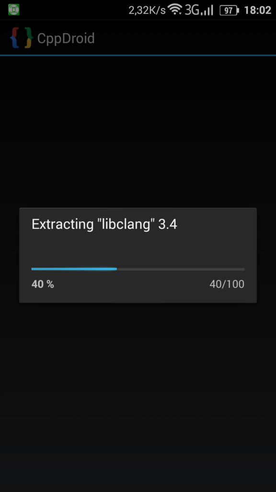
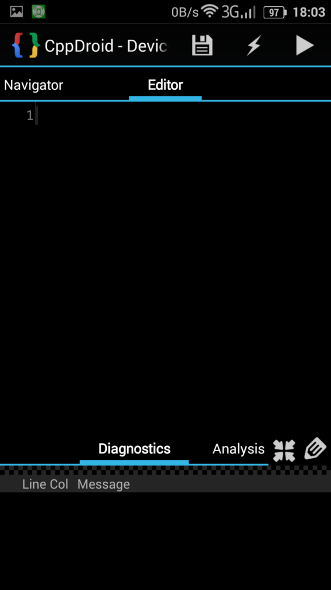
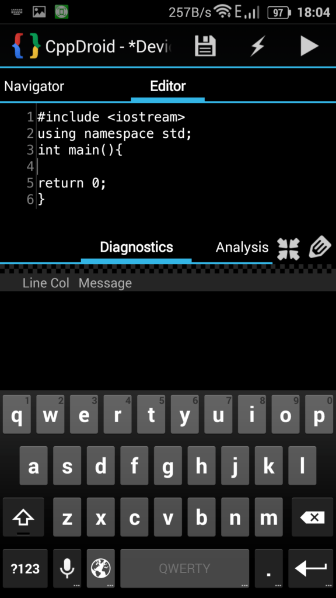
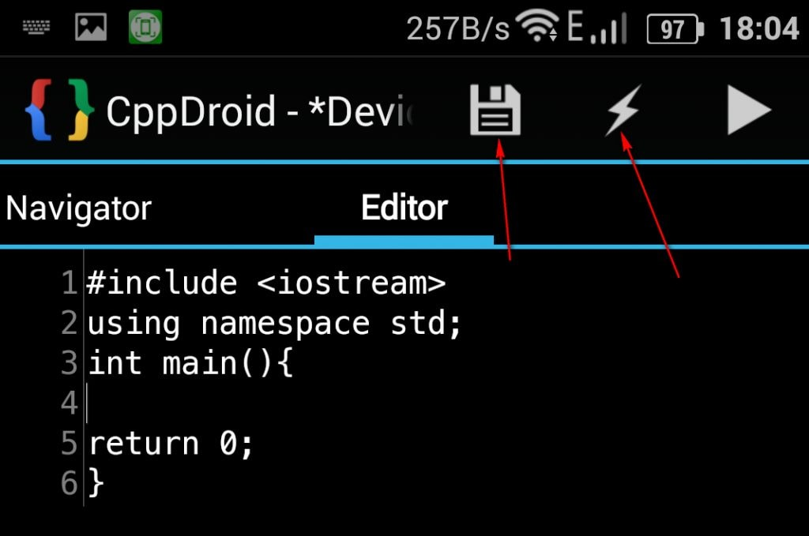
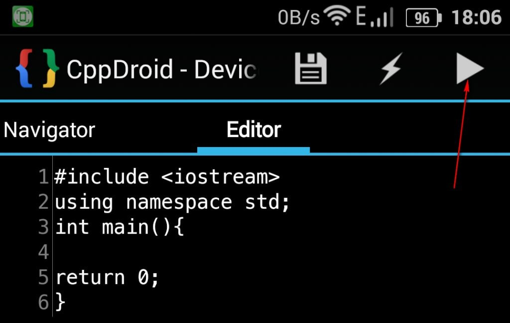
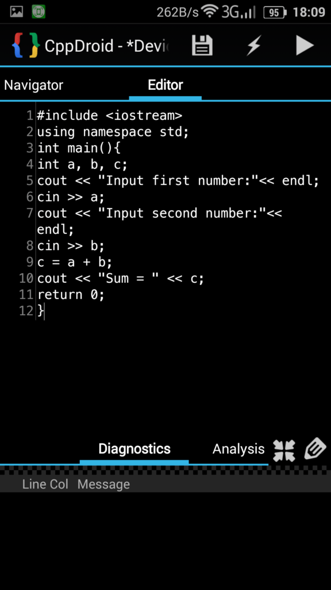
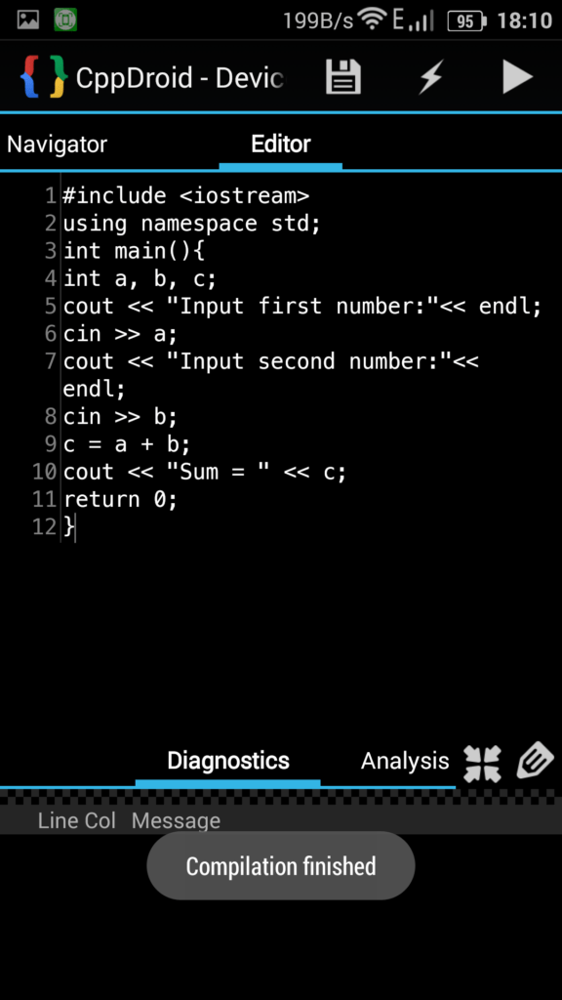
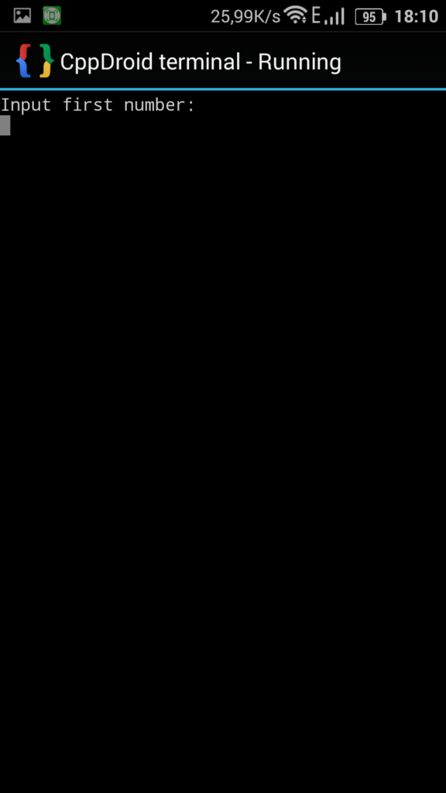
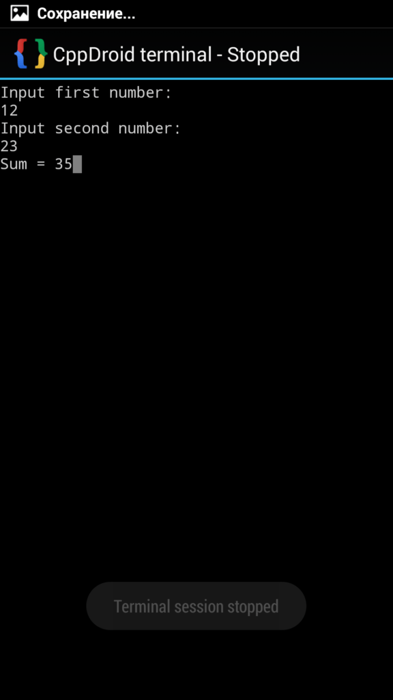

# Сложение двух чисел в CppDroid на C++

В статье рассказывается, как создать консольное приложения сложения двух чисел в CppDroid на Android.

## Программа

Программировать под C++ можно и в Android. CppDroid одна из таких приложений. Вот ссылка на приложение:

[Google Play](https://play.google.com/store/apps/details?id=name.antonsmirnov.android.cppdroid&hl=ru)

При открытии приложения будет произведена скачка и установка нужных файлов:



После этого откроется главное окно приложения:



## Болванка приложения

Введем в редакторе вот такой код:

```cpp
#include <iostream>
using namespace std;
int main(){

return 0;
}:

```



Сохраните и скомпилируйте приложение:




После этого запустите приложение:



Откроется пустое окно. Если вы его видите, то всё хорошо:


## Написание кода

Внутри функции main напишем такой код:

```cpp
int a, b, c;
cout << "Input first number:"<< endl;
cin >> a;
cout << "Input second number:"<< endl;
cin >> b;
c = a + b;
cout << "Sum = " << c;
return 0;
```

Полный код будет такой:

```cpp
#include <iostream>
using namespace std;
int main(){
int a, b, c;
cout << "Input first number:"<< endl;
cin >> a;
cout << "Input second number:"<< endl;
cin >> b;
c = a + b;
cout << "Sum = " << c;
return 0;
}
```



Аналогичным способом выше сохраним, скомпилируем и запустим программу:





Введите числа и получите в результате:


