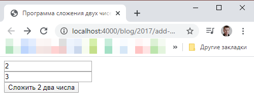
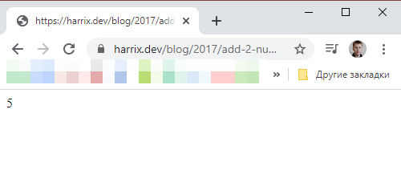

# Сложение двух чисел в HTML с передачей параметров через POST (клиентское приложение)

Напишем приложение сложение двух чисел на HTML, где сложение двух чисел происходит на стороне сервера.

## Постановка задачи

В [статье](https://github.com/Harrix/harrix.dev-blog-2015/blob/main/2015-07-14-add-2-num-js/2015-07-14-add-2-num-js.md) показан пример приложения на HTML + JavaScript по сложению двух чисел. И там сложение двух чисел происходило в самом приложении, что логично. Серверной части там нет.

В [статье](https://github.com/Harrix/harrix.dev-blog-2015/blob/main/2015-07-14-add-2-num-php/2015-07-14-add-2-num-php.md) показа пример приложения, где клиентская и серверная часть объединены в одном PHP скрипте.

А в этом приложении мы из полей ввода считаем два числа и отправим их на сервер, который сложит два числа, отправит нам ответ, и мы этот ответ отобразим в текстовом поле. То есть у нас клиентская и серверная часть разделены между собой.

На сервер поступает HTTP запрос с двумя переменными `a` и `b`. Переменные `a` и `b` передаются через POST параметры.

## Серверная часть

У вас должен быть сервер, доступный из интернета, к которому можно обращаться.

В [статье](https://github.com/Harrix/harrix.dev-blog-2017/blob/main/2017-05-04-add-2-num-java-get/2017-05-04-add-2-num-java-get.md) приведен пример серверной части на Java.

В [статье](https://github.com/Harrix/harrix.dev-blog-2017/blob/main/2017-05-04-add-2-num-php-get/2017-05-04-add-2-num-php-get.md) приведен пример серверной части на PHP.

В статье буду использовать PHP скрипт, который я расположил по адресу <https://github.com/Harrix/harrix.dev-blog-2017/tree/main/2017-05-05-add-2-num-php-post/demo> (если перейти по ссылке без параметров, то должно выдаваться `error`).

## Создание болванки

Создаем текстовой документ под именем `index.html`.

Закинем в него простую болванку HTML5 документа:

```html
<!DOCTYPE html>
<html lang="ru">
  <head>
    <meta charset="UTF-8" />
    <meta http-equiv="X-UA-Compatible" content="IE=edge,chrome=1">
    <meta name="viewport" content="width=device-width, initial-scale=1.0">
    <title>Программа сложения двух чисел</title>
  </head>
  <body>
  </body>
</html>
```

Если мы сохраним документ и откроем в браузере, то увидим пустое белое окно, так как ничего видимого в документе пока нет — это просто болванка с шапкой, где располагаются некоторые мета-тэги (по сути их тоже можно было выкинуть), и пустое тело.

## Наполнение HTML

Так как нам нужно приложение, которое будет складывать два числа, то нужно два поля ввода текстовой информации. Следовательно, их нужно будет размещать в некоторой форме. Поэтому в теле HTML документа `<body></body>` разместим такую форму:

```html
<form>
    <input name="a" type="text" value="2"><br>
    <input name="b" type="text" value="3"><br>
</form>
```

Каждое поле имеет своё имя `name` (не `id`) с названием переменной `a` и `b`. Также они имеют начальное наполнение.

Нам нужна кнопка для вычислений. Обычно на форме используется `input` тэг с `type=submit`:

```html
<input type="submit" value="Сложить 2 два числа">
```

У нас сложение двух чисел будет происходить не на стороне клиента, а на стороне сервера. Поэтому форме нужно указать адрес сервера, куда мы отправим запрос. Обратите внимание на то, что параметр `method` принимает значение `post`:

```html
<form action="https://harrix.dev/blog/2017/add-2-num-php-post/demo/" method="post">
```

Общий документ будет иметь вид:

```html
<!DOCTYPE html>
<html lang="ru">

<head>
  <meta charset="UTF-8" />
  <meta http-equiv="X-UA-Compatible" content="IE=edge,chrome=1">
  <meta name="viewport" content="width=device-width, initial-scale=1.0">
  <title>Программа сложения двух чисел</title>
</head>

<body>
  <form action="https://harrix.dev/blog/2017/add-2-num-php-post/demo/" method="post">
    <input name="a" type="text" value="2"><br>
    <input name="b" type="text" value="3"><br>
    <input type="submit" value="Сложить 2 два числа">
  </form>
</body>

</html>
```

Если мы сохраним документ и его откроем, то получим следующее:



Если нажмем на кнопку, то мы перейдем на страницу сервера, где будет отображен результат работы сервера:


