# Сложение двух чисел в Android Studio с использованием Apache HTTP с передачей параметров через POST (клиент-серверное приложение)


Напишем приложение сложение двух чисел, где сложение двух чисел происходит на стороне сервера.

- [Постановка задачи](#постановка-задачи)
- [Серверная часть](#серверная-часть)
- [Создание Android проекта](#создание-android-проекта)
- [XML разметка](#xml-разметка)
- [Добавление в Gradle](#добавление-в-gradle)
- [Добавляем разрешения](#добавляем-разрешения)
- [Java код](#java-код)

Внимание! В данной статье используются устаревшие классы по работе с запросами. В статье [Сложение двух чисел в Android Studio с использованием HttpURLConnection с передачей параметров через POST (клиент-серверное приложение)](https://github.com/Harrix/harrix.dev-articles-2017/blob/main/add-2-num-http-url-connection-post/add-2-num-http-url-connection-post.md) | [🡥](https://harrix.dev/ru/articles/2017/add-2-num-http-url-connection-post/) приведен вариант с использованием классов, пришедших на замену.

В [статье](https://github.com/Harrix/harrix.dev-articles-2017/blob/main/add-2-num-apache-http/add-2-num-apache-http.md) | [🡥](https://harrix.dev/ru/articles/2017/add-2-num-apache-http/) показан вариант приложения для отправки GET параметров.

## Постановка задачи

В [статье](https://github.com/Harrix/harrix.dev-articles-2019/blob/main/add-2-num-android/add-2-num-android.md) | [🡥](https://harrix.dev/ru/articles/2019/add-2-num-android/) показан пример приложения под Android по сложению двух чисел. И там сложение двух чисел происходило в самом приложении, что логично. А в этом приложении мы из полей ввода считаем два числа и отправим их на сервер, который сложит два числа, отправит нам ответ, и мы этот ответ отобразим в текстовом поле.

На сервер поступает HTTP запрос с двумя переменными `a` и `b`. Переменные `a` и `b` передаются через POST параметры.

## Серверная часть

У вас должен быть сервер, доступный из интернета, к которому можно обращаться.

В [статье](https://github.com/Harrix/harrix.dev-articles-2017/blob/main/add-2-num-java-get/add-2-num-java-get.md) | [🡥](https://harrix.dev/ru/articles/2017/add-2-num-java-get/) приведен пример серверной части на Java.

В [статье](https://github.com/Harrix/harrix.dev-articles-2017/blob/main/add-2-num-php-get/add-2-num-php-get.md) | [🡥](https://harrix.dev/ru/articles/2017/add-2-num-php-get/) приведен пример серверной части на PHP.

В статье буду использовать PHP скрипт, который я расположил по адресу <https://github.com/Harrix/harrix.dev-articles-2017/tree/main/add-2-num-php-post/demo> (если перейти по ссылке без параметров, то должно выдаваться `error`).

## Создание Android проекта

Надеюсь, что вы сможете сами создать болванку приложения, так что закинул под спойлер.

---

**Создание Android проекта** <!-- !details -->


_Рисунок 1 — Команда создания нового проекта_

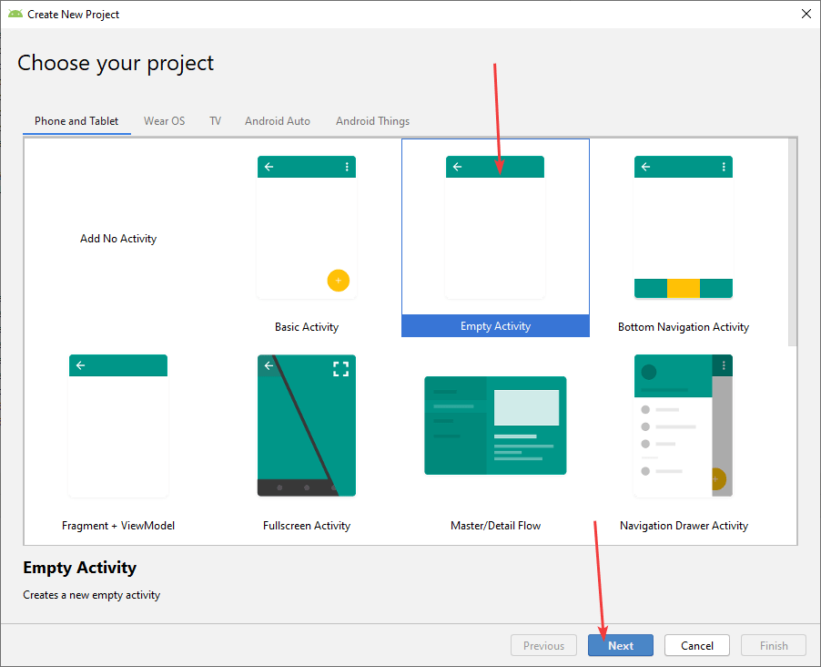

_Рисунок 2 — Выбор пустой активности для нового проекта_

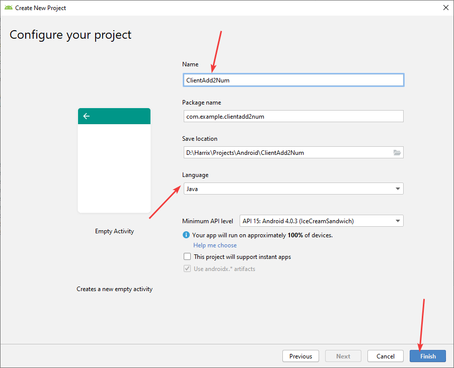

_Рисунок 3 — Выбор названия и настроек проекта_

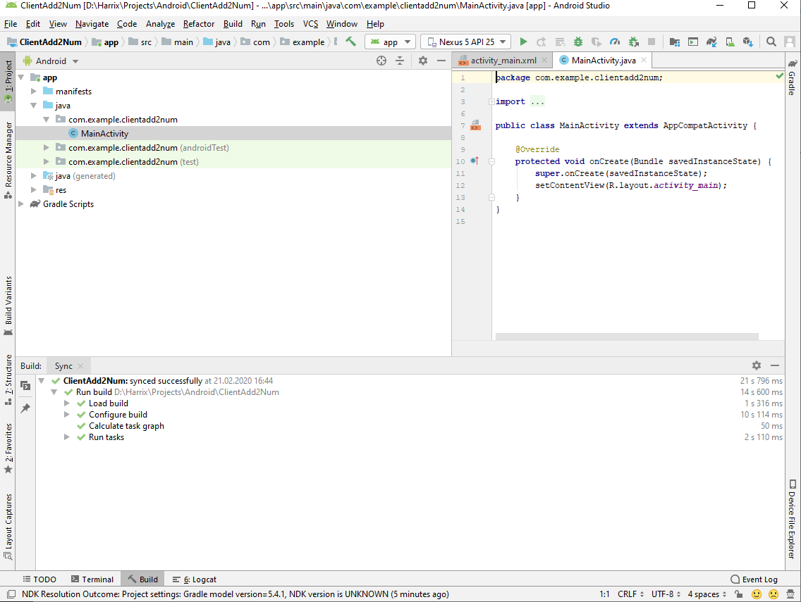

_Рисунок 4 — Созданный проект_

---

## XML разметка

Пусть разметка файла `activity_main.xml` будет такой:

```xml
<?xml version="1.0" encoding="utf-8"?>
<LinearLayout xmlns:android="http://schemas.android.com/apk/res/android"
    android:layout_width="match_parent"
    android:layout_height="match_parent"
    android:paddingLeft="16dp"
    android:paddingRight="16dp"
    android:orientation="vertical" >

    <EditText
        android:id="@+id/editText"
        android:layout_width="match_parent"
        android:layout_height="wrap_content"
        android:ems="10"
        android:inputType="textPersonName" />

    <EditText
        android:id="@+id/editText2"
        android:layout_width="match_parent"
        android:layout_height="wrap_content"
        android:ems="10"
        android:inputType="textPersonName" />

    <Button
        android:id="@+id/button"
        android:layout_width="match_parent"
        android:layout_height="wrap_content"
        android:text="Button" />

    <TextView
        android:id="@+id/textView"
        android:layout_width="match_parent"
        android:layout_height="wrap_content" />
</LinearLayout>
```

Есть два поля ввода чисел, кнопка и поле для вывода суммы чисел. Все элементы имеют свои идентификаторы `android:id`:

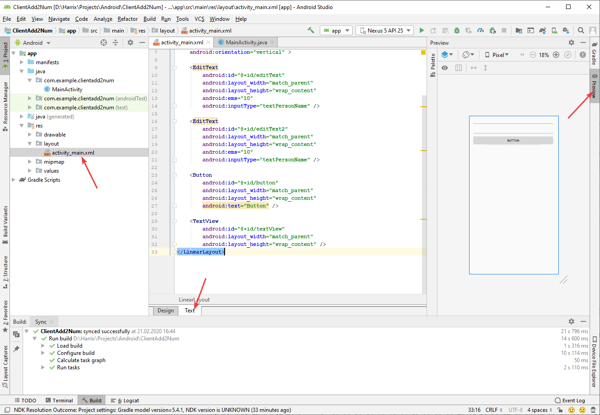

_Рисунок 5 — Разметка интерфейса приложения_

В Android Studio 4.0 перейти к разметке XML файла можно по другому:

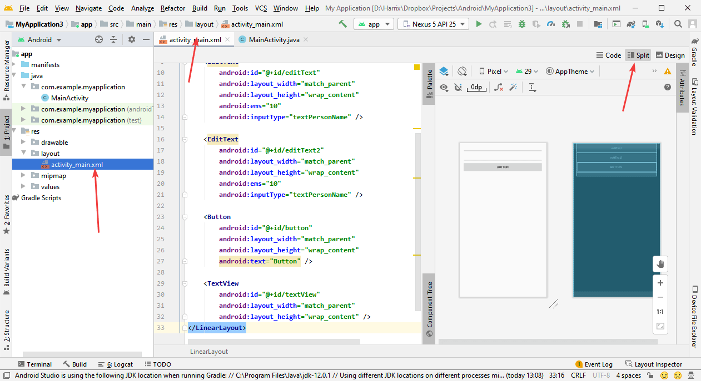

_Рисунок 6 — Разметка интерфейса приложения в Android Studio 4.0_

## Добавление в Gradle

Для работы с запросами над потребуется дополнительная библиотека, которую мы сейчас подключим в `Gradle`.

В файле `build.gradle (Module.app)` в разделе `dependencies` добавьте следующие строчки:

```json
android {
    useLibrary 'org.apache.http.legacy'
}
```

После этого нажмите на ссылку `Sync now`:

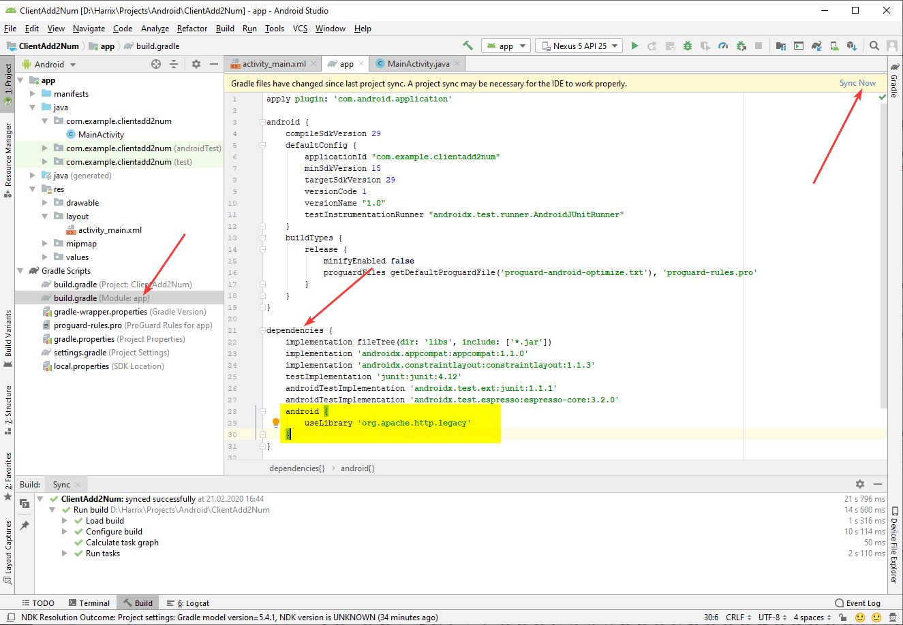

_Рисунок 7 — Добавление зависимости в Gradle_

И ждем, когда закончится синхронизация:

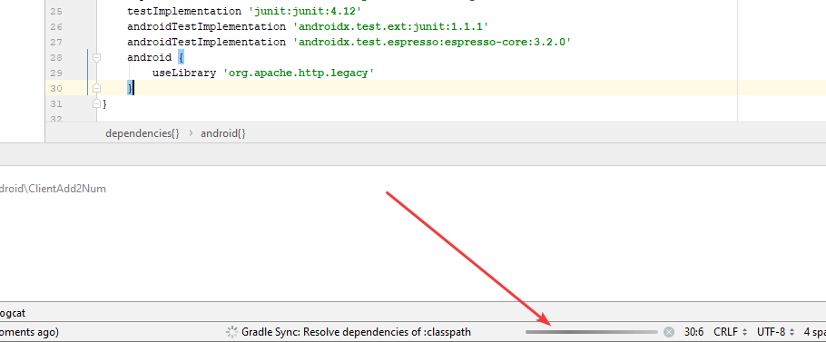

_Рисунок 8 — Полоска синхронизации Gradle_

## Добавляем разрешения

Приложение у нас будет обращаться в интернет. Поэтому нужно ей дать на это разрешение в `AndroidManifest.xml`:

```xml
<uses-permission android:name="android.permission.INTERNET"/>
```

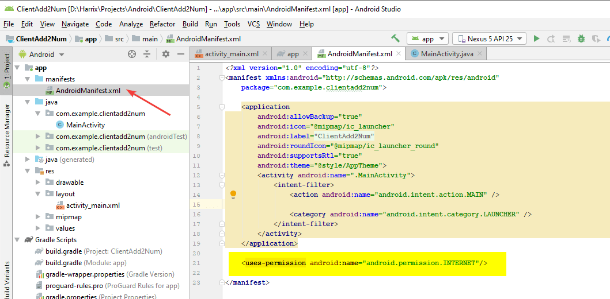

_Рисунок 9 — Добавление разрешения на использование интернета_

Также добавьте следующее разрешение в `<application>`:

```xml
<uses-library android:name="org.apache.http.legacy" android:required="false"/>
```

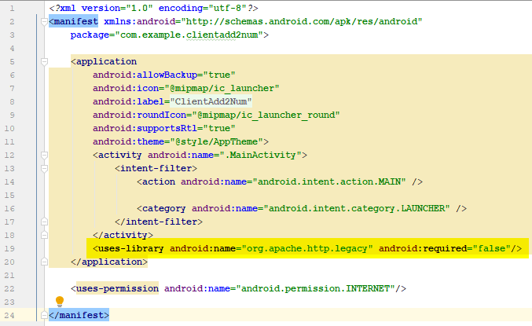

_Рисунок 10 — Добавление разрешения uses-library_

## Java код

Был такой код файла `MainActivity.java`:

```java
package com.example.clientadd2num;

import androidx.appcompat.app.AppCompatActivity;

import android.os.Bundle;

public class MainActivity extends AppCompatActivity {

    @Override
    protected void onCreate(Bundle savedInstanceState) {
        super.onCreate(savedInstanceState);
        setContentView(R.layout.activity_main);
    }
}
```

Вначале объявим переменные кнопки, полей ввода и поля для вывода результата и соединим их с элементами из XML файла. Также назначим слушателя для клика кнопки:

```java
package com.example.clientadd2num;

import androidx.appcompat.app.AppCompatActivity;

import android.os.Bundle;
import android.view.View;
import android.widget.Button;
import android.widget.EditText;
import android.widget.TextView;

public class MainActivity extends AppCompatActivity {

    private TextView textView;
    private EditText editText;
    private EditText editText2;
    private Button button;

    @Override
    protected void onCreate(Bundle savedInstanceState) {
        super.onCreate(savedInstanceState);
        setContentView(R.layout.activity_main);

        textView = (TextView)findViewById(R.id.textView);
        editText = (EditText)findViewById(R.id.editText);
        editText2 = (EditText)findViewById(R.id.editText2);
        button = (Button)findViewById(R.id.button);

        button.setOnClickListener(new View.OnClickListener() {
            @Override
            public void onClick(View v) {

            }
        });
    }
}
```

Запросы к серверу по времени могут быть длительными. Поэтому обязательно делаем их в другом потоке. Для этого внутри класса `MainActivity` создадим класс-наследник от `AsyncTask`:

```java
class MyAsyncTask extends AsyncTask<String, String, String> {

    @Override
    protected void onPreExecute() {
        super.onPreExecute();
    }

    @Override
    protected String doInBackground(String... params) {
        // Тут будет запрос к серверу
        return null;
    }

    @Override
    protected void onPostExecute(String result) {
        super.onPostExecute(result);
    }
}
```

В классе `MyAsyncTask` объявим переменные:

```java
String a, b, answerHTTP;
```

А также определим переменную `server`, которая будет указывать на сервер, к которому мы будем осуществлять запрос. Если вы используйте свой сервер, то поменяйте значение:

```java
String server = "https://harrix.dev/ru/articles/2017/add-2-num-php-post/demo/";
```

В методе `onPreExecute()` считаем данные из полей ввода:

```java
@Override
protected void onPreExecute() {
    a = editText.getText().toString();
    b = editText2.getText().toString();
    super.onPreExecute();
}
```

В методе `onPostExecute()` выведем ответ сервера:

```java
@Override
protected void onPostExecute(String result) {
    super.onPostExecute(result);
    textView.setText(answerHTTP);
}
```

В методе `doInBackground()` будем обращаться к серверу:

```java
@Override
protected String doInBackground(String... params) {
    HttpClient httpclient = new DefaultHttpClient();

    HttpPost httpPost = new HttpPost(server);

    try {
        List<NameValuePair> nameValuePairs = new ArrayList<NameValuePair>(2);
        nameValuePairs.add(new BasicNameValuePair("a", a));
        nameValuePairs.add(new BasicNameValuePair("b", b));
        httpPost.setEntity(new UrlEncodedFormEntity(nameValuePairs, "UTF-8"));

        HttpResponse response = httpclient.execute(httpPost);

        if (response.getStatusLine().getStatusCode() == 200) {
            HttpEntity entity = response.getEntity();
            answerHTTP = EntityUtils.toString(entity);
        }
    } catch (ClientProtocolException e) {
    } catch (IOException e) {
    }

    return null;
}
```

От [варианта](https://github.com/Harrix/harrix.dev-articles-2017/blob/main/add-2-num-apache-http/add-2-num-apache-http.md) | [🡥](https://harrix.dev/ru/articles/2017/add-2-num-apache-http/) с GET параметрами программа отличается именно этим методом. Обратите внимание на то, что параметры POST мы передаем через устаревший класс пар значений `NameValuePair`, в место `HttpGet` используем `HttpPost`.

Теперь остается только создать экземпляр данного класса `MyAsyncTask` в слушателе клика кнопки и запустить его:

```java
button.setOnClickListener(new View.OnClickListener() {
    @Override
    public void onClick(View v) {
        new MyAsyncTask().execute();
    }
});
```

В итоге у меня получился вот такой файл:

```java
package com.example.clientadd2num;

import androidx.appcompat.app.AppCompatActivity;

import android.os.AsyncTask;
import android.os.Bundle;
import android.view.View;
import android.widget.Button;
import android.widget.EditText;
import android.widget.TextView;

import org.apache.http.HttpEntity;
import org.apache.http.HttpResponse;
import org.apache.http.NameValuePair;
import org.apache.http.client.ClientProtocolException;
import org.apache.http.client.HttpClient;
import org.apache.http.client.entity.UrlEncodedFormEntity;
import org.apache.http.client.methods.HttpPost;
import org.apache.http.impl.client.DefaultHttpClient;
import org.apache.http.message.BasicNameValuePair;
import org.apache.http.util.EntityUtils;

import java.io.IOException;
import java.util.ArrayList;
import java.util.List;

public class MainActivity extends AppCompatActivity {

    private TextView textView;
    private EditText editText;
    private EditText editText2;
    private Button button;

    @Override
    protected void onCreate(Bundle savedInstanceState) {
        super.onCreate(savedInstanceState);
        setContentView(R.layout.activity_main);

        textView = (TextView) findViewById(R.id.textView);
        editText = (EditText) findViewById(R.id.editText);
        editText2 = (EditText) findViewById(R.id.editText2);
        button = (Button) findViewById(R.id.button);

        button.setOnClickListener(new View.OnClickListener() {
            @Override
            public void onClick(View v) {
                new MyAsyncTask().execute();
            }
        });
    }

    class MyAsyncTask extends AsyncTask<String, String, String> {

        String a, b, answerHTTP;

        String server = "https://harrix.dev/ru/articles/2017/add-2-num-php-post/demo/";

        @Override
        protected void onPreExecute() {
            a = editText.getText().toString();
            b = editText2.getText().toString();
            super.onPreExecute();
        }

        @Override
        protected String doInBackground(String... params) {
            HttpClient httpclient = new DefaultHttpClient();

            HttpPost httpPost = new HttpPost(server);

            try {
                List<NameValuePair> nameValuePairs = new ArrayList<NameValuePair>(2);
                nameValuePairs.add(new BasicNameValuePair("a", a));
                nameValuePairs.add(new BasicNameValuePair("b", b));
                httpPost.setEntity(new UrlEncodedFormEntity(nameValuePairs, "UTF-8"));

                HttpResponse response = httpclient.execute(httpPost);

                if (response.getStatusLine().getStatusCode() == 200) {
                    HttpEntity entity = response.getEntity();
                    answerHTTP = EntityUtils.toString(entity);
                }
            } catch (ClientProtocolException e) {
            } catch (IOException e) {
            }

            return null;
        }

        @Override
        protected void onPostExecute(String result) {
            super.onPostExecute(result);
            textView.setText(answerHTTP);
        }
    }
}
```

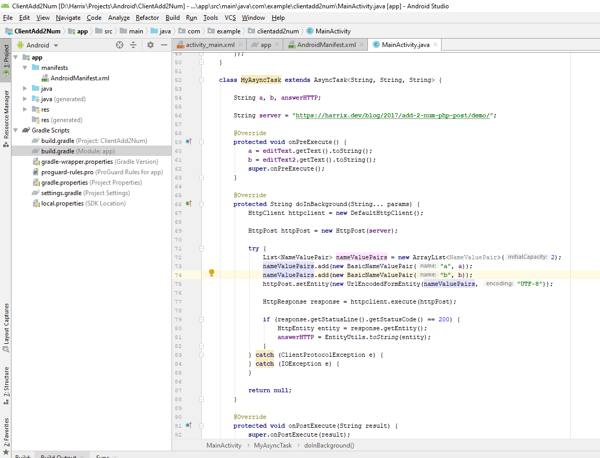

_Рисунок 11 — Java код активности_

Всё. Можете запускать приложение и проверять работу:

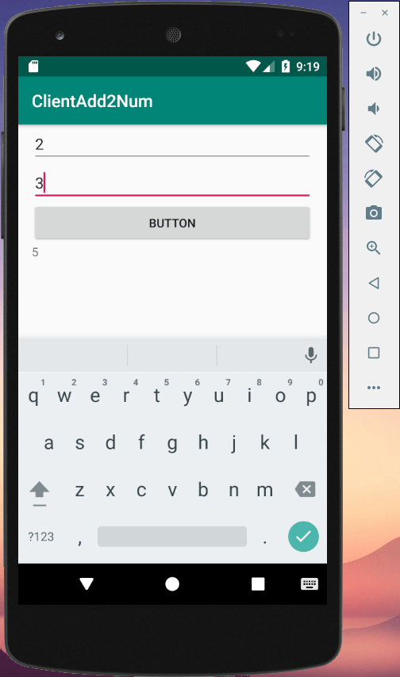

_Рисунок 12 — Результат работы программы_
