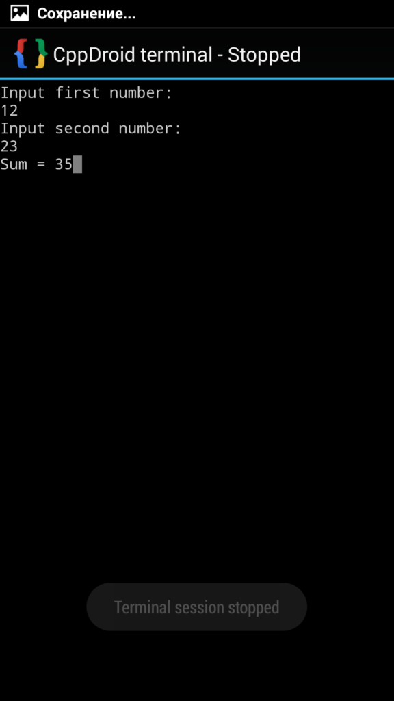

# Сложение двух чисел в CppDroid на C++


В статье рассказывается, как создать консольное приложения сложения двух чисел в CppDroid на Android.

- [Программа](#программа)
- [Болванка приложения](#болванка-приложения)
- [Написание кода](#написание-кода)

## Программа

Программировать под C++ можно и в Android. CppDroid одна из таких приложений. Вот ссылка на приложение:

[Google Play](https://play.google.com/store/apps/details?id=name.antonsmirnov.android.cppdroid&hl=ru)

При открытии приложения будет произведена скачка и установка нужных файлов:


_Рисунок 1 — Установка новых файлов_

После этого откроется главное окно приложения:


_Рисунок 2 — Окно программы_

## Болванка приложения

Введем в редакторе вот такой код:

```cpp
#include <iostream>
using namespace std;
int main(){

return 0;
}
```


_Рисунок 3 — Код болванки_

Сохраните и скомпилируйте приложение:


_Рисунок 4 — Компилирование проекта_


_Рисунок 5 — Завершение компилирования_

После этого запустите приложение:


_Рисунок 6 — Запуск приложения_

Откроется пустое окно. Если вы его видите, то всё хорошо:


_Рисунок 7 — Запущенная болванка приложения_

## Написание кода

Внутри функции `main` напишем такой код:

```cpp
int a, b, c;
cout << "Input first number:"<< endl;
cin >> a;
cout << "Input second number:"<< endl;
cin >> b;
c = a + b;
cout << "Sum = " << c;
return 0;
```

Полный код будет такой:

```cpp
#include <iostream>
using namespace std;
int main(){
int a, b, c;
cout << "Input first number:"<< endl;
cin >> a;
cout << "Input second number:"<< endl;
cin >> b;
c = a + b;
cout << "Sum = " << c;
return 0;
}
```


_Рисунок 8 — Код программы_

Аналогичным способом выше сохраним, скомпилируем и запустим программу:


_Рисунок 9 — Компилирование программы_


_Рисунок 10 — Запущенное приложение_

Введите числа и получите в результате:



_Рисунок 11 — Результат выполнения программы_
