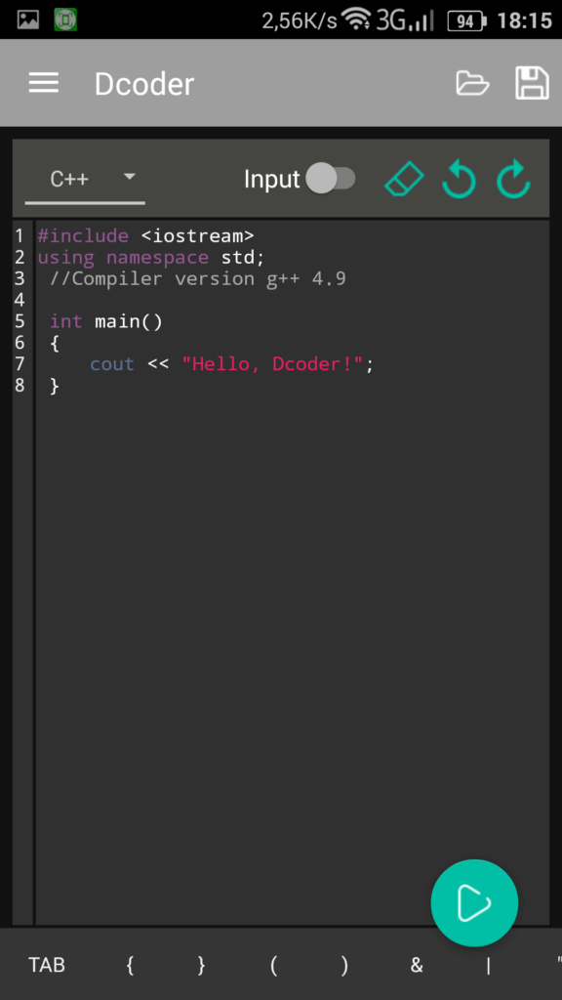

# Сложение двух чисел в Dcoder на C++


В статье рассказывается, как создать консольное приложения сложения двух чисел в Dcoder (Mobile Compiler IDE) на Android.

- [Программа](#программа)
- [Болванка приложения](#болванка-приложения)
- [Написание кода](#написание-кода)
- [Запуск программы](#запуск-программы)

## Программа

Программировать под C++ можно и в Android. Dcoder одна из таких приложений. Вот ссылка на приложение:

[Google Play](https://play.google.com/store/apps/details?id=com.paprbit.dcoder)

При открытии приложения пропустите приветственные слайды:


_Рисунок 1 — Приветственные слайды_

После попросят войти в приложение под учетной записью. Я выбрал учетку от Google:


_Рисунок 2 — Вход в учетную запись_

Появится начальное окно приложения:


_Рисунок 3 — Начальное окно приложения_

Нажимаем `Code Now`:


_Рисунок 4 — Кнопка Code Now_

## Болванка приложения

Выберем язык C++ в списке языков:


_Рисунок 5 — Выбор языка программирования_



_Рисунок 6 — Болванка приложения на C++_

Обратите внимание на то, что вы можете очистить потом окно для нового проекта через значок стирательной резинки. И внизу появится кнопка для вставки болванки кода на C++:


_Рисунок 7 — Кнопка для вставки болванки кода_

## Написание кода

Внутри функции `main` напишем такой код:

```cpp
int a, b, c;
cin >> a;
cin >> b;
c = a + b;
cout << "Sum = " << c;
```

Полный код будет такой:

```cpp
#include <iostream>
using namespace std;
 //Compiler version g++ 4.9

 int main()
 {
 int a, b, c;
 cin >> a;
 cin >> b;
 c = a + b;
 cout << "Sum = " << c;
 }
```


_Рисунок 8 — Код программы_

## Запуск программы

К сожалению, запуск программы не совсем тривиальный и отличается от обычного запуска консольных программ. Проблема заключается в том, что придется вначале ввести все параметры, которые может запросить программа, а только потом ей запустить. В нашем случае программа запросит значения переменных `a` и `b`.

Нажмем галочку `Input`:


_Рисунок 9 — Кнопка Input_

Введем наши два числа, которые мы хотим сложить:


_Рисунок 10 — Ввод значений параметров_

Нажмем на кнопку запуска приложения:


_Рисунок 11 — Запуск приложения_

И получим в результате:


_Рисунок 12 — Результат выполнения программы_

Нажав на иконку сохранения, вы можете сохранить код программы:


_Рисунок 13 — Сохранение программы_
