# Сложение двух чисел в Android Studio с использованием Retrofit (клиент-серверное приложение)


Напишем приложение сложение двух чисел, где сложение двух чисел происходит на стороне сервера.

<details>
<summary>📖 Содержание</summary>

- [Постановка задачи](#постановка-задачи)
- [Серверная часть](#серверная-часть)
- [Создание Android проекта](#создание-android-проекта)
- [XML разметка](#xml-разметка)
- [Добавляем разрешения](#добавляем-разрешения)
- [Про аннотации](#про-аннотации)
- [Подключение зависимостей](#подключение-зависимостей)
- [Шаблон запроса](#шаблон-запроса)
- [Java код](#java-код)
- [Ошибка Invoke-customs](#ошибка-invoke-customs)

В [статье](https://github.com/Harrix/harrix.dev-articles-2017/blob/main/add-2-num-http-url-connection-post/add-2-num-http-url-connection-post.md) | [🡥](https://harrix.dev/ru/articles/2017/add-2-num-http-url-connection-post/) приведен вариант, где сервер выдает одно число и всё. Чаще всего же сервера в виде текстовых файлов отдают либо HTML, либо XML, либо JSON, то есть структурированную информацию. В таких случаях часто используют библиотеку [Retrofit](https://square.github.io/retrofit/).

</details>

## Постановка задачи

На сервер от Android приложения поступает HTTP запрос с двумя переменными `a` и `b`. Переменные `a` и `b` передаются через POST параметры.

Сервер возвращает JSON файл, который содержит как слагаемые, так и сумму чисел, которая отображается в Android приложении.

Если мы передадим через POST параметры `a=2`, `b=3`, то сервер выдаст ответ:

```json
{ "a": 2, "b": 3, "c": 5 }
```

## Серверная часть

У вас должен быть сервер, доступный из интернета, к которому можно обращаться.

В [статье](https://github.com/Harrix/harrix.dev-articles-2017/blob/main/add-2-num-php-post-json/add-2-num-php-post-json.md) | [🡥](https://harrix.dev/ru/articles/2017/add-2-num-php-post-json/) приведен пример серверной части на PHP.

В статье буду использовать PHP скрипт, который я расположил по адресу (если перейти по ссылке без POST параметров, то должно выдаваться `error`):

<https://github.com/Harrix/harrix.dev-articles-2017/tree/main/add-2-num-php-post-json/demo>.

## Создание Android проекта

В статье [Болванка приложения на Android Studio](https://github.com/Harrix/harrix.dev-articles-2020/blob/main/empty-project-android/empty-project-android.md) | [🡥](https://harrix.dev/ru/articles/2020/empty-project-android/) рассказывается, как создать болванку приложения.

## XML разметка

Пусть разметка файла `activity_main.xml` будет такой:

```xml
<?xml version="1.0" encoding="utf-8"?>
<LinearLayout xmlns:android="http://schemas.android.com/apk/res/android"
    android:layout_width="match_parent"
    android:layout_height="match_parent"
    android:orientation="vertical"
    android:paddingLeft="16dp"
    android:paddingRight="16dp">

    <EditText
        android:id="@+id/editText"
        android:layout_width="match_parent"
        android:layout_height="wrap_content"
        android:ems="10"
        android:inputType="textPersonName" />

    <EditText
        android:id="@+id/editText2"
        android:layout_width="match_parent"
        android:layout_height="wrap_content"
        android:ems="10"
        android:inputType="textPersonName" />

    <Button
        android:id="@+id/button"
        android:layout_width="match_parent"
        android:layout_height="wrap_content"
        android:text="Button" />

    <TextView
        android:id="@+id/textView"
        android:layout_width="match_parent"
        android:layout_height="wrap_content" />
</LinearLayout>
```

Есть два поля ввода чисел, кнопка и поле для вывода суммы чисел. Все элементы имеют свои идентификаторы `android:id`:

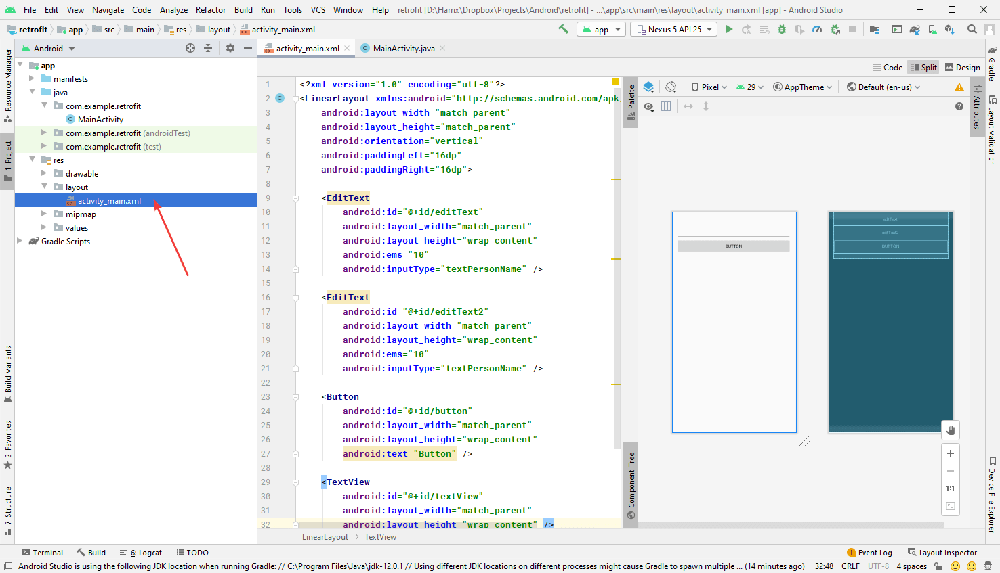

_Рисунок 1 — XML разметка приложения_

## Добавляем разрешения

Приложение у нас будет обращаться в интернет. Поэтому нужно ей дать на это разрешение в `AndroidManifest.xml`:

```xml
<uses-permission android:name="android.permission.INTERNET"/>
```

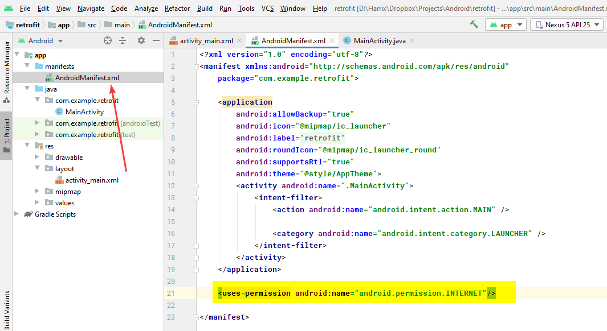

_Рисунок 2 — Разрешение на доступ в интернет_

## Про аннотации

Мы закончили со стандартной частью и теперь переходим к программированию с использованием библиотеки `Retrofit`. Она основана на работе с аннотациями. Многие, кто изучает Java, с ними напрямую не сталкивались и не понимают, что это такое. Так что настоятельно рекомендую изучить эту тему, прежде чем идти дальше. Вот пример одной из аннотаций, чтобы понимали, как они выглядят. Видите, знаки `@`. Вот ими и обозначаются аннотации:

```java
@Target(ElementType.METHOD)
@Retention(RetentionPolicy.RUNTIME)
public @interface NeedMethod {
    int type() default 1;
}
```

[Кратко об аннотациях в Java](https://github.com/Harrix/harrix.dev-articles-2017/blob/main/java-annotation/java-annotation.md) | [🡥](https://harrix.dev/ru/articles/2017/java-annotation/)

А тут показан пример использования аннотаций для решения одной из задач, по которой, надеюсь, аннотации станут понятнее.

[Как вызвать метод класса из другого класса при недостатке информации через аннотации в Java](https://github.com/Harrix/harrix.dev-articles-2017/blob/main/method-call-java-annotation/method-call-java-annotation.md) | [🡥](https://harrix.dev/ru/articles/2017/method-call-java-annotation/)

## Подключение зависимостей

Надеюсь, что вы только что поломали себе мозг над аннотациями, так что переходим к Retrofit.

Нам нужна будет сама библиотека [Retrofit](https://square.github.io/retrofit/).

От сервера мы получим JSON файл. Библиотекой [Gson](https://github.com/google/gson) будет его парсить.

И нужен конвектор данных от Retrofit в Gson [Gson Converter](https://github.com/square/retrofit/tree/master/retrofit-converters/gson).

Подключим эти библиотеки. Переходим в файл `build.gradle (Module.app)`:

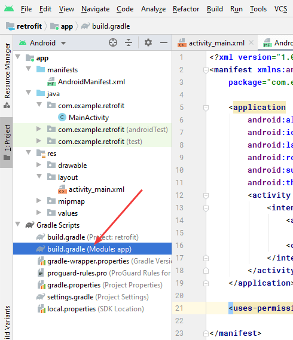

_Рисунок 3 — Файл build.gradle_

В разделе `dependencies` нужно подключить вышеупомянутые три библиотеки:

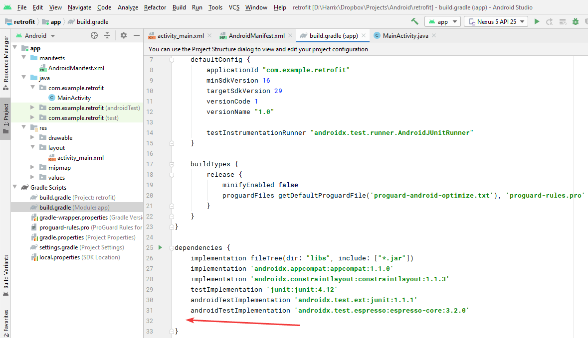

_Рисунок 4 — Содержимое файла build.gradle и место размещения зависимостей_

```text
implementation 'com.squareup.retrofit2:retrofit:2.9.0'
implementation 'com.squareup.retrofit2:converter-gson:2.9.0'
implementation 'com.google.code.gson:gson:2.8.6'
```

Хотя нет. А давайте в этот раз пропишем зависимости в «автоматизированном» виде:

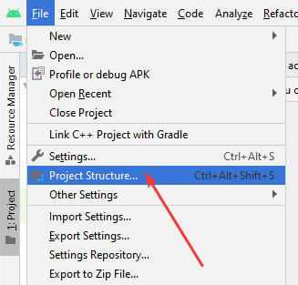

_Рисунок 5 — Выбор пункта Project Structure_

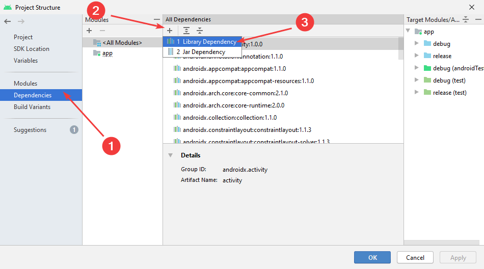

_Рисунок 6 — Добавление новой библиотеки_

Вводим `retrofit` и жмем кнопку поиска:

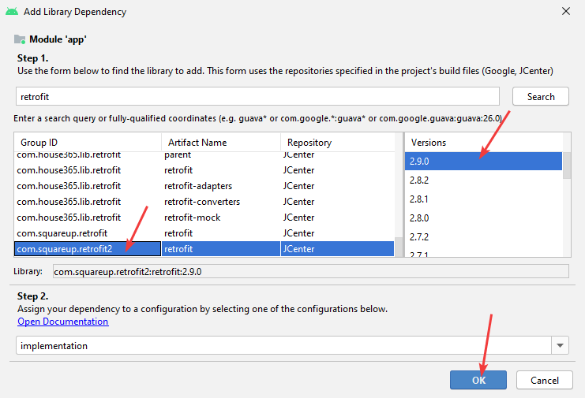

_Рисунок 7 — Поиск и добавление библиотеки retrofit_

Добавим следующую библиотеку:

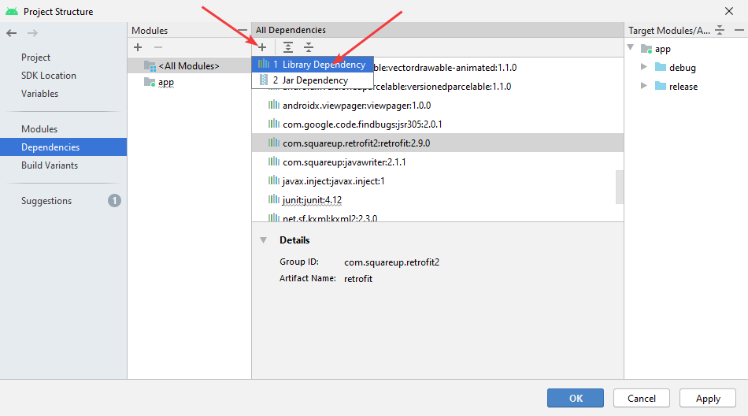

_Рисунок 8 — Добавление еще одной библиотеки_

Вводим `converter-gson`:


_Рисунок 9 — Поиск и добавление библиотеки converter-gson_

Добавим следующую библиотеку:

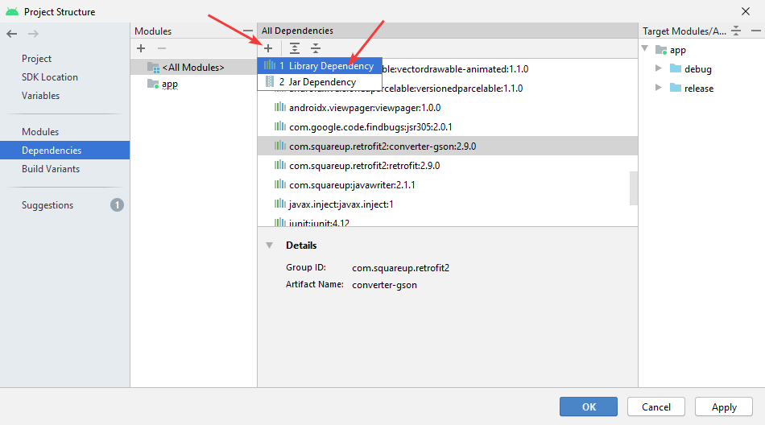

_Рисунок 10 — Добавление еще одной библиотеки_

Вводим `gson`:

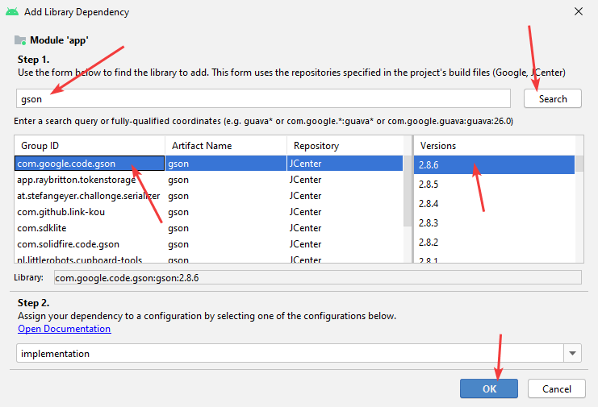

_Рисунок 11 — Поиск и добавление библиотеки Gson_

Список добавленных библиотек:

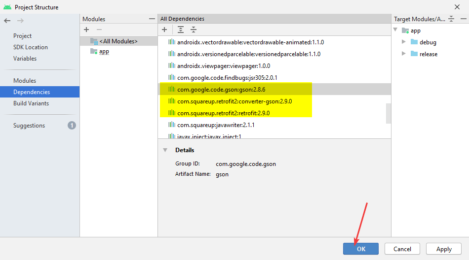

_Рисунок 12 — Список добавленных библиотек_

Теперь в `build.gradle` появились нужные строчки:

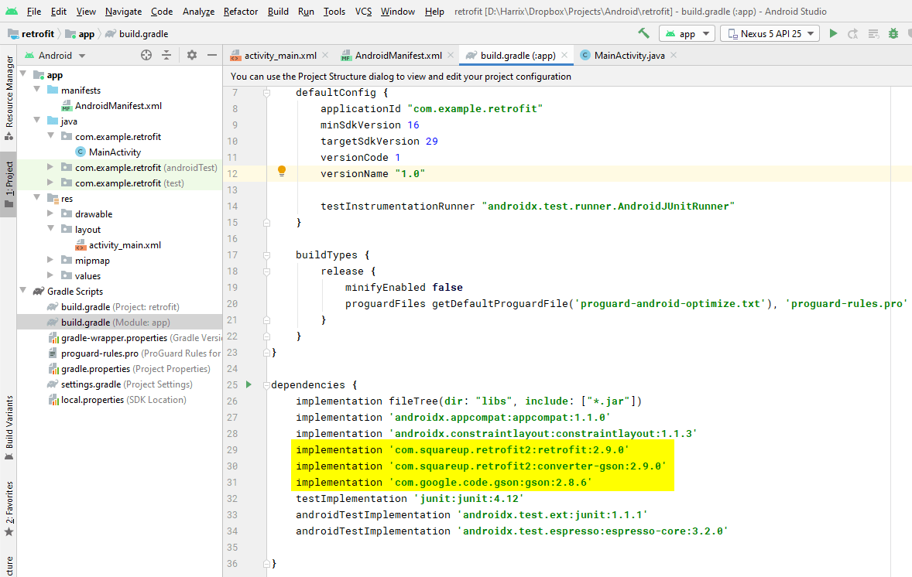

_Рисунок 13 — Добавленные библиотеки в build.gradle_

Можно было эти строчки прописать вручную, но, когда вы будете читать эту статью, версии библиотек скорее всего обновятся, так что способом, что показано выше, можно получить последние версии библиотек.

## Шаблон запроса

Создадим шаблон запроса к серверу. Он будет основан на интерфейсе с использованием аннотаций (тех самых, которыми я выше пугал) из библиотеки Retrofit.

Допустим наш интерфейс будет называться `Request`:

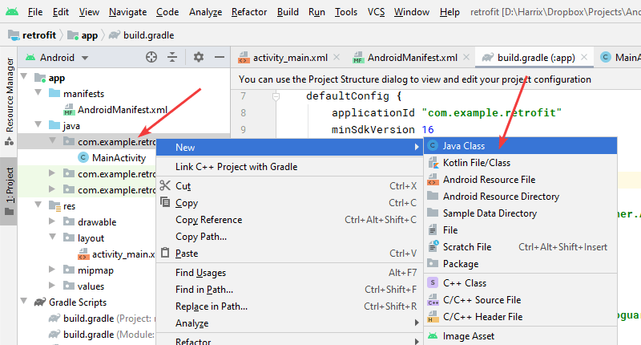

_Рисунок 14 — Правый клик по пакету приложения_

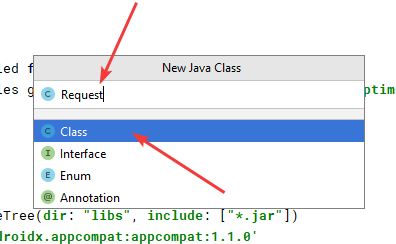

_Рисунок 15 — Выбор имени интерфейса_

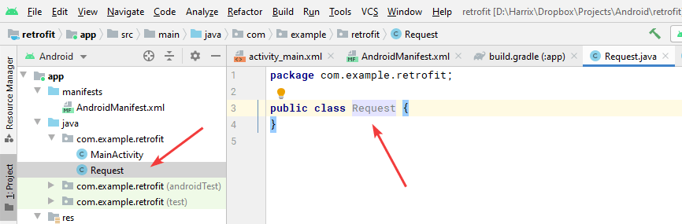

_Рисунок 16 — Созданный пустой интерфейс_

Шаблон для наполнения я скопировал со [страницы](https://square.github.io/retrofit/) из раздела FORM ENCODED AND MULTIPART.

Пока получилось так:

```java
package com.example.retrofit;

public interface Request {
    @FormUrlEncoded
    @POST("user/edit")
    Call<User> updateUser(@Field("first_name") String first, @Field("last_name") String last);
}
```

Нужно поменять строчку с `Call`. Здесь мы прописываем шаблон метода, который будем отправлять данные на сервер и получать ответ от него.

Как и в предыдущих статьях ([эта](https://github.com/Harrix/harrix.dev-articles-2017/blob/main/add-2-num-apache-http-post/add-2-num-apache-http-post.md) | [🡥](https://harrix.dev/ru/articles/2017/add-2-num-apache-http-post/) и [эта](https://github.com/Harrix/harrix.dev-articles-2017/blob/main/add-2-num-http-url-connection-post/add-2-num-http-url-connection-post.md) | [🡥](https://harrix.dev/ru/articles/2017/add-2-num-http-url-connection-post/)) набор отправляемых параметров будем передавать в виде словаря `HashMap`.

Также по аналогии с прошлыми статьями метод, который отправляет запрос и получает ответ, назовем `performPostCall`.

А вот с возвращаемым объектом не будем заморачиваться: пусть будет возвращаться обычный `Object`.

Получилась строчка у меня такая:

```java
Call<Object> performPostCall(@FieldMap HashMap<String, String> postDataParams);
```

И поменяем путь к скрипту на сервере, который считает сумму наших чисел. Это прописано в аннотации `@POST`.

Выше я говорил, что PHP скрипт я расположил по адресу <https://github.com/Harrix/harrix.dev-articles-2017/tree/main/add-2-num-php-post-json/demo>. Получается, что сервер находится по адресу `https://harrix.dev`, а скрипт на этом сервере находится по строчке `/ru/articles/2017/add-2-num-php-post-json/demo/`. Вот этот путь и записываем в `@POST`. Адрес сервера не указываем!

В итоге я получил вот такой интерфейс:

```java
package com.example.retrofit;

import java.util.HashMap;

import retrofit2.Call;
import retrofit2.http.FieldMap;
import retrofit2.http.FormUrlEncoded;
import retrofit2.http.POST;

public interface Request {
    @FormUrlEncoded
    @POST("/ru/articles/2017/add-2-num-php-post-json/demo/")
    Call<Object> performPostCall(@FieldMap HashMap<String, String> postDataParams);
}
```

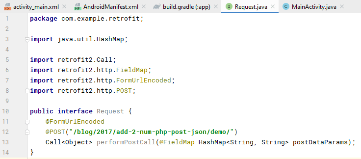

_Рисунок 17 — Созданный интерфейс запроса_

## Java код

Был такой код файла `MainActivity.java`:

```java
package com.example.retrofit;

import androidx.appcompat.app.AppCompatActivity;

import android.os.Bundle;

public class MainActivity extends AppCompatActivity {

    @Override
    protected void onCreate(Bundle savedInstanceState) {
        super.onCreate(savedInstanceState);
        setContentView(R.layout.activity_main);
    }
}
```

Вначале объявим переменные кнопки, полей ввода и поля для вывода результата и соединим их с элементами из XML файла. Также назначим слушателя для клика кнопки:

```java
package com.example.retrofit;

import androidx.appcompat.app.AppCompatActivity;

import android.os.Bundle;
import android.view.View;
import android.widget.Button;
import android.widget.EditText;
import android.widget.TextView;

public class MainActivity extends AppCompatActivity {

    private TextView textView;
    private EditText editText;
    private EditText editText2;
    private Button button;

    @Override
    protected void onCreate(Bundle savedInstanceState) {
        super.onCreate(savedInstanceState);
        setContentView(R.layout.activity_main);

        textView = findViewById(R.id.textView);
        editText = findViewById(R.id.editText);
        editText2 = findViewById(R.id.editText2);
        button = findViewById(R.id.button);

        button.setOnClickListener(new View.OnClickListener() {
            @Override
            public void onClick(View v) {

            }
        });
    }
}
```

В классе активности объявим переменные:

```java
private String a, b, answerHTTPS;
```

А также определим переменную `server`, которая будет указывать на сервер, к которому мы будем осуществлять запрос. Если вы используйте свой сервер, то поменяйте значение. Обратите внимание, что слэша в конце адреса сервера нет:

```java
private final String server = "https://harrix.dev";
```

Создадим экземпляр парсера `Gson` файла JSON:

```java
private Gson gson = new GsonBuilder().create();
```

И, наконец, создадим экземпляр нашего главного класса `Retrofit`, где укажем экземпляр `gson` и адрес сервер `server`:

```java
private Retrofit retrofit = new Retrofit.Builder()
        .addConverterFactory(GsonConverterFactory.create(gson))
        .baseUrl(server)
        .build();
```

Привяжем шаблон запроса к объекту `retrofit`:

```java
private Request req = retrofit.create(Request.class);
```

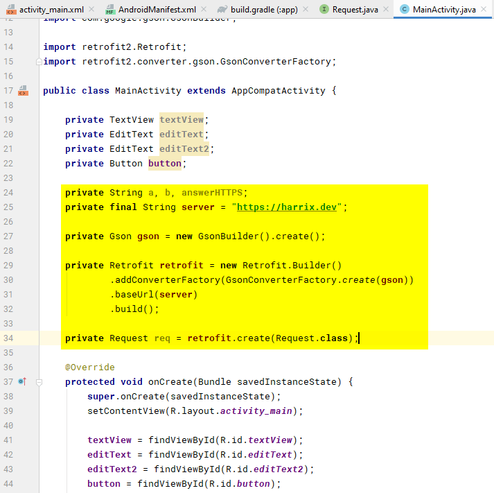

_Рисунок 18 — Созданные переменные_

Подготовительная работа сделана. Теперь переходим к программированию клика кнопки.

В клике кнопки считаем значения переменных `a` и `b` из полей ввода:

```java
a = editText.getText().toString();
b = editText2.getText().toString();
```

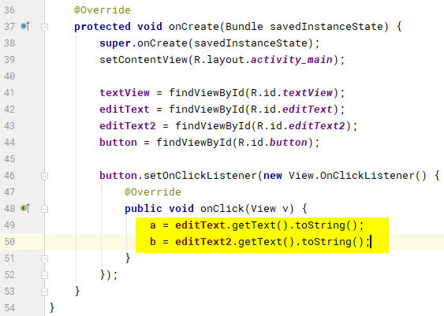

_Рисунок 19 — Тело метода onClick()_

Там же создадим `HashMap` для наших параметров и закинем туда наши считанные числа:

```java
HashMap<String, String> postDataParams = new HashMap<String, String>();
postDataParams.put("a", a);
postDataParams.put("b", b);
```

Создаем объект запроса (пока не запуская отправки запроса) по нашему шаблону:

```java
Call<Object> call = req.performPostCall(postDataParams);
```

В Retrofit есть два метода для запуска запроса: `execute()` и `enqueue()`.

Можно пользоваться любым, но первый выполняется в том потоке, в котором его вызвали. И если его вызвать в главном потоке, то вызовется ошибка `NetworkOnMainThreadException`, так как обращения к сети нельзя делать в главном потоке. То есть нужно создать новый поток (например, через `AsyncTask`) и уже там вызывать метод `execute()`.

А вот метод `enqueue()` сам создает еще один поток, в котором вызывает запрос. Его и используем:

```java
call.enqueue(new Callback<Object>() {
    @Override
    public void onResponse(Call<Object> call, Response<Object> response) {
    }

    @Override
    public void onFailure(Call<Object> call, Throwable t) {
    }
});
```

Метод `onResponse()` вызывается, если запрос прошел успешно.

Метод `onFailure()` вызывается, если что-то пошло не так.

Обратите внимание, что в библиотеке есть готовый класс-дженерик `Response<>`, куда записывается ответ.

Теперь ответ, что содержится в объекте `response` из метода `onResponse()`, можем анализировать, как хотим.

В конкретно нашем случае, сервер генерирует простой линейный JSON файл c тремя параметрами `a`, `b`, `c`.

Поэтому нам будет удобно перевести ответ сервера в `HashMap<String, Double>` с тремя элементами:

```java
HashMap<String, Double> map = gson.fromJson(response.body().toString(),HashMap.class);
```

Из трех значений в данном словаре нужно только со значением ключа `c`. Вытаскиваем и выводим:

```java
answerHTTPS = Double.toString(map.get("c"));
textView.setText(answerHTTPS);
```

А если пошло что-то не так, то выводим сообщение об ошибке:

```java
@Override
public void onFailure(Call<Object> call, Throwable t) {
    textView.setText("Request error");
}
```

Полный код:

```java
package com.example.retrofit;

import androidx.appcompat.app.AppCompatActivity;

import android.os.Bundle;
import android.view.View;
import android.widget.Button;
import android.widget.EditText;
import android.widget.TextView;

import com.google.gson.Gson;
import com.google.gson.GsonBuilder;

import java.util.HashMap;

import retrofit2.Call;
import retrofit2.Callback;
import retrofit2.Response;
import retrofit2.Retrofit;
import retrofit2.converter.gson.GsonConverterFactory;

public class MainActivity extends AppCompatActivity {

    private TextView textView;
    private EditText editText;
    private EditText editText2;
    private Button button;

    private String a, b, answerHTTPS;
    private final String server = "https://harrix.dev";

    private Gson gson = new GsonBuilder().create();

    private Retrofit retrofit = new Retrofit.Builder()
            .addConverterFactory(GsonConverterFactory.create(gson))
            .baseUrl(server)
            .build();

    private Request req = retrofit.create(Request.class);

    @Override
    protected void onCreate(Bundle savedInstanceState) {
        super.onCreate(savedInstanceState);
        setContentView(R.layout.activity_main);

        textView = findViewById(R.id.textView);
        editText = findViewById(R.id.editText);
        editText2 = findViewById(R.id.editText2);
        button = findViewById(R.id.button);

        button.setOnClickListener(new View.OnClickListener() {
            @Override
            public void onClick(View v) {
                a = editText.getText().toString();
                b = editText2.getText().toString();

                HashMap<String, String> postDataParams = new HashMap<String, String>();
                postDataParams.put("a", a);
                postDataParams.put("b", b);

                Call<Object> call = req.performPostCall(postDataParams);

                call.enqueue(new Callback<Object>() {
                    @Override
                    public void onResponse(Call<Object> call, Response<Object> response) {
                        HashMap<String, Double> map =
                                gson.fromJson(response.body().toString(), HashMap.class);

                        answerHTTPS = Double.toString(map.get("c"));
                        textView.setText(answerHTTPS);
                    }

                    @Override
                    public void onFailure(Call<Object> call, Throwable t) {
                        textView.setText("Request error");
                    }
                });
            }
        });
    }
}
```

Всё. Можете запускать приложение и проверять работу:

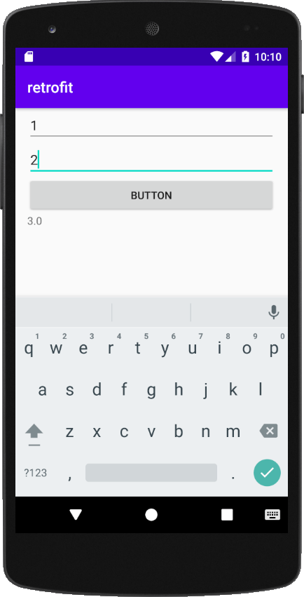

_Рисунок 20 — Результат выполнения программы_

## Ошибка Invoke-customs

У меня используется Java 8 и на Android 4.0 вылетела ошибка: `Invoke-customs are only supported starting with Android O ...`

Для этого пришлось в `build.gradle` прописать следующие строки:

```json
compileOptions {
    sourceCompatibility JavaVersion.VERSION_1_8
    targetCompatibility JavaVersion.VERSION_1_8
}
```

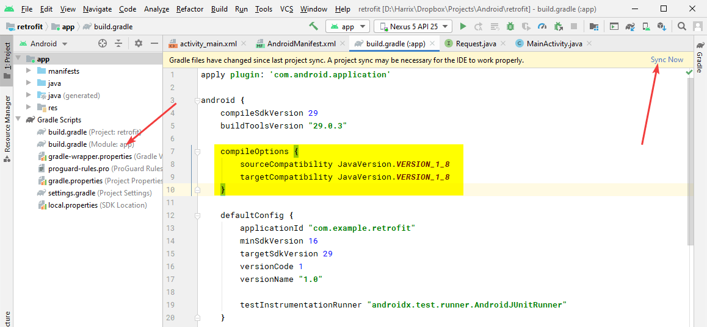

_Рисунок 21 — Добавление версии Java для компиляции проекта_
