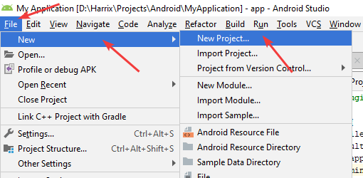
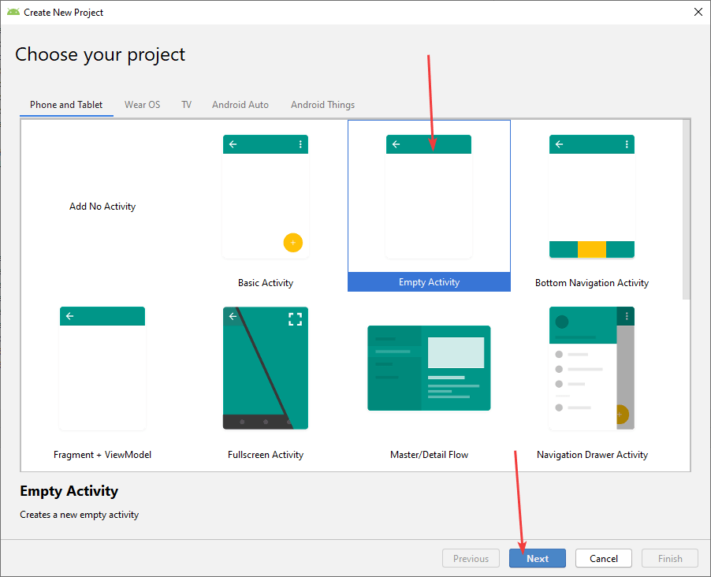
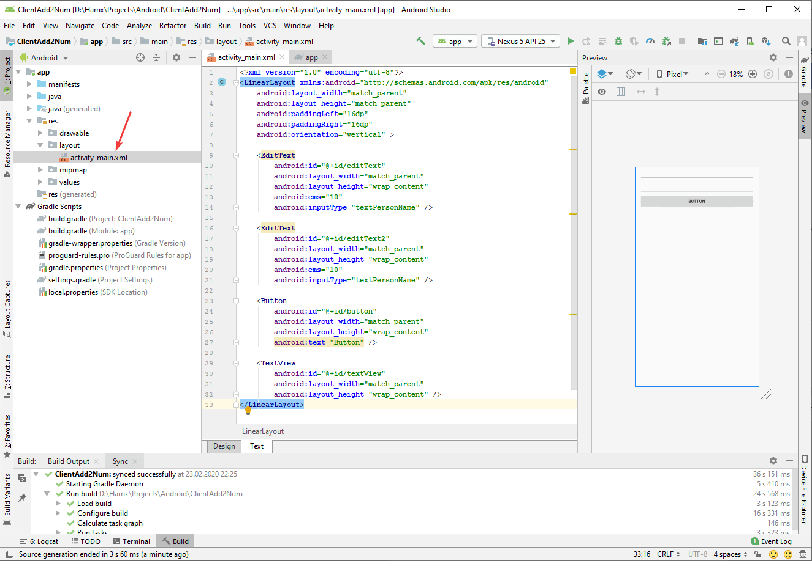
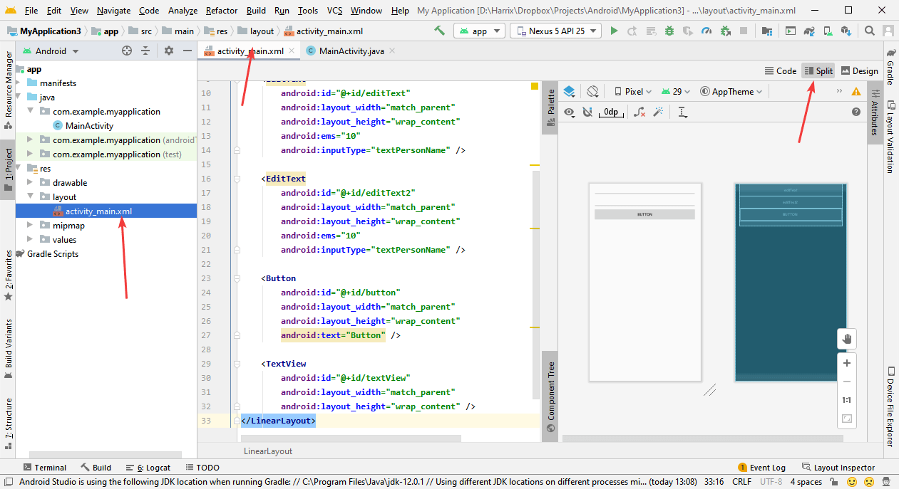
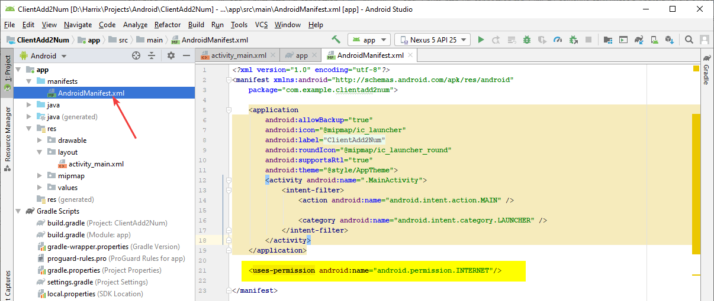
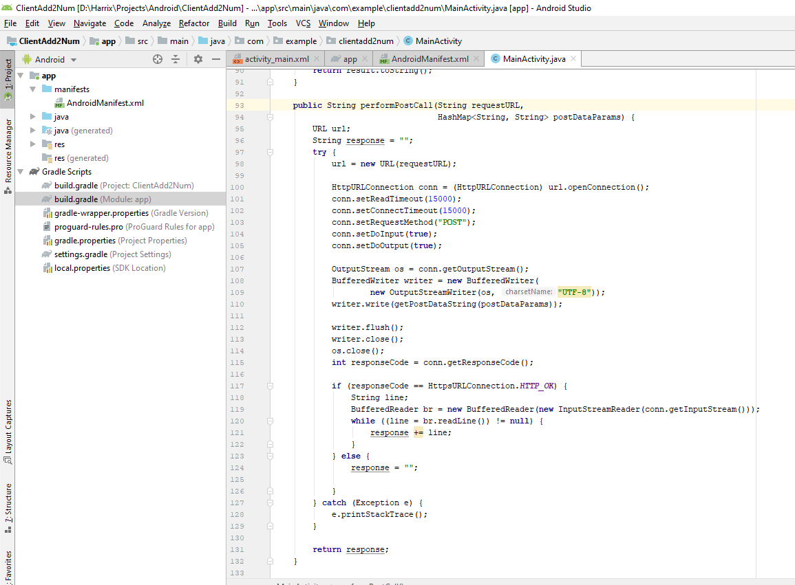
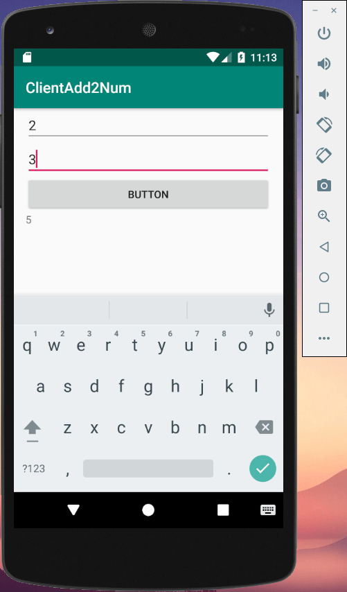

# Сложение двух чисел в Android Studio с использованием HttpURLConnection и передачей параметров через POST (клиент-серверное приложение)

Напишем приложение сложение двух чисел, где сложение двух чисел происходит на стороне сервера.

В статье [Сложение двух чисел в Android Studio с использованием Apache HTTP с передачей параметров через POST (клиент-серверное приложение)](https://github.com/Harrix/harrix.dev-blog-2017/blob/main/add-2-num-apache-http-post/add-2-num-apache-http-post.md) приведен вариант с использованием [устаревших](https://developer.android.com/about/versions/marshmallow/android-6.0-changes.html#behavior-apache-http-client) классов. В данной статье используются классы, пришедшие на замену.

В [статье](https://github.com/Harrix/harrix.dev-blog-2017/blob/main/add-2-num-http-url-connection/add-2-num-http-url-connection.md) показан вариант приложения для отправки GET параметров.

## Постановка задачи

В [статье](https://github.com/Harrix/harrix.dev-blog-2019/blob/main/add-2-num-android/add-2-num-android.md) показан пример приложения под Android по сложению двух чисел. И там сложение двух чисел происходило в самом приложении, что логично. А в этом приложении мы из полей ввода считаем два числа и отправим их на сервер, который сложит два числа, отправит нам ответ, и мы этот ответ отобразим в текстовом поле.

В статье буду использовать PHP скрипт, который я расположил по адресу <https://github.com/Harrix/harrix.dev-blog-2017/tree/main/add-2-num-php-post/demo> (если перейти по ссылке без параметров, то должно выдаваться `error`).

## Серверная часть

У вас должен быть сервер, доступный из интернета, к которому можно обращаться.

В [статье](https://github.com/Harrix/harrix.dev-blog-2017/blob/main/add-2-num-java-post/add-2-num-java-post.md) приведен пример серверной части на Java.

В [статье](https://github.com/Harrix/harrix.dev-blog-2017/blob/main/add-2-num-php-post/add-2-num-php-post.md) приведен пример серверной части на PHP.

В статье буду использовать PHP скрипт, который я расположил по адресу <https://github.com/Harrix/harrix.dev-blog-2017/tree/main/add-2-num-php-post/demo> (если перейти по ссылке без параметров, то должно выдаваться `error`).

## Создание Android проекта

Надеюсь, что вы сможете сами создать болванку приложения, так что закинул под спойлер.

---

**Создание Android проекта** <!-- !details -->






---

## XML разметка

Пусть разметка файла `activity_main.xml` будет такой:

```xml
<?xml version="1.0" encoding="utf-8"?>
<LinearLayout xmlns:android="http://schemas.android.com/apk/res/android"
    android:layout_width="match_parent"
    android:layout_height="match_parent"
    android:paddingLeft="16dp"
    android:paddingRight="16dp"
    android:orientation="vertical" >

    <EditText
        android:id="@+id/editText"
        android:layout_width="match_parent"
        android:layout_height="wrap_content"
        android:ems="10"
        android:inputType="textPersonName" />

    <EditText
        android:id="@+id/editText2"
        android:layout_width="match_parent"
        android:layout_height="wrap_content"
        android:ems="10"
        android:inputType="textPersonName" />

    <Button
        android:id="@+id/button"
        android:layout_width="match_parent"
        android:layout_height="wrap_content"
        android:text="Button" />

    <TextView
        android:id="@+id/textView"
        android:layout_width="match_parent"
        android:layout_height="wrap_content" />
</LinearLayout>
```

Есть два поля ввода чисел, кнопка и поле для вывода суммы чисел. Все элементы имеют свои идентификаторы `android:id`:



В Android Studio 4.0 переход к разметке XML файла осуществляется вот так:



## Добавляем разрешения

Приложение у нас будет обращаться в интернет. Поэтому нужно ей дать на это разрешение в `AndroidManifest.xml`:

```xml
<uses-permission android:name="android.permission.INTERNET"/>
```



## Java код

Был такой код файла `MainActivity.java`:

```java
package com.example.clientadd2num;

import androidx.appcompat.app.AppCompatActivity;

import android.os.Bundle;

public class MainActivity extends AppCompatActivity {

    @Override
    protected void onCreate(Bundle savedInstanceState) {
        super.onCreate(savedInstanceState);
        setContentView(R.layout.activity_main);
    }
}
```

Вначале объявим переменные кнопки, полей ввода и поля для вывода результата и соединим их с элементами из XML файла. Также назначим слушателя для клика кнопки:

```java
package com.example.clientadd2num;

import androidx.appcompat.app.AppCompatActivity;

import android.os.Bundle;
import android.view.View;
import android.widget.Button;
import android.widget.EditText;
import android.widget.TextView;

public class MainActivity extends AppCompatActivity {

    private TextView textView;
    private EditText editText;
    private EditText editText2;
    private Button button;

    @Override
    protected void onCreate(Bundle savedInstanceState) {
        super.onCreate(savedInstanceState);
        setContentView(R.layout.activity_main);

        textView = (TextView)findViewById(R.id.textView);
        editText = (EditText)findViewById(R.id.editText);
        editText2 = (EditText)findViewById(R.id.editText2);
        button = (Button)findViewById(R.id.button);

        button.setOnClickListener(new View.OnClickListener() {
            @Override
            public void onClick(View v) {

            }
        });
    }
}
```

Нам потребуется метод, который переводит `InputStream` в `String`:

```java
private String convertInputStreamToString(InputStream in) {
    BufferedReader reader = null;
    StringBuffer response = new StringBuffer();
    try {
        reader = new BufferedReader(new InputStreamReader(in));
        String line = "";
        while ((line = reader.readLine()) != null) {
            response.append(line);
        }
    } catch (IOException e) {
        e.printStackTrace();
    } finally {
        if (reader != null) {
            try {
                reader.close();
            } catch (IOException e) {
                e.printStackTrace();
            }
        }
    }
    return response.toString();
}
```

Запросы к серверу по времени могут быть длительными. Поэтому обязательно делаем их в другом потоке. Для этого внутри класса `MainActivity` создадим класс-наследник от `AsyncTask`:

```java
class MyAsyncTask extends AsyncTask<String, String, String> {

    @Override
    protected void onPreExecute() {
        super.onPreExecute();
    }

    @Override
    protected String doInBackground(String... params) {
        // Тут будет запрос к серверу
        return null;
    }

    @Override
    protected void onPostExecute(String result) {
        super.onPostExecute(result);
    }
}
```

В классе `MyAsyncTask` объявим переменные:

```java
String a, b;
```

А также определим переменную `server`, которая будет указывать на сервер, к которому мы будем осуществлять запрос. Если вы используйте свой сервер, то поменяйте значение:

```java
String server = "https://harrix.dev/blog/2017/add-2-num-php-post/demo/";
```

В методе `onPreExecute()` считаем данные из полей ввода:

```java
@Override
protected void onPreExecute() {
    super.onPreExecute();
    a = editText.getText().toString();
    b = editText2.getText().toString();
}
```

В методе `onPostExecute()` выведем ответ сервера:

```java
@Override
protected void onPostExecute(String result) {
    super.onPostExecute(result);
    textView.setText(result);
}
```

В методе `doInBackground()` будем обращаться к серверу. Мы разнесем работу этого метода на два других метода, поэтому к методу `doInBackground()` вернемся попозже.

Во-первых, давайте параметры, которые мы хотим закинуть в POST, будем передавать в виде `HashMap<String, String>`. Для этого нам будет нужна функция перевода HashMap в строку нужного нам вида:

```java
private String getPostDataString(HashMap<String, String> params) throws UnsupportedEncodingException {
    StringBuilder result = new StringBuilder();
    boolean first = true;
    for (Map.Entry<String, String> entry : params.entrySet()) {
        if (first)
            first = false;
        else
            result.append("&");

        result.append(URLEncoder.encode(entry.getKey(), "UTF-8"));
        result.append("=");
        result.append(URLEncoder.encode(entry.getValue(), "UTF-8"));
    }

    return result.toString();
}
```

Во-вторых, обработку запроса и получение ответа тоже перенесем в отдельный метод:

```java
public String performPostCall(String requestURL,
                              HashMap<String, String> postDataParams) {
    URL url;
    String response = "";
    try {
        url = new URL(requestURL);

        HttpURLConnection conn = (HttpURLConnection) url.openConnection();
        conn.setReadTimeout(15000);
        conn.setConnectTimeout(15000);
        conn.setRequestMethod("POST");
        conn.setDoInput(true);
        conn.setDoOutput(true);

        OutputStream os = conn.getOutputStream();
        BufferedWriter writer = new BufferedWriter(
                new OutputStreamWriter(os, "UTF-8"));
        writer.write(getPostDataString(postDataParams));

        writer.flush();
        writer.close();
        os.close();
        int responseCode = conn.getResponseCode();

        if (responseCode == HttpsURLConnection.HTTP_OK) {
            String line;
            BufferedReader br = new BufferedReader(new InputStreamReader(conn.getInputStream()));
            while ((line = br.readLine()) != null) {
                response += line;
            }
        } else {
            response = "";

        }
    } catch (Exception e) {
        e.printStackTrace();
    }

    return response;
}
```

Тогда в методе `doInBackground()` будет достаточно составить `HashMap` с нужными параметрами, а потом вызвать `performPostCall()`:

```java
@Override
protected String doInBackground(String... params) {
    HashMap<String, String> postDataParams = new HashMap<String, String>();
    postDataParams.put("a", a);
    postDataParams.put("b", b);
    String answerHTTP = performPostCall(server, postDataParams);

    return answerHTTP;
}
```

Теперь остается только создать экземпляр данного класса `MyAsyncTask` в слушателе клика кнопки и запустить его:

```java
button.setOnClickListener(new View.OnClickListener() {
    @Override
    public void onClick(View v) {
        new MyAsyncTask().execute();
    }
});
```

В итоге у меня получился вот такой файл:

```java
package com.example.clientadd2num;

import androidx.appcompat.app.AppCompatActivity;

import android.os.AsyncTask;
import android.os.Bundle;
import android.view.View;
import android.widget.Button;
import android.widget.EditText;
import android.widget.TextView;

import java.io.BufferedReader;
import java.io.BufferedWriter;
import java.io.IOException;
import java.io.InputStream;
import java.io.InputStreamReader;
import java.io.OutputStream;
import java.io.OutputStreamWriter;
import java.io.UnsupportedEncodingException;
import java.net.HttpURLConnection;
import java.net.URL;
import java.net.URLEncoder;
import java.util.HashMap;
import java.util.Map;

import javax.net.ssl.HttpsURLConnection;

public class MainActivity extends AppCompatActivity {

    private TextView textView;
    private EditText editText;
    private EditText editText2;
    private Button button;

    @Override
    protected void onCreate(Bundle savedInstanceState) {
        super.onCreate(savedInstanceState);
        setContentView(R.layout.activity_main);

        textView = (TextView) findViewById(R.id.textView);
        editText = (EditText) findViewById(R.id.editText);
        editText2 = (EditText) findViewById(R.id.editText2);
        button = (Button) findViewById(R.id.button);

        button.setOnClickListener(new View.OnClickListener() {
            @Override
            public void onClick(View v) {
                new MyAsyncTask().execute();
            }
        });
    }

    private String convertInputStreamToString(InputStream in) {
        BufferedReader reader = null;
        StringBuffer response = new StringBuffer();
        try {
            reader = new BufferedReader(new InputStreamReader(in));
            String line = "";
            while ((line = reader.readLine()) != null) {
                response.append(line);
            }
        } catch (IOException e) {
            e.printStackTrace();
        } finally {
            if (reader != null) {
                try {
                    reader.close();
                } catch (IOException e) {
                    e.printStackTrace();
                }
            }
        }
        return response.toString();
    }

    private String getPostDataString(HashMap<String, String> params) throws UnsupportedEncodingException {
        StringBuilder result = new StringBuilder();
        boolean first = true;
        for (Map.Entry<String, String> entry : params.entrySet()) {
            if (first)
                first = false;
            else
                result.append("&");

            result.append(URLEncoder.encode(entry.getKey(), "UTF-8"));
            result.append("=");
            result.append(URLEncoder.encode(entry.getValue(), "UTF-8"));
        }

        return result.toString();
    }

    public String performPostCall(String requestURL,
                                  HashMap<String, String> postDataParams) {
        URL url;
        String response = "";
        try {
            url = new URL(requestURL);

            HttpURLConnection conn = (HttpURLConnection) url.openConnection();
            conn.setReadTimeout(15000);
            conn.setConnectTimeout(15000);
            conn.setRequestMethod("POST");
            conn.setDoInput(true);
            conn.setDoOutput(true);

            OutputStream os = conn.getOutputStream();
            BufferedWriter writer = new BufferedWriter(
                    new OutputStreamWriter(os, "UTF-8"));
            writer.write(getPostDataString(postDataParams));

            writer.flush();
            writer.close();
            os.close();
            int responseCode = conn.getResponseCode();

            if (responseCode == HttpsURLConnection.HTTP_OK) {
                String line;
                BufferedReader br = new BufferedReader(new InputStreamReader(conn.getInputStream()));
                while ((line = br.readLine()) != null) {
                    response += line;
                }
            } else {
                response = "";

            }
        } catch (Exception e) {
            e.printStackTrace();
        }

        return response;
    }

    class MyAsyncTask extends AsyncTask<String, String, String> {
        String a, b;
        String server = "https://harrix.dev/blog/2017/add-2-num-php-post/demo/";

        @Override
        protected void onPreExecute() {
            super.onPreExecute();
            a = editText.getText().toString();
            b = editText2.getText().toString();
        }

        @Override
        protected String doInBackground(String... params) {
            HashMap<String, String> postDataParams = new HashMap<String, String>();
            postDataParams.put("a", a);
            postDataParams.put("b", b);
            String answerHTTP = performPostCall(server, postDataParams);

            return answerHTTP;
        }

        @Override
        protected void onPostExecute(String result) {
            super.onPostExecute(result);
            textView.setText(result);
        }
    }
}
```



Всё. Можете запускать приложение и проверять работу:


