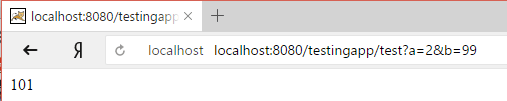

# Сложение двух чисел на JAVA с передачей параметров через GET (серверное приложение)


Рассмотрен пример сервлета на Java, который делает то же самое, что и [PHP скрипт](https://github.com/Harrix/harrix.dev-articles-2017/blob/main/add-2-num-php-get/add-2-num-php-get.md) | [🡥](https://harrix.dev/ru/articles/2017/add-2-num-php-get/): складывает два числа, которые пришли со стороны клиента.

<details>
<summary>📖 Содержание</summary>

## Содержание

- [Приготовления](#приготовления)
- [Постановка задачи](#постановка-задачи)
- [Java сервлет](#java-сервлет)
- [Сборка сервлета](#сборка-сервлета)
- [Проверка работы](#проверка-работы)

</details>

В [статье](https://github.com/Harrix/harrix.dev-articles-2017/blob/main/add-2-num-java-post/add-2-num-java-post.md) | [🡥](https://harrix.dev/ru/articles/2017/add-2-num-java-post/) показан сервлет, который работает также, но с параметрами, переданными через POST.

## Приготовления

В статье [Простейшее web-приложение на Java на сервере Tomcat](https://github.com/Harrix/harrix.dev-articles-2017/blob/main/tomcat/tomcat.md) | [🡥](https://harrix.dev/ru/articles/2017/tomcat/) рассмотрен пример простейшего сервлета с инструкцией по установке и поднятии сервера `Tomcat`. Поэтому в этой статье я не буду рассматривать подробно процесс компилирования `.java` файлов в `.class` файлы, создание папок для нашего приложения. Для этого обратитесь в вышеприведенную статью.

## Постановка задачи

На сервер поступает HTTP запрос с двумя переменными `a` и `b`. Сервер должен считать два числа, сложить их и вернуть эту сумму клиенту. Переменные `a` и `b` передаются через GET параметры, то есть через адресную строку. Пример такого запроса:

```text
http://[путь с скрипту]?a=2&b=3
```

Если данные не переданы или переданы с ошибкой, то должно вывестись слово `error`.

## Java сервлет

Общий вид Java сервлета `TestServlet.java` приведен ниже:

```java
package com.example;

import java.io.IOException;
import java.io.PrintWriter;

import javax.servlet.ServletException;
import javax.servlet.http.HttpServlet;
import javax.servlet.http.HttpServletRequest;
import javax.servlet.http.HttpServletResponse;

public class TestServlet extends HttpServlet {

    public void doGet(HttpServletRequest req, HttpServletResponse resp) throws ServletException, IOException {
        resp.setContentType("text/html;charset=utf-8");

        PrintWriter pw = resp.getWriter();

        Integer a = 0, b = 0, c = 0;
        Boolean Error = false;

        String param_a = req.getParameter("a");
        String param_b = req.getParameter("b");

        try {
            a = Integer.parseInt(param_a);
            b = Integer.parseInt(param_b);
        }
        catch (NumberFormatException e) {
            Error = true;
        }

        if (Error) {
       pw.println("error");
    }
    else {
      c = a + b;

      pw.println(c);
    }

    }
}
```

Разберем код.

В нашем главном методе `doGet()` есть два параметра: `HttpServletRequest req` — запрос от клиента, `HttpServletResponse resp` ответ клиенту. Поэтому мы в переменную `resp` будем записывать результат, а из переменной `req` вытаскивать данные.

И следующие строчки вытаскивают GET параметры `a` и `b` в виде строковых переменных:

```java
String param_a = req.getParameter("a");
String param_b = req.getParameter("b");
```

Потом пытаемся перевести эти строки в числа. Но так как мало ли что было передано в качестве параметров (а может вообще ничего от клиента в этих параметрах не пришло), то обрамляем процесс перевода в конструкцию `try catch`:

```java
try {
    a = Integer.parseInt(param_a);
    b = Integer.parseInt(param_b);
}
catch (NumberFormatException e) {
    Error = true;
}
```

Если в процессе получения значений `a` и `b` произошли проблемы, то выводим `error`, иначе сумму двух чисел:

```java
if (Error) {
     pw.println("error");
}
else {
    c = a + b;

    pw.println(c);
}
```

## Сборка сервлета

Создадим где-нибудь папку `[папка]`. У меня это `testapp` на рабочем столе с полным путем `C:\Users\User\Desktop\testapp`.

В ней должны быть такие два файла.

`[папка]\com\example\TestServlet.java`

`[папка]\servlet-api.jar`

В командной строке переходим в папку командой:

```shell
cd [полный путь к папке]
```

У меня это:

```shell
cd C:\Users\User\Desktop\testapp
```

Собираем `TestServlet.class` командой:

```shell
javac -encoding UTF-8 -cp .;servlet-api.jar com\example\*.java
```

В папке `[папка]\com\example\` должен появиться файл `TestServlet.class`.

В папке Tomcat (у меня это `C:\Program Files\Apache Software Foundation\Tomcat 9.0`) переходим в папку `webapps`.

В ней создаем папку с названием вашего web-приложения, например, `testingapp`.

В этой папке должны быть два файла:

- `…\WEB-INF\classes\com\example\TestServlet.class`
- `…\WEB-INF\web.xml`

Файл `web.xml` будет вот с таким, например, содержимым:

```xml
<!DOCTYPE web-app PUBLIC '-//Sun Microsystems, Inc.//DTD
  Web Application 2.3//EN' 'http://java.sun.com/dtd/web-app_2_3.dtd'>

<web-app>

  <servlet>
    <servlet-name>test</servlet-name>
    <servlet-class>com.example.TestServlet</servlet-class>
  </servlet>

  <servlet-mapping>
    <servlet-name>test</servlet-name>
    <url-pattern>/test</url-pattern>
  </servlet-mapping>

</web-app>
```

Перезапускаем сервер Tomcat.

Если что-то пошло не так или какой-то шаг непонятен, то читаем [статью](https://github.com/Harrix/harrix.dev-articles-2017/blob/main/tomcat/tomcat.md) | [🡥](https://harrix.dev/ru/articles/2017/tomcat/).

## Проверка работы

Рассмотрим работу скрипта на тестовом примере, когда Tomcat был поднят на локальном компьютере.

При вызове <http://localhost:8080/testingapp/test> мы получим `error`, так как данные не переданы.

При вызове <http://localhost:8080/testingapp/test?a=2> мы получим `error`, так как переменная `b` не передана.

При вызове <http://localhost:8080/testingapp/test?a=2&b=99> мы получим `101`.

При вызове <http://localhost:8080/testingapp/test?a=harrix&b=99> мы получим `error`, так как строка `harrix` не может быть переведена в число:



_Рисунок 1 — Результат выполнения программы_

В [статье](https://github.com/Harrix/harrix.dev-articles-2017/blob/main/add-2-num-php-get/add-2-num-php-get.md) | [🡥](https://harrix.dev/ru/articles/2017/add-2-num-php-get/) рассмотрен пример web-приложения на PHP, который делает тоже самое.
