# Сложение двух чисел в Visual Studio 2015 на C++ без использования `stdafx.h` (консольное Win32 приложение)

В статье рассказывается, как создать консольное приложения сложения двух чисел Win32 в Visual Studio 2015 без `stdafx.h`.

## Создание проекта

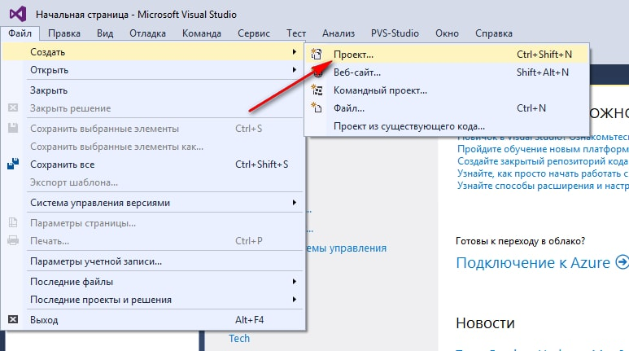

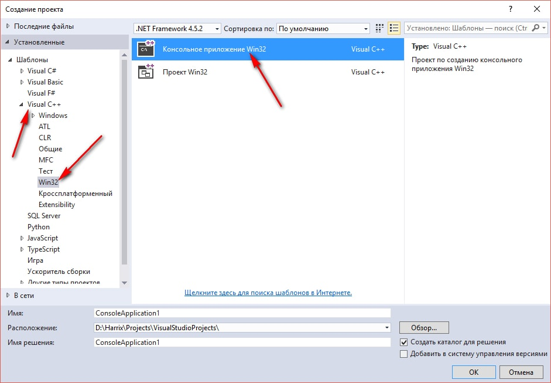

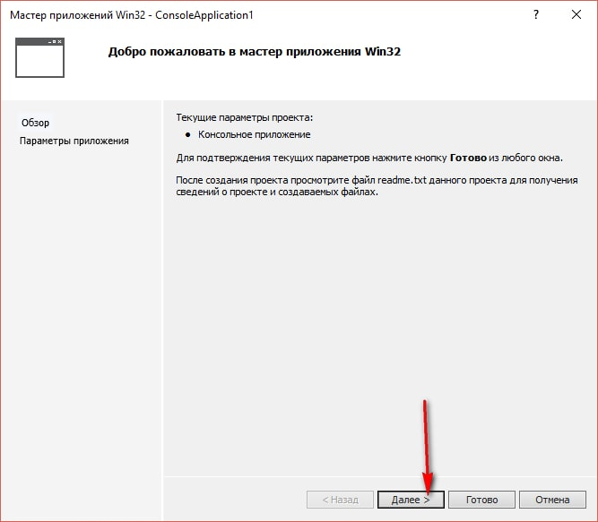

Выбираем создание пустого проекта:

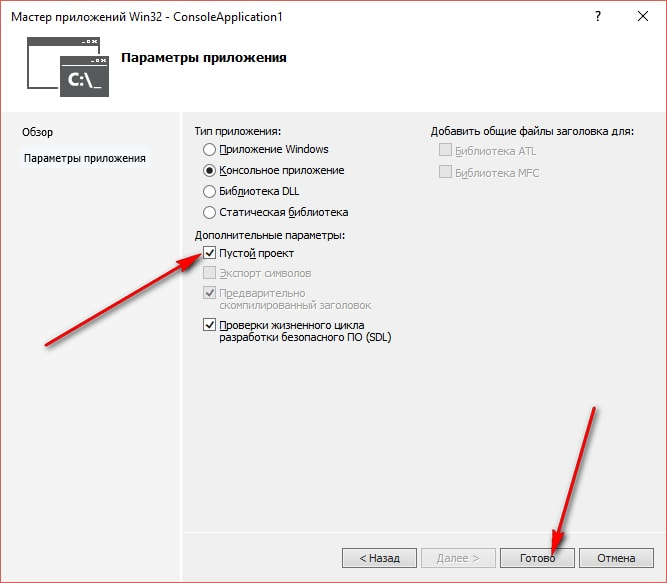

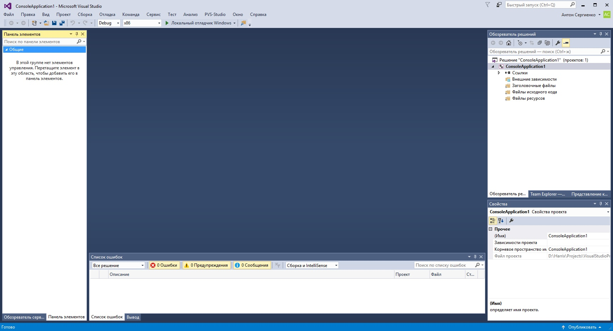

## Болванка приложения C++

У нас создался пустой проект без каких-либо файлов `cpp` или `h`.

Поэтому создадим нужный нам файл. В разделе `Файлы исходного кода` щелкнем правой кнопкой и выберем команду `Добавить`, а там `Создать элемент`:

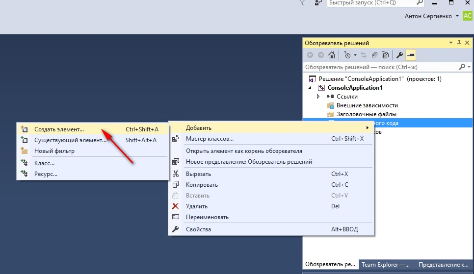

Там создадим `cpp` файл с каким-нибудь названием:

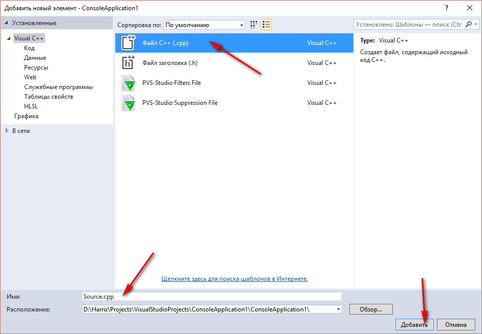

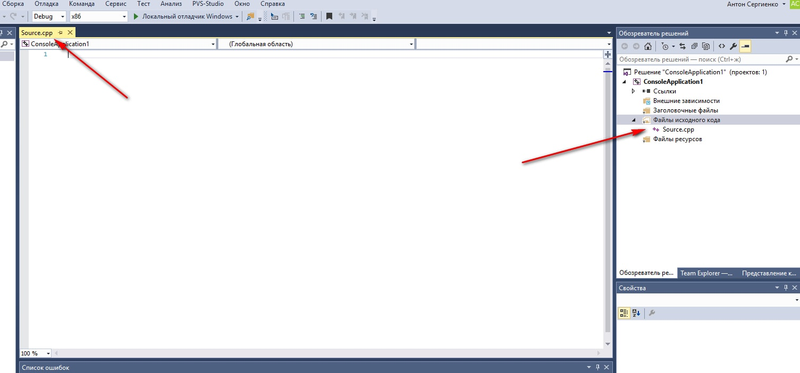

В пустом файле пропишем болванку консольного приложения:

```cpp
#include <iostream>

using namespace std;

int main() {

  return 0;
}
```

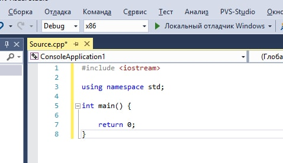

В функции `main` пропишем строчки кода, чтобы русский язык отображался корректно:

```cpp
setlocale(LC_ALL, "RUSSIAN"); // Для корректного отображения русского языка
// Раскомментировать строчки ниже, если с русским будут проблемы
// setlocale(LC_ALL, "ru_RU.UTF-8");
// setlocale(LC_ALL, "");
```

В итоге получаем болванку программы на C++, которую потом удобно использовать для других приложений учебного толка:

```cpp
#include <iostream>

using namespace std;

int main() {
  setlocale(LC_ALL, "RUSSIAN"); // Для корректного отображения русского языка
  // Раскомментировать строчки ниже, если с русским будут проблемы
  // setlocale(LC_ALL, "ru_RU.UTF-8");
  // setlocale(LC_ALL, "");

  return 0;
}
```

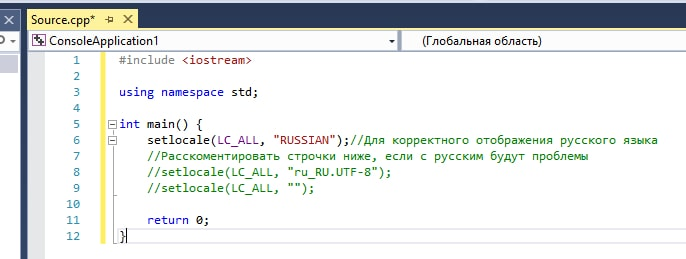

## Написание кода основной программы

А теперь пропишем основной код нашей программы, где через `cin` мы считываем в переменные наши числа, а через `cout` выводим текст в консоль:

```cpp
int a, b, c;

// Считаем первое число
cout << "Введите первое число:" << endl;
cin >> a;

// Считаем второе число
cout << "Введите второе число:" << endl;
cin >> b;

// Посчитаем сумму
c = a + b;

// Выведем результат
cout << "Сумма: " << c << endl;
```

Полная программа будет выглядеть так:

```cpp
#include <iostream>

using namespace std;

int main() {
  setlocale(LC_ALL, "RUSSIAN"); // Для корректного отображения русского языка
  // Раскомментировать строчки ниже, если с русским будут проблемы
  // setlocale(LC_ALL, "ru_RU.UTF-8");
  // setlocale(LC_ALL, "");

  int a, b, c;

  // Считаем первое число
  cout << "Введите первое число:" << endl;
  cin >> a;

  // Считаем второе число
  cout << "Введите второе число:" << endl;
  cin >> b;

  // Посчитаем сумму
  c = a + b;

  // Выведем результат
  cout << "Сумма: " << c << endl;

  return 0;
}
```

## Запуск программы

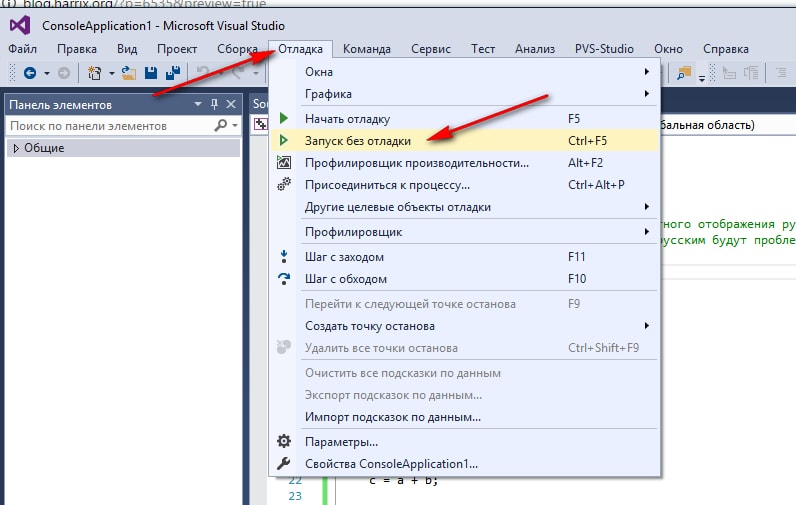

Получаем наше приложение:

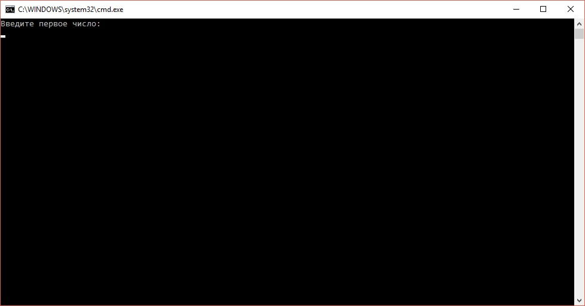

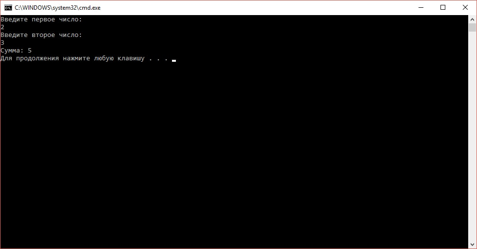
