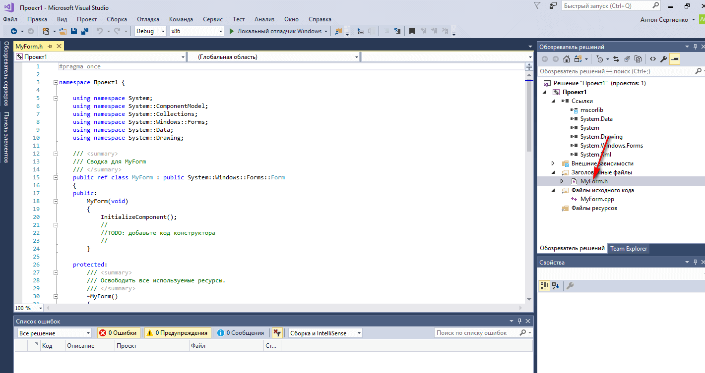

# Сложение двух чисел в Visual Studio 2017 на C++ (CLR приложение)


В статье рассказывается как создать CLR приложение сложения двух чисел в Visual Studio 2017 на C++.

## Установка Visual Studio

Об установке программы с нужными пакетами можно прочитать в статье [Установка Visual Studio 2017 Community](https://github.com/Harrix/harrix.dev-articles-2017/blob/main/install-visual-studio-2017/install-visual-studio-2017.md) <!-- https://harrix.dev/ru/articles/2017/install-visual-studio-2017/ -->.

## Создание проекта


_Рисунок 1 — Создание нового проекта_


_Рисунок 2 — Выбор типа нового проекта_

## Дописывание кода

В отличии от Visual Studio 2010 тут CLR приложения создаются пустыми без формы. Зачем они это сделали — непонятно. Будем добавлять форму самостоятельно.

Щелкаем по проекту правой кнопкой и следуем иллюстрациям:


_Рисунок 3 — Добавление нового элемента_


_Рисунок 4 — Создание новой формы_

Скорее всего, что у вас возникнет вот такая картинка с ошибками:


_Рисунок 5 — Ошибка при открытии созданной формы_

В `Visual Studio 2015` проблема решалась просто: достаточно было открыть и закрыть форму:


_Рисунок 6 — Закрытие формы_



_Рисунок 7 — Открытие формы_

Но в `Visual Studio 2017` обнаружилась проблема. При двойном клике по `MyForm.h` в `Обозревателе решений` открывается только текстовая версия файла без конструктора. Что делать?

Нужно просто закрыть Visual Studio, запустить заново и открыть только что созданный проект:


_Рисунок 8 — Открытие решения_


_Рисунок 9 — Выбор главного файла решения_

И потом двойным щелчком по `MyForm.h` открываем конструктор формы:


_Рисунок 10 — Открытие формы_


_Рисунок 11 — Форма открылась_

Далее перейдем в файл `cpp` нашей формы:


_Рисунок 12 — Файл cpp_

Допишем там вот такой код после единственной строчки:

```cpp
using namespace System;
using namespace System::Windows::Forms;

[STAThread]
void Main(array<String^>^args)
{
Application::EnableVisualStyles();
Application::SetCompatibleTextRenderingDefault(false);

Проект1::MyForm form;
Application::Run(%form);
}
```

Обратите внимание, что `Проект1` — это название вашего проекта в коде выше. Поэтому, если ваш проект называется по-другому, то вставьте своё название проекта.

Щелкнем по проекту правой кнопкой и перейдем в его свойства:


_Рисунок 13 — Свойства проекта_

В настройках компоновщика нужно в двух местах поменять настройки:


_Рисунок 14 — Изменение подсистемы_


_Рисунок 15 — Изменение точки входа_

Жмем `OK`, и мы закончили прикручивать форму к нашему приложению.

Можете запустить приложение и проверить работоспособность. Если приложение скомпилируется и запустится, то всё норм. Иначе проверьте все шаги до этого:


_Рисунок 16 — Запуск проекта_


_Рисунок 17 — Запуск проекта_


_Рисунок 18 — Запущенное приложение_

## Интерфейс приложения

Перейдем на форму. Можно сделать двумя способами:


_Рисунок 19 — Переход на форму_

Обратите внимание, что код кнопок и сама форма прописывается в `h` файле, а не `cpp`.

Откроем и закрепим панель элементов:


_Рисунок 20 — Панель элементов_


_Рисунок 21 — Закрепление панели элементов_

Перетащите два textBox на форму, в которые будем записывать наши числа:


_Рисунок 22 — Перетаскивание первого textBox_


_Рисунок 23 — Перетаскивание второго textBox_

Перетащите кнопку на форму:


_Рисунок 24 — Перетаскивание кнопку_

Перетащите третий textBox на форму, в которую мы будем выводить информацию:


_Рисунок 25 — Перетаскивание третьего textBox_

Однострочные и многострочные текстовые поля задаются одним компонентом. Поэтому мы должны изменить параметры нашего `textBox3`, чтобы в нем можно было выводить много строк. Выделим наш `textBox3` и изменим его параметры: значение параметра `Multiline` меняем на `true`:


_Рисунок 26 — Изменение свойства Multiline_

Теперь мы можем его растянуть вниз:


_Рисунок 27 — Растягивание textBox_

## Написание кода основной программы

Щелкнете по кнопке двойным кликом:


_Рисунок 28 — Клик по кнопке_

Мы получили метод, в котором прописываем реакцию на клик нашей мыши:


_Рисунок 29 — Метод клика кнопки_

В фигурных скобках пропишем код нашей программы по считыванию двух чисел, их сложении и выводе результата:

```cpp
 int x, y, z;

//Считаем значение из первого lineEdit
String^ S1 = textBox1->Text;
//Переведем значение в число
x = Convert::ToInt32(S1);

//Считаем значение из второго lineEdit
String^ S2 = textBox2->Text;
//Переведем значение в число
y = Convert::ToInt32(S2);

//Посчитаем сумму
z = x + y;

//Выведем результат
textBox3->Text = z.ToString();
```


_Рисунок 30 — Метод клика кнопки с кодом_

## Запуск программы


_Рисунок 31 — Запуск приложения_

Получаем наше приложение:


_Рисунок 32 — Запущенное приложение_

При вводе наших чисел получим вот это:


_Рисунок 33 — Результат работы программы_
