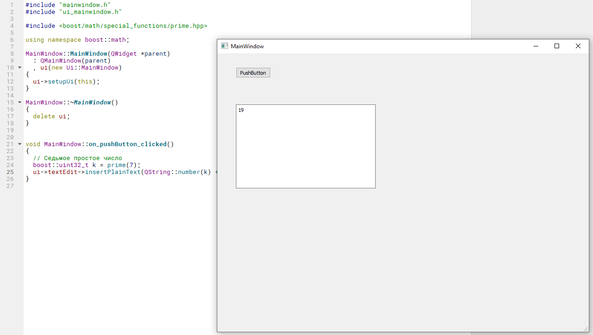

# Установка Boost под Qt


Сказ о том, как установить библиотеку Boost для Qt под MinGW и Qt под Visual Studio.

Материал подготовлен на примере Qt 15.0, Visual Studio 2019 16.5.4, Boost 1.73.0, Windows 10. Папка Boost после компиляции под MinGW x86-x64, Visual Studio x86-x64 у меня занимает 22,9 ГБ.

## Подготовка

На сайте <https://www.boost.org/> скачиваем последнюю версию библиотеки Boost:


_Рисунок 1 — Главная страница библиотеки_


_Рисунок 2 — Архив последней версии библиотеки_

Распакуем архив куда-нибудь и переименуем папку в `boost`. Я распаковал в корень диска `C:\boost`:


_Рисунок 3 — Файлы из распаковываемого архива_

## Работаем с Qt

Собираем библиотеку Boost тем компилятором, которым компилируем наши проекты, где будем использовать Boost.

**Под каждый компилятор вам нужно собирать библиотеку отдельно!**

Для Qt под `MinGW` 32 бита нам потребуется программа `gcc.exe`.

У меня этот файл находится в папке:

```console
D:\Qt\Tools\mingw730_32\bin
```

На время добавим этот путь в системную переменную `Path` на примере Windows 10:


_Рисунок 4 — Переходим в настройки компьютера_


_Рисунок 5 — Выбор пункта «Дополнительные параметры системы»_


_Рисунок 6 — Выбора пункта «Переменные среды»_


_Рисунок 7 — Выбор системной переменной Path_


_Рисунок 8 — Добавление нового пути в переменной Path_


_Рисунок 9 — Соглашение с изменением через нажатие кнопки «OK»_


_Рисунок 10 — Соглашение с изменением через нажатие кнопки «OK»_

## Сборка для Qt под MinGW 32 бита

Вызываем командную строку. Это сделать можно разными способами. Например, жмем `Win` + `R`. Там вводим `cmd` и жмем `Enter`.

А можно через поиск:


_Рисунок 11 — Вызов командной строки_

Вводим команду для перехода в папку, где располагается распакованный Boost:

```console
cd C:\boost
```


_Рисунок 12 — Переход в папку с распакованным Boost_

Вводим следующую команду. И ждем, когда всё выполнится:

```console
bootstrap.bat gcc
```


_Рисунок 13 — Результат выполнения команды bootstrap.bat gcc_

Вы библиотеку Boost возможно будете собирать под разные версии компиляторов на одном компе. Поэтому в следующей команде укажите название папки, которая создаться в папке `C:\boost`, куда будут закинуты собранные файлы. Для MinGW 32bit папку назвал `boost_mingw730_32`.

Вводим команду (не забудьте поменять название папки на вашу версию компилятора). И ждем, когда всё выполнится (а вот это будет не быстро):

```console
b2 toolset=gcc link=shared --prefix=boost_mingw730_32 install
```

И через долгое время (у меня ушло более 20 минут) библиотека соберется:


_Рисунок 14 — Результат компилирования библиотеки_

Кстати, эту команду можно ускорить, указав параметр `-j8`, где число будет обозначать на скольких ядрах процессора будет происходить компилирование (правда у меня не сильно скорость увеличилась):

```console
b2 toolset=gcc link=shared -j8 --prefix=boost_mingw730_32 install
```

Итак, у нас у меня в папке `C:\boost\boost_mingw730_32` собранная библиотека, которую я теперь могу использовать.

Не забудьте удалить путь к `gcc.exe` из переменной `Path`. Если вы не удалите, то ничего страшного не случится, но в будущем, когда под другой компилятор или другой версии текущего компилятора будете собирать Boost, возникнут проблемы.

И вам нужно удалить только один путь из переменной Path. Не вздумайте удалить всю переменную Path! Это приведет к **очень плохим** последствиям:


_Рисунок 15 — Удаление пути к компилятору_

Закрываем cmd.

## Сборка для Qt под MinGW 64 бита

Для MinGW 64 бит повторяем всё тоже самое, но указываем другой путь к компилятору (у меня это `D:\Qt\Tools\mingw730_64\bin`) и указываем другую папку для сборки (например, `boost_mingw730_64`).

После указания пути к компилятору в переменной в `Path` в консоли последовательно вызываем команды:

```console
cd C:\boost
bootstrap.bat gcc
b2 toolset=gcc link=shared --prefix=boost_mingw730_64 install
```


_Рисунок 16 — Результат компилирования библиотеки_

Не забудьте удалить путь к `gcc.exe` из переменной `Path`.

## Сборка для Qt под Visual Studio 32 бит

И если сборка под MinGW прошла без проволочек, то со сборкой под Visual Studio я намучился.

У меня стоит сразу две версии Qt: под MinGW и под Visual Studio (`QWebEngine` работает только под Visual Studio).

Тут вместо `gcc.exe` будет нужен файл `cl.exe`. У меня стоит Visual Studio 2019, и данный файл находится в папке:

```console
C:\Program Files (x86)\Microsoft Visual Studio\2019\Community\VC\Tools\MSVC\14.25.28610\bin\Hostx86\x86\
```

Добавляем этот путь **временно** в системную переменную `Path`.

Также нам потребуется знание версии компилятора Visual Studio. Она не совпадает с названием установленной Visual Studio! Получить это значение можно из Visual Studio Installer:


_Рисунок 17 — Visual Studio Installer_

Через поиск `msvc` находим установленный компилятор:


_Рисунок 18 — Найденный компонент_

Нам потребуется как значение `v142`. Последовательно в cmd вызываем команды:

```console
cd C:\boost
bootstrap.bat vc142
b2 toolset=msvc-14.2 --build-type=complete --prefix=boost_vs2019_32 install
```

Обратите внимание, что в командах используется значение `v142` дважды в `vc142` и `msvc-14.2`. И не забываем поменять название папки для собранной библиотеки Boost:


_Рисунок 19 — Результат выполнения команды bootstrap.bat vc142_


_Рисунок 20 — Результат выполнения сборки_

## Сборка для Qt под Visual Studio 64 бита

Для MinGW повторяем всё тоже самое, но указываем другой путь к компилятору и указываем другую папку для сборки (например, `boost_vs2019_64`), а также указываем, что собираем именно под x64 (`--address-model=64`). У меня компилятор под x64 располагается тут:

```console
C:\Program Files (x86)\Microsoft Visual Studio\2019\Community\VC\Tools\MSVC\14.25.28610\bin\Hostx64\x64
```

После указания пути к компилятору в переменной в Path в консоли последовательно вызываем команды:

```console
cd C:\boost
bootstrap.bat vc142
b2 toolset=msvc-14.2 --build-type=complete --address-model=64 --prefix=boost_vs2019_64 install
```


_Рисунок 21 — Результат выполнения сборки_

## Подготовка Qt проекта

Создадим простой проект с виджетами с кнопкой `PushButton` и полем для вывода текста `TextEdit`. Для тех, кто не знает — скриншоты по под спойлером:

---

**Создание проекта** <!-- !details -->


_Рисунок 22 — Создание нового проекта_


_Рисунок 23 — Выбор Qt Widgets Application_


_Рисунок 24 — Выбор имени проекта и его расположения_


_Рисунок 25 — Выбор системы сборки_


_Рисунок 26 — Выбор названия главного класса приложения_


_Рисунок 27 — Настройка перевода приложения_


_Рисунок 28 — Выбор компиляторов сборки_


_Рисунок 29 — Настройка системы контроля версий проекта_


_Рисунок 30 — Переход на форму приложения_


_Рисунок 31 — Размещение компонентов на форме_


_Рисунок 32 — Переход на обработчик клика кнопки_


_Рисунок 33 — Выбор типа события кнопки_


_Рисунок 34 — Метод обработки клика кнопки_

---

## Подготовка для работы с MinGW 32 бита

Идем в файл проекта `.pro`:


_Рисунок 35 — Файл проекта_

Там подключите Boost библиотеку (не забудьте поменять пути на свои). В коде ниже есть раздел как для MinGW, так и под Visual Studio, причем под две битности x86 и x64:

```ini
greaterThan(QT_MAJOR_VERSION, 4) {
    TARGET_ARCH=$${QT_ARCH}
} else {
    TARGET_ARCH=$${QMAKE_HOST.arch}
}

contains(TARGET_ARCH, x86_64) {
    ARCHITECTURE = x64
} else {
    ARCHITECTURE = x86
}

win32-g++:contains(ARCHITECTURE, x86): {
    INCLUDEPATH += C:/boost/boost_mingw730_32/include/boost-1_73
}
win32-g++:contains(ARCHITECTURE, x64): {
    INCLUDEPATH += C:/boost/boost_mingw730_64/include/boost-1_73
}
win32-msvc*:contains(ARCHITECTURE, x86) {
    INCLUDEPATH += C:/boost/boost_vs2019_32/include/boost-1_73
}
win32-msvc*:contains(ARCHITECTURE, x64) {
    INCLUDEPATH += C:/boost/boost_vs2019_64/include/boost-1_73
}
```


_Рисунок 36 — Файл проекта с подключением Boost_

Обратите внимание на то, в какую сторону повернуты слэши.

Пути к папкам поменяйте на свои:


_Рисунок 37 — Пути к скомпилированным версиям Boost_

В дальнейшем вам нужно будет добавлять тут еще библиотеки, которые вы будете использовать. Подключаете их через `LIBS`.

Если вы не подключите их, то будете видеть подобные ошибки (по ошибкам и определяете, какие файлы нужно подключить):


_Рисунок 38 — Ошибка подключения файла библиотеки Boost_

Для примеров ниже мне нужно было добавить библиотеки, и полный кусок добавляемого кода в `*.pro` файл выглядит так:

```ini
greaterThan(QT_MAJOR_VERSION, 4) {
    TARGET_ARCH=$${QT_ARCH}
} else {
    TARGET_ARCH=$${QMAKE_HOST.arch}
}

contains(TARGET_ARCH, x86_64) {
    ARCHITECTURE = x64
} else {
    ARCHITECTURE = x86
}

win32-g++:contains(ARCHITECTURE, x86): {
    INCLUDEPATH += C:/boost/boost_mingw730_32/include/boost-1_73
    LIBS += "-LC:/boost/boost_mingw730_32/lib" \
            -llibboost_date_time-mgw7-mt-x32-1_73 \
            -llibboost_system-mgw7-mt-x32-1_73
}

win32-g++:contains(ARCHITECTURE, x64): {
    INCLUDEPATH += C:/boost/boost_mingw730_64/include/boost-1_73
    LIBS += "-LC:/boost/boost_mingw730_64/lib" \
            -llibboost_date_time-mgw7-mt-x64-1_73 \
            -llibboost_system-mgw7-mt-x64-1_73
}

win32-msvc*:contains(ARCHITECTURE, x86) {
    INCLUDEPATH += C:/boost/boost_vs2019_32/include/boost-1_73
    LIBS += "-LC:/boost/boost_vs2019_32/lib" \
            -llibboost_date_time-vc142-mt-x32-1_73 \
            -llibboost_system-vc142-mt-x32-1_73
}

win32-msvc*:contains(ARCHITECTURE, x64) {
    INCLUDEPATH += C:/boost/boost_vs2019_64/include/boost-1_73
    LIBS += "-LC:/boost/boost_vs2019_64/lib" \
            -llibboost_date_time-vc142-mt-x64-1_73 \
            -llibboost_system-vc142-mt-x64-1_73
}
```


_Рисунок 39 — Подключение библиотеки Boost_

Обратите внимание, что перед путями и названием библиотеки появляется `-L` или `-l`:


_Рисунок 40 — Пути к файлам Boost_

Если вам нужно подключить несколько библиотек, то добавляете их подобным образом:

Обратите внимание на то, что для разных компиляторов одна и та же библиотека, например, `libboost_date_time` хранится в разных файлах, например с названием (без расширения) `libboost_date_time-mgw7-mt-x32-1_73` и `libboost_date_time-vc142-mt-x32-1_73`.

Если после внесения изменений и сохранения файла у вас кнопка запуска проекта горит зеленым, то всё прошло хорошо. Если серым, то где-то напортачили:


_Рисунок 41 — Кнопка запуска приложения_

Перейдем в файл `mainwindow.cpp`:


_Рисунок 42 — Файл mainwindow.cpp_

## Проверка № 1

Выведем седьмое простое число через функцию `prime()`. [Функция](https://www.boost.org/doc/libs/1_73_0/libs/math/doc/html/math_toolkit/number_series/primes.html) является одной из специальных математических функций.

Подключаем заголовочный файл и соответствующее пространство имен:

```cpp
#include <boost/math/special_functions/prime.hpp>
using namespace boost::math;
```

Теперь в коде клика кнопки можем прописать:

```cpp
// Седьмое простое число
boost::uint32_t k = prime(7);
ui->textEdit->insertPlainText(QString::number(k) + "\n");
```



_Рисунок 43 — Результат выполнения программы_

Если возникнет такая ошибка, то повторно запустите процесс компиляции программы:


_Рисунок 44 — Ошибка при компиляции программы_

## Проверка № 2

Проверим сколько дней прошло с 1 января.

Подключаем заголовочный файл и соответствующее пространство имен:

```cpp
#include <boost/date_time/gregorian/gregorian.hpp>
using namespace boost::gregorian;
```

Теперь в коде клика кнопки можем прописать:

```cpp
// Сколько дней прошло с 1 января
date today = day_clock::local_day();
partial_date new_years_day(1,Jan);
days days_since_year_start = today - new_years_day.get_date(today.year());

ui->textEdit->insertPlainText(QString::number(days_since_year_start.days()) + "\n");
```


_Рисунок 45 — Результат выполнения программы_

Полный код:

```cpp
#include "mainwindow.h"
#include "ui_mainwindow.h"

#include <boost/math/special_functions/prime.hpp>
#include <boost/date_time/gregorian/gregorian.hpp>

using namespace boost::math;
using namespace boost::gregorian;

MainWindow::MainWindow(QWidget *parent)
  : QMainWindow(parent)
  , ui(new Ui::MainWindow)
{
  ui->setupUi(this);
}

MainWindow::~MainWindow()
{
  delete ui;
}


void MainWindow::on_pushButton_clicked()
{
  // Седьмое простое число
  boost::uint32_t k = prime(7);
  ui->textEdit->insertPlainText(QString::number(k) + "\n");

  // Сколько дней прошло с 1 января
  date today = day_clock::local_day();
  partial_date new_years_day(1,Jan);
  days days_since_year_start = today - new_years_day.get_date(today.year());
  ui->textEdit->insertPlainText(QString::number(days_since_year_start.days()) + "\n");
}
```

Исходники проекта прикреплены к статье.
