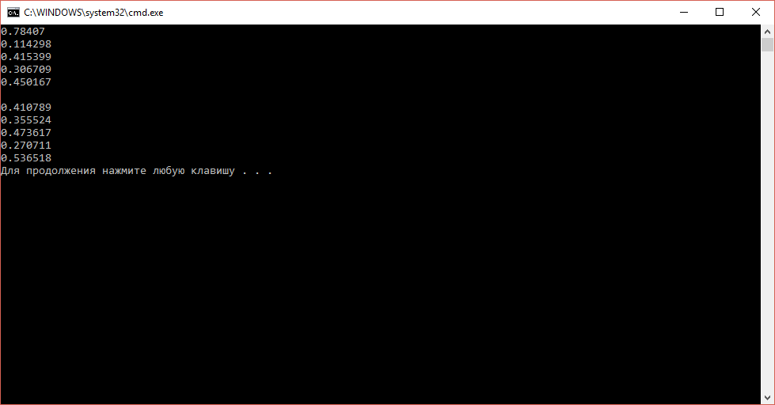

# Класс генератора случайных чисел для C++11


В статье приведен класс-синглтон для запуска генератора псевдослучайных чисел.

**Внимание!** Предложенный класс является не потокобезопасным!

В `C++11` появилось много классов для работы по генерации случайных чисел, качество которых куда лучше стандартного `rand()`.

Для генерации будем использовать генератор `std::mt19937` вихря Мерсенна. Минус его заключается в том, что желательно во всей программе использовать один экземпляр данного генератора, что куда менее удобно, чем было с стандартным генератором `rand()` (один раз запустили `strand()` и всё).

Поэтому предлагается использовать класс-синглтон, который будет возвращать ссылку на экземпляр класса `std::mt19937`. При таком подходе в одном запуске программы будет использоваться только один экземпляр.

Как и любой генератор псевдослучайных чисел, наш генератор нужно инициализировать. В C++11 появился очень крутой тип `std::random_device`. Он генерирует истинно случайное число благодаря устройствам на компьютере (например, через источник энтропии на Intel чипах: я не смог найти информацию о природе этого источника). Но не на всех устройствах есть возможность генерирования таких случайных чисел. А некоторые компиляторы просто не обращаются к этому устройству (например, `MinGW`).

Поэтому в классе предусмотрен вариант, что если не получилось использовать данный генератор, то будем использовать стандартную инициализацию временем.

Сам класс:

```cpp
class RandomGenerator
{
public:
    static std::mt19937 & getMt19937();

private:
    RandomGenerator();
    ~RandomGenerator() {}
    static RandomGenerator& instance();

    RandomGenerator(RandomGenerator const&) = delete;
    RandomGenerator& operator= (RandomGenerator const&) = delete;

    std::mt19937 mMt;
};

RandomGenerator::RandomGenerator() {
    std::random_device rd;

    if (rd.entropy() != 0) {
        std::seed_seq seed{rd(), rd(), rd(), rd(), rd(), rd(), rd(), rd()};
        mMt.seed(seed);
    }
    else {
        auto seed = std::chrono::high_resolution_clock::now().time_since_epoch().count();
        mMt.seed(seed);
    }
}

RandomGenerator& RandomGenerator::instance() {
    static RandomGenerator s;
    return s;
}

std::mt19937 & RandomGenerator::getMt19937() {
    return RandomGenerator::instance().mMt;
}
```

Пример использования:

```cpp
#include <iostream>
#include <random>
#include <chrono>

class RandomGenerator
{
public:
  static std::mt19937 & getMt19937();

private:
  RandomGenerator();
  ~RandomGenerator() {}
  static RandomGenerator& instance();

  RandomGenerator(RandomGenerator const&) = delete;
  RandomGenerator& operator= (RandomGenerator const&) = delete;

  std::mt19937 mMt;
};

RandomGenerator::RandomGenerator() {
  std::random_device rd;

  if (rd.entropy() != 0) {
    std::seed_seq seed{ rd(), rd(), rd(), rd(), rd(), rd(), rd(), rd() };
    mMt.seed(seed);
  }
  else {
    auto seed = std::chrono::high_resolution_clock::now().time_since_epoch().count();
    mMt.seed(seed);
  }
}

RandomGenerator& RandomGenerator::instance() {
  static RandomGenerator s;
  return s;
}

std::mt19937 & RandomGenerator::getMt19937() {
  return RandomGenerator::instance().mMt;
}

int main() {

  std::mt19937 &mt = RandomGenerator::getMt19937();
  std::uniform_real_distribution<double> dist(0.0, 1.0);
  for (std::size_t i = 0; i < 5; i++)
    std::cout << dist(mt) << "\n";

  std::cout << "\n";

  std::mt19937 &mt2 = RandomGenerator::getMt19937();
  std::uniform_real_distribution<double> dist2(0.0, 1.0);
  for (std::size_t i = 0; i < 5; i++)
    std::cout << dist2(mt2) << "\n";

  return 0;
}
```

Пример вывода:



_Рисунок 1 — Результат выполнения программы_

Класс проверен на компиляторах: `Visual Studio 2015`, `MinGW`, `DevC++`, `GCC`.

## Замечания

От Павла Галушина был получен комментарий:

> Приветствую.
>
> Так как класс RandomGenerator определяет только одну полезную для пользователя функцию, то лучше было бы полностью скрыть его в cpp файле. А видимой оставить только следующую функцию (имя примерное) `std::mt19937 & get_global_mt19937() {return RandomGenerator::instance().get();}`
>
> Вообще, объекты генераторов случайных чисел (а не просто функции) были введены для интеграции с многопоточностью. Если функция порождения случайных чисел не будет синхронизироваться между потоками, то может быть неопределённое поведение из-за того, что два потока будут одновременно модифицировать состояние генератора случайных чисел. Если же ввести в такие функции внутреннюю блокировку (например, мьютекс), то будет просадка по производительности в однопоточных программах.
>
> Если же есть объекты генератора случайных чисел, то каждый поток может создать себе свой, нужно будет только корректно его инициализировать. А дальше уже можно не беспокоится о том, что другим потокам тоже нужны случайные числа.
>
> В C++11 есть ключевое слово thread_local, которое позволяет объявить переменную, для которой в каждом потоке создаётся свой экземпляр. Такую переменную нужно только правильно инициализировать, а map, который ты предлагаешь, придётся синхронизировать при каждом обращении.
