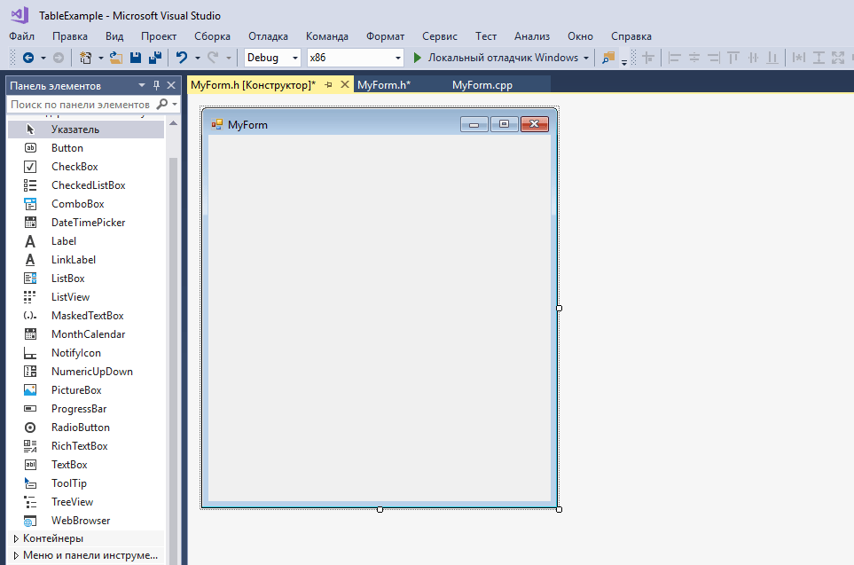
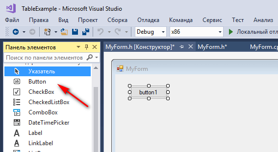
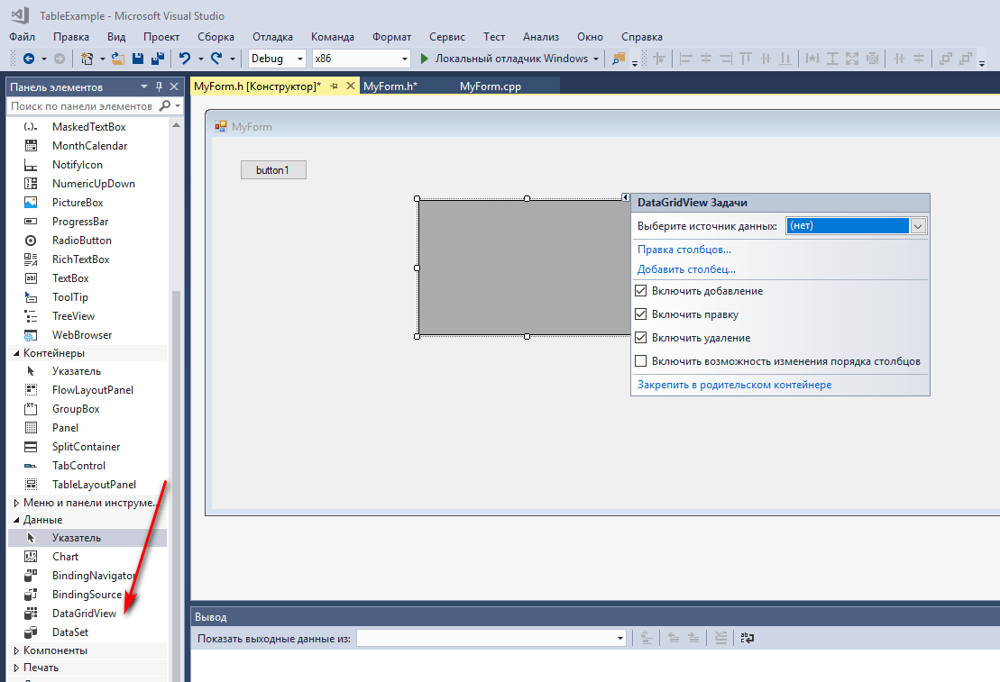
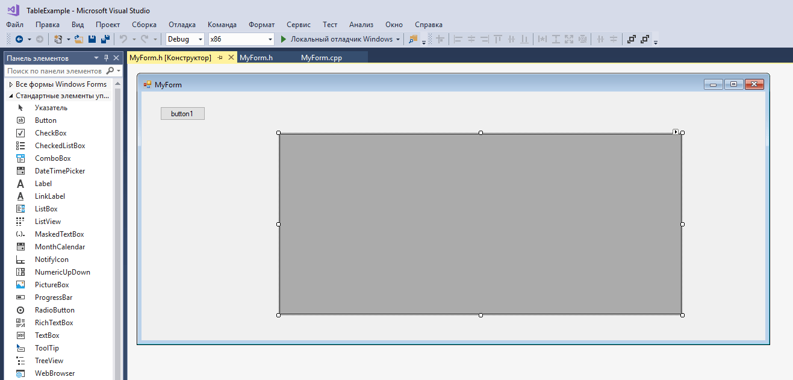
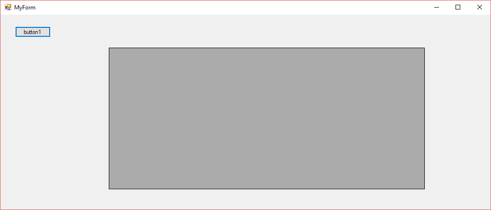
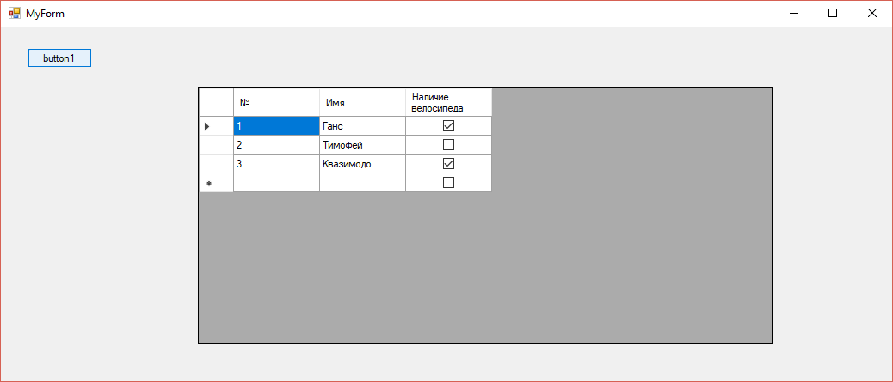
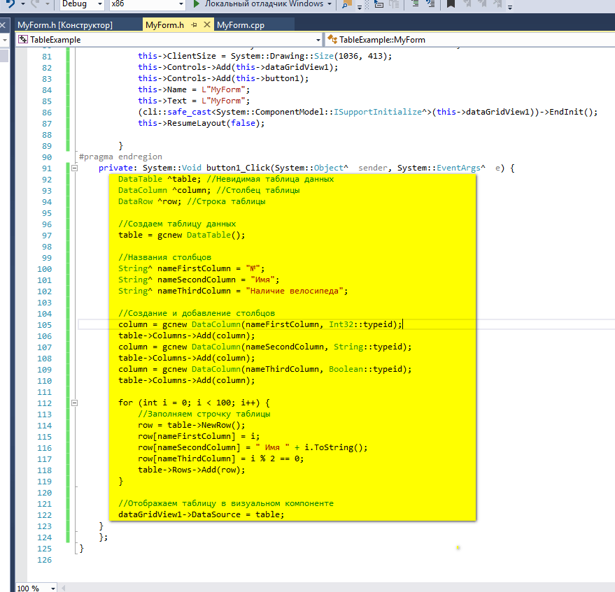
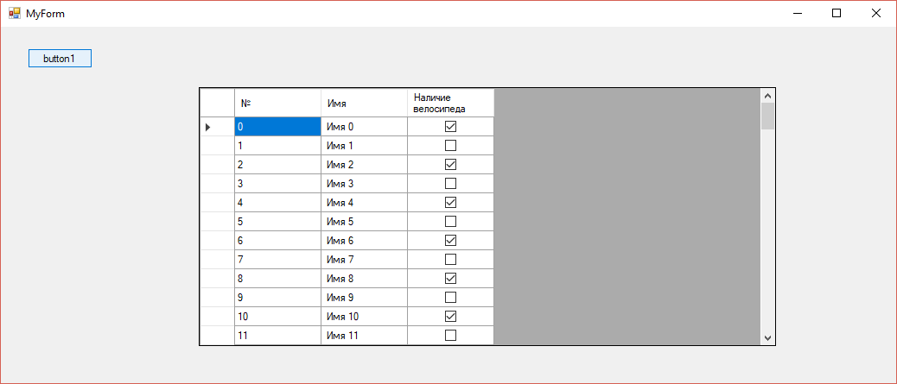

# Вывод таблицы вручную в Visual Studio в CLR приложении


Как вывести данные в обычной таблице.

## Создание болванки приложения

Подготовьте приложение с готовой формой.

Подготовьте приложение с готовой формой. Прочитать об этом можно тут: [Visual Studio 2017](https://github.com/Harrix/harrix.dev-blog-2017/blob/main/add-2-num-vs-2017-clr/add-2-num-vs-2017-clr.md), [Visual Studio 2015](https://github.com/Harrix/harrix.dev-blog-2016/blob/main/add-2-num-vs-2015-clr/add-2-num-vs-2015-clr.md), [Visual Studio 2010](https://github.com/Harrix/harrix.dev-blog-2016/blob/main/add-2-num-vs-2010-clr/add-2-num-vs-2010-clr.md):



## Размещаем компоненты

Разместите на приложении кнопку:



И размещаем компонент таблицы `DataGridView`. О компоненте можно почитать [тут](http://rsdn.org/article/dotnet/DataGridView20.xml):



Растянул компонент:



## Заполняем таблицу

При клике на кнопку должна добавиться таблица. Для этого дважды кликаем по кнопке и вводим код:

```cpp
// Очистка строк и столбцов таблицы
dataGridView1->Rows->Clear();
dataGridView1->Columns->Clear();

// Создание столбцов
DataGridViewTextBoxColumn ^firstColumn = gcnew DataGridViewTextBoxColumn();
firstColumn->HeaderText = "№";
firstColumn->Name = "№";
DataGridViewTextBoxColumn ^secondColumn = gcnew DataGridViewTextBoxColumn();
secondColumn->HeaderText = "Имя";
secondColumn->Name = "Имя";
DataGridViewCheckBoxColumn ^thirdColumn = gcnew DataGridViewCheckBoxColumn();
thirdColumn->Name = "Наличие велосипеда";
thirdColumn->HeaderText = "Наличие велосипеда";

// Добавление столбцов
dataGridView1->Columns->Add(firstColumn);
dataGridView1->Columns->Add(secondColumn);
dataGridView1->Columns->Add(thirdColumn);

// Переменные для ячеек и строки таблицы
DataGridViewCell ^firstCell;
DataGridViewCell ^secondCell;
DataGridViewCell ^thirdCell;
DataGridViewRow ^row;

// Создание ячеек для первой строки
firstCell = gcnew DataGridViewTextBoxCell();
secondCell = gcnew DataGridViewTextBoxCell();
thirdCell = gcnew DataGridViewCheckBoxCell();
row = gcnew DataGridViewRow();
firstCell->Value = "1";
secondCell->Value = "Ганс";
thirdCell->Value = true;
row->Cells->AddRange(firstCell, secondCell, thirdCell);
dataGridView1->Rows->Add(row);

// Создание ячеек для второй строки
firstCell = gcnew DataGridViewTextBoxCell();
secondCell = gcnew DataGridViewTextBoxCell();
thirdCell = gcnew DataGridViewCheckBoxCell();
row = gcnew DataGridViewRow();
firstCell->Value = "2";
secondCell->Value = "Тимофей";
thirdCell->Value = false;
row->Cells->AddRange(firstCell, secondCell, thirdCell);
dataGridView1->Rows->Add(row);

// Создание ячеек для третьей строки
firstCell = gcnew DataGridViewTextBoxCell();
secondCell = gcnew DataGridViewTextBoxCell();
thirdCell = gcnew DataGridViewCheckBoxCell();
row = gcnew DataGridViewRow();
firstCell->Value = "3";
secondCell->Value = "Квазимодо";
thirdCell->Value = true;
row->Cells->AddRange(firstCell, secondCell, thirdCell);
dataGridView1->Rows->Add(row);
```

При запуске приложения и нажатии на кнопку получим следующее:





Надеюсь, что очевидно, что создание новой строчки таблицы можно запихать в цикл.

## Второй способ

Предыдущий вариант не очень эффективный, так как даже при добавлении трех строк видно, как появляются записи: после добавления каждой новой строчки таблица отрисовывается заново. А представьте, что будет, если записей будет куда больше?

Лучше заранее подготовить невидимую таблицу данных `DataTable ^table`, заполнить ей тем, что нужно. А потом одной строчкой `dataGridView1->DataSource = table;` отобразить все данные.

Код клика кнопки:

```cpp
DataTable ^table; // Невидимая таблица данных
DataColumn ^column; // Столбец таблицы
DataRow ^row; // Строка таблицы

// Создаем таблицу данных
table = gcnew DataTable();

// Названия столбцов
String^ nameFirstColumn = "№";
String^ nameSecondColumn = "Имя";
String^ nameThirdColumn = "Наличие велосипеда";

// Создание и добавление столбцов
column = gcnew DataColumn(nameFirstColumn, Int32::typeid);
table->Columns->Add(column);
column = gcnew DataColumn(nameSecondColumn, String::typeid);
table->Columns->Add(column);
column = gcnew DataColumn(nameThirdColumn, Boolean::typeid);
table->Columns->Add(column);

// Заполняем первую строчку таблицы
row = table->NewRow();
row[nameFirstColumn] = 1;
row[nameSecondColumn] = "Ганс";
row[nameThirdColumn] = true;
table->Rows->Add(row);

// Заполняем вторую строчку таблицы
row = table->NewRow();
row[nameFirstColumn] = 2;
row[nameSecondColumn] = "Тимофей";
row[nameThirdColumn] = false;
table->Rows->Add(row);

// Заполняем третью строчку таблицы
row = table->NewRow();
row[nameFirstColumn] = 3;
row[nameSecondColumn] = "Квазимодо";
row[nameThirdColumn] = true;
table->Rows->Add(row);

// Отображаем таблицу в визуальном компоненте
dataGridView1->DataSource = table;
```


Типы колонок для отображения информации можно посмотреть по [ссылке](https://docs.microsoft.com/en-us/dotnet/api/system.data.datacolumn.datatype?redirectedfrom=MSDN&view=netcore-3.1#System_Data_DataColumn_DataType).

## Второй способ с циклом

Покажем напоследок, как тот же код будет выглядеть с циклом:

```cpp
DataTable ^table; // Невидимая таблица данных
DataColumn ^column; // Столбец таблицы
DataRow ^row; // Строка таблицы

// Создаем таблицу данных
table = gcnew DataTable();

// Названия столбцов
String^ nameFirstColumn = "№";
String^ nameSecondColumn = "Имя";
String^ nameThirdColumn = "Наличие велосипеда";

// Создание и добавление столбцов
column = gcnew DataColumn(nameFirstColumn, Int32::typeid);
table->Columns->Add(column);
column = gcnew DataColumn(nameSecondColumn, String::typeid);
table->Columns->Add(column);
column = gcnew DataColumn(nameThirdColumn, Boolean::typeid);
table->Columns->Add(column);

for (int i = 0; i < 100; i++) {
  // Заполняем строчку таблицы
  row = table->NewRow();
  row[nameFirstColumn] = i;
  row[nameSecondColumn] = " Имя " + i.ToString();
  row[nameThirdColumn] = i % 2 == 0;
  table->Rows->Add(row);
}

// Отображаем таблицу в визуальном компоненте
dataGridView1->DataSource = table;
```




