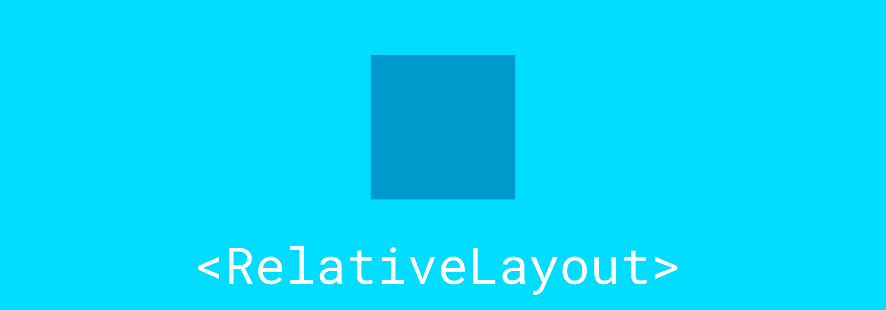
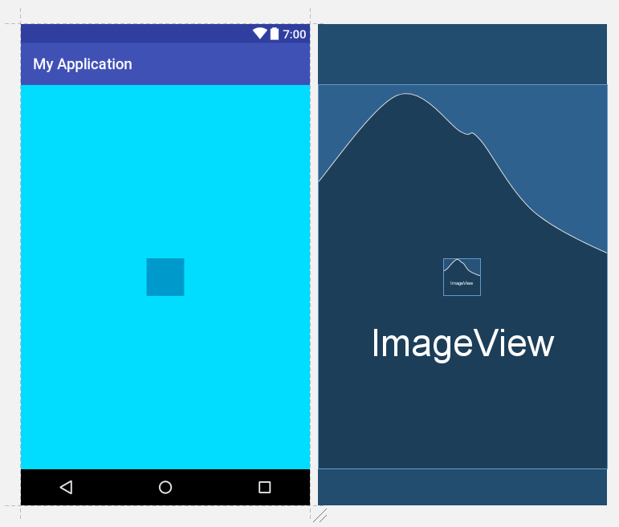

# Разместить один элемент над другим в Android разметке



Один элемент в Android разметке (картинка) растянута на весь экран. Как разместить другой элемент над ним (например, по центру).

Можно использовать, например, `RelativeLayout`:

```xml
<?xml version="1.0" encoding="utf-8"?>
<RelativeLayout xmlns:android="http://schemas.android.com/apk/res/android"
    xmlns:app="http://schemas.android.com/apk/res-auto"
    android:layout_width="match_parent"
    android:layout_height="match_parent" >

    <ImageView
        android:id="@+id/imageView"
        android:layout_width="match_parent"
        android:layout_height="match_parent"
        app:srcCompat="@android:color/holo_blue_bright" />

    <ImageView
        android:id="@+id/imageView2"
        android:layout_width="50dp"
        android:layout_height="50dp"
        app:srcCompat="@android:color/holo_blue_dark"
        android:layout_centerHorizontal="true"
        android:layout_centerVertical="true"/>

</RelativeLayout>
```



_Рисунок 1 — Итоговый результат_
