# Внешние ключи в DB Browser for SQLite


Сказ о том, как включить поддержку внешних ключей в популярной программе по редактированию SQLite баз данных.

Откроем программу `DB Browser for SQLite`.

Создадим новую базу данных, например, `music.db`:

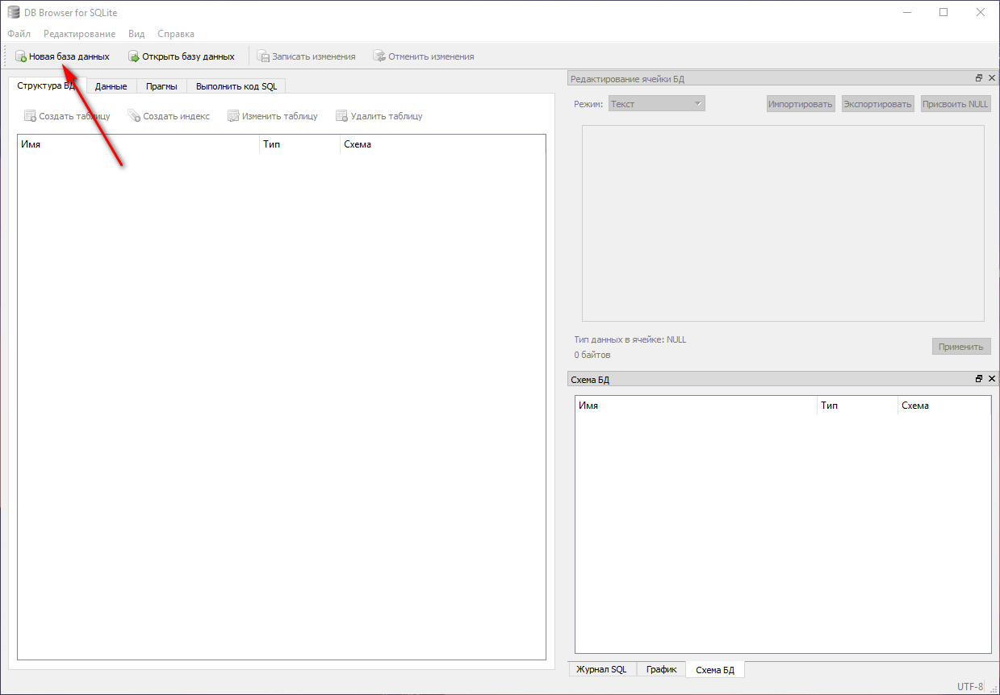

_Рисунок 1 — Создание новой базы данных_

Не будем пока создавать таблицы:

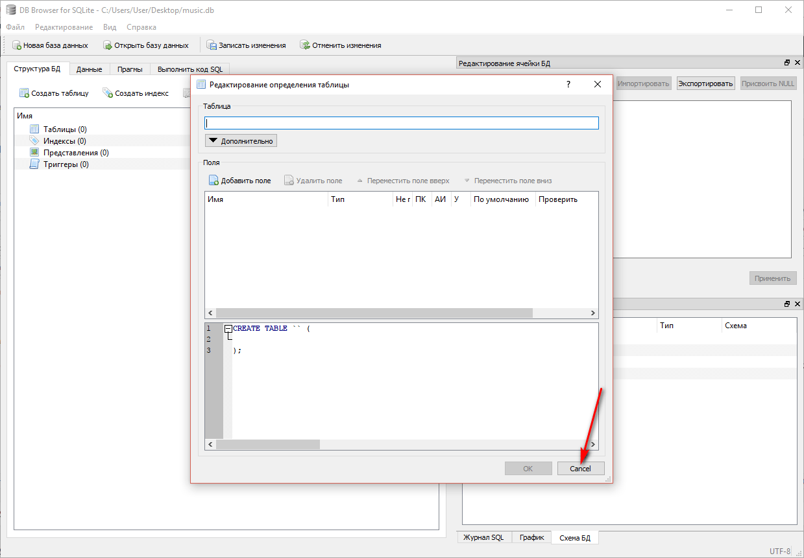

_Рисунок 2 — Отказ от создания таблицы_

Включим поддержку внешних ключей. Не забудьте нажать на кнопку `Save`:

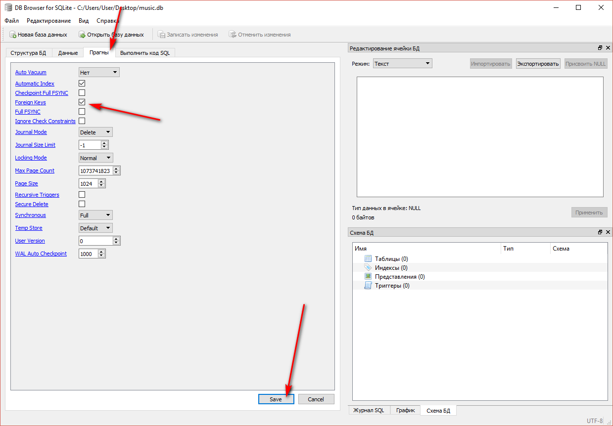

_Рисунок 3 — Включение поддержки внешних ключей_

Теперь покажем, как работают внешние ключи.

Создадим две таблицы `artists` (музыканты) и `tracks` (песни). Конструктор не будем использовать. Во второй таблице будем хранить номер музыканта как внешний ключ:

```sql
CREATE TABLE artists(
  _id    INTEGER PRIMARY KEY AUTOINCREMENT,
  name  TEXT
);

CREATE TABLE tracks(
  _id     INTEGER PRIMARY KEY AUTOINCREMENT,
  title   TEXT,
  id_artist INTEGER,
  FOREIGN KEY(id_artist) REFERENCES artists(_id)
);
```

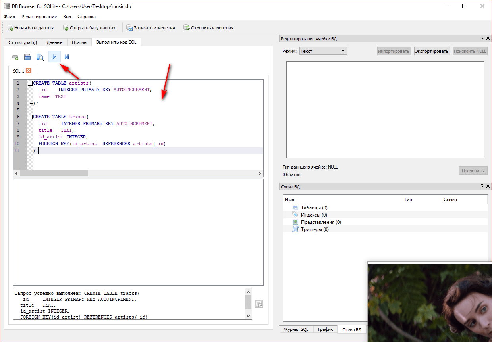

_Рисунок 4 — Запуск SQL скрипта_

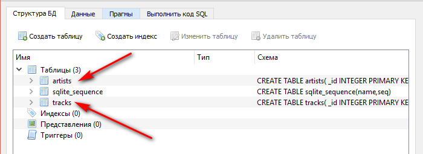

_Рисунок 5 — Созданные таблицы_

Опять же без конструктора закинем две записи о двух исполнителях:

```sql
INSERT INTO artists (name) VALUES ('Nightwish');
INSERT INTO artists (name) VALUES ('Scooter');
```

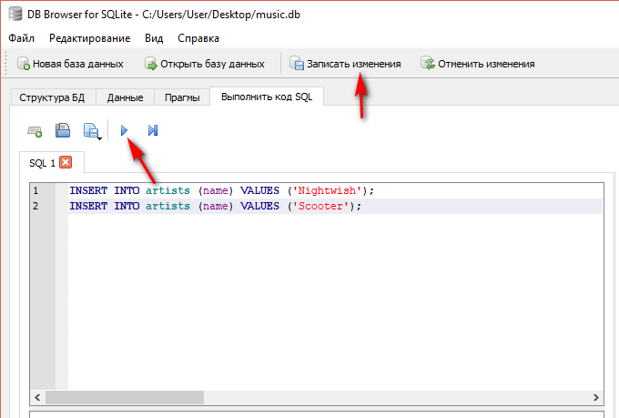

_Рисунок 6 — Запуск SQL скрипта_

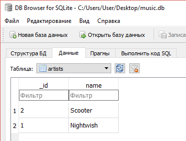

_Рисунок 7 — Созданные записи в таблицу_

Попробуем добавить записи к таблице песню с правильным номером исполнителя:

```sql
INSERT INTO tracks (title, id_artist) VALUES ('Wishmaster', 1);
```

Запрос прошел успешно:

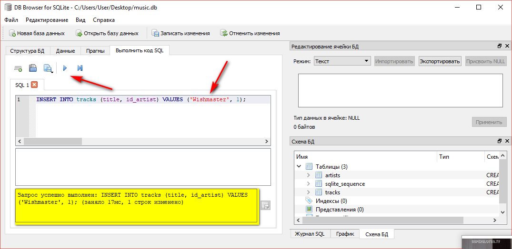

_Рисунок 8 — Запуск SQL скрипта по вставке новой записи_

А теперь попробуем добавить запись с несуществующим номером исполнителя:

```sql
INSERT INTO tracks (title, id_artist) VALUES ('To the Sky', 100);
```

А теперь запрос не пройдет из-за внешнего ключа:

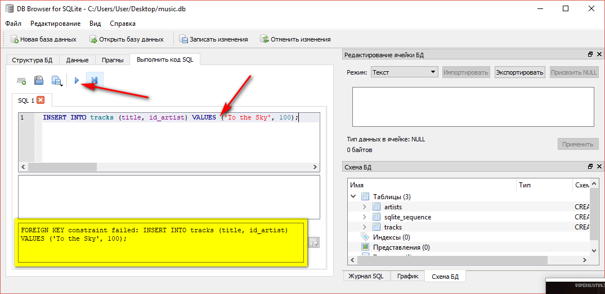

_Рисунок 9 — Ошибка при выполнении SQL скрипта_

И в таблице `tracks` мы увидим только одну запись:

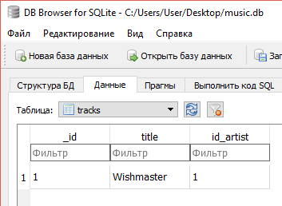

_Рисунок 10 — Записи в таблице_

Обратите внимание на то, что в `SQLite` можно добавлять внешние ключи через `CREATE`. В «полноценных» БД можно добавлять внешние ключи через `ALTER`. Но в SQLite это сделать [нельзя](https://stackoverflow.com/questions/1884818/how-do-i-add-a-foreign-key-to-an-existing-sqlite-table):

```sql
ALTER TABLE child ADD CONSTRAINT fk_child_parent
                  FOREIGN KEY (parent_id)
                  REFERENCES parent(id);
```

И напоследок покажу, как сделать выборку песен из БД так, чтобы вместо номеров песен мы видели названия самих исполнителей.

Этот пример стандартного вызова `SELECT`, когда мы увидим песни с номерами исполнителей:

```sql
SELECT * FROM TRACKS;
```

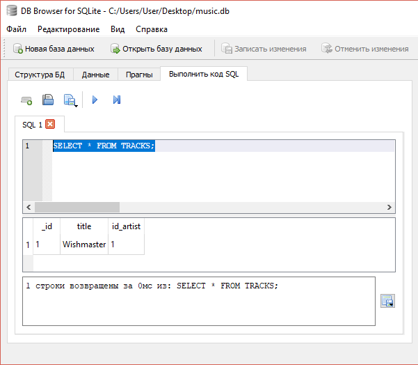

_Рисунок 11 — Результат работы команды SELECT_

А вот пример кода, который вернет нам то, что нужно:

```sql
SELECT t._id, t.title, a.name AS a_name
FROM tracks t
LEFT JOIN artists a ON t.id_artist = a._id;
```

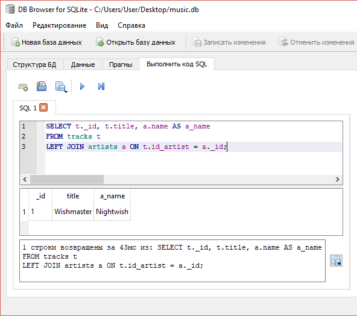

_Рисунок 12 — Результат работы команды SELECT_

Более упрощенный код запроса:

```sql
SELECT tracks._id, tracks.title, artists.name
FROM tracks
LEFT JOIN artists ON tracks.id_artist = artists._id;
```

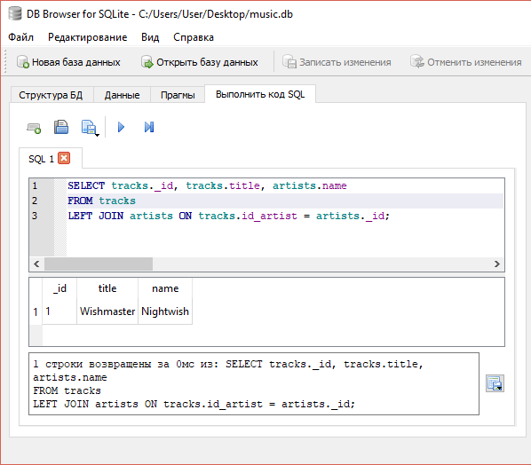

_Рисунок 13 — Результат работы команды SELECT_

Рекомендую прочитать [эту](http://www.skillz.ru/dev/php/article-Obyasnenie_SQL_obedinenii_JOIN_INNER_OUTER.html) статью.
