# Взаимодействие между фрагментами и активностью в Android Studio. Часть 1. Подготовка


Передавать сообщения между элементами на одной активности легко. А как быть, если элементы находятся в разных фрагментах. В статье рассмотрены некоторые сценарии.

Все статьи цикла «Взаимодействие между фрагментами и активностью в Android Studio»:

- [Часть 1. Подготовка](https://github.com/Harrix/harrix.dev-blog-2017/blob/main/fragments-android-1/fragments-android-1.md)
- [Часть 2. Простые способы](https://github.com/Harrix/harrix.dev-blog-2017/blob/main/fragments-android-2/fragments-android-2.md)
- [Часть 3. Через интерфейсы](https://github.com/Harrix/harrix.dev-blog-2017/blob/main/fragments-android-3/fragments-android-3.md)
- [Часть 4. Через намерения](https://github.com/Harrix/harrix.dev-blog-2017/blob/main/fragments-android-4/fragments-android-4.md)
- [Часть 5. Несколько фрагментов](https://github.com/Harrix/harrix.dev-blog-2017/blob/main/fragments-android-5/fragments-android-5.md)

## Создание проекта

В статье [Болванка приложения на Android Studio](https://github.com/Harrix/harrix.dev-blog-2020/blob/main/empty-project-android/empty-project-android.md) рассказывается, как создать болванку приложения для нашей программы.

## Предварительная работа с главной активностью

Пусть разметка файла `activity_main.xml` будет такой:

```xml
<?xml version="1.0" encoding="utf-8"?>
<LinearLayout xmlns:android="http://schemas.android.com/apk/res/android"
    android:layout_width="match_parent"
    android:layout_height="match_parent"
    android:paddingLeft="16dp"
    android:paddingRight="16dp"
    android:orientation="vertical" >

    <FrameLayout
        android:id="@+id/fragmentContainer"
        android:layout_width="match_parent"
        android:layout_height="wrap_content"
        />

    <FrameLayout
        android:id="@+id/fragmentContainer2"
        android:layout_width="match_parent"
        android:layout_height="wrap_content"
        />

    <EditText
        android:id="@+id/editText"
        android:layout_width="match_parent"
        android:layout_height="wrap_content"
        android:ems="10"
        android:inputType="textPersonName" />

    <Button
        android:id="@+id/button"
        android:layout_width="match_parent"
        android:layout_height="wrap_content"
        android:text="Button" />

    <TextView
        android:id="@+id/textView"
        android:layout_width="match_parent"
        android:layout_height="wrap_content" />
</LinearLayout>
```

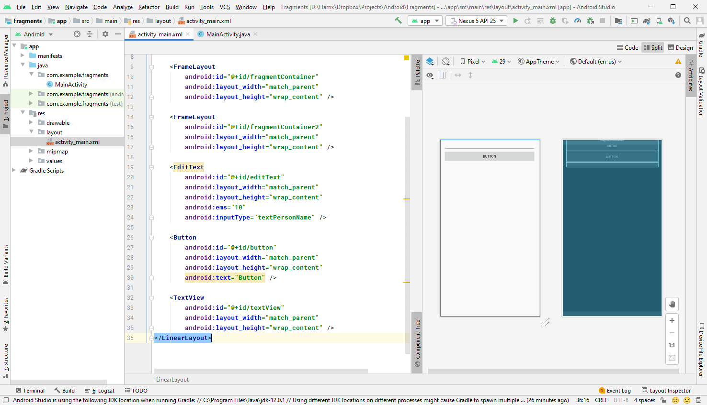

У нас есть два контейнера для фрагментов `fragmentContainer` и `fragmentContainer2`. Также на самой активности есть кнопка `button`, поле для ввода теста `editText` и поле для вывода теста `textView`.

В `MainActivity.java` проведем стандартную работу по созданию переменных, соответствующих элементам из XML разметки, а также пропишем обработчик клика кнопки:

```java
package com.example.fragments;

import androidx.appcompat.app.AppCompatActivity;

import android.os.Bundle;
import android.view.View;
import android.widget.Button;
import android.widget.EditText;
import android.widget.FrameLayout;
import android.widget.TextView;

public class MainActivity extends AppCompatActivity {

    private EditText editText;
    private TextView textView;
    private Button button;
    private FrameLayout fragmentContainer;
    private FrameLayout fragmentContainer2;

    @Override
    protected void onCreate(Bundle savedInstanceState) {
        super.onCreate(savedInstanceState);
        setContentView(R.layout.activity_main);

        editText = (EditText) findViewById(R.id.editText);
        textView = (TextView) findViewById(R.id.textView);
        button = (Button) findViewById(R.id.button);
        fragmentContainer = (FrameLayout) findViewById(R.id.fragmentContainer);
        fragmentContainer2 = (FrameLayout) findViewById(R.id.fragmentContainer2);

        button.setOnClickListener(new View.OnClickListener() {
            @Override
            public void onClick(View v) {

            }
        });
    }
}
```

## Создаем фрагменты

Нам нужно будет создать 3 фрагмента для разных манипуляций.

Создадим простой фрагмент `Fragment1`:

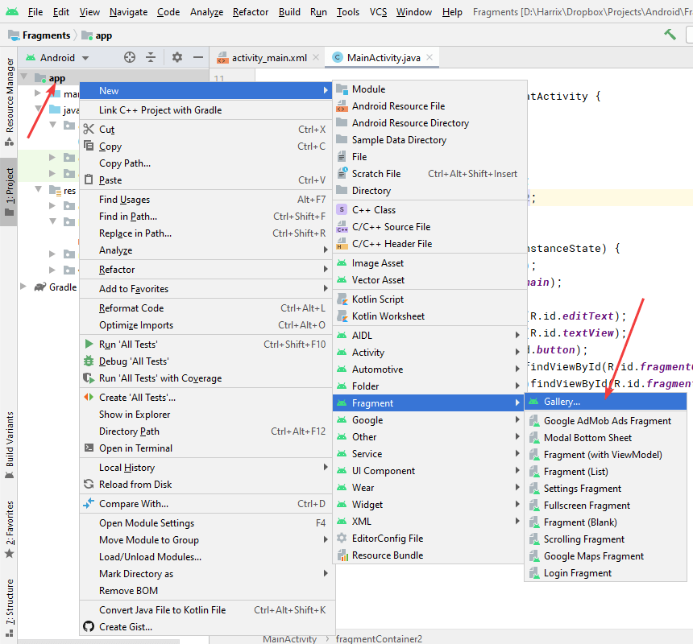

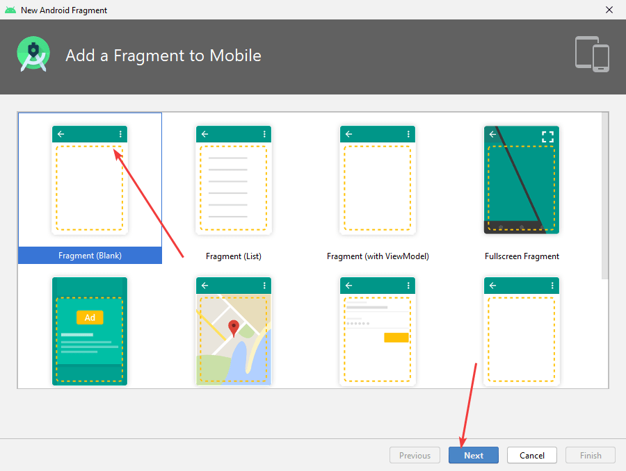

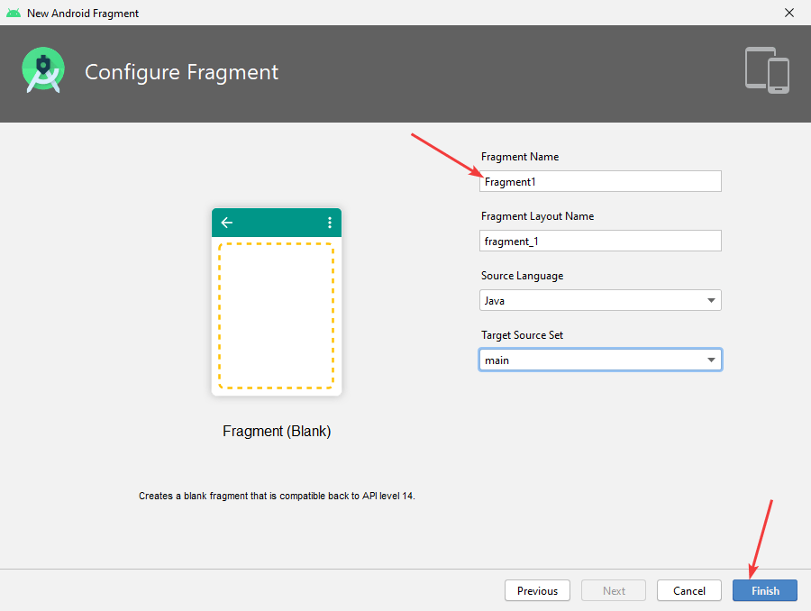

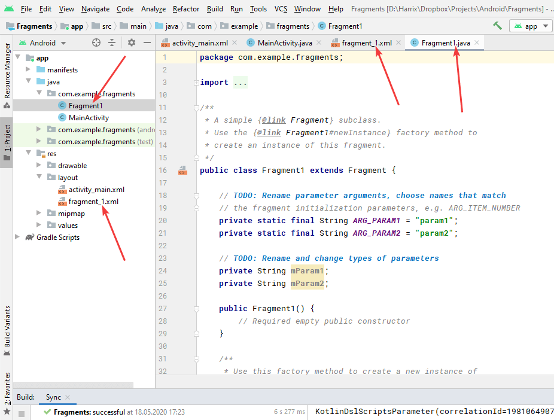

Разметку фрагмента поменяем на такую:

```xml
<?xml version="1.0" encoding="utf-8"?>
<LinearLayout xmlns:android="http://schemas.android.com/apk/res/android"
    android:layout_width="match_parent"
    android:layout_height="match_parent"
    android:background="#FF33B5E5"
    android:orientation="vertical">

    <EditText
        android:id="@+id/editTextFragment1"
        android:layout_width="match_parent"
        android:layout_height="wrap_content"
        android:ems="10"
        android:inputType="textPersonName" />

    <Button
        android:id="@+id/buttonFragment1"
        android:layout_width="match_parent"
        android:layout_height="wrap_content"
        android:text="From Fragment1" />

    <TextView
        android:id="@+id/textViewFragment1"
        android:layout_width="match_parent"
        android:layout_height="wrap_content" />
</LinearLayout>
```

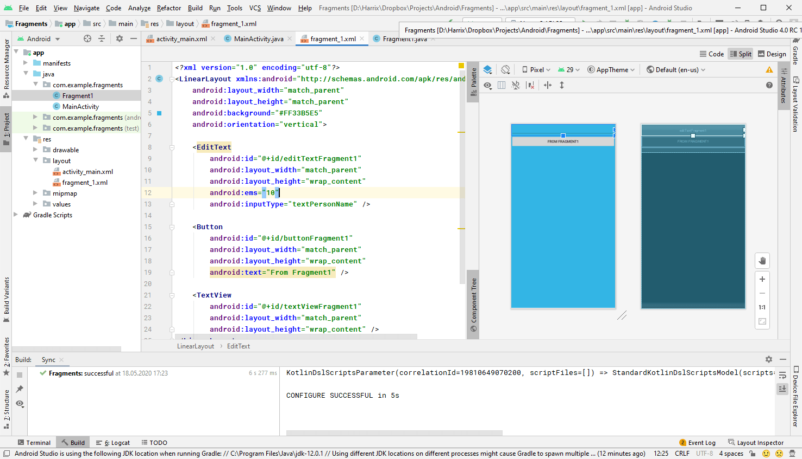

Java файл `Fragment1.java` фрагмента у меня выглядел так:

```java
package com.example.fragments;

import android.os.Bundle;

import androidx.fragment.app.Fragment;

import android.view.LayoutInflater;
import android.view.View;
import android.view.ViewGroup;

/**
 * A simple {@link Fragment} subclass.
 * Use the {@link Fragment1#newInstance} factory method to
 * create an instance of this fragment.
 */
public class Fragment1 extends Fragment {

    // TODO: Rename parameter arguments, choose names that match
    // the fragment initialization parameters, e.g. ARG_ITEM_NUMBER
    private static final String ARG_PARAM1 = "param1";
    private static final String ARG_PARAM2 = "param2";

    // TODO: Rename and change types of parameters
    private String mParam1;
    private String mParam2;

    public Fragment1() {
        // Required empty public constructor
    }

    /**
     * Use this factory method to create a new instance of
     * this fragment using the provided parameters.
     *
     * @param param1 Parameter 1.
     * @param param2 Parameter 2.
     * @return A new instance of fragment Fragment1.
     */
    // TODO: Rename and change types and number of parameters
    public static Fragment1 newInstance(String param1, String param2) {
        Fragment1 fragment = new Fragment1();
        Bundle args = new Bundle();
        args.putString(ARG_PARAM1, param1);
        args.putString(ARG_PARAM2, param2);
        fragment.setArguments(args);
        return fragment;
    }

    @Override
    public void onCreate(Bundle savedInstanceState) {
        super.onCreate(savedInstanceState);
        if (getArguments() != null) {
            mParam1 = getArguments().getString(ARG_PARAM1);
            mParam2 = getArguments().getString(ARG_PARAM2);
        }
    }

    @Override
    public View onCreateView(LayoutInflater inflater, ViewGroup container,
                             Bundle savedInstanceState) {
        // Inflate the layout for this fragment
        return inflater.inflate(R.layout.fragment_1, container, false);
    }
}
```

Аналогично, как и для активности, сюда внес переменные, отвечающие за элементы из XML файла + обработка клика кнопки + удаление лишнего на данный момент:

```java
package com.example.fragments;

import android.os.Bundle;

import androidx.fragment.app.Fragment;

import android.view.LayoutInflater;
import android.view.View;
import android.view.ViewGroup;
import android.widget.Button;
import android.widget.EditText;
import android.widget.TextView;

public class Fragment1 extends Fragment {

    private EditText editTextFragment1;
    private TextView textViewFragment1;
    private Button buttonFragment1;

    public Fragment1() {
    }

    public static Fragment1 newInstance(String param1, String param2) {
        Fragment1 fragment = new Fragment1();
        return fragment;
    }

    @Override
    public void onCreate(Bundle savedInstanceState) {
        super.onCreate(savedInstanceState);
    }

    @Override
    public View onCreateView(LayoutInflater inflater, ViewGroup container,
                             Bundle savedInstanceState) {
        View view = inflater.inflate(R.layout.fragment_1, container, false);

        editTextFragment1 = (EditText) view.findViewById(R.id.editTextFragment1);
        textViewFragment1 = (TextView) view.findViewById(R.id.textViewFragment1);
        buttonFragment1 = (Button) view.findViewById(R.id.buttonFragment1);

        buttonFragment1.setOnClickListener(new View.OnClickListener() {
            @Override
            public void onClick(View v) {

            }
        });

        return view;
    }
}
```

Обратите внимание, что я немного поменял строчку:

```java
return inflater.inflate(R.layout.fragment_1, container, false);
```

Также в фрагментах немного по другому выглядит вызов `findViewById()`. И работаем с элементами в методе `onCreateView()`.

Аналогично создаем `Fragment2`.

XML разметка:

```xml
<?xml version="1.0" encoding="utf-8"?>
<LinearLayout xmlns:android="http://schemas.android.com/apk/res/android"
    android:layout_width="match_parent"
    android:layout_height="match_parent"
    android:background="#FF99CC00"
    android:orientation="vertical">

    <EditText
        android:id="@+id/editTextFragment2"
        android:layout_width="match_parent"
        android:layout_height="wrap_content"
        android:ems="10"
        android:inputType="textPersonName" />

    <Button
        android:id="@+id/buttonFragment2"
        android:layout_width="match_parent"
        android:layout_height="wrap_content"
        android:text="From Fragment2" />

    <TextView
        android:id="@+id/textViewFragment2"
        android:layout_width="match_parent"
        android:layout_height="wrap_content" />
</LinearLayout>
```

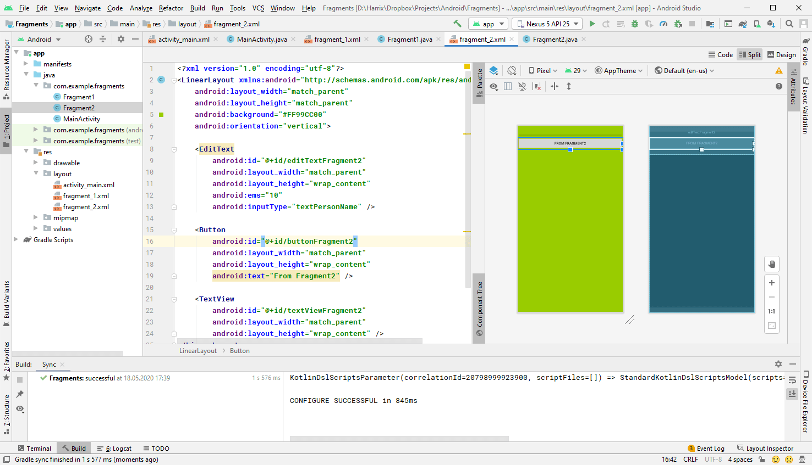

Java файл фрагмента `Fragment2`:

```java
package com.example.fragments;

import android.os.Bundle;

import androidx.fragment.app.Fragment;

import android.view.LayoutInflater;
import android.view.View;
import android.view.ViewGroup;
import android.widget.Button;
import android.widget.EditText;
import android.widget.TextView;

public class Fragment2 extends Fragment {

    private EditText editTextFragment2;
    private TextView textViewFragment2;
    private Button buttonFragment2;

    public Fragment2() {
    }

    public static Fragment2 newInstance(String param1, String param2) {
        Fragment2 fragment = new Fragment2();
        return fragment;
    }

    @Override
    public void onCreate(Bundle savedInstanceState) {
        super.onCreate(savedInstanceState);
    }

    @Override
    public View onCreateView(LayoutInflater inflater, ViewGroup container,
                             Bundle savedInstanceState) {
        View view = inflater.inflate(R.layout.fragment_2, container, false);

        editTextFragment2 = (EditText) view.findViewById(R.id.editTextFragment2);
        textViewFragment2 = (TextView) view.findViewById(R.id.textViewFragment2);
        buttonFragment2 = (Button) view.findViewById(R.id.buttonFragment2);

        buttonFragment2.setOnClickListener(new View.OnClickListener() {
            @Override
            public void onClick(View v) {

            }
        });

        return view;
    }
}
```

Аналогично создаем `Fragment3`.

XML разметка:

```xml
<?xml version="1.0" encoding="utf-8"?>
<LinearLayout xmlns:android="http://schemas.android.com/apk/res/android"
    android:layout_width="match_parent"
    android:layout_height="match_parent"
    android:background="#FFFFBB33"
    android:orientation="vertical">

    <EditText
        android:id="@+id/editTextFragment3"
        android:layout_width="match_parent"
        android:layout_height="wrap_content"
        android:ems="10"
        android:inputType="textPersonName" />

    <Button
        android:id="@+id/buttonFragment3"
        android:layout_width="match_parent"
        android:layout_height="wrap_content"
        android:text="From Fragment3" />

    <TextView
        android:id="@+id/textViewFragment3"
        android:layout_width="match_parent"
        android:layout_height="wrap_content" />
</LinearLayout>
```

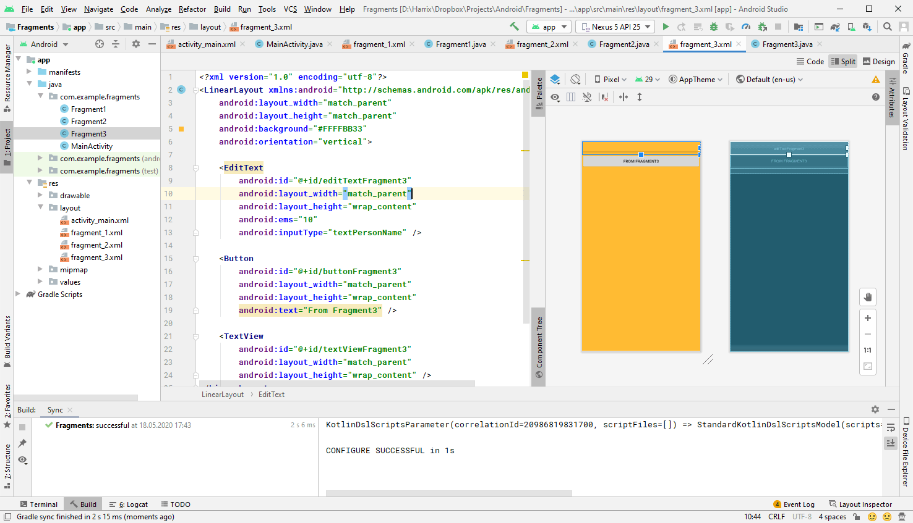

Java файл фрагмента `Fragment3`:

```java
package com.example.fragments;

import android.os.Bundle;

import androidx.fragment.app.Fragment;

import android.view.LayoutInflater;
import android.view.View;
import android.view.ViewGroup;
import android.widget.Button;
import android.widget.EditText;
import android.widget.TextView;

public class Fragment3 extends Fragment {

    private EditText editTextFragment3;
    private TextView textViewFragment3;
    private Button buttonFragment3;

    public Fragment3() {
    }

    public static Fragment3 newInstance(String param1, String param2) {
        Fragment3 fragment = new Fragment3();
        return fragment;
    }

    @Override
    public void onCreate(Bundle savedInstanceState) {
        super.onCreate(savedInstanceState);
    }

    @Override
    public View onCreateView(LayoutInflater inflater, ViewGroup container,
                             Bundle savedInstanceState) {
        View view = inflater.inflate(R.layout.fragment_3, container, false);

        editTextFragment3 = (EditText) view.findViewById(R.id.editTextFragment3);
        textViewFragment3 = (TextView) view.findViewById(R.id.textViewFragment3);
        buttonFragment3 = (Button) view.findViewById(R.id.buttonFragment3);

        buttonFragment3.setOnClickListener(new View.OnClickListener() {
            @Override
            public void onClick(View v) {

            }
        });

        return view;
    }
}
```

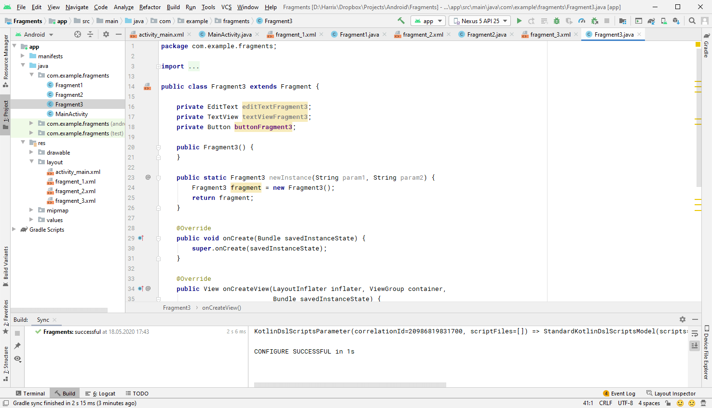

## Отображаем первый фрагмент

**Задача.** При запуске приложения в контейнер активности `fragmentContainer` должен загрузиться первый фрагмент `Fragment1`.

**Решение.** Будем использовать `FragmentManager`:

```java
FragmentManager fm = getSupportFragmentManager();

Fragment fragment = fm.findFragmentById(R.id.fragmentContainer);
if (fragment == null) {
    fragment = new Fragment1();
    fm.beginTransaction()
            .add(R.id.fragmentContainer, fragment)
            .commit();
}
```

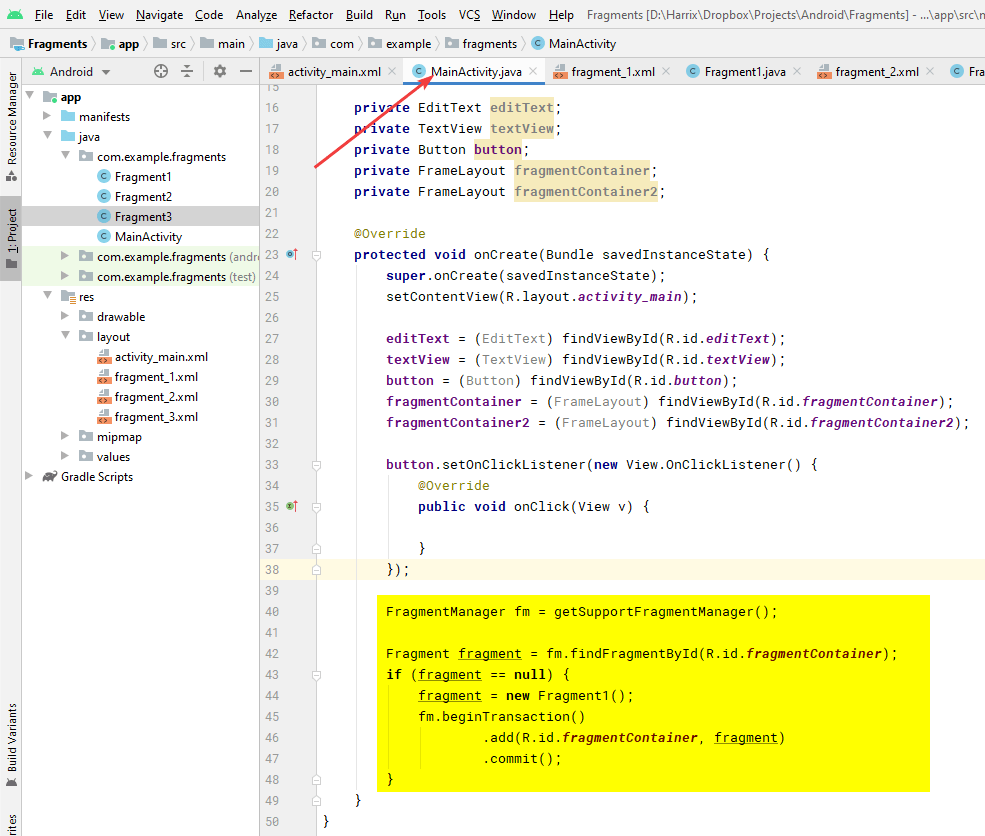

Теперь при запуске приложения в первом контейнере появится первый фрагмент:

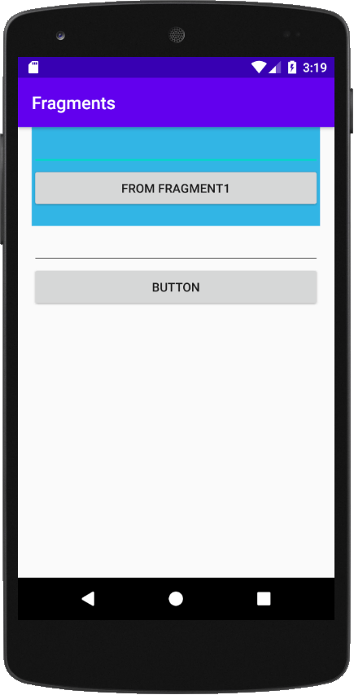

## Точка сохранения 1

Дальше в коде я буду ссылаться на эту точку сохранения. Вы должны будете откатить программу к этому моменту: когда в активности отображается первый фрагмент при старте и всё.

Код `MainActivity.java` в **точке сохранения 1.**:

```java
package com.example.fragments;

import androidx.appcompat.app.AppCompatActivity;
import androidx.fragment.app.Fragment;
import androidx.fragment.app.FragmentManager;

import android.os.Bundle;
import android.view.View;
import android.widget.Button;
import android.widget.EditText;
import android.widget.FrameLayout;
import android.widget.TextView;

public class MainActivity extends AppCompatActivity {

    private EditText editText;
    private TextView textView;
    private Button button;
    private FrameLayout fragmentContainer;
    private FrameLayout fragmentContainer2;

    @Override
    protected void onCreate(Bundle savedInstanceState) {
        super.onCreate(savedInstanceState);
        setContentView(R.layout.activity_main);

        editText = (EditText) findViewById(R.id.editText);
        textView = (TextView) findViewById(R.id.textView);
        button = (Button) findViewById(R.id.button);
        fragmentContainer = (FrameLayout) findViewById(R.id.fragmentContainer);
        fragmentContainer2 = (FrameLayout) findViewById(R.id.fragmentContainer2);

        button.setOnClickListener(new View.OnClickListener() {
            @Override
            public void onClick(View v) {

            }
        });

        FragmentManager fm = getSupportFragmentManager();

        Fragment fragment = fm.findFragmentById(R.id.fragmentContainer);
        if (fragment == null) {
            fragment = new Fragment1();
            fm.beginTransaction()
                    .add(R.id.fragmentContainer, fragment)
                    .commit();
        }
    }
}
```

Код `Fragment1.java` в **точке сохранения 1.**:

```java
package com.example.fragments;

import android.os.Bundle;

import androidx.fragment.app.Fragment;

import android.view.LayoutInflater;
import android.view.View;
import android.view.ViewGroup;
import android.widget.Button;
import android.widget.EditText;
import android.widget.TextView;

public class Fragment1 extends Fragment {

    private EditText editTextFragment1;
    private TextView textViewFragment1;
    private Button buttonFragment1;

    public Fragment1() {
    }

    public static Fragment1 newInstance(String param1, String param2) {
        Fragment1 fragment = new Fragment1();
        return fragment;
    }

    @Override
    public void onCreate(Bundle savedInstanceState) {
        super.onCreate(savedInstanceState);
    }

    @Override
    public View onCreateView(LayoutInflater inflater, ViewGroup container,
                             Bundle savedInstanceState) {
        View view = inflater.inflate(R.layout.fragment_1, container, false);

        editTextFragment1 = (EditText) view.findViewById(R.id.editTextFragment1);
        textViewFragment1 = (TextView) view.findViewById(R.id.textViewFragment1);
        buttonFragment1 = (Button) view.findViewById(R.id.buttonFragment1);

        buttonFragment1.setOnClickListener(new View.OnClickListener() {
            @Override
            public void onClick(View v) {

            }
        });

        return view;
    }
}
```

Файл `Fragment2.java`:

```java
package com.example.fragments;

import android.os.Bundle;

import androidx.fragment.app.Fragment;

import android.view.LayoutInflater;
import android.view.View;
import android.view.ViewGroup;
import android.widget.Button;
import android.widget.EditText;
import android.widget.TextView;

public class Fragment2 extends Fragment {

    private EditText editTextFragment2;
    private TextView textViewFragment2;
    private Button buttonFragment2;

    public Fragment2() {
    }

    public static Fragment2 newInstance(String param1, String param2) {
        Fragment2 fragment = new Fragment2();
        return fragment;
    }

    @Override
    public void onCreate(Bundle savedInstanceState) {
        super.onCreate(savedInstanceState);
    }

    @Override
    public View onCreateView(LayoutInflater inflater, ViewGroup container,
                             Bundle savedInstanceState) {
        View view = inflater.inflate(R.layout.fragment_2, container, false);

        editTextFragment2 = (EditText) view.findViewById(R.id.editTextFragment2);
        textViewFragment2 = (TextView) view.findViewById(R.id.textViewFragment2);
        buttonFragment2 = (Button) view.findViewById(R.id.buttonFragment2);

        buttonFragment2.setOnClickListener(new View.OnClickListener() {
            @Override
            public void onClick(View v) {

            }
        });

        return view;
    }
}
```

Файл `Fragment3.java`:

```java
package com.example.fragments;

import android.os.Bundle;

import androidx.fragment.app.Fragment;

import android.view.LayoutInflater;
import android.view.View;
import android.view.ViewGroup;
import android.widget.Button;
import android.widget.EditText;
import android.widget.TextView;

public class Fragment3 extends Fragment {

    private EditText editTextFragment3;
    private TextView textViewFragment3;
    private Button buttonFragment3;

    public Fragment3() {
    }

    public static Fragment3 newInstance(String param1, String param2) {
        Fragment3 fragment = new Fragment3();
        return fragment;
    }

    @Override
    public void onCreate(Bundle savedInstanceState) {
        super.onCreate(savedInstanceState);
    }

    @Override
    public View onCreateView(LayoutInflater inflater, ViewGroup container,
                             Bundle savedInstanceState) {
        View view = inflater.inflate(R.layout.fragment_3, container, false);

        editTextFragment3 = (EditText) view.findViewById(R.id.editTextFragment3);
        textViewFragment3 = (TextView) view.findViewById(R.id.textViewFragment3);
        buttonFragment3 = (Button) view.findViewById(R.id.buttonFragment3);

        buttonFragment3.setOnClickListener(new View.OnClickListener() {
            @Override
            public void onClick(View v) {

            }
        });

        return view;
    }
}
```

Следующая часть [Часть 2. Простые способы](https://github.com/Harrix/harrix.dev-blog-2017/blob/main/fragments-android-2/fragments-android-2.md).
