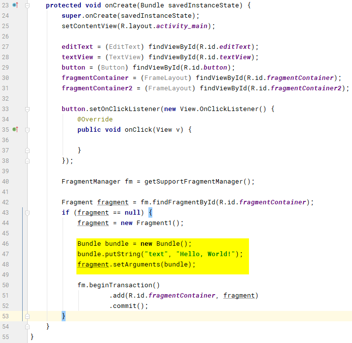
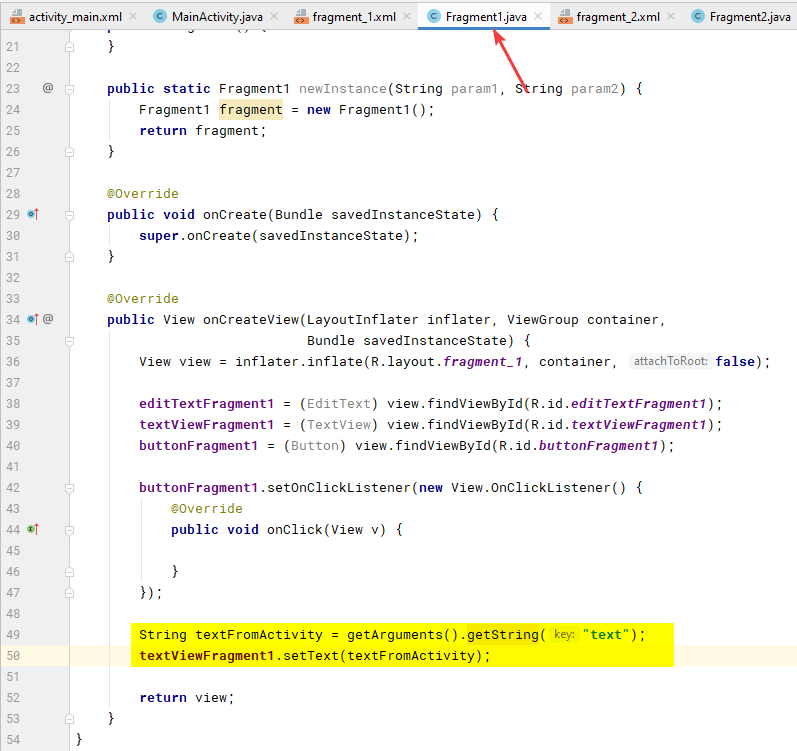
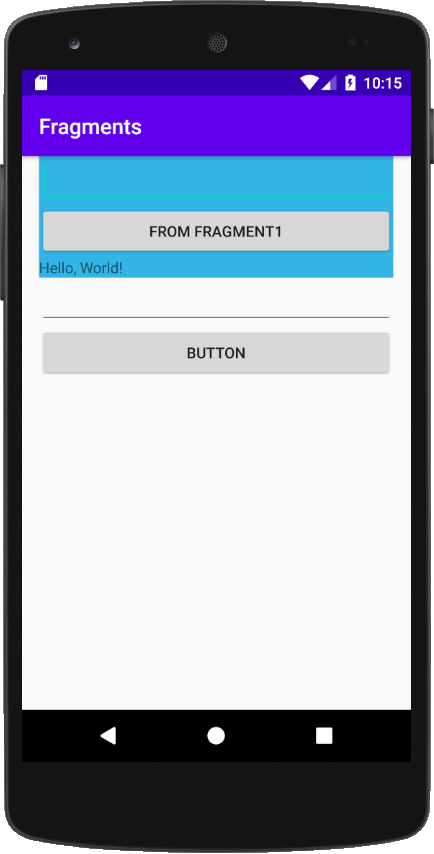
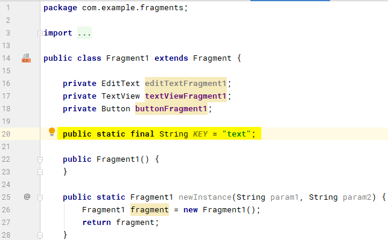
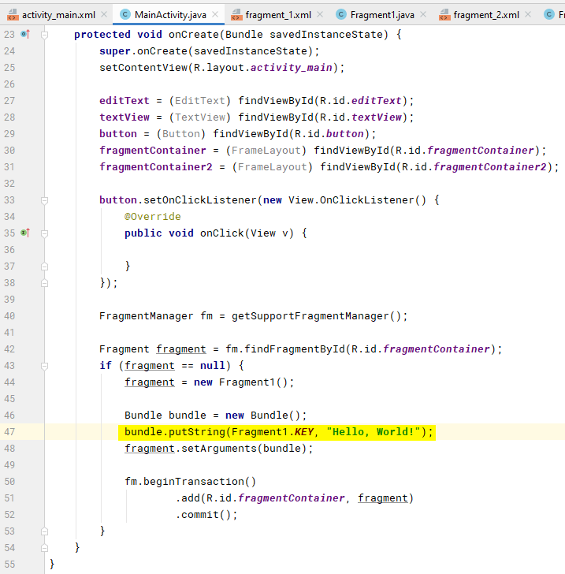
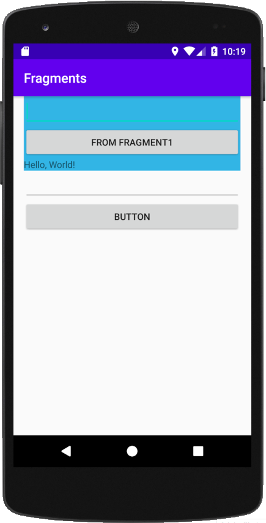
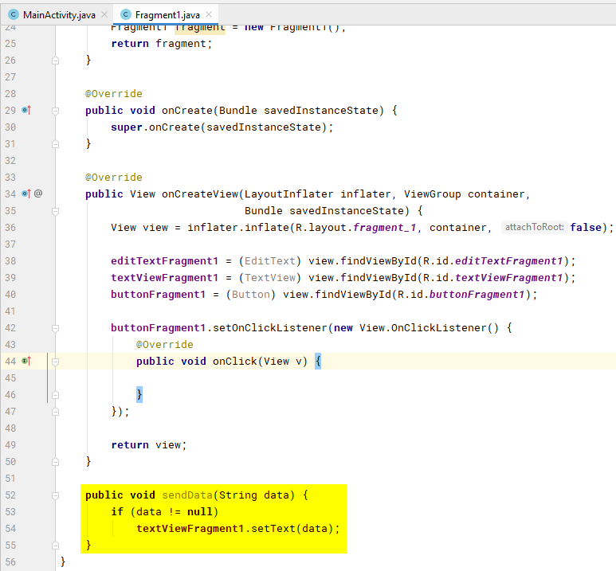
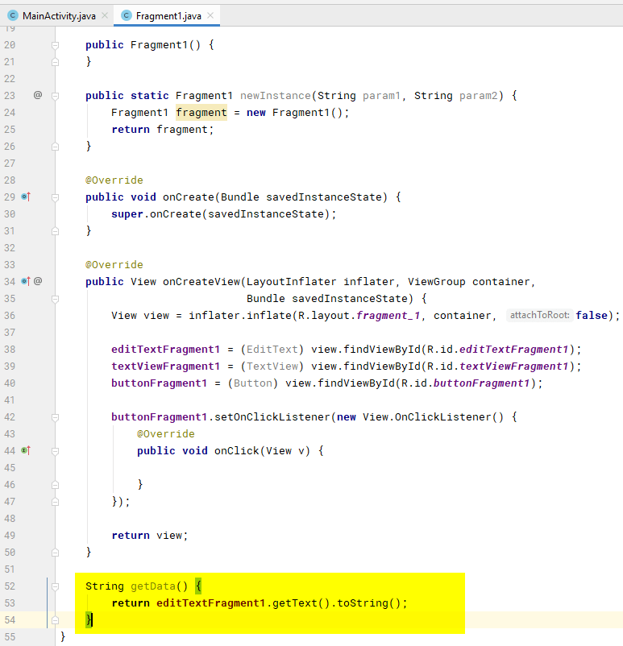
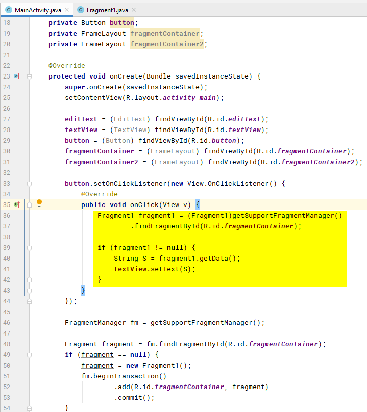
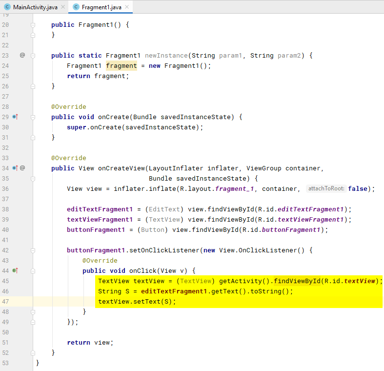

# Взаимодействие между фрагментами и активностью в Android Studio. Часть 2. Простые способы

Вторая часть серии статей про взаимодействие фрагментов и активности.

Все статьи цикла «Взаимодействие между фрагментами и активностью в Android Studio»:

- [Часть 1. Подготовка](https://github.com/Harrix/harrix.dev-blog-2017/blob/main/fragments-android-1/fragments-android-1.md)
- [Часть 2. Простые способы](https://github.com/Harrix/harrix.dev-blog-2017/blob/main/fragments-android-2/fragments-android-2.md)
- [Часть 3. Через интерфейсы](https://github.com/Harrix/harrix.dev-blog-2017/blob/main/fragments-android-3/fragments-android-3.md)
- [Часть 4. Через намерения](https://github.com/Harrix/harrix.dev-blog-2017/blob/main/fragments-android-4/fragments-android-4.md)
- [Часть 5. Несколько фрагментов](https://github.com/Harrix/harrix.dev-blog-2017/blob/main/fragments-android-5/fragments-android-5.md)

Предыдущая часть [Часть 1. Подготовка](https://github.com/Harrix/harrix.dev-blog-2017/blob/main/fragments-android-1/fragments-android-1.md).

## При старте приложения отправляем информацию в фрагмент из активности

**Задача.** При запуске приложения главная активность отправляет текст `Hello, World!` в фрагмент, который отображается в в поле `textViewFragment1` фрагмента.

**Решение.** При создании фрагмента нужные данные закинем в `Bundle`, например, по ключу `text`:

```java
FragmentManager fm = getSupportFragmentManager();

Fragment fragment = fm.findFragmentById(R.id.fragmentContainer);
if (fragment == null) {
    fragment = new Fragment1();

    Bundle bundle = new Bundle();
    bundle.putString("text", "Hello, World!");
    fragment.setArguments(bundle);

    fm.beginTransaction()
            .add(R.id.fragmentContainer, fragment)
            .commit();
}
```



В фрагменте в методе `onCreateView()` считываем пришедшую информацию по заданному ключу `text`:

```java
String textFromActivity = getArguments().getString("text");
textViewFragment1.setText(textFromActivity);
```





Но предложенное решение не самое хорошее. Почему? Активность хранит у себя информацию о ключе фрагмента. Это не хорошо. Было бы хорошо, если бы только фрагмент хранил информацию о ключе.

В фрагменте создадим **статическую** переменную `KEY`:

```java
public static final String KEY = "text";
```



Теперь в активности значение ключа будем вытаскивать из фрагмента `Fragment1.KEY`:

```java
bundle.putString(Fragment1.KEY, "Hello, World!");
```





Приведу полные коды файлов.

---

**Полные коды файлов** <!-- !details -->

`MainActivity.java`:

```java
package com.example.fragments;

import androidx.appcompat.app.AppCompatActivity;
import androidx.fragment.app.Fragment;
import androidx.fragment.app.FragmentManager;

import android.os.Bundle;
import android.view.View;
import android.widget.Button;
import android.widget.EditText;
import android.widget.FrameLayout;
import android.widget.TextView;

public class MainActivity extends AppCompatActivity {

    private EditText editText;
    private TextView textView;
    private Button button;
    private FrameLayout fragmentContainer;
    private FrameLayout fragmentContainer2;

    @Override
    protected void onCreate(Bundle savedInstanceState) {
        super.onCreate(savedInstanceState);
        setContentView(R.layout.activity_main);

        editText = (EditText) findViewById(R.id.editText);
        textView = (TextView) findViewById(R.id.textView);
        button = (Button) findViewById(R.id.button);
        fragmentContainer = (FrameLayout) findViewById(R.id.fragmentContainer);
        fragmentContainer2 = (FrameLayout) findViewById(R.id.fragmentContainer2);

        button.setOnClickListener(new View.OnClickListener() {
            @Override
            public void onClick(View v) {

            }
        });

        FragmentManager fm = getSupportFragmentManager();

        Fragment fragment = fm.findFragmentById(R.id.fragmentContainer);
        if (fragment == null) {
            fragment = new Fragment1();

            Bundle bundle = new Bundle();
            bundle.putString(Fragment1.KEY, "Hello, World!");
            fragment.setArguments(bundle);

            fm.beginTransaction()
                    .add(R.id.fragmentContainer, fragment)
                    .commit();
        }
    }
}
```

`Fragment1.java`:

```java
package com.example.fragments;

import android.os.Bundle;

import androidx.fragment.app.Fragment;

import android.view.LayoutInflater;
import android.view.View;
import android.view.ViewGroup;
import android.widget.Button;
import android.widget.EditText;
import android.widget.TextView;

public class Fragment1 extends Fragment {

    private EditText editTextFragment1;
    private TextView textViewFragment1;
    private Button buttonFragment1;

    public static final String KEY = "text";

    public Fragment1() {
    }

    public static Fragment1 newInstance(String param1, String param2) {
        Fragment1 fragment = new Fragment1();
        return fragment;
    }

    @Override
    public void onCreate(Bundle savedInstanceState) {
        super.onCreate(savedInstanceState);
    }

    @Override
    public View onCreateView(LayoutInflater inflater, ViewGroup container,
                             Bundle savedInstanceState) {
        View view = inflater.inflate(R.layout.fragment_1, container, false);

        editTextFragment1 = (EditText) view.findViewById(R.id.editTextFragment1);
        textViewFragment1 = (TextView) view.findViewById(R.id.textViewFragment1);
        buttonFragment1 = (Button) view.findViewById(R.id.buttonFragment1);

        buttonFragment1.setOnClickListener(new View.OnClickListener() {
            @Override
            public void onClick(View v) {

            }
        });

        String textFromActivity = getArguments().getString("text");
        textViewFragment1.setText(textFromActivity);

        return view;
    }
}
```

---

## Получаем информацию из активности в фрагменте при клике кнопки активности

**Задача.** При нажатии на кнопку `button` в главной активности текст из `editText` главной активности должен отобразится в поле `textViewFragment1` фрагмента.

**Решение.** Тут всё просто. Реализуем какой-нибудь метод во фрагменте, который будем вызвать, чтобы отправить во фрагмент информацию. Например, реализуем метод `sendData()`:

```java
public void sendData(String data) {
    if (data != null)
        textViewFragment1.setText(data);
}
```



Теперь в клике кнопки `button` активности нам нужно найти текущий фрагмент, который находится в контейнере `fragmentContainer`:

```java
Fragment1 fragment1 = (Fragment1)getSupportFragmentManager()
        .findFragmentById(R.id.fragmentContainer);
```

А потом уже у фрагмента вызвать наш метод `sendData()`:

```java
button.setOnClickListener(new View.OnClickListener() {
    @Override
    public void onClick(View v) {
        Fragment1 fragment1 = (Fragment1)getSupportFragmentManager()
                .findFragmentById(R.id.fragmentContainer);

        if (fragment1 != null) {
            String S = editText.getText().toString();
            fragment1.sendData(S);
        }
    }
});
```


---

**Полные коды файлов** <!-- !details -->

Полный код `MainActivity.java`:

```java
package com.example.fragments;

import androidx.appcompat.app.AppCompatActivity;
import androidx.fragment.app.Fragment;
import androidx.fragment.app.FragmentManager;

import android.os.Bundle;
import android.view.View;
import android.widget.Button;
import android.widget.EditText;
import android.widget.FrameLayout;
import android.widget.TextView;

public class MainActivity extends AppCompatActivity {

    private EditText editText;
    private TextView textView;
    private Button button;
    private FrameLayout fragmentContainer;
    private FrameLayout fragmentContainer2;

    @Override
    protected void onCreate(Bundle savedInstanceState) {
        super.onCreate(savedInstanceState);
        setContentView(R.layout.activity_main);

        editText = (EditText) findViewById(R.id.editText);
        textView = (TextView) findViewById(R.id.textView);
        button = (Button) findViewById(R.id.button);
        fragmentContainer = (FrameLayout) findViewById(R.id.fragmentContainer);
        fragmentContainer2 = (FrameLayout) findViewById(R.id.fragmentContainer2);

        button.setOnClickListener(new View.OnClickListener() {
            @Override
            public void onClick(View v) {
                Fragment1 fragment1 = (Fragment1)getSupportFragmentManager()
                        .findFragmentById(R.id.fragmentContainer);

                if (fragment1 != null) {
                    String S = editText.getText().toString();
                    fragment1.sendData(S);
                }
            }
        });

        FragmentManager fm = getSupportFragmentManager();

        Fragment fragment = fm.findFragmentById(R.id.fragmentContainer);
        if (fragment == null) {
            fragment = new Fragment1();
            fm.beginTransaction()
                    .add(R.id.fragmentContainer, fragment)
                    .commit();
        }
    }
}
```

Полный код `Fragment1.java`:

```java
package com.example.fragments;

import android.os.Bundle;

import androidx.fragment.app.Fragment;

import android.view.LayoutInflater;
import android.view.View;
import android.view.ViewGroup;
import android.widget.Button;
import android.widget.EditText;
import android.widget.TextView;

public class Fragment1 extends Fragment {

    private EditText editTextFragment1;
    private TextView textViewFragment1;
    private Button buttonFragment1;

    public Fragment1() {
    }

    public static Fragment1 newInstance(String param1, String param2) {
        Fragment1 fragment = new Fragment1();
        return fragment;
    }

    @Override
    public void onCreate(Bundle savedInstanceState) {
        super.onCreate(savedInstanceState);
    }

    @Override
    public View onCreateView(LayoutInflater inflater, ViewGroup container,
                             Bundle savedInstanceState) {
        View view = inflater.inflate(R.layout.fragment_1, container, false);

        editTextFragment1 = (EditText) view.findViewById(R.id.editTextFragment1);
        textViewFragment1 = (TextView) view.findViewById(R.id.textViewFragment1);
        buttonFragment1 = (Button) view.findViewById(R.id.buttonFragment1);

        buttonFragment1.setOnClickListener(new View.OnClickListener() {
            @Override
            public void onClick(View v) {

            }
        });

        return view;
    }

    public void sendData(String data) {
        if (data != null)
            textViewFragment1.setText(data);
    }
}
```

---

## Получаем информацию из активности в фрагменте при клике кнопки фрагмента

**Задача.** При нажатии на кнопку `buttonFragment1` в фрагменте текст из `editText` главной активности должен отобразится в поле `textViewFragment1` фрагмента.

Если в прошлый раз мы нажимали кнопку в активности, то сейчас будем нажимать в фрагменте.

В коде я откатываюсь к [точке сохранения 1](https://github.com/Harrix/harrix.dev-blog-2017/blob/main/fragments-android-1/fragments-android-1.md).

**Решение.** Мы из фрагмента можем получить доступ к активности, где располагается данный фрагмент, через `getActivity()`. Поэтому код клика кнопки `buttonFragment1` будет таким:

```java
buttonFragment1.setOnClickListener(new View.OnClickListener() {
    @Override
    public void onClick(View v) {
        EditText editText = (EditText) getActivity().findViewById(R.id.editText);
        String S = editText.getText().toString();
        textViewFragment1.setText(S);
    }
});
```


Код `MainActivity.java` не меняется.

---

**Полные коды файлов** <!-- !details -->

Полный код `MainActivity.java`. По сравнению с точкой сохранения тут ничего не поменялось:

```java
package com.example.fragments;

import androidx.appcompat.app.AppCompatActivity;
import androidx.fragment.app.Fragment;
import androidx.fragment.app.FragmentManager;

import android.os.Bundle;
import android.view.View;
import android.widget.Button;
import android.widget.EditText;
import android.widget.FrameLayout;
import android.widget.TextView;

public class MainActivity extends AppCompatActivity {

    private EditText editText;
    private TextView textView;
    private Button button;
    private FrameLayout fragmentContainer;
    private FrameLayout fragmentContainer2;

    @Override
    protected void onCreate(Bundle savedInstanceState) {
        super.onCreate(savedInstanceState);
        setContentView(R.layout.activity_main);

        editText = (EditText) findViewById(R.id.editText);
        textView = (TextView) findViewById(R.id.textView);
        button = (Button) findViewById(R.id.button);
        fragmentContainer = (FrameLayout) findViewById(R.id.fragmentContainer);
        fragmentContainer2 = (FrameLayout) findViewById(R.id.fragmentContainer2);

        button.setOnClickListener(new View.OnClickListener() {
            @Override
            public void onClick(View v) {

            }
        });

        FragmentManager fm = getSupportFragmentManager();

        Fragment fragment = fm.findFragmentById(R.id.fragmentContainer);
        if (fragment == null) {
            fragment = new Fragment1();
            fm.beginTransaction()
                    .add(R.id.fragmentContainer, fragment)
                    .commit();
        }
    }
}
```

Полный код `Fragment1.java`:

```java
package com.example.fragments;

import android.os.Bundle;

import androidx.fragment.app.Fragment;

import android.view.LayoutInflater;
import android.view.View;
import android.view.ViewGroup;
import android.widget.Button;
import android.widget.EditText;
import android.widget.TextView;

public class Fragment1 extends Fragment {

    private EditText editTextFragment1;
    private TextView textViewFragment1;
    private Button buttonFragment1;

    public Fragment1() {
    }

    public static Fragment1 newInstance(String param1, String param2) {
        Fragment1 fragment = new Fragment1();
        return fragment;
    }

    @Override
    public void onCreate(Bundle savedInstanceState) {
        super.onCreate(savedInstanceState);
    }

    @Override
    public View onCreateView(LayoutInflater inflater, ViewGroup container,
                             Bundle savedInstanceState) {
        View view = inflater.inflate(R.layout.fragment_1, container, false);

        editTextFragment1 = (EditText) view.findViewById(R.id.editTextFragment1);
        textViewFragment1 = (TextView) view.findViewById(R.id.textViewFragment1);
        buttonFragment1 = (Button) view.findViewById(R.id.buttonFragment1);

        buttonFragment1.setOnClickListener(new View.OnClickListener() {
            @Override
            public void onClick(View v) {
                EditText editText = (EditText) getActivity().findViewById(R.id.editText);
                String S = editText.getText().toString();
                textViewFragment1.setText(S);
            }
        });

        return view;
    }
}
```

---

## Получаем информацию из фрагмента в активности при клике кнопки активности

**Задача.** При нажатии на кнопку `button` в активности текст из `editTextFragment1` фрагмента должен отобразится в поле `textView` активности.

В коде я откатываюсь к [точке сохранения 1](https://github.com/Harrix/harrix.dev-blog-2017/blob/main/fragments-android-1/fragments-android-1.md).

**Решение.** Мы можем в фрагменте определить метод `getData()`, который будет возвращать значение из поля ввода:

```java
String getData() {
    return editTextFragment1.getText().toString();
}
```



Теперь в активности мы можем при клике кнопки вызвать этот метод `getData()`:

```java
button.setOnClickListener(new View.OnClickListener() {
    @Override
    public void onClick(View v) {
        Fragment1 fragment1 = (Fragment1)getSupportFragmentManager()
                .findFragmentById(R.id.fragmentContainer);

        if (fragment1 != null) {
            String S = fragment1.getData();
            textView.setText(S);
        }
    }
});
```




---

**Полные коды файлов** <!-- !details -->

Файл `MainActivity.java`:

```java
package com.example.fragments;

import androidx.appcompat.app.AppCompatActivity;
import androidx.fragment.app.Fragment;
import androidx.fragment.app.FragmentManager;

import android.os.Bundle;
import android.view.View;
import android.widget.Button;
import android.widget.EditText;
import android.widget.FrameLayout;
import android.widget.TextView;

public class MainActivity extends AppCompatActivity {

    private EditText editText;
    private TextView textView;
    private Button button;
    private FrameLayout fragmentContainer;
    private FrameLayout fragmentContainer2;

    @Override
    protected void onCreate(Bundle savedInstanceState) {
        super.onCreate(savedInstanceState);
        setContentView(R.layout.activity_main);

        editText = (EditText) findViewById(R.id.editText);
        textView = (TextView) findViewById(R.id.textView);
        button = (Button) findViewById(R.id.button);
        fragmentContainer = (FrameLayout) findViewById(R.id.fragmentContainer);
        fragmentContainer2 = (FrameLayout) findViewById(R.id.fragmentContainer2);

        button.setOnClickListener(new View.OnClickListener() {
            @Override
            public void onClick(View v) {
                Fragment1 fragment1 = (Fragment1)getSupportFragmentManager()
                        .findFragmentById(R.id.fragmentContainer);

                if (fragment1 != null) {
                    String S = fragment1.getData();
                    textView.setText(S);
                }
            }
        });

        FragmentManager fm = getSupportFragmentManager();

        Fragment fragment = fm.findFragmentById(R.id.fragmentContainer);
        if (fragment == null) {
            fragment = new Fragment1();
            fm.beginTransaction()
                    .add(R.id.fragmentContainer, fragment)
                    .commit();
        }
    }
}
```

Файл `Fragment1.java`:

```java
package com.example.fragments;

import android.os.Bundle;

import androidx.fragment.app.Fragment;

import android.view.LayoutInflater;
import android.view.View;
import android.view.ViewGroup;
import android.widget.Button;
import android.widget.EditText;
import android.widget.TextView;

public class Fragment1 extends Fragment {

    private EditText editTextFragment1;
    private TextView textViewFragment1;
    private Button buttonFragment1;

    public Fragment1() {
    }

    public static Fragment1 newInstance(String param1, String param2) {
        Fragment1 fragment = new Fragment1();
        return fragment;
    }

    @Override
    public void onCreate(Bundle savedInstanceState) {
        super.onCreate(savedInstanceState);
    }

    @Override
    public View onCreateView(LayoutInflater inflater, ViewGroup container,
                             Bundle savedInstanceState) {
        View view = inflater.inflate(R.layout.fragment_1, container, false);

        editTextFragment1 = (EditText) view.findViewById(R.id.editTextFragment1);
        textViewFragment1 = (TextView) view.findViewById(R.id.textViewFragment1);
        buttonFragment1 = (Button) view.findViewById(R.id.buttonFragment1);

        buttonFragment1.setOnClickListener(new View.OnClickListener() {
            @Override
            public void onClick(View v) {

            }
        });

        return view;
    }

    String getData() {
        return editTextFragment1.getText().toString();
    }
}
```

---

## Получаем информацию из фрагмента в активности при клике кнопки фрагмента

**Задача.** При нажатии на кнопку `buttonFragment1` в фрагменте текст из `editTextFragment1` фрагмента должен отобразится в поле `textView` активности.

В коде я откатываюсь к [точке сохранения 1](https://github.com/Harrix/harrix.dev-blog-2017/blob/main/fragments-android-1/fragments-android-1.md).

**Решение.** Мы из фрагмента можем получить доступ к активности, где располагается данный фрагмент, через `getActivity()`. Поэтому код клика кнопки `buttonFragment1` будет таким:

```java
buttonFragment1.setOnClickListener(new View.OnClickListener() {
    @Override
    public void onClick(View v) {
        TextView textView = (TextView) getActivity().findViewById(R.id.textView);
        String S = editTextFragment1.getText().toString();
        textView.setText(S);
    }
});
```




Код файла `MainActivity.java` не меняется.

---

**Полные коды файлов** <!-- !details -->

Файл `MainActivity.java`:

```java
package com.example.fragments;

import androidx.appcompat.app.AppCompatActivity;
import androidx.fragment.app.Fragment;
import androidx.fragment.app.FragmentManager;

import android.os.Bundle;
import android.view.View;
import android.widget.Button;
import android.widget.EditText;
import android.widget.FrameLayout;
import android.widget.TextView;

public class MainActivity extends AppCompatActivity {

    private EditText editText;
    private TextView textView;
    private Button button;
    private FrameLayout fragmentContainer;
    private FrameLayout fragmentContainer2;

    @Override
    protected void onCreate(Bundle savedInstanceState) {
        super.onCreate(savedInstanceState);
        setContentView(R.layout.activity_main);

        editText = (EditText) findViewById(R.id.editText);
        textView = (TextView) findViewById(R.id.textView);
        button = (Button) findViewById(R.id.button);
        fragmentContainer = (FrameLayout) findViewById(R.id.fragmentContainer);
        fragmentContainer2 = (FrameLayout) findViewById(R.id.fragmentContainer2);

        button.setOnClickListener(new View.OnClickListener() {
            @Override
            public void onClick(View v) {

            }
        });

        FragmentManager fm = getSupportFragmentManager();

        Fragment fragment = fm.findFragmentById(R.id.fragmentContainer);
        if (fragment == null) {
            fragment = new Fragment1();
            fm.beginTransaction()
                    .add(R.id.fragmentContainer, fragment)
                    .commit();
        }
    }
}
```

Файл `Fragment1.java`:

```java
package com.example.fragments;

import android.os.Bundle;

import androidx.fragment.app.Fragment;

import android.view.LayoutInflater;
import android.view.View;
import android.view.ViewGroup;
import android.widget.Button;
import android.widget.EditText;
import android.widget.TextView;

public class Fragment1 extends Fragment {

    private EditText editTextFragment1;
    private TextView textViewFragment1;
    private Button buttonFragment1;

    public Fragment1() {
    }

    public static Fragment1 newInstance(String param1, String param2) {
        Fragment1 fragment = new Fragment1();
        return fragment;
    }

    @Override
    public void onCreate(Bundle savedInstanceState) {
        super.onCreate(savedInstanceState);
    }

    @Override
    public View onCreateView(LayoutInflater inflater, ViewGroup container,
                             Bundle savedInstanceState) {
        View view = inflater.inflate(R.layout.fragment_1, container, false);

        editTextFragment1 = (EditText) view.findViewById(R.id.editTextFragment1);
        textViewFragment1 = (TextView) view.findViewById(R.id.textViewFragment1);
        buttonFragment1 = (Button) view.findViewById(R.id.buttonFragment1);

        buttonFragment1.setOnClickListener(new View.OnClickListener() {
            @Override
            public void onClick(View v) {
                TextView textView = (TextView) getActivity().findViewById(R.id.textView);
                String S = editTextFragment1.getText().toString();
                textView.setText(S);
            }
        });

        return view;
    }
}
```

---

Следующая часть [Часть 3. Через интерфейсы](https://github.com/Harrix/harrix.dev-blog-2017/blob/main/fragments-android-3/fragments-android-3.md).
