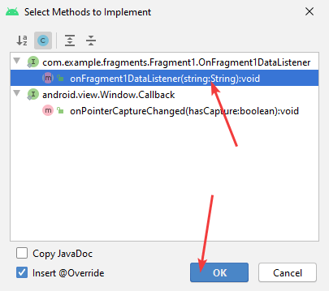

# Взаимодействие между фрагментами и активностью в Android Studio. Часть 3. Через интерфейсы

Третья часть серии статей про взаимодействие фрагментов и активности.

Все статьи цикла «Взаимодействие между фрагментами и активностью в Android Studio»:

- [Часть 1. Подготовка](https://github.com/Harrix/harrix.dev-blog-2017/blob/main/fragments-android-1/fragments-android-1.md)
- [Часть 2. Простые способы](https://github.com/Harrix/harrix.dev-blog-2017/blob/main/fragments-android-2/fragments-android-2.md)
- [Часть 3. Через интерфейсы](https://github.com/Harrix/harrix.dev-blog-2017/blob/main/fragments-android-3/fragments-android-3.md)
- [Часть 4. Через намерения](https://github.com/Harrix/harrix.dev-blog-2017/blob/main/fragments-android-4/fragments-android-4.md)
- [Часть 5. Несколько фрагментов](https://github.com/Harrix/harrix.dev-blog-2017/blob/main/fragments-android-5/fragments-android-5.md)

Предыдущая часть [Часть 2. Простые способы](https://github.com/Harrix/harrix.dev-blog-2017/blob/main/fragments-android-2/fragments-android-2.md).

## Критика

В предыдущей части мы показали способы передачи информации между активностью и фрагментом. Но они не есть хорошие (кроме примера с Bundle). Почему? Например, в последнем случае мы обращались из фрагмента напрямую к активности. А это означает, что мы фактически привязали фрагмент к нашей активности: в другой активности, где нет элемента `textView` фрагмент работать не будет.

Было бы лучше, чтобы фрагмент при клике кнопки отправил какой-нибудь сигнал в активность: «Я тут строчку считал. Отправляю тебе. А ты делай с ней, что хочешь». Дальше посмотрим, как это можно сделать.

Такие же проблемы в случае, когда мы из активности вызывали метод из фрагмента. А если бы в фрагменте не было нужного метода?

## Получаем информацию из фрагмента в активности при клике кнопки фрагмента

**Задача.** При нажатии на кнопку `buttonFragment1` в фрагменте текст из `editTextFragment1` фрагмента должен отобразится в поле `textView` активности.

В коде я откатываюсь к [точке сохранения 1](https://github.com/Harrix/harrix.dev-blog-2017/blob/main/fragments-android-1/fragments-android-1.md), про которую я говорил.

**Решение.** Будем использовать подход с использованием интерфейсов-слушателей. Его [рекомендует](https://developer.android.com/guide/components/fragments.html#CommunicatingWithActivity) сам Google.

В фрагменте определим интерфейс слушателя команд от нашего фрагмента:

```java
public interface OnFragment1DataListener {
    void onFragment1DataListener(String string);
}
```

Если фрагмент может отправлять несколько сигналов, то в этом интерфейсе будет несколько методов. Пока определим единственный метод, который произвольно назвали `onFragment1DataListener()`. Название интерфейса тоже можно выбрать другое.

Теперь в фрагменте объявим «объект» данного интерфейса:

```java
private OnFragment1DataListener mListener;
```

Для чего он нам нужен? Мы обяжем активность имплементировать наш интерфейс `OnFragment1DataListener`. Если какая-то другая активность, которая не имплементирует интерфейс, попытается запустить у себя наш фрагмент, то программа вылетит. Как это сделаем? У фрагмента есть метод `onAttach()`, который вызывается при присоединении фрагмента к активности. В нем и проверим есть ли у активности наш интерфейс. Если нет, то вызовем `RuntimeException`, которая прекратит работу программы.

В общем, у меня получилось так:

```java
@Override
public void onAttach(Context context) {
    super.onAttach(context);
    if (context instanceof OnFragment1DataListener) {
        mListener = (OnFragment1DataListener) context;
    } else {
        throw new RuntimeException(context.toString()
                + " must implement OnFragment1DataListener");
    }
}
```

В выделенной строчке видно, что мы из активности вытащили «объект» нашего интерфейса. То есть этот интерфейс принадлежит активности, а не фрагменту. Теперь мы в фрагменте можем обращаться к нашему объекту `mListener` и вызывать его метод `onFragment1DataListener()`. И этот вызов будет означать, что мы вызываем метод активности. Мы хотим послать сигнал активности в клике кнопки, так что вот так он будет выглядеть:

```java
buttonFragment1.setOnClickListener(new View.OnClickListener() {
    @Override
    public void onClick(View v) {
        String S = editTextFragment1.getText().toString();
        mListener.onFragment1DataListener(S);
    }
});
```

Итак, с фрагментом разобрались. Переходим к активности. Как говорили выше, мы обязываем активность имплементировать интерфейс из активности.

Было:

```java
public class MainActivity extends AppCompatActivity {
```

Стало:

```java
public class MainActivity extends AppCompatActivity implements Fragment1.OnFragment1DataListener {
```





Теперь всё легко. Просто прописываем в этом методе, то, что нужно сделать, когда придет сигнал из фрагмента, и данный метод активизируется:

```java
@Override
public void onFragment1DataListener(String string) {
    textView.setText(string);
}
```


Обратите внимание на то, что писать пришлось больше кода, но в своих приложениях лучше пользоваться этим методом:


---

**Полные коды файлов** <!-- !details -->

Полный код `MainActivity.java`:

```java
package com.example.fragments;

import androidx.appcompat.app.AppCompatActivity;
import androidx.fragment.app.Fragment;
import androidx.fragment.app.FragmentManager;

import android.os.Bundle;
import android.view.View;
import android.widget.Button;
import android.widget.EditText;
import android.widget.FrameLayout;
import android.widget.TextView;

public class MainActivity extends AppCompatActivity implements Fragment1.OnFragment1DataListener {

    private EditText editText;
    private TextView textView;
    private Button button;
    private FrameLayout fragmentContainer;
    private FrameLayout fragmentContainer2;

    @Override
    public void onFragment1DataListener(String string) {
        textView.setText(string);
    }

    @Override
    protected void onCreate(Bundle savedInstanceState) {
        super.onCreate(savedInstanceState);
        setContentView(R.layout.activity_main);

        editText = (EditText) findViewById(R.id.editText);
        textView = (TextView) findViewById(R.id.textView);
        button = (Button) findViewById(R.id.button);
        fragmentContainer = (FrameLayout) findViewById(R.id.fragmentContainer);
        fragmentContainer2 = (FrameLayout) findViewById(R.id.fragmentContainer2);

        button.setOnClickListener(new View.OnClickListener() {
            @Override
            public void onClick(View v) {

            }
        });

        FragmentManager fm = getSupportFragmentManager();

        Fragment fragment = fm.findFragmentById(R.id.fragmentContainer);
        if (fragment == null) {
            fragment = new Fragment1();
            fm.beginTransaction()
                    .add(R.id.fragmentContainer, fragment)
                    .commit();
        }
    }
}
```

Полный код `Fragment1.java`:

```java
package com.example.fragments;

import android.content.Context;
import android.os.Bundle;

import androidx.fragment.app.Fragment;

import android.view.LayoutInflater;
import android.view.View;
import android.view.ViewGroup;
import android.widget.Button;
import android.widget.EditText;
import android.widget.TextView;

public class Fragment1 extends Fragment {

    private EditText editTextFragment1;
    private TextView textViewFragment1;
    private Button buttonFragment1;

    private OnFragment1DataListener mListener;

    public Fragment1() {
    }

    public static Fragment1 newInstance(String param1, String param2) {
        Fragment1 fragment = new Fragment1();
        return fragment;
    }

    @Override
    public void onCreate(Bundle savedInstanceState) {
        super.onCreate(savedInstanceState);
    }

    public interface OnFragment1DataListener {
        void onFragment1DataListener(String string);
    }

    @Override
    public void onAttach(Context context) {
        super.onAttach(context);
        if (context instanceof OnFragment1DataListener) {
            mListener = (OnFragment1DataListener) context;
        } else {
            throw new RuntimeException(context.toString()
                    + " must implement OnFragment1DataListener");
        }
    }

    @Override
    public View onCreateView(LayoutInflater inflater, ViewGroup container,
                             Bundle savedInstanceState) {
        View view = inflater.inflate(R.layout.fragment_1, container, false);

        editTextFragment1 = (EditText) view.findViewById(R.id.editTextFragment1);
        textViewFragment1 = (TextView) view.findViewById(R.id.textViewFragment1);
        buttonFragment1 = (Button) view.findViewById(R.id.buttonFragment1);

        buttonFragment1.setOnClickListener(new View.OnClickListener() {
            @Override
            public void onClick(View v) {
                String S = editTextFragment1.getText().toString();
                mListener.onFragment1DataListener(S);
            }
        });

        return view;
    }
}
```

---

## Получаем информацию из активности в фрагменте при клике кнопки активности

**Задача.** При нажатии на кнопку `button` в главной активности текст из `editText` главной активности должен отобразится в поле `textViewFragment1` фрагмента.

В коде я откатываюсь к [точке сохранения 1](https://github.com/Harrix/harrix.dev-blog-2017/blob/main/fragments-android-1/fragments-android-1.md).

**Решение.** Применим тот же подход с интерфейсами, только наоборот. Мы теперь в активности поместим интерфейс, например, с именем `OnActivityDataListener` и создадим его экземпляр:

```java
public interface OnActivityDataListener {
    void onActivityDataListener(String string);
}

private OnActivityDataListener mListener;
```

При создании экземпляра фрагмента проверим, имплементирует ли он наш интерфейс. И вытащим «объект» интерфейса из фрагмента:

```java
Fragment fragment = fm.findFragmentById(R.id.fragmentContainer);
if (fragment == null) {
    fragment = new Fragment1();

    if (fragment instanceof OnActivityDataListener) {
        mListener = (OnActivityDataListener) fragment;
    } else {
        throw new RuntimeException(fragment.toString()
                + " must implement onActivityDataListener");
    }

    fm.beginTransaction()
            .add(R.id.fragmentContainer, fragment)
            .commit();
}
```


А в самом фрагменте нам потребуется имплементировать интерфейс из активности:

```java
public class Fragment1 extends Fragment implements MainActivity.OnActivityDataListener {
    ...
}
```

И реализовать метод `onActivityDataListener()`, который будет вызываться, когда активность захочет отправить сигнал в фрагмент:

```java
@Override
public void onActivityDataListener(String string) {
    textViewFragment1.setText(string);
}
```


И в клике кнопки активности реализуем вызов метода интерфейса:

```java
String S = editText.getText().toString();
mListener.onActivityDataListener(S);
```


---

**Полные коды файлов** <!-- !details -->

Полный код `MainActivity.java`:

```java
package com.example.fragments;

import androidx.appcompat.app.AppCompatActivity;
import androidx.fragment.app.Fragment;
import androidx.fragment.app.FragmentManager;

import android.os.Bundle;
import android.view.View;
import android.widget.Button;
import android.widget.EditText;
import android.widget.FrameLayout;
import android.widget.TextView;

public class MainActivity extends AppCompatActivity {

    private EditText editText;
    private TextView textView;
    private Button button;
    private FrameLayout fragmentContainer;
    private FrameLayout fragmentContainer2;

    @Override
    protected void onCreate(Bundle savedInstanceState) {
        super.onCreate(savedInstanceState);
        setContentView(R.layout.activity_main);

        editText = (EditText) findViewById(R.id.editText);
        textView = (TextView) findViewById(R.id.textView);
        button = (Button) findViewById(R.id.button);
        fragmentContainer = (FrameLayout) findViewById(R.id.fragmentContainer);
        fragmentContainer2 = (FrameLayout) findViewById(R.id.fragmentContainer2);

        button.setOnClickListener(new View.OnClickListener() {
            @Override
            public void onClick(View v) {
                String S = editText.getText().toString();
                mListener.onActivityDataListener(S);
            }
        });

        FragmentManager fm = getSupportFragmentManager();

        Fragment fragment = fm.findFragmentById(R.id.fragmentContainer);
        if (fragment == null) {
            fragment = new Fragment1();

            if (fragment instanceof OnActivityDataListener) {
                mListener = (OnActivityDataListener) fragment;
            } else {
                throw new RuntimeException(fragment.toString()
                        + " must implement onActivityDataListener");
            }

            fm.beginTransaction()
                    .add(R.id.fragmentContainer, fragment)
                    .commit();
        }
    }

    public interface OnActivityDataListener {
        void onActivityDataListener(String string);
    }

    private OnActivityDataListener mListener;
}
```

Полный код `Fragment1.java`:

```java
package com.example.fragments;

import android.os.Bundle;

import androidx.fragment.app.Fragment;

import android.view.LayoutInflater;
import android.view.View;
import android.view.ViewGroup;
import android.widget.Button;
import android.widget.EditText;
import android.widget.TextView;

public class Fragment1 extends Fragment implements MainActivity.OnActivityDataListener {

    private EditText editTextFragment1;
    private TextView textViewFragment1;
    private Button buttonFragment1;

    @Override
    public void onActivityDataListener(String string) {
        textViewFragment1.setText(string);
    }

    public Fragment1() {
    }

    public static Fragment1 newInstance(String param1, String param2) {
        Fragment1 fragment = new Fragment1();
        return fragment;
    }

    @Override
    public void onCreate(Bundle savedInstanceState) {
        super.onCreate(savedInstanceState);
    }

    @Override
    public View onCreateView(LayoutInflater inflater, ViewGroup container,
                             Bundle savedInstanceState) {
        View view = inflater.inflate(R.layout.fragment_1, container, false);

        editTextFragment1 = (EditText) view.findViewById(R.id.editTextFragment1);
        textViewFragment1 = (TextView) view.findViewById(R.id.textViewFragment1);
        buttonFragment1 = (Button) view.findViewById(R.id.buttonFragment1);

        buttonFragment1.setOnClickListener(new View.OnClickListener() {
            @Override
            public void onClick(View v) {

            }
        });

        return view;
    }
}
```

---

## Получаем информацию из фрагмента в активности при клике кнопки активности

**Задача.** При нажатии на кнопку `button` в активности текст из `editTextFragment1` фрагмента должен отобразится в поле `textView` активности.

В коде я откатываюсь к [точке сохранения 1](https://github.com/Harrix/harrix.dev-blog-2017/blob/main/fragments-android-1/fragments-android-1.md).

**Решение.** Тут ситуация посложнее. Нужно вначале в кнопке активности `button` отправить сигнал в фрагмент, что активность что-то хочет от фрагмента. Фрагмент в ответ считывает текст из `editTextFragment1` и отправляет свой сигнал в активность, которая при приеме выводит полученный текст в `textView`. То есть в нашем случае и у активности, и у фрагмента появятся интерфейсы.

То есть у нас будет объединение двух вышеприведенных примеров.

Будет только одно существенное отличие. В прошлых примерах интерфейсы определялись в самих классах активности и фрагмента. Сейчас такое не прокатит, так как произойдет циклическое наследование. Поэтому создадим два отдельных интерфейса:


Файл `OnFragment1DataListener.java`:

```java
package com.example.fragments;

public interface OnFragment1DataListener {
    void onFragment1DataListener(String string);
}
```

Файл `OnActivityDataListener.java`. Тут у нас нет параметров в методе, так как мы просто отправим сообщение фрагменту, что мы от него хотим получить текст:

```java
package com.example.fragments;

public interface OnActivityDataListener {
    void onActivityDataListener();
}
```


Не буду подробно расписывать дальнейшие шаги, а сразу приложу полные коды двух файлов.

---

**Полные коды файлов** <!-- !details -->

Файл `MainActivity.java`:

```java
package com.example.fragments;

import androidx.appcompat.app.AppCompatActivity;
import androidx.fragment.app.Fragment;
import androidx.fragment.app.FragmentManager;

import android.os.Bundle;
import android.view.View;
import android.widget.Button;
import android.widget.EditText;
import android.widget.FrameLayout;
import android.widget.TextView;

public class MainActivity extends AppCompatActivity implements OnFragment1DataListener {

    private EditText editText;
    private TextView textView;
    private Button button;
    private FrameLayout fragmentContainer;
    private FrameLayout fragmentContainer2;

    private OnActivityDataListener mListener;

    @Override
    public void onFragment1DataListener(String string) {
        textView.setText(string);
    }

    @Override
    protected void onCreate(Bundle savedInstanceState) {
        super.onCreate(savedInstanceState);
        setContentView(R.layout.activity_main);

        editText = (EditText) findViewById(R.id.editText);
        textView = (TextView) findViewById(R.id.textView);
        button = (Button) findViewById(R.id.button);
        fragmentContainer = (FrameLayout) findViewById(R.id.fragmentContainer);
        fragmentContainer2 = (FrameLayout) findViewById(R.id.fragmentContainer2);

        button.setOnClickListener(new View.OnClickListener() {
            @Override
            public void onClick(View v) {
                mListener.onActivityDataListener();
            }
        });

        FragmentManager fm = getSupportFragmentManager();

        Fragment fragment = fm.findFragmentById(R.id.fragmentContainer);
        if (fragment == null) {
            fragment = new Fragment1();

            if (fragment instanceof OnActivityDataListener) {
                mListener = (OnActivityDataListener) fragment;
            } else {
                throw new RuntimeException(fragment.toString()
                        + " must implement onActivityDataListener");
            }

            fm.beginTransaction()
                    .add(R.id.fragmentContainer, fragment)
                    .commit();
        }
    }
}
```

Файл `Fragment1.java`:

```java
package com.example.fragments;

import android.content.Context;
import android.os.Bundle;

import androidx.fragment.app.Fragment;

import android.view.LayoutInflater;
import android.view.View;
import android.view.ViewGroup;
import android.widget.Button;
import android.widget.EditText;
import android.widget.TextView;

public class Fragment1 extends Fragment implements OnActivityDataListener {

    private EditText editTextFragment1;
    private TextView textViewFragment1;
    private Button buttonFragment1;

    private OnFragment1DataListener mListener;

    @Override
    public void onActivityDataListener() {
        String S = editTextFragment1.getText().toString();
        mListener.onFragment1DataListener(S);
    }

    @Override
    public void onAttach(Context context) {
        super.onAttach(context);
        if (context instanceof OnFragment1DataListener) {
            mListener = (OnFragment1DataListener) context;
        } else {
            throw new RuntimeException(context.toString()
                    + " must implement OnFragment1DataListener");
        }
    }

    public Fragment1() {
    }

    public static Fragment1 newInstance(String param1, String param2) {
        Fragment1 fragment = new Fragment1();
        return fragment;
    }

    @Override
    public void onCreate(Bundle savedInstanceState) {
        super.onCreate(savedInstanceState);
    }

    @Override
    public View onCreateView(LayoutInflater inflater, ViewGroup container,
                             Bundle savedInstanceState) {
        View view = inflater.inflate(R.layout.fragment_1, container, false);

        editTextFragment1 = (EditText) view.findViewById(R.id.editTextFragment1);
        textViewFragment1 = (TextView) view.findViewById(R.id.textViewFragment1);
        buttonFragment1 = (Button) view.findViewById(R.id.buttonFragment1);

        buttonFragment1.setOnClickListener(new View.OnClickListener() {
            @Override
            public void onClick(View v) {

            }
        });

        return view;
    }
}
```

---

Получившийся результат:


## Получаем информацию из активности в фрагменте при клике кнопки фрагмента

**Задача.** При нажатии на кнопку `buttonFragment1` в фрагменте текст из `editText` главной активности должен отобразится в поле `textViewFragment1` фрагмента.

**Решение.** Поступаем аналогично. Только наши интерфейсы поменяются и методы их реализующие.

Файл `OnFragment1DataListener.java`:

```java
package com.example.fragments;

public interface OnFragment1DataListener {
    void onFragment1DataListener();
}
```

Файл `OnActivityDataListener.java`:

```java
package com.example.fragments;

public interface OnActivityDataListener {
    void onActivityDataListener(String string);
}
```

---

**Полные коды файлов** <!-- !details -->

Файл `MainActivity.java`:

```java
package com.example.fragments;

import androidx.appcompat.app.AppCompatActivity;
import androidx.fragment.app.Fragment;
import androidx.fragment.app.FragmentManager;

import android.os.Bundle;
import android.view.View;
import android.widget.Button;
import android.widget.EditText;
import android.widget.FrameLayout;
import android.widget.TextView;

public class MainActivity extends AppCompatActivity implements OnFragment1DataListener {

    private EditText editText;
    private TextView textView;
    private Button button;
    private FrameLayout fragmentContainer;
    private FrameLayout fragmentContainer2;

    private OnActivityDataListener mListener;

    @Override
    public void onFragment1DataListener() {
        String S = editText.getText().toString();
        mListener.onActivityDataListener(S);
    }

    @Override
    protected void onCreate(Bundle savedInstanceState) {
        super.onCreate(savedInstanceState);
        setContentView(R.layout.activity_main);

        editText = (EditText) findViewById(R.id.editText);
        textView = (TextView) findViewById(R.id.textView);
        button = (Button) findViewById(R.id.button);
        fragmentContainer = (FrameLayout) findViewById(R.id.fragmentContainer);
        fragmentContainer2 = (FrameLayout) findViewById(R.id.fragmentContainer2);

        button.setOnClickListener(new View.OnClickListener() {
            @Override
            public void onClick(View v) {

            }
        });

        FragmentManager fm = getSupportFragmentManager();

        Fragment fragment = fm.findFragmentById(R.id.fragmentContainer);
        if (fragment == null) {
            fragment = new Fragment1();

            if (fragment instanceof OnActivityDataListener) {
                mListener = (OnActivityDataListener) fragment;
            } else {
                throw new RuntimeException(fragment.toString()
                        + " must implement onActivityDataListener");
            }

            fm.beginTransaction()
                    .add(R.id.fragmentContainer, fragment)
                    .commit();
        }
    }
}
```

Файл `Fragment1.java`:

```java
package com.example.fragments;

import android.content.Context;
import android.os.Bundle;

import androidx.fragment.app.Fragment;

import android.view.LayoutInflater;
import android.view.View;
import android.view.ViewGroup;
import android.widget.Button;
import android.widget.EditText;
import android.widget.TextView;

public class Fragment1 extends Fragment implements OnActivityDataListener {

    private EditText editTextFragment1;
    private TextView textViewFragment1;
    private Button buttonFragment1;

    private OnFragment1DataListener mListener;

    @Override
    public void onActivityDataListener(String string) {
        textViewFragment1.setText(string);
    }

    @Override
    public void onAttach(Context context) {
        super.onAttach(context);
        if (context instanceof OnFragment1DataListener) {
            mListener = (OnFragment1DataListener) context;
        } else {
            throw new RuntimeException(context.toString()
                    + " must implement OnFragment1DataListener");
        }
    }

    public Fragment1() {
    }

    public static Fragment1 newInstance(String param1, String param2) {
        Fragment1 fragment = new Fragment1();
        return fragment;
    }

    @Override
    public void onCreate(Bundle savedInstanceState) {
        super.onCreate(savedInstanceState);
    }

    @Override
    public View onCreateView(LayoutInflater inflater, ViewGroup container,
                             Bundle savedInstanceState) {
        View view = inflater.inflate(R.layout.fragment_1, container, false);

        editTextFragment1 = (EditText) view.findViewById(R.id.editTextFragment1);
        textViewFragment1 = (TextView) view.findViewById(R.id.textViewFragment1);
        buttonFragment1 = (Button) view.findViewById(R.id.buttonFragment1);

        buttonFragment1.setOnClickListener(new View.OnClickListener() {
            @Override
            public void onClick(View v) {
                mListener.onFragment1DataListener();
            }
        });

        return view;
    }
}
```

---

Получившийся результат:


Как видите, писать приходится гораздо больше, чем в вариантах из предыдущей статьи, но зато теперь активности и фрагменты представляют собой самостоятельные единицы, которые могут существовать друг без друга и могут быть заменены другими.

Следующая часть [Часть 4. Через намерения](https://github.com/Harrix/harrix.dev-blog-2017/blob/main/fragments-android-4/fragments-android-4.md).
