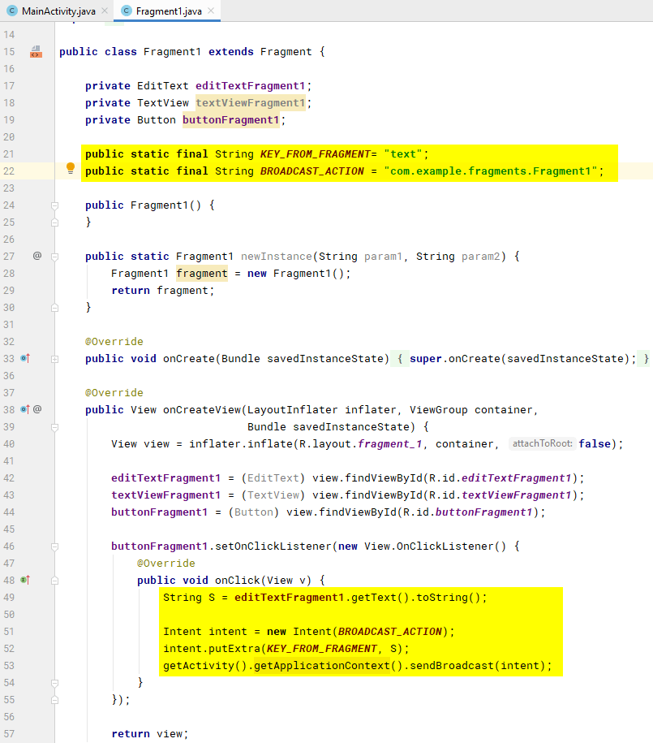
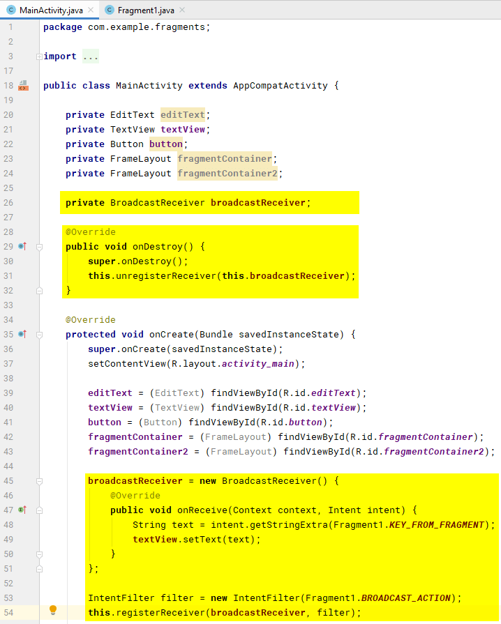

# Взаимодействие между фрагментами и активностью в Android Studio. Часть 4. Через намерения

Четвертая часть серии статей про взаимодействие фрагментов и активности.

Все статьи цикла «Взаимодействие между фрагментами и активностью в Android Studio»:

- [Часть 1. Подготовка](https://github.com/Harrix/harrix.dev-blog-2017/blob/main/fragments-android-1/fragments-android-1.md)
- [Часть 2. Простые способы](https://github.com/Harrix/harrix.dev-blog-2017/blob/main/fragments-android-2/fragments-android-2.md)
- [Часть 3. Через интерфейсы](https://github.com/Harrix/harrix.dev-blog-2017/blob/main/fragments-android-3/fragments-android-3.md)
- [Часть 4. Через намерения](https://github.com/Harrix/harrix.dev-blog-2017/blob/main/fragments-android-4/fragments-android-4.md)
- [Часть 5. Несколько фрагментов](https://github.com/Harrix/harrix.dev-blog-2017/blob/main/fragments-android-5/fragments-android-5.md)

Предыдущая часть [Часть 3. Через интерфейсы](https://github.com/Harrix/harrix.dev-blog-2017/blob/main/fragments-android-3/fragments-android-3.md).

## Введение

В [части 2](https://github.com/Harrix/harrix.dev-blog-2017/blob/main/fragments-android-2/fragments-android-2.md) были рассмотрены простые способы взаимодействия между активностью и фрагментом. Но их лучше (кроме первого) никогда не использовать.

В [части 3](https://github.com/Harrix/harrix.dev-blog-2017/blob/main/fragments-android-3/fragments-android-3.md) были описаны рекомендованные способы через создание слушателей в виде интерфейсов. Но там прописывается много кода и легко запутаться в переплетениях отправках сигналов.

Можно воспользоваться мощным механизмом намерений (`Intent`). Сразу предупреждаю, что этот способ из разряда «пушки по воробьям»: мы будем сообщения из фрагментов перекидывать через широковещательные сообщения Android. Это очень не хороший способ, но он имеет право на жизнь. Но лучше воспользоваться слушателями-интерфейсами.

## Получаем информацию из фрагмента в активности при клике кнопки фрагмента

**Задача.** При нажатии на кнопку `buttonFragment1` в фрагменте текст из `editTextFragment1` фрагмента должен отобразится в поле `textView` активности.

В коде я откатываюсь к [точке сохранения 1](https://github.com/Harrix/harrix.dev-blog-2017/blob/main/fragments-android-1/fragments-android-1.md), про которую я говорил.

**Решение.** Будем использовать отправку намерений. Фрагмент будет формировать `Intent`, а активность будет ловить сигнал.

Вначале займемся фрагментом, откуда мы будем отправлять наш сигнал-намерение. В клике кнопки пропишем следующий код:

```java
String S = editTextFragment1.getText().toString();

Intent intent = new Intent(BROADCAST_ACTION);
intent.putExtra(KEY_FROM_FRAGMENT, S);
getActivity().getApplicationContext().sendBroadcast(intent);
```

`KEY_FROM_FRAGMENT` — это статическая константа, которая означает название поля, которое закидываем в Intent:

```java
public static final String KEY_FROM_FRAGMENT= "text";
```

`BROADCAST_ACTION` — это статическая константа, которая позволит нам идентифицировать сигнал. Почему она в отличии от предыдущей так сложно написана? Мы отправляем Intent как широковещательное сообщение. Сообщений в Android много разными сервисами и приложениями. И мало ли как они называют свои намерения. Чтобы не произошло накладок, то в значении переменной используем название пакета приложения (у вас оно будет скорее всего своё):

```java
public static final String BROADCAST_ACTION = "com.example.fragments.Fragment1";
```



Перейдем к активности. Там объявим переменную приемника сообщений:

```java
private BroadcastReceiver broadcastReceiver;
```

В методе `onCreate()` активности создадим экземпляр приемника. После укажем приемнику фильтр сообщений через `BROADCAST_ACTION`. И зарегистрируем приемник в Android:

```java
broadcastReceiver = new BroadcastReceiver() {
    @Override
    public void onReceive(Context context, Intent intent) {
    }
};

IntentFilter filter = new IntentFilter(Fragment1.BROADCAST_ACTION);
this.registerReceiver(broadcastReceiver, filter);
```

Не забудем, что нужно приемник будет разрегистрировать:

```java
@Override
public void onDestroy() {
    super.onDestroy();
    this.unregisterReceiver(this.broadcastReceiver);
}
```

И теперь можем в методе `onReceive()` прописать код для вытаскивания текста из намерения и вывода текста в `textView`:

```java
broadcastReceiver = new BroadcastReceiver() {
    @Override
    public void onReceive(Context context, Intent intent) {
        String text = intent.getStringExtra(Fragment1.KEY_FROM_FRAGMENT);
        textView.setText(text);
    }
};
```



---

**Полные коды файлов** <!-- !details -->

Полный код `MainActivity.java`:

```java
package com.example.fragments;

import androidx.appcompat.app.AppCompatActivity;
import androidx.fragment.app.Fragment;
import androidx.fragment.app.FragmentManager;

import android.content.BroadcastReceiver;
import android.content.Context;
import android.content.Intent;
import android.content.IntentFilter;
import android.os.Bundle;
import android.view.View;
import android.widget.Button;
import android.widget.EditText;
import android.widget.FrameLayout;
import android.widget.TextView;

public class MainActivity extends AppCompatActivity {

    private EditText editText;
    private TextView textView;
    private Button button;
    private FrameLayout fragmentContainer;
    private FrameLayout fragmentContainer2;

    private BroadcastReceiver broadcastReceiver;

    @Override
    public void onDestroy() {
        super.onDestroy();
        this.unregisterReceiver(this.broadcastReceiver);
    }

    @Override
    protected void onCreate(Bundle savedInstanceState) {
        super.onCreate(savedInstanceState);
        setContentView(R.layout.activity_main);

        editText = (EditText) findViewById(R.id.editText);
        textView = (TextView) findViewById(R.id.textView);
        button = (Button) findViewById(R.id.button);
        fragmentContainer = (FrameLayout) findViewById(R.id.fragmentContainer);
        fragmentContainer2 = (FrameLayout) findViewById(R.id.fragmentContainer2);

        broadcastReceiver = new BroadcastReceiver() {
            @Override
            public void onReceive(Context context, Intent intent) {
                String text = intent.getStringExtra(Fragment1.KEY_FROM_FRAGMENT);
                textView.setText(text);
            }
        };

        IntentFilter filter = new IntentFilter(Fragment1.BROADCAST_ACTION);
        this.registerReceiver(broadcastReceiver, filter);

        button.setOnClickListener(new View.OnClickListener() {
            @Override
            public void onClick(View v) {

            }
        });

        FragmentManager fm = getSupportFragmentManager();

        Fragment fragment = fm.findFragmentById(R.id.fragmentContainer);
        if (fragment == null) {
            fragment = new Fragment1();
            fm.beginTransaction()
                    .add(R.id.fragmentContainer, fragment)
                    .commit();
        }
    }
}
```

Полный код `Fragment1.java`:

```java
package com.example.fragments;

import android.content.Intent;
import android.os.Bundle;

import androidx.fragment.app.Fragment;

import android.view.LayoutInflater;
import android.view.View;
import android.view.ViewGroup;
import android.widget.Button;
import android.widget.EditText;
import android.widget.TextView;

public class Fragment1 extends Fragment {

    private EditText editTextFragment1;
    private TextView textViewFragment1;
    private Button buttonFragment1;

    public static final String KEY_FROM_FRAGMENT = "text";
    public static final String BROADCAST_ACTION = "com.example.fragments.Fragment1";

    public Fragment1() {
    }

    public static Fragment1 newInstance(String param1, String param2) {
        Fragment1 fragment = new Fragment1();
        return fragment;
    }

    @Override
    public void onCreate(Bundle savedInstanceState) {
        super.onCreate(savedInstanceState);
    }

    @Override
    public View onCreateView(LayoutInflater inflater, ViewGroup container,
                             Bundle savedInstanceState) {
        View view = inflater.inflate(R.layout.fragment_1, container, false);

        editTextFragment1 = (EditText) view.findViewById(R.id.editTextFragment1);
        textViewFragment1 = (TextView) view.findViewById(R.id.textViewFragment1);
        buttonFragment1 = (Button) view.findViewById(R.id.buttonFragment1);

        buttonFragment1.setOnClickListener(new View.OnClickListener() {
            @Override
            public void onClick(View v) {
                String S = editTextFragment1.getText().toString();

                Intent intent = new Intent(BROADCAST_ACTION);
                intent.putExtra(KEY_FROM_FRAGMENT, S);
                getActivity().getApplicationContext().sendBroadcast(intent);
            }
        });

        return view;
    }
}
```

---

Получившийся результат:


## Получаем информацию из активности в фрагменте при клике кнопки активности

**Задача.** При нажатии на кнопку `button` в главной активности текст из `editText` главной активности должен отобразится в поле `textViewFragment1` фрагмента.

В коде я откатываюсь к [точке сохранения 1](https://github.com/Harrix/harrix.dev-blog-2017/blob/main/fragments-android-1/fragments-android-1.md).

**Решение.** Применим тот же подход с намерениями, только наоборот.

Сразу приведу коды файлов.

---

**Полные коды файлов** <!-- !details -->

Полный код `MainActivity.java`:

```java
package com.example.fragments;

import androidx.appcompat.app.AppCompatActivity;
import androidx.fragment.app.Fragment;
import androidx.fragment.app.FragmentManager;

import android.content.Intent;
import android.os.Bundle;
import android.view.View;
import android.widget.Button;
import android.widget.EditText;
import android.widget.FrameLayout;
import android.widget.TextView;

public class MainActivity extends AppCompatActivity {

    private EditText editText;
    private TextView textView;
    private Button button;
    private FrameLayout fragmentContainer;
    private FrameLayout fragmentContainer2;

    public static final String KEY_FROM_ACTIVITY = "text";
    public static final String BROADCAST_ACTION = "com.example.fragments.Activity";

    @Override
    protected void onCreate(Bundle savedInstanceState) {
        super.onCreate(savedInstanceState);
        setContentView(R.layout.activity_main);

        editText = (EditText) findViewById(R.id.editText);
        textView = (TextView) findViewById(R.id.textView);
        button = (Button) findViewById(R.id.button);
        fragmentContainer = (FrameLayout) findViewById(R.id.fragmentContainer);
        fragmentContainer2 = (FrameLayout) findViewById(R.id.fragmentContainer2);

        button.setOnClickListener(new View.OnClickListener() {
            @Override
            public void onClick(View v) {
                String S = editText.getText().toString();

                Intent intent = new Intent(BROADCAST_ACTION);
                intent.putExtra(KEY_FROM_ACTIVITY, S);
                getApplicationContext().sendBroadcast(intent);
            }
        });

        FragmentManager fm = getSupportFragmentManager();

        Fragment fragment = fm.findFragmentById(R.id.fragmentContainer);
        if (fragment == null) {
            fragment = new Fragment1();
            fm.beginTransaction()
                    .add(R.id.fragmentContainer, fragment)
                    .commit();
        }
    }
}
```

Полный код `Fragment1.java`:

```java
package com.example.fragments;

import android.content.BroadcastReceiver;
import android.content.Context;
import android.content.Intent;
import android.content.IntentFilter;
import android.os.Bundle;

import androidx.fragment.app.Fragment;

import android.view.LayoutInflater;
import android.view.View;
import android.view.ViewGroup;
import android.widget.Button;
import android.widget.EditText;
import android.widget.TextView;

public class Fragment1 extends Fragment {

    private EditText editTextFragment1;
    private TextView textViewFragment1;
    private Button buttonFragment1;

    private BroadcastReceiver broadcastReceiver;

    public Fragment1() {
    }

    public static Fragment1 newInstance(String param1, String param2) {
        Fragment1 fragment = new Fragment1();
        return fragment;
    }

    @Override
    public void onCreate(Bundle savedInstanceState) {
        super.onCreate(savedInstanceState);
    }

    @Override
    public View onCreateView(LayoutInflater inflater, ViewGroup container,
                             Bundle savedInstanceState) {
        View view = inflater.inflate(R.layout.fragment_1, container, false);

        editTextFragment1 = (EditText) view.findViewById(R.id.editTextFragment1);
        textViewFragment1 = (TextView) view.findViewById(R.id.textViewFragment1);
        buttonFragment1 = (Button) view.findViewById(R.id.buttonFragment1);

        buttonFragment1.setOnClickListener(new View.OnClickListener() {
            @Override
            public void onClick(View v) {

            }
        });

        broadcastReceiver = new BroadcastReceiver() {
            @Override
            public void onReceive(Context context, Intent intent) {
                String text = intent.getStringExtra(MainActivity.KEY_FROM_ACTIVITY);
                textViewFragment1.setText(text);
            }
        };

        IntentFilter filter = new IntentFilter(MainActivity.BROADCAST_ACTION);
        getActivity().getApplicationContext().registerReceiver(broadcastReceiver, filter);

        return view;
    }

    @Override
    public void onDestroyView() {
        super.onDestroyView();
        getActivity().getApplicationContext().unregisterReceiver(this.broadcastReceiver);
    }
}
```

---

Получившийся результат:


## Получаем информацию из фрагмента в активности при клике кнопки активности

**Задача.** При нажатии на кнопку `button` в активности текст из `editTextFragment1` фрагмента должен отобразится в поле `textView` активности.

В коде я откатываюсь к [точке сохранения 1](https://github.com/Harrix/harrix.dev-blog-2017/blob/main/fragments-android-1/fragments-android-1.md).

**Решение.** Тут ситуация посложнее. Нужно вначале в кнопке активности `button` отправить сигнал в фрагмент (отправим пустое намерение), что активность что-то хочет от фрагмента. Фрагмент в ответ считывает текст из `editTextFragment1` и отправляет свой сигнал в активность, которая при приеме выводит полученный текст в `textView`.

То есть у нас будет объединение двух вышеприведенных примеров.

Сразу привожу коды файлов.

---

**Полные коды файлов** <!-- !details -->

Полный код `MainActivity.java`:

```java
package com.example.fragments;

import androidx.appcompat.app.AppCompatActivity;
import androidx.fragment.app.Fragment;
import androidx.fragment.app.FragmentManager;

import android.content.BroadcastReceiver;
import android.content.Context;
import android.content.Intent;
import android.content.IntentFilter;
import android.os.Bundle;
import android.view.View;
import android.widget.Button;
import android.widget.EditText;
import android.widget.FrameLayout;
import android.widget.TextView;

public class MainActivity extends AppCompatActivity {

    private EditText editText;
    private TextView textView;
    private Button button;
    private FrameLayout fragmentContainer;
    private FrameLayout fragmentContainer2;

    private BroadcastReceiver broadcastReceiverActivity;

    public static final String BROADCAST_ACTION = "com.example.fragments.Activity";

    @Override
    protected void onCreate(Bundle savedInstanceState) {
        super.onCreate(savedInstanceState);
        setContentView(R.layout.activity_main);

        editText = (EditText) findViewById(R.id.editText);
        textView = (TextView) findViewById(R.id.textView);
        button = (Button) findViewById(R.id.button);
        fragmentContainer = (FrameLayout) findViewById(R.id.fragmentContainer);
        fragmentContainer2 = (FrameLayout) findViewById(R.id.fragmentContainer2);

        button.setOnClickListener(new View.OnClickListener() {
            @Override
            public void onClick(View v) {
                Intent intent = new Intent(BROADCAST_ACTION);
                getApplicationContext().sendBroadcast(intent);
            }
        });

        FragmentManager fm = getSupportFragmentManager();

        Fragment fragment = fm.findFragmentById(R.id.fragmentContainer);
        if (fragment == null) {
            fragment = new Fragment1();
            fm.beginTransaction()
                    .add(R.id.fragmentContainer, fragment)
                    .commit();
        }

        broadcastReceiverActivity = new BroadcastReceiver() {
            @Override
            public void onReceive(Context context, Intent intent) {
                String text = intent.getStringExtra(Fragment1.KEY_FROM_FRAGMENT);
                textView.setText(text);
            }
        };

        IntentFilter filter = new IntentFilter(Fragment1.BROADCAST_ACTION);
        this.registerReceiver(broadcastReceiverActivity, filter);
    }

    @Override
    public void onDestroy() {
        super.onDestroy();
        this.unregisterReceiver(this.broadcastReceiverActivity);
    }
}
```

Полный код `Fragment1.java`:

```java
package com.example.fragments;

import android.content.BroadcastReceiver;
import android.content.Context;
import android.content.Intent;
import android.content.IntentFilter;
import android.os.Bundle;

import androidx.fragment.app.Fragment;

import android.view.LayoutInflater;
import android.view.View;
import android.view.ViewGroup;
import android.widget.Button;
import android.widget.EditText;
import android.widget.TextView;

public class Fragment1 extends Fragment {

    private EditText editTextFragment1;
    private TextView textViewFragment1;
    private Button buttonFragment1;

    private BroadcastReceiver broadcastReceiver;

    public static final String KEY_FROM_FRAGMENT = "text";
    public static final String BROADCAST_ACTION = "com.example.fragments.Fragment1";

    public Fragment1() {
    }

    public static Fragment1 newInstance(String param1, String param2) {
        Fragment1 fragment = new Fragment1();
        return fragment;
    }

    @Override
    public void onCreate(Bundle savedInstanceState) {
        super.onCreate(savedInstanceState);
    }

    @Override
    public View onCreateView(LayoutInflater inflater, ViewGroup container,
                             Bundle savedInstanceState) {
        View view = inflater.inflate(R.layout.fragment_1, container, false);

        editTextFragment1 = (EditText) view.findViewById(R.id.editTextFragment1);
        textViewFragment1 = (TextView) view.findViewById(R.id.textViewFragment1);
        buttonFragment1 = (Button) view.findViewById(R.id.buttonFragment1);

        buttonFragment1.setOnClickListener(new View.OnClickListener() {
            @Override
            public void onClick(View v) {

            }
        });

        broadcastReceiver = new BroadcastReceiver() {
            @Override
            public void onReceive(Context context, Intent intent) {
                String S = editTextFragment1.getText().toString();

                Intent intentToActivity = new Intent(BROADCAST_ACTION);
                intentToActivity.putExtra(KEY_FROM_FRAGMENT, S);
                getActivity().getApplicationContext().sendBroadcast(intentToActivity);
            }
        };

        IntentFilter filter = new IntentFilter(MainActivity.BROADCAST_ACTION);
        getActivity().getApplicationContext().registerReceiver(broadcastReceiver, filter);

        return view;
    }
}
```

---

Получившийся результат:


## Получаем информацию из активности в фрагменте при клике кнопки фрагмента

**Задача.** При нажатии на кнопку `buttonFragment1` в фрагменте текст из `editText` главной активности должен отобразится в поле `textViewFragment1` фрагмента.

**Решение.** Поступаем аналогично. Только наши Intent по своему содержимому поменяются и коды обработки приемников.

Сразу привожу полные коды файлов.

---

**Полные коды файлов** <!-- !details -->

Полный код `MainActivity.java`:

```java
package com.example.fragments;

import androidx.appcompat.app.AppCompatActivity;
import androidx.fragment.app.Fragment;
import androidx.fragment.app.FragmentManager;

import android.content.BroadcastReceiver;
import android.content.Context;
import android.content.Intent;
import android.content.IntentFilter;
import android.os.Bundle;
import android.view.View;
import android.widget.Button;
import android.widget.EditText;
import android.widget.FrameLayout;
import android.widget.TextView;

public class MainActivity extends AppCompatActivity {

    private EditText editText;
    private TextView textView;
    private Button button;
    private FrameLayout fragmentContainer;
    private FrameLayout fragmentContainer2;

    private BroadcastReceiver broadcastReceiver;

    public static final String KEY_FROM_ACTIVITY = "text";
    public static final String BROADCAST_ACTION = "com.example.fragments.Activity";

    @Override
    protected void onCreate(Bundle savedInstanceState) {
        super.onCreate(savedInstanceState);
        setContentView(R.layout.activity_main);

        editText = (EditText) findViewById(R.id.editText);
        textView = (TextView) findViewById(R.id.textView);
        button = (Button) findViewById(R.id.button);
        fragmentContainer = (FrameLayout) findViewById(R.id.fragmentContainer);
        fragmentContainer2 = (FrameLayout) findViewById(R.id.fragmentContainer2);

        button.setOnClickListener(new View.OnClickListener() {
            @Override
            public void onClick(View v) {

            }
        });

        FragmentManager fm = getSupportFragmentManager();

        Fragment fragment = fm.findFragmentById(R.id.fragmentContainer);
        if (fragment == null) {
            fragment = new Fragment1();
            fm.beginTransaction()
                    .add(R.id.fragmentContainer, fragment)
                    .commit();
        }

        broadcastReceiver = new BroadcastReceiver() {
            @Override
            public void onReceive(Context context, Intent intent) {
                String S = editText.getText().toString();

                Intent intentToFragment = new Intent(BROADCAST_ACTION);
                intentToFragment.putExtra(KEY_FROM_ACTIVITY, S);
                getApplicationContext().sendBroadcast(intentToFragment);
            }
        };

        IntentFilter filter = new IntentFilter(Fragment1.BROADCAST_ACTION);
        this.registerReceiver(broadcastReceiver, filter);
    }
}
```

Полный код `Fragment1.java`:

```java
package com.example.fragments;

import android.content.BroadcastReceiver;
import android.content.Context;
import android.content.Intent;
import android.content.IntentFilter;
import android.os.Bundle;

import androidx.fragment.app.Fragment;

import android.view.LayoutInflater;
import android.view.View;
import android.view.ViewGroup;
import android.widget.Button;
import android.widget.EditText;
import android.widget.TextView;

public class Fragment1 extends Fragment {

    private EditText editTextFragment1;
    private TextView textViewFragment1;
    private Button buttonFragment1;

    private BroadcastReceiver broadcastReceiver;

    public static final String BROADCAST_ACTION = "com.example.fragments.Fragment1";

    public Fragment1() {
    }

    public static Fragment1 newInstance(String param1, String param2) {
        Fragment1 fragment = new Fragment1();
        return fragment;
    }

    @Override
    public void onCreate(Bundle savedInstanceState) {
        super.onCreate(savedInstanceState);
    }

    @Override
    public View onCreateView(LayoutInflater inflater, ViewGroup container,
                             Bundle savedInstanceState) {
        View view = inflater.inflate(R.layout.fragment_1, container, false);

        editTextFragment1 = (EditText) view.findViewById(R.id.editTextFragment1);
        textViewFragment1 = (TextView) view.findViewById(R.id.textViewFragment1);
        buttonFragment1 = (Button) view.findViewById(R.id.buttonFragment1);

        buttonFragment1.setOnClickListener(new View.OnClickListener() {
            @Override
            public void onClick(View v) {
                Intent intentToActivity = new Intent(BROADCAST_ACTION);
                getActivity().getApplicationContext().sendBroadcast(intentToActivity);
            }
        });

        broadcastReceiver = new BroadcastReceiver() {
            @Override
            public void onReceive(Context context, Intent intent) {
                String text = intent.getStringExtra("text");
                textViewFragment1.setText(text);
            }
        };

        IntentFilter filter = new IntentFilter(MainActivity.BROADCAST_ACTION);
        getActivity().getApplicationContext().registerReceiver(broadcastReceiver, filter);

        return view;
    }

    @Override
    public void onDestroyView() {
        super.onDestroyView();
        getActivity().getApplicationContext().unregisterReceiver(this.broadcastReceiver);
    }
}
```

---

Получившийся результат:


Следующая часть [Часть 5. Несколько фрагментов](https://github.com/Harrix/harrix.dev-blog-2017/blob/main/fragments-android-5/fragments-android-5.md).
