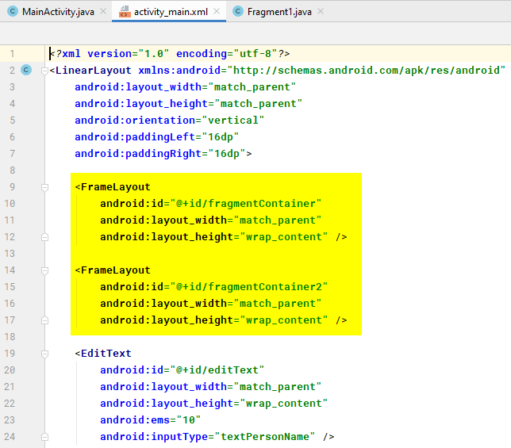

# Взаимодействие между фрагментами и активностью в Android Studio. Часть 5. Несколько фрагментов


Четвертая часть серии статей про взаимодействие фрагментов и активности.

Все статьи цикла «Взаимодействие между фрагментами и активностью в Android Studio»:

- [Часть 1. Подготовка](https://github.com/Harrix/harrix.dev-blog-2017/blob/main/fragments-android-1/fragments-android-1.md) <!-- https://harrix.dev/ru/blog/2017/fragments-android-1/ -->
- [Часть 2. Простые способы](https://github.com/Harrix/harrix.dev-blog-2017/blob/main/fragments-android-2/fragments-android-2.md) <!-- https://harrix.dev/ru/blog/2017/fragments-android-2/ -->
- [Часть 3. Через интерфейсы](https://github.com/Harrix/harrix.dev-blog-2017/blob/main/fragments-android-3/fragments-android-3.md) <!-- https://harrix.dev/ru/blog/2017/fragments-android-3/ -->
- [Часть 4. Через намерения](https://github.com/Harrix/harrix.dev-blog-2017/blob/main/fragments-android-4/fragments-android-4.md) <!-- https://harrix.dev/ru/blog/2017/fragments-android-4/ -->
- [Часть 5. Несколько фрагментов](https://github.com/Harrix/harrix.dev-blog-2017/blob/main/fragments-android-5/fragments-android-5.md) <!-- https://harrix.dev/ru/blog/2017/fragments-android-5/ -->

Предыдущая часть [Часть 4. Через намерения](https://github.com/Harrix/harrix.dev-blog-2017/blob/main/fragments-android-4/fragments-android-4.md) <!-- https://harrix.dev/ru/blog/2017/fragments-android-4/ -->.

## Введение

Если мы глянем в [официальную документацию](https://developer.android.com/training/basics/fragments/communicating.html), то увидим следующие строки:

> Often you will want one Fragment to communicate with another, for example to change the content based on a user event. All Fragment-to-Fragment communication is done through the associated Activity. Two Fragments should never communicate directly.

То есть все взаимодействия между фрагментами осуществляется через активность. Напрямую фрагменты никогда не должны общаться.

А разнообразные способы общения фрагментов с активностью были рассмотрены в предыдущих частях. Фактически, ничего нового дальше не будет — всё будет представлять собой комбинацию уже описанных взаимодействий.

И да. Помните в [первой части](https://github.com/Harrix/harrix.dev-blog-2017/blob/main/fragments-android-1/fragments-android-1.md) <!-- https://harrix.dev/ru/blog/2017/fragments-android-1/ --> мы создали три, а не один фрагмент. Пришло время про них вспомнить.

## Открываем фрагмент из другого фрагмента в другом контейнере. Простой способ

**Задача.** При нажатии на кнопку `buttonFragment1` в фрагменте `Fragment1` во втором контейнере `fragmentContainer2` активности откроется фрагмент `Fragment2`.

Напоминаю, что в главной активности у нас есть два контейнера для фрагментов. В первом из них `fragmentContainer` при старте приложения загружается `Fragment1`. Второй `fragmentContainer2` у нас пустой пока:



_Рисунок 1 — Два контейнера для размещения контейнеров_

В коде я откатываюсь к [точке сохранения 1](https://github.com/Harrix/harrix.dev-blog-2017/blob/main/fragments-android-1/fragments-android-1.md) <!-- https://harrix.dev/ru/blog/2017/fragments-android-1/ -->.

**Решение.** Мы в активности определим метод `openFragment2()`, который будем вызывать из фрагмента. Этот метод простой, но пользоваться им крайне **не рекомендую**!

Обратите внимание, что при создании транзакции `Fragment2` я еще добавил строчку `.setTransition(FragmentTransaction.TRANSIT_FRAGMENT_OPEN)`. Теперь второй фрагмент будет появляться с анимацией.

---

**Полные коды файлов** <!-- !details -->

Файл `MainActivity.java`:

```java
package com.example.fragments;

import androidx.appcompat.app.AppCompatActivity;
import androidx.fragment.app.Fragment;
import androidx.fragment.app.FragmentManager;
import androidx.fragment.app.FragmentTransaction;

import android.os.Bundle;
import android.view.View;
import android.widget.Button;
import android.widget.EditText;
import android.widget.FrameLayout;
import android.widget.TextView;

public class MainActivity extends AppCompatActivity {

    private EditText editText;
    private TextView textView;
    private Button button;
    private FrameLayout fragmentContainer;
    private FrameLayout fragmentContainer2;

    @Override
    protected void onCreate(Bundle savedInstanceState) {
        super.onCreate(savedInstanceState);
        setContentView(R.layout.activity_main);

        editText = (EditText) findViewById(R.id.editText);
        textView = (TextView) findViewById(R.id.textView);
        button = (Button) findViewById(R.id.button);
        fragmentContainer = (FrameLayout) findViewById(R.id.fragmentContainer);
        fragmentContainer2 = (FrameLayout) findViewById(R.id.fragmentContainer2);

        button.setOnClickListener(new View.OnClickListener() {
            @Override
            public void onClick(View v) {

            }
        });

        FragmentManager fm = getSupportFragmentManager();

        Fragment fragment = fm.findFragmentById(R.id.fragmentContainer);
        if (fragment == null) {
            fragment = new Fragment1();
            fm.beginTransaction()
                    .add(R.id.fragmentContainer, fragment)
                    .commit();
        }
    }

    public void openFragment2 () {
        FragmentManager fm = getSupportFragmentManager();

        Fragment fragment = fm.findFragmentById(R.id.fragmentContainer2);
        if (fragment == null) {
            fragment = new Fragment2();
            fm.beginTransaction()
                    .add(R.id.fragmentContainer2, fragment)
                    .setTransition(FragmentTransaction.TRANSIT_FRAGMENT_OPEN)
                    .commit();
        }
    }
}
```

Файл `Fragment1.java`:

```java
package com.example.fragments;

import android.os.Bundle;

import androidx.fragment.app.Fragment;

import android.view.LayoutInflater;
import android.view.View;
import android.view.ViewGroup;
import android.widget.Button;
import android.widget.EditText;
import android.widget.TextView;

public class Fragment1 extends Fragment {

    private EditText editTextFragment1;
    private TextView textViewFragment1;
    private Button buttonFragment1;

    public Fragment1() {
    }

    public static Fragment1 newInstance(String param1, String param2) {
        Fragment1 fragment = new Fragment1();
        return fragment;
    }

    @Override
    public void onCreate(Bundle savedInstanceState) {
        super.onCreate(savedInstanceState);
    }

    @Override
    public View onCreateView(LayoutInflater inflater, ViewGroup container,
                             Bundle savedInstanceState) {
        View view = inflater.inflate(R.layout.fragment_1, container, false);

        editTextFragment1 = (EditText) view.findViewById(R.id.editTextFragment1);
        textViewFragment1 = (TextView) view.findViewById(R.id.textViewFragment1);
        buttonFragment1 = (Button) view.findViewById(R.id.buttonFragment1);

        buttonFragment1.setOnClickListener(new View.OnClickListener() {
            @Override
            public void onClick(View v) {
                ((MainActivity)getActivity()).openFragment2();
            }
        });

        return view;
    }
}
```

---

Получившийся результат:


_Рисунок 2 — Результат выполнения программы_

## Открываем фрагмент из другого фрагмента в другом контейнере. Через интерфейсы

**Задача.** Решаем ту же задачу, но другим способом. При нажатии на кнопку `buttonFragment1` в фрагменте `Fragment1` во втором контейнере `fragmentContainer2` откроется фрагмент `Fragment2`.

В коде я откатываюсь к [точке сохранения 1](https://github.com/Harrix/harrix.dev-blog-2017/blob/main/fragments-android-1/fragments-android-1.md) <!-- https://harrix.dev/ru/blog/2017/fragments-android-1/ -->.

**Решение.** Используем механизм из [части 3](https://github.com/Harrix/harrix.dev-blog-2017/blob/main/fragments-android-3/fragments-android-3.md) <!-- https://harrix.dev/ru/blog/2017/fragments-android-3/ -->.

---

**Полные коды файлов** <!-- !details -->

Файл `OnFragment1DataListener.java`:

```java
package com.example.fragments;

public interface OnFragment1DataListener {
    void onOpenFragment2();
}
```

Файл `MainActivity.java`:

```java
package com.example.fragments;

import androidx.appcompat.app.AppCompatActivity;
import androidx.fragment.app.Fragment;
import androidx.fragment.app.FragmentManager;
import androidx.fragment.app.FragmentTransaction;

import android.os.Bundle;
import android.view.View;
import android.widget.Button;
import android.widget.EditText;
import android.widget.FrameLayout;
import android.widget.TextView;

public class MainActivity extends AppCompatActivity implements OnFragment1DataListener {

    private EditText editText;
    private TextView textView;
    private Button button;
    private FrameLayout fragmentContainer;
    private FrameLayout fragmentContainer2;

    @Override
    public void onOpenFragment2() {
        FragmentManager fm = getSupportFragmentManager();

        Fragment fragment = fm.findFragmentById(R.id.fragmentContainer2);
        if (fragment == null) {
            fragment = new Fragment2();
            fm.beginTransaction()
                    .add(R.id.fragmentContainer2, fragment)
                    .setTransition(FragmentTransaction.TRANSIT_FRAGMENT_OPEN)
                    .commit();
        }
    }

    @Override
    protected void onCreate(Bundle savedInstanceState) {
        super.onCreate(savedInstanceState);
        setContentView(R.layout.activity_main);

        editText = (EditText) findViewById(R.id.editText);
        textView = (TextView) findViewById(R.id.textView);
        button = (Button) findViewById(R.id.button);
        fragmentContainer = (FrameLayout) findViewById(R.id.fragmentContainer);
        fragmentContainer2 = (FrameLayout) findViewById(R.id.fragmentContainer2);

        button.setOnClickListener(new View.OnClickListener() {
            @Override
            public void onClick(View v) {

            }
        });

        FragmentManager fm = getSupportFragmentManager();

        Fragment fragment = fm.findFragmentById(R.id.fragmentContainer);
        if (fragment == null) {
            fragment = new Fragment1();
            fm.beginTransaction()
                    .add(R.id.fragmentContainer, fragment)
                    .commit();
        }
    }
}
```

Файл `Fragment1.java`:

```java
package com.example.fragments;

import android.content.Context;
import android.os.Bundle;

import androidx.fragment.app.Fragment;

import android.view.LayoutInflater;
import android.view.View;
import android.view.ViewGroup;
import android.widget.Button;
import android.widget.EditText;
import android.widget.TextView;

public class Fragment1 extends Fragment {

    private EditText editTextFragment1;
    private TextView textViewFragment1;
    private Button buttonFragment1;

    private OnFragment1DataListener mListener;

    public Fragment1() {
    }

    public static Fragment1 newInstance(String param1, String param2) {
        Fragment1 fragment = new Fragment1();
        return fragment;
    }

    @Override
    public void onCreate(Bundle savedInstanceState) {
        super.onCreate(savedInstanceState);
    }

    @Override
    public View onCreateView(LayoutInflater inflater, ViewGroup container,
                             Bundle savedInstanceState) {
        View view = inflater.inflate(R.layout.fragment_1, container, false);

        editTextFragment1 = (EditText) view.findViewById(R.id.editTextFragment1);
        textViewFragment1 = (TextView) view.findViewById(R.id.textViewFragment1);
        buttonFragment1 = (Button) view.findViewById(R.id.buttonFragment1);

        buttonFragment1.setOnClickListener(new View.OnClickListener() {
            @Override
            public void onClick(View v) {
                mListener.onOpenFragment2();
            }
        });

        return view;
    }

    @Override
    public void onAttach(Context context) {
        super.onAttach(context);
        if (context instanceof OnFragment1DataListener) {
            mListener = (OnFragment1DataListener) context;
        } else {
            throw new RuntimeException(context.toString()
                    + " must implement OnFragment1DataListener");
        }
    }
}
```

---

Получившийся результат:


_Рисунок 3 — Результат выполнения программы_

## Открываем фрагмент из другого фрагмента в другом контейнере. Через намерения

**Задача.** Решаем ту же задачу, но другим способом. При нажатии на кнопку `buttonFragment1` в фрагменте `Fragment1` во втором контейнере `fragmentContainer2` откроется фрагмент `Fragment2`.

В коде я откатываюсь к [точке сохранения 1](https://github.com/Harrix/harrix.dev-blog-2017/blob/main/fragments-android-1/fragments-android-1.md) <!-- https://harrix.dev/ru/blog/2017/fragments-android-1/ -->.

**Решение.** Используем механизм из [части 4](https://github.com/Harrix/harrix.dev-blog-2017/blob/main/fragments-android-4/fragments-android-4.md) <!-- https://harrix.dev/ru/blog/2017/fragments-android-4/ -->.

---

**Полные коды файлов** <!-- !details -->

Файл `MainActivity.java`:

```java
package com.example.fragments;

import androidx.appcompat.app.AppCompatActivity;
import androidx.fragment.app.Fragment;
import androidx.fragment.app.FragmentManager;
import androidx.fragment.app.FragmentTransaction;

import android.content.BroadcastReceiver;
import android.content.Context;
import android.content.Intent;
import android.content.IntentFilter;
import android.os.Bundle;
import android.view.View;
import android.widget.Button;
import android.widget.EditText;
import android.widget.FrameLayout;
import android.widget.TextView;

public class MainActivity extends AppCompatActivity {

    private EditText editText;
    private TextView textView;
    private Button button;
    private FrameLayout fragmentContainer;
    private FrameLayout fragmentContainer2;

    private BroadcastReceiver broadcastReceiver;

    @Override
    protected void onCreate(Bundle savedInstanceState) {
        super.onCreate(savedInstanceState);
        setContentView(R.layout.activity_main);

        editText = (EditText) findViewById(R.id.editText);
        textView = (TextView) findViewById(R.id.textView);
        button = (Button) findViewById(R.id.button);
        fragmentContainer = (FrameLayout) findViewById(R.id.fragmentContainer);
        fragmentContainer2 = (FrameLayout) findViewById(R.id.fragmentContainer2);

        button.setOnClickListener(new View.OnClickListener() {
            @Override
            public void onClick(View v) {

            }
        });

        FragmentManager fm = getSupportFragmentManager();

        Fragment fragment = fm.findFragmentById(R.id.fragmentContainer);
        if (fragment == null) {
            fragment = new Fragment1();
            fm.beginTransaction()
                    .add(R.id.fragmentContainer, fragment)
                    .commit();
        }

        broadcastReceiver = new BroadcastReceiver() {
            @Override
            public void onReceive(Context context, Intent intent) {
                FragmentManager fm = getSupportFragmentManager();

                Fragment fragment = fm.findFragmentById(R.id.fragmentContainer2);
                if (fragment == null) {
                    fragment = new Fragment2();
                    fm.beginTransaction()
                            .add(R.id.fragmentContainer2, fragment)
                            .setTransition(FragmentTransaction.TRANSIT_FRAGMENT_OPEN)
                            .commit();
                }
            }
        };

        IntentFilter filter = new IntentFilter(Fragment1.BROADCAST_ACTION);
        this.registerReceiver(broadcastReceiver, filter);
    }

    @Override
    public void onDestroy() {
        super.onDestroy();
        this.unregisterReceiver(this.broadcastReceiver);
    }
}
```

Файл `Fragment1.java`:

```java
package com.example.fragments;

import android.content.Intent;
import android.os.Bundle;

import androidx.fragment.app.Fragment;

import android.view.LayoutInflater;
import android.view.View;
import android.view.ViewGroup;
import android.widget.Button;
import android.widget.EditText;
import android.widget.TextView;

public class Fragment1 extends Fragment {

    private EditText editTextFragment1;
    private TextView textViewFragment1;
    private Button buttonFragment1;

    public static final String BROADCAST_ACTION = "com.example.fragments.Fragment1";

    public Fragment1() {
    }

    public static Fragment1 newInstance(String param1, String param2) {
        Fragment1 fragment = new Fragment1();
        return fragment;
    }

    @Override
    public void onCreate(Bundle savedInstanceState) {
        super.onCreate(savedInstanceState);
    }

    @Override
    public View onCreateView(LayoutInflater inflater, ViewGroup container,
                             Bundle savedInstanceState) {
        View view = inflater.inflate(R.layout.fragment_1, container, false);

        editTextFragment1 = (EditText) view.findViewById(R.id.editTextFragment1);
        textViewFragment1 = (TextView) view.findViewById(R.id.textViewFragment1);
        buttonFragment1 = (Button) view.findViewById(R.id.buttonFragment1);

        buttonFragment1.setOnClickListener(new View.OnClickListener() {
            @Override
            public void onClick(View v) {
                String S = editTextFragment1.getText().toString();

                Intent intent = new Intent(BROADCAST_ACTION);
                getActivity().getApplicationContext().sendBroadcast(intent);
            }
        });

        return view;
    }
}
```

---

Получившийся результат:


_Рисунок 4 — Результат выполнения программы_

## Открываем фрагмент из другого фрагмента в другом контейнере с передачей данных. Через интерфейсы

**Задача.** При нажатии на кнопку `buttonFragment1` в фрагменте `Fragment1` во втором контейнере `fragmentContainer2` откроется фрагмент `Fragment2`, а также отобразится во втором фрагменте в `textViewFragment2` текст из `editTextFragment1` первого фрагмента.

То есть мы хотим при открытии второго фрагмента передать ему еще информацию из первого фрагмента.

В коде я откатываюсь к [точке сохранения 1](https://github.com/Harrix/harrix.dev-blog-2017/blob/main/fragments-android-1/fragments-android-1.md) <!-- https://harrix.dev/ru/blog/2017/fragments-android-1/ -->.

**Решение.** Надеюсь, что вы поняли принцип работы простого способа и способа через намерения. Больше к ним возвращаться не буду. Будем использовать только рекомендованный способ через создание слушателей-интерфейсов.

Обратите внимание на то, что передаваться текст при данном решении будет только один раз. Если нажать на кнопку еще раз, то текст во втором фрагменте не поменяется.

---

**Полные коды файлов** <!-- !details -->

Файл `OnFragment1DataListener.java`:

```java
package com.example.fragments;

public interface OnFragment1DataListener {
    void onOpenFragment2(String string);
}
```

Файл `MainActivity.java`:

```java
package com.example.fragments;

import androidx.appcompat.app.AppCompatActivity;
import androidx.fragment.app.Fragment;
import androidx.fragment.app.FragmentManager;
import androidx.fragment.app.FragmentTransaction;

import android.os.Bundle;
import android.view.View;
import android.widget.Button;
import android.widget.EditText;
import android.widget.FrameLayout;
import android.widget.TextView;

public class MainActivity extends AppCompatActivity implements OnFragment1DataListener {

    private EditText editText;
    private TextView textView;
    private Button button;
    private FrameLayout fragmentContainer;
    private FrameLayout fragmentContainer2;

    @Override
    public void onOpenFragment2(String string) {
        FragmentManager fm = getSupportFragmentManager();

        Fragment fragment = fm.findFragmentById(R.id.fragmentContainer2);
        if (fragment == null) {
            fragment = new Fragment2();

            Bundle bundle = new Bundle();
            bundle.putString(Fragment2.KEY, string);
            fragment.setArguments(bundle);

            fm.beginTransaction()
                    .add(R.id.fragmentContainer2, fragment)
                    .setTransition(FragmentTransaction.TRANSIT_FRAGMENT_OPEN)
                    .commit();
        }
    }

    @Override
    protected void onCreate(Bundle savedInstanceState) {
        super.onCreate(savedInstanceState);
        setContentView(R.layout.activity_main);

        editText = (EditText) findViewById(R.id.editText);
        textView = (TextView) findViewById(R.id.textView);
        button = (Button) findViewById(R.id.button);
        fragmentContainer = (FrameLayout) findViewById(R.id.fragmentContainer);
        fragmentContainer2 = (FrameLayout) findViewById(R.id.fragmentContainer2);

        button.setOnClickListener(new View.OnClickListener() {
            @Override
            public void onClick(View v) {

            }
        });

        FragmentManager fm = getSupportFragmentManager();

        Fragment fragment = fm.findFragmentById(R.id.fragmentContainer);
        if (fragment == null) {
            fragment = new Fragment1();
            fm.beginTransaction()
                    .add(R.id.fragmentContainer, fragment)
                    .commit();
        }
    }
}
```

Файл `Fragment1.java`:

```java
package com.example.fragments;

import android.content.Context;
import android.os.Bundle;

import androidx.fragment.app.Fragment;

import android.view.LayoutInflater;
import android.view.View;
import android.view.ViewGroup;
import android.widget.Button;
import android.widget.EditText;
import android.widget.TextView;

public class Fragment1 extends Fragment {

    private EditText editTextFragment1;
    private TextView textViewFragment1;
    private Button buttonFragment1;

    private OnFragment1DataListener mListener;

    public Fragment1() {
    }

    public static Fragment1 newInstance(String param1, String param2) {
        Fragment1 fragment = new Fragment1();
        return fragment;
    }

    @Override
    public void onCreate(Bundle savedInstanceState) {
        super.onCreate(savedInstanceState);
    }

    @Override
    public View onCreateView(LayoutInflater inflater, ViewGroup container,
                             Bundle savedInstanceState) {
        View view = inflater.inflate(R.layout.fragment_1, container, false);

        editTextFragment1 = (EditText) view.findViewById(R.id.editTextFragment1);
        textViewFragment1 = (TextView) view.findViewById(R.id.textViewFragment1);
        buttonFragment1 = (Button) view.findViewById(R.id.buttonFragment1);

        buttonFragment1.setOnClickListener(new View.OnClickListener() {
            @Override
            public void onClick(View v) {
                String S = editTextFragment1.getText().toString();
                mListener.onOpenFragment2(S);
            }
        });

        return view;
    }

    @Override
    public void onAttach(Context context) {
        super.onAttach(context);
        if (context instanceof OnFragment1DataListener) {
            mListener = (OnFragment1DataListener) context;
        } else {
            throw new RuntimeException(context.toString()
                    + " must implement OnFragment1DataListener");
        }
    }
}
```

Файл `Fragment2.java`:

```java
package com.example.fragments;

import android.os.Bundle;

import androidx.fragment.app.Fragment;

import android.view.LayoutInflater;
import android.view.View;
import android.view.ViewGroup;
import android.widget.Button;
import android.widget.EditText;
import android.widget.TextView;

public class Fragment2 extends Fragment {

    private EditText editTextFragment2;
    private TextView textViewFragment2;
    private Button buttonFragment2;

    public static final String KEY = "text";

    public Fragment2() {
    }

    public static Fragment2 newInstance(String param1, String param2) {
        Fragment2 fragment = new Fragment2();
        return fragment;
    }

    @Override
    public void onCreate(Bundle savedInstanceState) {
        super.onCreate(savedInstanceState);
    }

    @Override
    public View onCreateView(LayoutInflater inflater, ViewGroup container,
                             Bundle savedInstanceState) {
        View view = inflater.inflate(R.layout.fragment_2, container, false);

        editTextFragment2 = (EditText) view.findViewById(R.id.editTextFragment2);
        textViewFragment2 = (TextView) view.findViewById(R.id.textViewFragment2);
        buttonFragment2 = (Button) view.findViewById(R.id.buttonFragment2);

        buttonFragment2.setOnClickListener(new View.OnClickListener() {
            @Override
            public void onClick(View v) {

            }
        });

        String textFromActivity = getArguments().getString(KEY);
        textViewFragment2.setText(textFromActivity);

        return view;
    }
}
```

---

Получившийся результат:


_Рисунок 5 — Результат выполнения программы_

## Открываем фрагмент из другого фрагмента в другом контейнере с передачей данных и обновлением данных. Через интерфейсы

**Задача.** При нажатии на кнопку `buttonFragment1` в фрагменте `Fragment1` во втором контейнере `fragmentContainer2` откроется фрагмент `Fragment2`, а также отобразится во втором фрагменте в `textViewFragment2` текст из `editTextFragment1` первого фрагмента.

В предыдущем решении после первого открытия Fragment2, при повторном нажатии кнопки из первого фрагмента текст во втором фрагменте не менялся. Исправим это.

То есть мы хотим при открытии второго фрагмента передать ему еще информацию из первого фрагмента.

Откатываться к точке сохранения 1 тут не буду. Будем продолжать модифицировать прежний вариант.

**Решение.** Если мы обнаружим фрагмент во втором контейнере, то туда отправим сигнал из активности.

---

**Полные коды файлов** <!-- !details -->

Новый файл `OnActivityDataListener.java`:

```java
package com.example.fragments;

public interface OnActivityDataListener {
    void onActivityDataListener(String string);
}
```

Файл `OnFragment1DataListener.java`. Он без изменений:

```java
package com.example.fragments;

public interface OnFragment1DataListener {
    void onOpenFragment2(String string);
}
```

Файл `MainActivity.java` (обратите внимание на метод `onOpenFragment2()`):

```java
package com.example.fragments;

import androidx.appcompat.app.AppCompatActivity;
import androidx.fragment.app.Fragment;
import androidx.fragment.app.FragmentManager;
import androidx.fragment.app.FragmentTransaction;

import android.os.Bundle;
import android.view.View;
import android.widget.Button;
import android.widget.EditText;
import android.widget.FrameLayout;
import android.widget.TextView;

public class MainActivity extends AppCompatActivity implements OnFragment1DataListener {

    private EditText editText;
    private TextView textView;
    private Button button;
    private FrameLayout fragmentContainer;
    private FrameLayout fragmentContainer2;

    private OnActivityDataListener mListenerActivity;

    @Override
    public void onOpenFragment2(String string) {
        FragmentManager fm = getSupportFragmentManager();

        Fragment fragment = fm.findFragmentById(R.id.fragmentContainer2);
        if (fragment == null) {
            fragment = new Fragment2();

            Bundle bundle = new Bundle();
            bundle.putString(Fragment2.KEY, string);
            fragment.setArguments(bundle);

            fm.beginTransaction()
                    .add(R.id.fragmentContainer2, fragment)
                    .setTransition(FragmentTransaction.TRANSIT_FRAGMENT_OPEN)
                    .commit();
        } else {
            if (fragment instanceof OnActivityDataListener) {
                mListenerActivity = (OnActivityDataListener) fragment;
            } else {
                throw new RuntimeException(fragment.toString()
                        + " must implement onActivityDataListener");
            }

            mListenerActivity.onActivityDataListener(string);
        }
    }

    @Override
    protected void onCreate(Bundle savedInstanceState) {
        super.onCreate(savedInstanceState);
        setContentView(R.layout.activity_main);

        editText = (EditText) findViewById(R.id.editText);
        textView = (TextView) findViewById(R.id.textView);
        button = (Button) findViewById(R.id.button);
        fragmentContainer = (FrameLayout) findViewById(R.id.fragmentContainer);
        fragmentContainer2 = (FrameLayout) findViewById(R.id.fragmentContainer2);

        button.setOnClickListener(new View.OnClickListener() {
            @Override
            public void onClick(View v) {

            }
        });

        FragmentManager fm = getSupportFragmentManager();

        Fragment fragment = fm.findFragmentById(R.id.fragmentContainer);
        if (fragment == null) {
            fragment = new Fragment1();
            fm.beginTransaction()
                    .add(R.id.fragmentContainer, fragment)
                    .commit();
        }
    }
}
```

Файл `Fragment1.java`. Изменений нет:

```java
package com.example.fragments;

import android.content.Context;
import android.os.Bundle;

import androidx.fragment.app.Fragment;

import android.view.LayoutInflater;
import android.view.View;
import android.view.ViewGroup;
import android.widget.Button;
import android.widget.EditText;
import android.widget.TextView;

public class Fragment1 extends Fragment {

    private EditText editTextFragment1;
    private TextView textViewFragment1;
    private Button buttonFragment1;

    private OnFragment1DataListener mListener;

    public Fragment1() {
    }

    public static Fragment1 newInstance(String param1, String param2) {
        Fragment1 fragment = new Fragment1();
        return fragment;
    }

    @Override
    public void onCreate(Bundle savedInstanceState) {
        super.onCreate(savedInstanceState);
    }

    @Override
    public View onCreateView(LayoutInflater inflater, ViewGroup container,
                             Bundle savedInstanceState) {
        View view = inflater.inflate(R.layout.fragment_1, container, false);

        editTextFragment1 = (EditText) view.findViewById(R.id.editTextFragment1);
        textViewFragment1 = (TextView) view.findViewById(R.id.textViewFragment1);
        buttonFragment1 = (Button) view.findViewById(R.id.buttonFragment1);

        buttonFragment1.setOnClickListener(new View.OnClickListener() {
            @Override
            public void onClick(View v) {
                String S = editTextFragment1.getText().toString();
                mListener.onOpenFragment2(S);
            }
        });

        return view;
    }

    @Override
    public void onAttach(Context context) {
        super.onAttach(context);
        if (context instanceof OnFragment1DataListener) {
            mListener = (OnFragment1DataListener) context;
        } else {
            throw new RuntimeException(context.toString()
                    + " must implement OnFragment1DataListener");
        }
    }
}
```

Файл `Fragment2.java` (появилась реализация `onActivityDataListener`):

```java
package com.example.fragments;

import android.os.Bundle;

import androidx.fragment.app.Fragment;

import android.view.LayoutInflater;
import android.view.View;
import android.view.ViewGroup;
import android.widget.Button;
import android.widget.EditText;
import android.widget.TextView;

public class Fragment2 extends Fragment implements OnActivityDataListener {

    private EditText editTextFragment2;
    private TextView textViewFragment2;
    private Button buttonFragment2;

    public static final String KEY = "text";

    public Fragment2() {
    }

    @Override
    public void onActivityDataListener(String string) {
        textViewFragment2.setText(string);
    }

    public static Fragment2 newInstance(String param1, String param2) {
        Fragment2 fragment = new Fragment2();
        return fragment;
    }

    @Override
    public void onCreate(Bundle savedInstanceState) {
        super.onCreate(savedInstanceState);
    }

    @Override
    public View onCreateView(LayoutInflater inflater, ViewGroup container,
                             Bundle savedInstanceState) {
        View view = inflater.inflate(R.layout.fragment_2, container, false);

        editTextFragment2 = (EditText) view.findViewById(R.id.editTextFragment2);
        textViewFragment2 = (TextView) view.findViewById(R.id.textViewFragment2);
        buttonFragment2 = (Button) view.findViewById(R.id.buttonFragment2);

        buttonFragment2.setOnClickListener(new View.OnClickListener() {
            @Override
            public void onClick(View v) {

            }
        });

        String textFromActivity = getArguments().getString(KEY);
        textViewFragment2.setText(textFromActivity);

        return view;
    }
}
```

---

Получившийся результат:


_Рисунок 6 — Результат выполнения программы_

## Переключаем фрагменты командами из фрагмента в другом контейнере. Через интерфейсы

**Задача.** При нажатии на кнопку `buttonFragment1` в фрагменте `Fragment1` во втором контейнере `fragmentContainer2` должны переключаться `Fragment2` и `Fragment3`.

В коде я откатываюсь к [точке сохранения 1](https://github.com/Harrix/harrix.dev-blog-2017/blob/main/fragments-android-1/fragments-android-1.md) <!-- https://harrix.dev/ru/blog/2017/fragments-android-1/ -->.

**Решение.** Если во втором контейнере есть уже фрагмент, то проверяем: наследником какого фрагмента является фрагмент. И замещаем через `.replace()` на противоположный фрагмент.

---

**Полные коды файлов** <!-- !details -->

Файл `OnFragment1DataListener.java`:

```java
package com.example.fragments;

public interface OnFragment1DataListener {
    void onToggleFragments();
}
```

Файл `MainActivity.java`:

```java
package com.example.fragments;

import androidx.appcompat.app.AppCompatActivity;
import androidx.fragment.app.Fragment;
import androidx.fragment.app.FragmentManager;
import androidx.fragment.app.FragmentTransaction;

import android.os.Bundle;
import android.view.View;
import android.widget.Button;
import android.widget.EditText;
import android.widget.FrameLayout;
import android.widget.TextView;

public class MainActivity extends AppCompatActivity implements OnFragment1DataListener {

    private EditText editText;
    private TextView textView;
    private Button button;
    private FrameLayout fragmentContainer;
    private FrameLayout fragmentContainer2;

    @Override
    public void onToggleFragments() {
        FragmentManager fm = getSupportFragmentManager();

        Fragment fragment = fm.findFragmentById(R.id.fragmentContainer2);
        if (fragment == null) {
            fragment = new Fragment2();
            fm.beginTransaction()
                    .add(R.id.fragmentContainer2, fragment)
                    .setTransition(FragmentTransaction.TRANSIT_FRAGMENT_OPEN)
                    .commit();
        }
        else {
            Fragment fragmentReplace;
            if (fragment instanceof Fragment2) {
                fragmentReplace = new Fragment3();
            }
            else {
                fragmentReplace = new Fragment2();
            }
            fm.beginTransaction()
                    .replace(R.id.fragmentContainer2, fragmentReplace)
                    .setTransition(FragmentTransaction.TRANSIT_FRAGMENT_OPEN)
                    .commit();
        }
    }

    @Override
    protected void onCreate(Bundle savedInstanceState) {
        super.onCreate(savedInstanceState);
        setContentView(R.layout.activity_main);

        editText = (EditText) findViewById(R.id.editText);
        textView = (TextView) findViewById(R.id.textView);
        button = (Button) findViewById(R.id.button);
        fragmentContainer = (FrameLayout) findViewById(R.id.fragmentContainer);
        fragmentContainer2 = (FrameLayout) findViewById(R.id.fragmentContainer2);

        button.setOnClickListener(new View.OnClickListener() {
            @Override
            public void onClick(View v) {

            }
        });

        FragmentManager fm = getSupportFragmentManager();

        Fragment fragment = fm.findFragmentById(R.id.fragmentContainer);
        if (fragment == null) {
            fragment = new Fragment1();
            fm.beginTransaction()
                    .add(R.id.fragmentContainer, fragment)
                    .commit();
        }
    }
}
```

Файл `Fragment1.java`:

```java
package com.example.fragments;

import android.content.Context;
import android.os.Bundle;

import androidx.fragment.app.Fragment;

import android.view.LayoutInflater;
import android.view.View;
import android.view.ViewGroup;
import android.widget.Button;
import android.widget.EditText;
import android.widget.TextView;

public class Fragment1 extends Fragment {

    private EditText editTextFragment1;
    private TextView textViewFragment1;
    private Button buttonFragment1;

    private OnFragment1DataListener mListener;

    public Fragment1() {
    }

    public static Fragment1 newInstance(String param1, String param2) {
        Fragment1 fragment = new Fragment1();
        return fragment;
    }

    @Override
    public void onCreate(Bundle savedInstanceState) {
        super.onCreate(savedInstanceState);
    }

    @Override
    public View onCreateView(LayoutInflater inflater, ViewGroup container,
                             Bundle savedInstanceState) {
        View view = inflater.inflate(R.layout.fragment_1, container, false);

        editTextFragment1 = (EditText) view.findViewById(R.id.editTextFragment1);
        textViewFragment1 = (TextView) view.findViewById(R.id.textViewFragment1);
        buttonFragment1 = (Button) view.findViewById(R.id.buttonFragment1);

        buttonFragment1.setOnClickListener(new View.OnClickListener() {
            @Override
            public void onClick(View v) {
                mListener.onToggleFragments();
            }
        });

        return view;
    }

    @Override
    public void onAttach(Context context) {
        super.onAttach(context);
        if (context instanceof OnFragment1DataListener) {
            mListener = (OnFragment1DataListener) context;
        } else {
            throw new RuntimeException(context.toString()
                    + " must implement OnFragment1DataListener");
        }
    }
}
```

---

Получившийся результат:


_Рисунок 7 — Результат выполнения программы_

## Открываем фрагмент из другого фрагмента в этом же контейнере с передачей данных. Через интерфейсы

**Задача.** При нажатии на кнопку `buttonFragment1` в фрагменте `Fragment1` во этом же контейнере `fragmentContainer` откроется фрагмент `Fragment2`, а также отобразится во втором фрагменте в `textViewFragment2` текст из `editTextFragment1` первого фрагмента.

То есть мы хотим при открытии второго фрагмента передать ему еще информацию из первого фрагмента.

В коде я откатываюсь к [точке сохранения 1](https://github.com/Harrix/harrix.dev-blog-2017/blob/main/fragments-android-1/fragments-android-1.md) <!-- https://harrix.dev/ru/blog/2017/fragments-android-1/ -->.

**Решение.** Действуем по аналогии с предыдущими задачами.

Обратите внимание на то, что тут я фрагменты добавляю с указанием тэга `TAG` фрагментов. А также есть строчка с методом `.addToBackStack()`, который позволяет при нажатии на клавишу `Back` перейти на предыдущий фрагмент.

---

**Полные коды файлов** <!-- !details -->

Файл `OnFragment1DataListener.java`:

```java
package com.example.fragments;

public interface OnFragment1DataListener {
    void onOpenFragment2(String string);
}
```

Файл `MainActivity.java`:

```java
package com.example.fragments;

import androidx.appcompat.app.AppCompatActivity;
import androidx.fragment.app.Fragment;
import androidx.fragment.app.FragmentManager;
import androidx.fragment.app.FragmentTransaction;

import android.os.Bundle;
import android.view.View;
import android.widget.Button;
import android.widget.EditText;
import android.widget.FrameLayout;
import android.widget.TextView;

public class MainActivity extends AppCompatActivity implements OnFragment1DataListener {

    private EditText editText;
    private TextView textView;
    private Button button;
    private FrameLayout fragmentContainer;
    private FrameLayout fragmentContainer2;

    @Override
    public void onOpenFragment2(String string) {
        FragmentManager fm = getSupportFragmentManager();

        Fragment fragment = fm.findFragmentById(R.id.fragmentContainer);
        if (fragment instanceof Fragment1) {
            Fragment fragmentReplace;
            fragmentReplace = new Fragment2();

            Bundle bundle = new Bundle();
            bundle.putString(Fragment2.KEY, string);
            fragmentReplace.setArguments(bundle);

            fm.beginTransaction()
                    .replace(R.id.fragmentContainer, fragmentReplace, Fragment2.TAG)
                    .setTransition(FragmentTransaction.TRANSIT_FRAGMENT_OPEN)
                    .addToBackStack(Fragment2.TAG)
                    .commit();
        }
    }

    @Override
    protected void onCreate(Bundle savedInstanceState) {
        super.onCreate(savedInstanceState);
        setContentView(R.layout.activity_main);

        editText = (EditText) findViewById(R.id.editText);
        textView = (TextView) findViewById(R.id.textView);
        button = (Button) findViewById(R.id.button);
        fragmentContainer = (FrameLayout) findViewById(R.id.fragmentContainer);
        fragmentContainer2 = (FrameLayout) findViewById(R.id.fragmentContainer2);

        button.setOnClickListener(new View.OnClickListener() {
            @Override
            public void onClick(View v) {

            }
        });

        FragmentManager fm = getSupportFragmentManager();

        Fragment fragment = fm.findFragmentById(R.id.fragmentContainer);
        if (fragment == null) {
            fragment = new Fragment1();
            fm.beginTransaction()
                    .add(R.id.fragmentContainer, fragment, Fragment1.TAG)
                    .commit();
        }
    }
}
```

Файл `Fragment1.java`:

```java
package com.example.fragments;

import android.content.Context;
import android.os.Bundle;

import androidx.fragment.app.Fragment;

import android.view.LayoutInflater;
import android.view.View;
import android.view.ViewGroup;
import android.widget.Button;
import android.widget.EditText;
import android.widget.TextView;

public class Fragment1 extends Fragment {

    private EditText editTextFragment1;
    private TextView textViewFragment1;
    private Button buttonFragment1;

    public final static String TAG = "com.example.fragments.Fragment1";

    private OnFragment1DataListener mListener;

    public Fragment1() {
    }

    public static Fragment1 newInstance(String param1, String param2) {
        Fragment1 fragment = new Fragment1();
        return fragment;
    }

    @Override
    public void onCreate(Bundle savedInstanceState) {
        super.onCreate(savedInstanceState);
    }

    @Override
    public View onCreateView(LayoutInflater inflater, ViewGroup container,
                             Bundle savedInstanceState) {
        View view = inflater.inflate(R.layout.fragment_1, container, false);

        editTextFragment1 = (EditText) view.findViewById(R.id.editTextFragment1);
        textViewFragment1 = (TextView) view.findViewById(R.id.textViewFragment1);
        buttonFragment1 = (Button) view.findViewById(R.id.buttonFragment1);

        buttonFragment1.setOnClickListener(new View.OnClickListener() {
            @Override
            public void onClick(View v) {
                String S = editTextFragment1.getText().toString();
                mListener.onOpenFragment2(S);
            }
        });

        return view;
    }

    @Override
    public void onAttach(Context context) {
        super.onAttach(context);
        if (context instanceof OnFragment1DataListener) {
            mListener = (OnFragment1DataListener) context;
        } else {
            throw new RuntimeException(context.toString()
                    + " must implement OnFragment1DataListener");
        }
    }
}
```

Файл `Fragment2.java`:

```java
package com.example.fragments;

import android.os.Bundle;

import androidx.fragment.app.Fragment;

import android.view.LayoutInflater;
import android.view.View;
import android.view.ViewGroup;
import android.widget.Button;
import android.widget.EditText;
import android.widget.TextView;

public class Fragment2 extends Fragment {

    private EditText editTextFragment2;
    private TextView textViewFragment2;
    private Button buttonFragment2;

    public final static String TAG = "com.example.fragments.Fragment2";
    public static final String KEY = "text";

    public Fragment2() {
    }

    public static Fragment2 newInstance(String param1, String param2) {
        Fragment2 fragment = new Fragment2();
        return fragment;
    }

    @Override
    public void onCreate(Bundle savedInstanceState) {
        super.onCreate(savedInstanceState);
    }

    @Override
    public View onCreateView(LayoutInflater inflater, ViewGroup container,
                             Bundle savedInstanceState) {
        View view = inflater.inflate(R.layout.fragment_2, container, false);

        editTextFragment2 = (EditText) view.findViewById(R.id.editTextFragment2);
        textViewFragment2 = (TextView) view.findViewById(R.id.textViewFragment2);
        buttonFragment2 = (Button) view.findViewById(R.id.buttonFragment2);

        buttonFragment2.setOnClickListener(new View.OnClickListener() {
            @Override
            public void onClick(View v) {
            }
        });

        String textFromActivity = getArguments().getString(KEY);
        textViewFragment2.setText(textFromActivity);

        return view;
    }
}
```

---

Получившийся результат:


_Рисунок 8 — Результат выполнения программы_

## Передача в активность сообщения при закрытии фрагмента

**Задача.** Оставим предыдущую задачу, когда из первого фрагмента открывался в том же контейнере второй фрагмент. Там было показано, что при нажатии на `Back` мы возвращаемся в первый фрагмент.

Дополним следующим. При нажатии на кнопку `buttonFragment2` фрагмент `Fragment2` должен закрыться и открыться первый фрагмент. При закрытии (через кнопку или через `Back`) текст из `editTextFragment2` должен отобразиться в `textView` активности.

**Решение.** Прежнее решение остается таким же. Мы только его дополним.

Обратите внимание, что у `FragmentManager` есть полезный метод popBackStack(), который в стеке фрагментов удаляет последний. Что нам и нужно. И наш `Fragment2` будет запускать сигнал при своем закрытии, что мы пропишем в его методе `onDestroyView()`.

---

**Полные коды файлов** <!-- !details -->

Новый файл `OnFragment2DataListener.java`:

```java
package com.example.fragments;

public interface OnFragment2DataListener {
    void onSendTextFromFragment2(String string);
    void onCloseFragment();
}
```

Файл `OnFragment1DataListener.java`. Этот не изменился:

```java
package com.example.fragments;

public interface OnFragment1DataListener {
    void onOpenFragment2(String string);
}
```

Файл `MainActivity.java`:

```java
package com.example.fragments;

import androidx.appcompat.app.AppCompatActivity;
import androidx.fragment.app.Fragment;
import androidx.fragment.app.FragmentManager;
import androidx.fragment.app.FragmentTransaction;

import android.os.Bundle;
import android.view.View;
import android.widget.Button;
import android.widget.EditText;
import android.widget.FrameLayout;
import android.widget.TextView;

public class MainActivity extends AppCompatActivity implements OnFragment1DataListener, OnFragment2DataListener {

    private EditText editText;
    private TextView textView;
    private Button button;
    private FrameLayout fragmentContainer;
    private FrameLayout fragmentContainer2;

    @Override
    public void onSendTextFromFragment2(String string) {
        textView.setText(string);
    }

    @Override
    public void onCloseFragment() {
        FragmentManager fm = getSupportFragmentManager();
        fm.popBackStack();
    }

    @Override
    public void onOpenFragment2(String string) {
        FragmentManager fm = getSupportFragmentManager();

        Fragment fragment = fm.findFragmentById(R.id.fragmentContainer);
        if (fragment instanceof Fragment1) {
            Fragment fragmentReplace;
            fragmentReplace = new Fragment2();

            Bundle bundle = new Bundle();
            bundle.putString(Fragment2.KEY, string);
            fragmentReplace.setArguments(bundle);

            fm.beginTransaction()
                    .replace(R.id.fragmentContainer, fragmentReplace, Fragment2.TAG)
                    .setTransition(FragmentTransaction.TRANSIT_FRAGMENT_OPEN)
                    .addToBackStack(Fragment2.TAG)
                    .commit();
        }
    }

    @Override
    protected void onCreate(Bundle savedInstanceState) {
        super.onCreate(savedInstanceState);
        setContentView(R.layout.activity_main);

        editText = (EditText) findViewById(R.id.editText);
        textView = (TextView) findViewById(R.id.textView);
        button = (Button) findViewById(R.id.button);
        fragmentContainer = (FrameLayout) findViewById(R.id.fragmentContainer);
        fragmentContainer2 = (FrameLayout) findViewById(R.id.fragmentContainer2);

        button.setOnClickListener(new View.OnClickListener() {
            @Override
            public void onClick(View v) {

            }
        });

        FragmentManager fm = getSupportFragmentManager();

        Fragment fragment = fm.findFragmentById(R.id.fragmentContainer);
        if (fragment == null) {
            fragment = new Fragment1();
            fm.beginTransaction()
                    .add(R.id.fragmentContainer, fragment, Fragment1.TAG)
                    .commit();
        }
    }
}
```

Файл `Fragment1.java`. Этот файл не претерпел изменений:

```java
package com.example.fragments;

import android.content.Context;
import android.os.Bundle;

import androidx.fragment.app.Fragment;

import android.view.LayoutInflater;
import android.view.View;
import android.view.ViewGroup;
import android.widget.Button;
import android.widget.EditText;
import android.widget.TextView;

public class Fragment1 extends Fragment {

    private EditText editTextFragment1;
    private TextView textViewFragment1;
    private Button buttonFragment1;

    public final static String TAG = "com.example.fragments.Fragment1";

    private OnFragment1DataListener mListener;

    public Fragment1() {
    }

    public static Fragment1 newInstance(String param1, String param2) {
        Fragment1 fragment = new Fragment1();
        return fragment;
    }

    @Override
    public void onCreate(Bundle savedInstanceState) {
        super.onCreate(savedInstanceState);
    }

    @Override
    public View onCreateView(LayoutInflater inflater, ViewGroup container,
                             Bundle savedInstanceState) {
        View view = inflater.inflate(R.layout.fragment_1, container, false);

        editTextFragment1 = (EditText) view.findViewById(R.id.editTextFragment1);
        textViewFragment1 = (TextView) view.findViewById(R.id.textViewFragment1);
        buttonFragment1 = (Button) view.findViewById(R.id.buttonFragment1);

        buttonFragment1.setOnClickListener(new View.OnClickListener() {
            @Override
            public void onClick(View v) {
                String S = editTextFragment1.getText().toString();
                mListener.onOpenFragment2(S);
            }
        });

        return view;
    }

    @Override
    public void onAttach(Context context) {
        super.onAttach(context);
        if (context instanceof OnFragment1DataListener) {
            mListener = (OnFragment1DataListener) context;
        } else {
            throw new RuntimeException(context.toString()
                    + " must implement OnFragment1DataListener");
        }
    }
}
```

Файл `Fragment2.java`:

```java
package com.example.fragments;

import android.content.Context;
import android.os.Bundle;

import androidx.fragment.app.Fragment;

import android.view.LayoutInflater;
import android.view.View;
import android.view.ViewGroup;
import android.widget.Button;
import android.widget.EditText;
import android.widget.TextView;

public class Fragment2 extends Fragment {

    private EditText editTextFragment2;
    private TextView textViewFragment2;
    private Button buttonFragment2;

    public final static String TAG = "com.example.fragments.Fragment2";
    public static final String KEY = "text";

    private OnFragment2DataListener mListener;

    public Fragment2() {
    }

    public static Fragment2 newInstance(String param1, String param2) {
        Fragment2 fragment = new Fragment2();
        return fragment;
    }

    @Override
    public void onCreate(Bundle savedInstanceState) {
        super.onCreate(savedInstanceState);
    }

    @Override
    public View onCreateView(LayoutInflater inflater, ViewGroup container,
                             Bundle savedInstanceState) {
        View view = inflater.inflate(R.layout.fragment_2, container, false);

        editTextFragment2 = (EditText) view.findViewById(R.id.editTextFragment2);
        textViewFragment2 = (TextView) view.findViewById(R.id.textViewFragment2);
        buttonFragment2 = (Button) view.findViewById(R.id.buttonFragment2);

        buttonFragment2.setOnClickListener(new View.OnClickListener() {
            @Override
            public void onClick(View v) {
                mListener.onCloseFragment();
            }
        });

        String textFromActivity = getArguments().getString(KEY);
        textViewFragment2.setText(textFromActivity);

        return view;
    }

    @Override
    public void onAttach(Context context) {
        super.onAttach(context);
        if (context instanceof OnFragment1DataListener) {
            mListener = (OnFragment2DataListener) context;
        } else {
            throw new RuntimeException(context.toString()
                    + " must implement OnFragment1DataListener");
        }
    }

    @Override
    public void onDestroyView() {
        super.onDestroyView();

        String S = editTextFragment2.getText().toString();
        mListener.onSendTextFromFragment2(S);
    }
}
```

---

Получившийся результат:


_Рисунок 9 — Результат выполнения программы_

## Передача в фрагмент сообщения при закрытии другого фрагмента

**Задача.** В предыдущей задаче у нас текст передавался в активность. А давайте передадим его в первый фрагмент `Fragment1`.

**Решение.** Какая у нас получается цепочка:

- Активность в `fragmentContainer` размещает `Fragment1`.
- При нажатии на кнопку в `Fragment1` идет сигнал из фрагмента в активность с текстом.
- Активность, получая сигнал, открывает `fragmentContainer` второй фрагмент `Fragment2`, отправляя ему полученный текст.
- Фрагмент `Fragment2` при нажатии на свою кнопку отправляет сигнал активности `onCloseFragment()`.
- Активность, получая этот сигнал, закрывает `Fragment2`.
- `Fragment2` при закрытии отправляет сигнал активности со своим текстом.
- Активность, получая этот сигнал с новым текстом, отправляет сигнал в `Fragment1`.
  Фрагмент `Fragment1`, получая сигнал от активности, отображает у себя текст.

---

**Полные коды файлов** <!-- !details -->

Новый файл `OnActivityDataListener.java`:

```java
package com.example.fragments;

public interface OnActivityDataListener {
    void onActivityDataListener(String string);
}
```

Файл `OnFragment1DataListener.java`. Без изменений:

```java
package com.example.fragments;

public interface OnFragment1DataListener {
    void onOpenFragment2(String string);
}
```

Файл `OnFragment2DataListener.java`. Без изменений:

```java
package com.example.fragments;

public interface OnFragment2DataListener {
    void onSendTextFromFragment2(String string);
    void onCloseFragment();
}
```

Файл `MainActivity.java`:

```java
package com.example.fragments;

import androidx.appcompat.app.AppCompatActivity;
import androidx.fragment.app.Fragment;
import androidx.fragment.app.FragmentManager;
import androidx.fragment.app.FragmentTransaction;

import android.os.Bundle;
import android.util.Log;
import android.view.View;
import android.widget.Button;
import android.widget.EditText;
import android.widget.FrameLayout;
import android.widget.TextView;

public class MainActivity extends AppCompatActivity implements OnFragment1DataListener, OnFragment2DataListener {

    private EditText editText;
    private TextView textView;
    private Button button;
    private FrameLayout fragmentContainer;
    private FrameLayout fragmentContainer2;

    private OnActivityDataListener mListenerActivity;

    @Override
    public void onSendTextFromFragment2(String string) {
        FragmentManager fm = getSupportFragmentManager();
        Fragment fragment = fm.findFragmentById(R.id.fragmentContainer);

        if (fragment instanceof OnActivityDataListener) {
            mListenerActivity = (OnActivityDataListener) fragment;
        } else {
            throw new RuntimeException(fragment.toString()
                    + " must implement onActivityDataListener");
        }

        mListenerActivity.onActivityDataListener(string);
        textView.setText(string);
    }

    @Override
    public void onCloseFragment() {
        FragmentManager fm = getSupportFragmentManager();
        fm.popBackStack();
    }

    @Override
    public void onOpenFragment2(String string) {
        FragmentManager fm = getSupportFragmentManager();

        Fragment fragment = fm.findFragmentById(R.id.fragmentContainer);
        if (fragment instanceof Fragment1) {
            Fragment fragmentReplace;
            fragmentReplace = new Fragment2();

            Bundle bundle = new Bundle();
            bundle.putString(Fragment2.KEY, string);
            fragmentReplace.setArguments(bundle);

            fm.beginTransaction()
                    .replace(R.id.fragmentContainer, fragmentReplace, Fragment2.TAG)
                    .setTransition(FragmentTransaction.TRANSIT_FRAGMENT_OPEN)
                    .addToBackStack(Fragment2.TAG)
                    .commit();
        }
    }

    @Override
    protected void onCreate(Bundle savedInstanceState) {
        super.onCreate(savedInstanceState);
        setContentView(R.layout.activity_main);

        editText = (EditText) findViewById(R.id.editText);
        textView = (TextView) findViewById(R.id.textView);
        button = (Button) findViewById(R.id.button);
        fragmentContainer = (FrameLayout) findViewById(R.id.fragmentContainer);
        fragmentContainer2 = (FrameLayout) findViewById(R.id.fragmentContainer2);

        button.setOnClickListener(new View.OnClickListener() {
            @Override
            public void onClick(View v) {

            }
        });

        FragmentManager fm = getSupportFragmentManager();

        Fragment fragment = fm.findFragmentById(R.id.fragmentContainer);
        if (fragment == null) {
            fragment = new Fragment1();
            fm.beginTransaction()
                    .add(R.id.fragmentContainer, fragment, Fragment1.TAG)
                    .commit();
        }
    }
}
```

Файл `Fragment1.java`:

```java
package com.example.fragments;

import android.content.Context;
import android.os.Bundle;

import androidx.fragment.app.Fragment;

import android.util.Log;
import android.view.LayoutInflater;
import android.view.View;
import android.view.ViewGroup;
import android.widget.Button;
import android.widget.EditText;
import android.widget.TextView;

public class Fragment1 extends Fragment implements OnActivityDataListener {

    private EditText editTextFragment1;
    private TextView textViewFragment1;
    private Button buttonFragment1;

    public final static String TAG = "com.example.fragments.Fragment1";

    private OnFragment1DataListener mListener;

    @Override
    public void onActivityDataListener(String string) {
        textViewFragment1.setText(string);
    }

    public Fragment1() {
    }

    public static Fragment1 newInstance(String param1, String param2) {
        Fragment1 fragment = new Fragment1();
        return fragment;
    }

    @Override
    public void onCreate(Bundle savedInstanceState) {
        super.onCreate(savedInstanceState);
    }

    @Override
    public View onCreateView(LayoutInflater inflater, ViewGroup container,
                             Bundle savedInstanceState) {
        View view = inflater.inflate(R.layout.fragment_1, container, false);

        editTextFragment1 = (EditText) view.findViewById(R.id.editTextFragment1);
        textViewFragment1 = (TextView) view.findViewById(R.id.textViewFragment1);
        buttonFragment1 = (Button) view.findViewById(R.id.buttonFragment1);

        buttonFragment1.setOnClickListener(new View.OnClickListener() {
            @Override
            public void onClick(View v) {
                String S = editTextFragment1.getText().toString();
                mListener.onOpenFragment2(S);
            }
        });

        return view;
    }

    @Override
    public void onAttach(Context context) {
        super.onAttach(context);
        if (context instanceof OnFragment1DataListener) {
            mListener = (OnFragment1DataListener) context;
        } else {
            throw new RuntimeException(context.toString()
                    + " must implement OnFragment1DataListener");
        }
    }
}
```

Файл `Fragment2.java`. **Внимание**: метод `onDestroyView()` заменился на метод `onDestroy()`:

```java
package com.example.fragments;

import android.content.Context;
import android.os.Bundle;

import androidx.fragment.app.Fragment;

import android.util.Log;
import android.view.LayoutInflater;
import android.view.View;
import android.view.ViewGroup;
import android.widget.Button;
import android.widget.EditText;
import android.widget.TextView;

public class Fragment2 extends Fragment {

    private EditText editTextFragment2;
    private TextView textViewFragment2;
    private Button buttonFragment2;

    public final static String TAG = "com.example.fragments.Fragment2";
    public static final String KEY = "text";

    private OnFragment2DataListener mListener;

    public Fragment2() {
    }

    public static Fragment2 newInstance(String param1, String param2) {
        Fragment2 fragment = new Fragment2();
        return fragment;
    }

    @Override
    public void onCreate(Bundle savedInstanceState) {
        super.onCreate(savedInstanceState);
    }

    @Override
    public View onCreateView(LayoutInflater inflater, ViewGroup container,
                             Bundle savedInstanceState) {
        View view = inflater.inflate(R.layout.fragment_2, container, false);

        editTextFragment2 = (EditText) view.findViewById(R.id.editTextFragment2);
        textViewFragment2 = (TextView) view.findViewById(R.id.textViewFragment2);
        buttonFragment2 = (Button) view.findViewById(R.id.buttonFragment2);

        buttonFragment2.setOnClickListener(new View.OnClickListener() {
            @Override
            public void onClick(View v) {
                mListener.onCloseFragment();
            }
        });

        String textFromActivity = getArguments().getString(KEY);
        textViewFragment2.setText(textFromActivity);

        return view;
    }

    @Override
    public void onAttach(Context context) {
        super.onAttach(context);
        if (context instanceof OnFragment1DataListener) {
            mListener = (OnFragment2DataListener) context;
        } else {
            throw new RuntimeException(context.toString()
                    + " must implement OnFragment1DataListener");
        }
    }

    @Override
    public void onDestroy() {
        super.onDestroy();
        String S = editTextFragment2.getText().toString();
        mListener.onSendTextFromFragment2(S);
    }
}
```

---

Получившийся результат:


_Рисунок 10 — Результат выполнения программы_
