# Подключение Gson в IntelliJ IDEA и простейшая работа с библиотекой

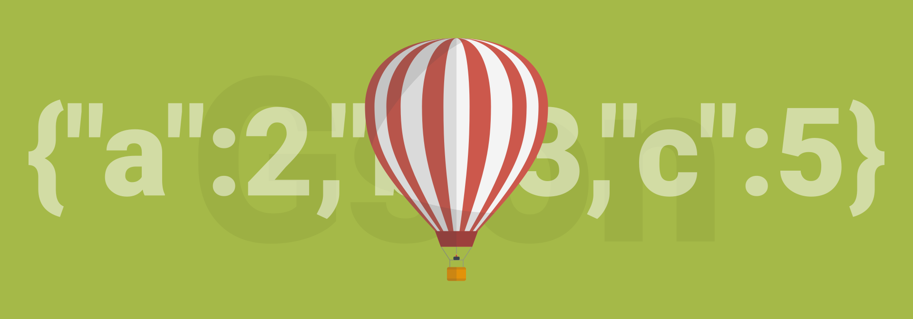

Gson — популярная [библиотека](https://github.com/google/gson) от Google для создания и парсинга JSON файлов на Java. Как подключить?

## Создание консольного приложения

Покажу на примере консольного приложения.

---

**Создание консольного приложения в IntelliJ IDEA** <!-- !details -->

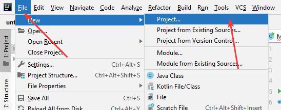

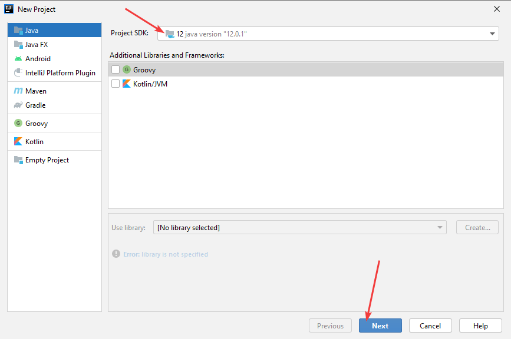

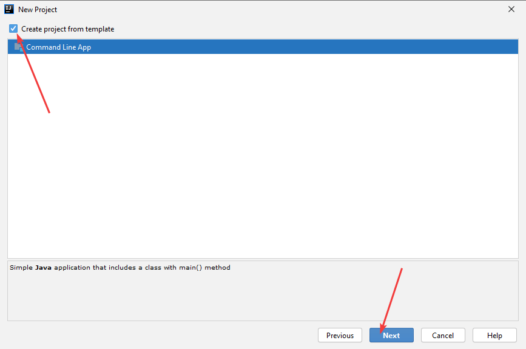

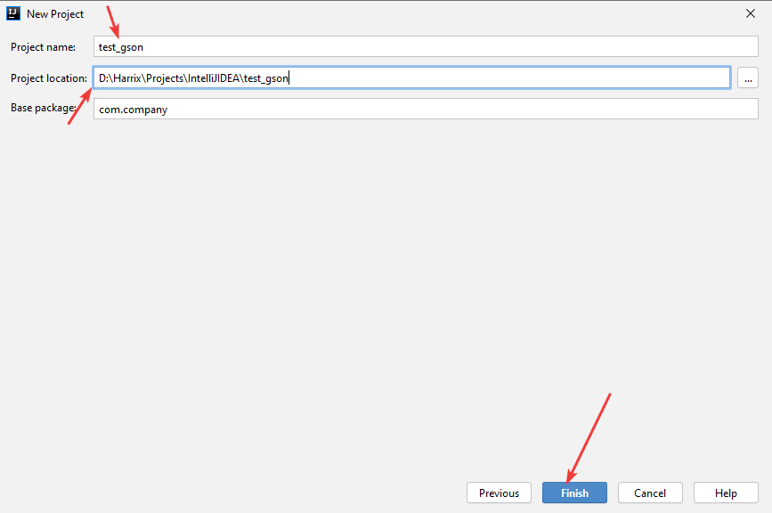

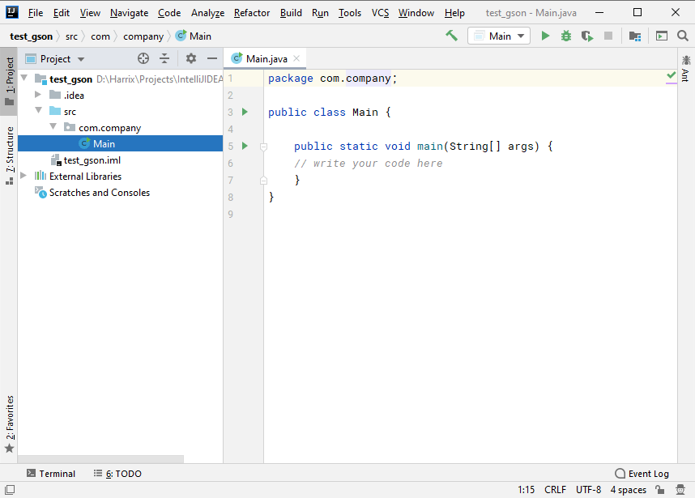

---

## Подключение Gson

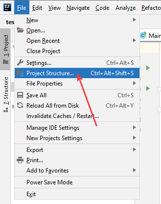

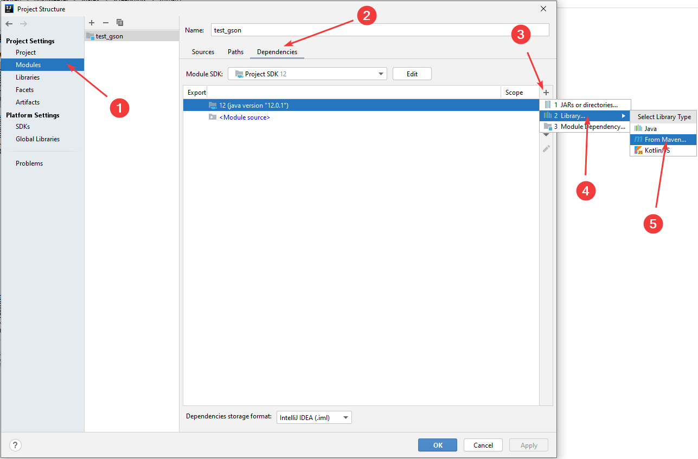

Вводим `Gson` и ищем:

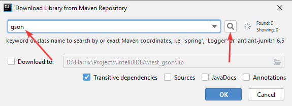

В списке находим последнюю версию библиотеки:

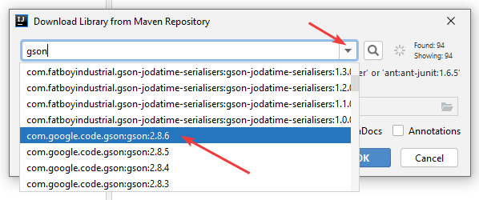

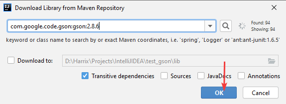

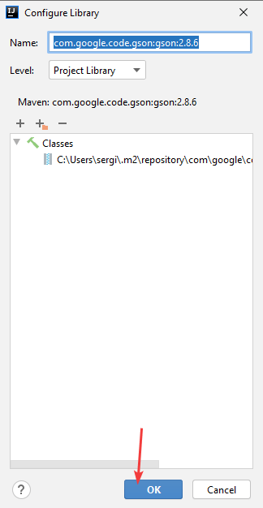

Поставьте галочку:

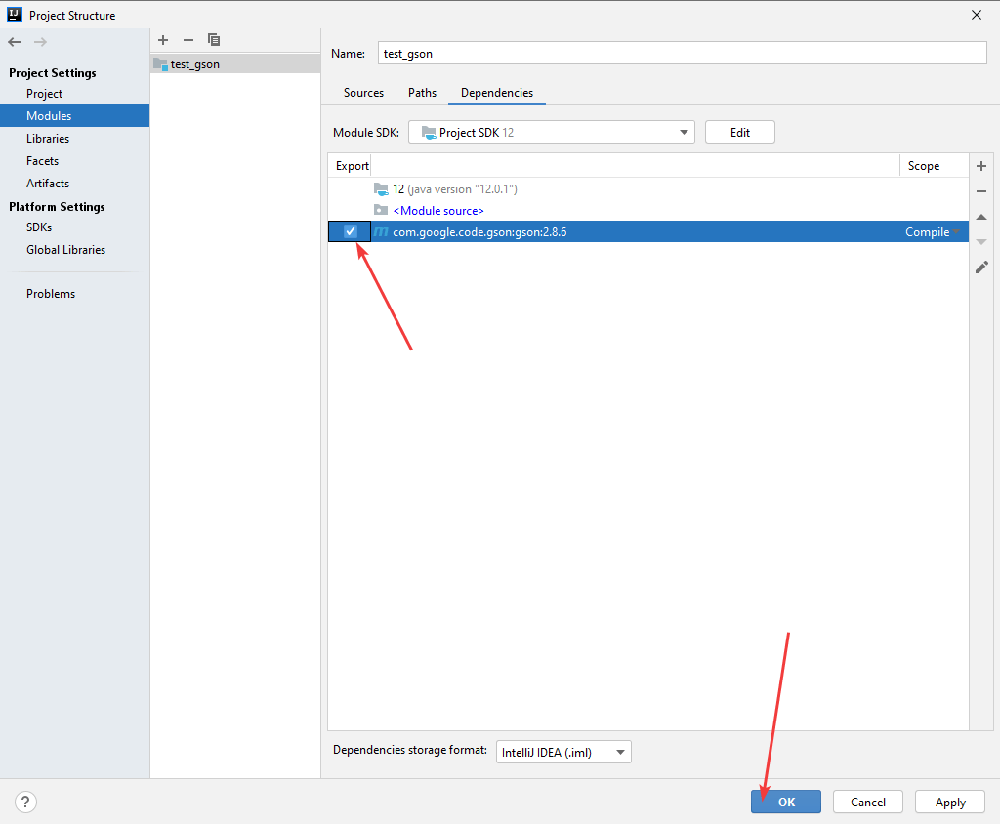

Библиотека добавилась в проект:

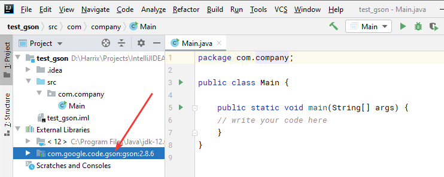

### Проверка работы

Код программы:

```java
package com.company;

import java.util.ArrayList;
import java.util.List;

import com.google.gson.*;

class User {
    String name;
    int age;
    List<String> programmingLanguages;

    @Override
    public String toString() {
        return "User{" +
                "name='" + name + '\'' +
                ", age=" + age +
                ", programmingLanguages=" + programmingLanguages +
                '}';
    }
}

public class Main {

    public static void main(String[] args) {
        // Создаем экземпляр пользователя
        User user = new User();
        user.name = "Anton";
        user.age = 30;
        user.programmingLanguages = new ArrayList<>();
        user.programmingLanguages.add("Java");
        user.programmingLanguages.add("C++");
        user.programmingLanguages.add("PHP");
        user.programmingLanguages.add("LaTeX");

        // Создаем экземпляр Gson
        Gson gson = new Gson();

        // Сериализуем пользователя в JSON и выведем в консоль
        String JSON = gson.toJson(user);
        System.out.println(JSON);

        // Создадим экземпляр второго пользователя на основе строки JSON
        User userTwo = gson.fromJson(JSON, User.class);
        System.out.println(userTwo);
    }
}
```

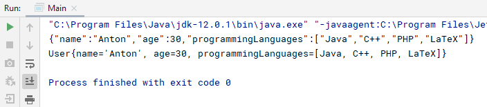
