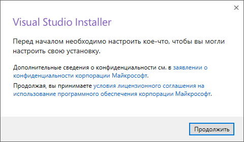
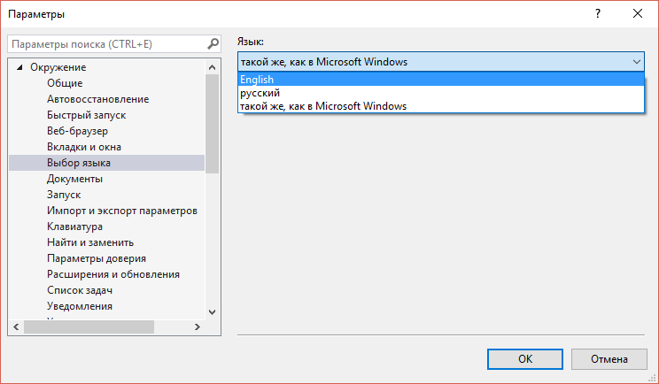

# Установка Visual Studio 2017 Community

В статье приведена инструкция по установке бесплатной версии Visual Studio 2017 Community на Windows 10 для программирования на C++. По сравнению с версией 2015 процесс установки сильно изменился.

Так как уже вышла [Visual Studio 2019](https://github.com/Harrix/harrix.dev-blog-2021/blob/main/install-visual-studio-2019/install-visual-studio-2019.md), то Visual Studio 2017 нужно искать на странице со старыми релизами.

Переходим на адрес загрузки предыдущих версий `Visual Studio`: <https://visualstudio.microsoft.com/ru/vs/older-downloads/>.

Выбираем загрузку версии 2017:

И там выбираем версию установщика под нашу операционную систему:

Запускаем скаченный файл:

После этого откроется окно с большим количеством пакетов для скачивания и установки в `Visual Studio`. Там и средства для программирования для мобильных устройств и под Node.js и так далее. Причем каждый пункт имеет справа список загружаемых файлов.

Нас интересует программирование на C++ под обычный Windows.

Если вы хотите программировать так называемые универсальные приложения (это те, что с Metro стилем и могут распространяться с магазином), то выберите первый блок и такие подпункты справа (обратите внимание, что пакет `Windows 10 SDK` лучше выбирать последний версии, который будет показываться у вас):

Для классических приложений выберите эти пакеты:

Лично я еще удаляю пакет русского языка и устанавливаю только английский язык. Но это исключительно на ваш выбор:

После выбора пакетов нужно запустить долгую-долгую установку:

После установки всех пакетов запустите Visual Studio:

Настоятельно рекомендую войти под учетной записью Visual Studio, чтобы через месяц программа не перестала работать (не проверял в 2017 версии, но в 2015 через месяц работы в незарегистрированной Community версии программа перестала запускаться, говоря, что нужно всё-таки войти под учеткой):

После этого откроется готовая к работе `Visual Studio 2017 Community`:

## Дополнительно

Можете попробовать создать простое консольное приложение по уроку:

[Сложение двух чисел в Visual Studio 2013 (консольное Win32 приложение)](https://github.com/Harrix/harrix.dev-blog-2015/tree/main/add-2-num-vs-2013-console)

А в этой статье говорится как сложить два числа в оконном приложении:

[Сложение двух чисел в Visual Studio 2017 на C++ (CLR приложение)](https://github.com/Harrix/harrix.dev-blog-2017/blob/main/add-2-num-vs-2017-clr/add-2-num-vs-2017-clr.md)

Если вы хотите разрабатывать универсальные UWP приложения, то не забудьте включить режим `Режим разработчика` в параметрах Windows 10:

Также рекомендую поменять язык интерфейса на английский. Хотя ввиду хорошей многоязычной документации от Microsoft это не так критично, как в других IDE. Смена языка делается через настройки:

