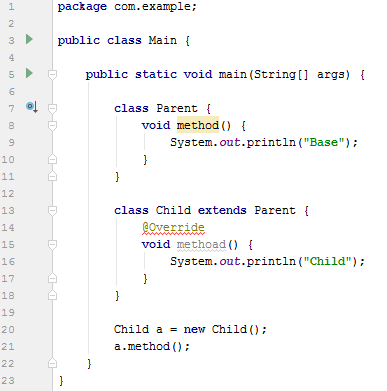
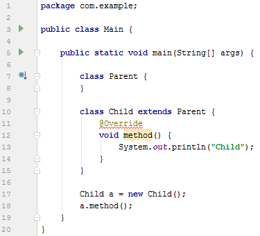

# Кратко об аннотациях в Java

Что такое аннотация в Java? Давайте глянем.

## Как аннотации выглядят

Вот так, например, выглядит аннотация:

```java
@Target(ElementType.METHOD)
@Retention(RetentionPolicy.RUNTIME)
public @interface NeedMethod {
    int type() default 1;
}
```

**Внимание!** Аннотации начинаются со знака `@`. Так что при написании аннотации выше мы использовали еще две существующие аннотации (там `1+2=3` знака `@`).

## Ссылки

Более подробно про аннотации можно прочитать тут:

[https://ru.wikipedia.org/wiki/Аннотация\_(Java)](<https://ru.wikipedia.org/wiki/Аннотация_(Java)>)

<http://www.seostella.com/ru/article/2012/05/19/annotacii-v-java-vvedenie.html>

<http://www.quizful.net/post/annotations-in-java>

<https://mkyong.com/java/java-custom-annotations-example/>

<https://dzone.com/articles/how-annotations-work-java>

## Для чего нужны аннотации

Аннотации позволяют в коде расставить те или иные смысловые метки в коде, которые что-то говорят либо компилятору, либо редактору, либо виртуальной машине. Аннотация как бы говорит: «Если есть такая метка, то тут должно быть вот так».

Также часто аннотации используются в различных библиотеках (например, в [Retrofit](https://square.github.io/retrofit/)). И расставляя по шаблонам из документации аннотации в своих классах, мы говорим библиотеке, какие методы и классы нужно брать для взаимодействия.

В общем, с помощью них можно отслеживать правильность кода, его анализировать и др.

## Существующие аннотации

Аннотации бывают существующими, или вы можете сами их создавать.

Например, одну аннотацию вы видели очень часто. Это `@Override`.

Допустим у вас есть код:

```java
class Parent {
    void method() {
        System.out.println("Base");
    }
}

class Child extends Parent {
    void method() {
        System.out.println("Child");
    }
}

Child a = new Child();
a.method();
```

Это работающий код, который спокойно компилируется. И можно ничего не делать. Но вдруг вы в названии метода `method()` в `Child` ошибетесь? Назовете его, например, `methoad()`. Компилятор спокойно всё скомпилирует и не подавится. Хотя мы хотели переопределить метод.

А что будет, если добавим аннотацию `@Override`. На первый взгляд ничего не изменится:

```java
class Parent {
    void method() {
        System.out.println("Base");
    }
}

class Child extends Parent {
    @Override
    void method() {
        System.out.println("Child");
    }
}

Child a = new Child();
a.method();
```

Всё компилируется, как и раньше. Но сейчас код с `methoad()` выдаст ошибку. Тогда как без `@Override` всё компилировалось бы:





То есть с аннотацией мы обезопасили свой код от некоторых ошибок программиста.

## Новые аннотации

Аннотации можно также писать самому.

Создадим, например, аннотацию `Animal` к классу, которая содержит параметр `massa` с стандартным значением `3`:

```java
@Target(ElementType.TYPE)
@Retention(RetentionPolicy.RUNTIME)
public @interface Animal {
    int massa() default 3;
}
```

Тут для создания аннотации используются две существующие аннотации в Java.

`@Target(ElementType.TYPE)` — означает, аннотация применяется к классу.

`@Retention(RetentionPolicy.RUNTIME)` — означает, что аннотация действует и при работе программы.

Обратите внимание на то, что параметр аннотации massa не имеет никакого отношения к полям классов, которые будут иметь эту аннотацию.

Создадим класс `Cat`, который будет прописан с аннотацией. Обратите внимание, что аннотация применяется не к объекту класса, а к самому классу. И также создадим экземпляр:

```java
@Animal()
class Cat {
}

Cat a = new Cat();
```

Теперь мы можем вытащить аннотацию из класса и вывести значения `massa` у аннотации:

```java
Class cl = a.getClass();
Animal an = (Animal)cl.getAnnotation(Animal.class);

System.out.println(an.massa());
```

Полный код консольного приложения:

```java
package com.example;

import java.lang.annotation.*;

public class Main {

    @Target(ElementType.TYPE)
    @Retention(RetentionPolicy.RUNTIME)
    public @interface Animal {
        int massa() default 3;
    }

    public static void main(String[] args) {

        @Animal()
        class Cat {
        }

        Cat a = new Cat();

        Class cl = a.getClass();
        Animal an = (Animal)cl.getAnnotation(Animal.class);

        System.out.println(an.massa());
    }
}
```

При выполнении программы должно вывестись `3`.

Можем у класса значение параметра аннотации и поменять. Например, у собаки в коде ниже значение будет `4`:

```java
package com.example;

import java.lang.annotation.*;

public class Main {

    @Target(ElementType.TYPE)
    @Retention(RetentionPolicy.RUNTIME)
    public @interface Animal {
        int massa() default 3;
    }

    public static void main(String[] args) {

        @Animal()
        class Cat {
        }

        Cat a = new Cat();

        Class cl = a.getClass();
        Animal an = (Animal)cl.getAnnotation(Animal.class);

        System.out.println(an.massa());

        //-------------------

        @Animal(massa = 5)
        class Dog {
        }

        Dog b = new Dog();

        Class clb = b.getClass();
        Animal anb = (Animal)cl.getAnnotation(Animal.class);

        System.out.println(anb.massa());
    }
}
```

В общем, примеры создания собственных аннотаций и их использования показал. Но вот только скорее всего возникнет вопрос: а зачем оно нужно?

В статье [Как вызвать метод класса из другого класса при недостатке информации через аннотации в Java](https://github.com/Harrix/harrix.dev-blog-2017/blob/main/method-call-java-annotation/method-call-java-annotation.md) показан пример использования аннотаций более приближенного к практике.
