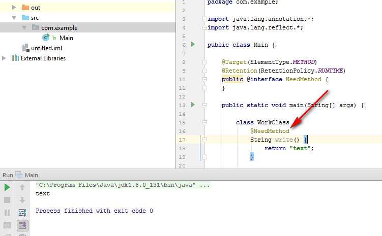
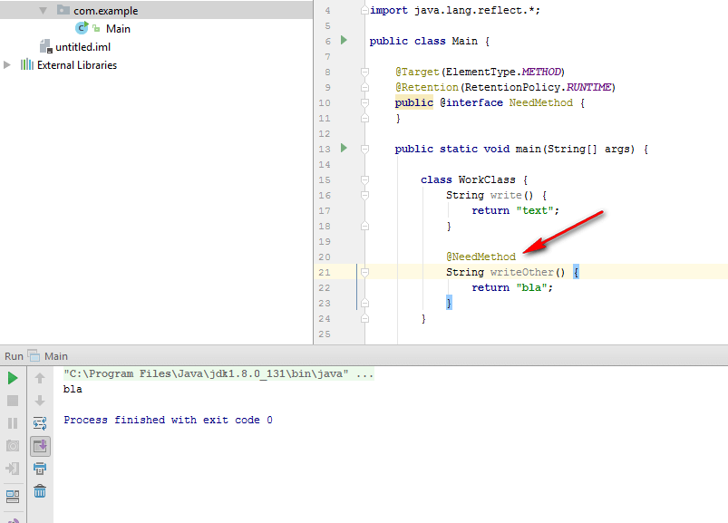
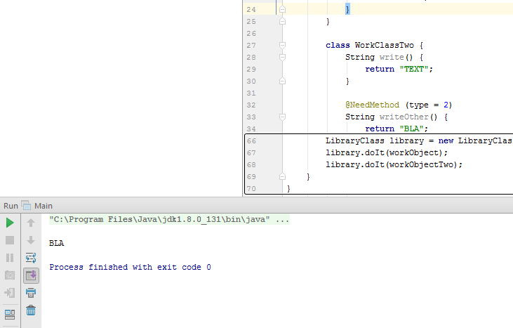

# Как вызвать метод класса из другого класса при недостатке информации через аннотации в Java


Что делать, если нужно вызвать метод объекта, о котором мы почти ничего не знаем: ни название, ни его методы (на самом деле знаем, но об этом ниже).

<details>
<summary>📖 Содержание</summary>

## Содержание

- [Постановка задачи](#постановка-задачи)
- [Варианты неверных решений](#варианты-неверных-решений)
- [Идея решения](#идея-решения)
- [Решение](#решение)
- [Использование библиотеки](#использование-библиотеки)
- [Дополнение](#дополнение)

</details>

## Постановка задачи

Есть некоторый класс какой-нибудь библиотеки, который мы сейчас проектируем, `LibraryClass` с методом `doIt`, который принимает произвольный объект:

```java
class LibraryClass {
    void doIt(Object object) {

    }
}
```

Мы знаем, что у принимаемого объекта **возможно** есть какой-то нужный нам метод, который возвращает строку `String`. Имя метода мы **не знаем.**

Точнее мы не знаем это на этапе разработки нашей библиотеки. А на этапе разработки передаваемого класса мы это знать будем.

Нам нужно вызывать этот метод, вытащить оттуда возвращаемую строчку и вывести на экран:

```java
class LibraryClass {
    void doIt(Object object) {
        String s = "";
        // Вызвать как-то метод и закинуть значение в s
        System.out.println(s);
    }
}
```

## Варианты неверных решений

Прошу обратить внимание на то, что это решения неверные строго с точки зрения поставленной задачи. Если на практике возникнет подобная (не такая же) задача, то лучше попробовать какое-нибудь из «неверных» решений.

Мы могли бы обязать передавать объект в `doIt` только как наследника абстрактного класса с нужным нам методом:

```java
abstract class Parent {
    abstract String method();
}

class LibraryClass {
    void doIt(Parent object) {
        String s = "";
        s = object.method();
        System.out.println(s);
    }
}

class Child extends Parent {
    @Override
    String method() {
        return "Bla";
    }
}

LibraryClass library = new LibraryClass();
library.doIt(new Child());
```

Или через интерфейс:

```java
interface Parent {
    String method();
}
```

```java
class LibraryClass {
    void doIt(Parent object) {
        String s = "";
        s = object.method();
        System.out.println(s);
    }
}

class Child implements Parent {
    @Override
    public String method() {
        return "Bla";
    }
}

LibraryClass library = new LibraryClass();
library.doIt(new Child());
```

Или даже через указание имени метода:

```java
class LibraryClass {
    void doIt(Object object) {
        String s = "";

        Class classObject = object.getClass();

        for (Method method : classObject.getDeclaredMethods()) {
            String nameMethod = method.getName();

            if (nameMethod.equals("method")) {
                try {
                    s = (String) method.invoke(object);
                } catch (IllegalAccessException e) {
                    e.printStackTrace();
                } catch (InvocationTargetException e) {
                    e.printStackTrace();
                }
            }
        }

        System.out.println(s);
    }
}

class Child {
    String method() {
        return "Bla";
    }
}

LibraryClass library = new LibraryClass();
library.doIt(new Child());
```

Но все эти способы подразумевают, что мы **знаем**, как называется метод, который нам нужен: либо заставляя нужный метод реализовать, либо перебирая все методы в поисках нужного имени. Но по условии задачи мы это **не знаем.**

То есть все эти способы не подойдут. Кстати, последний пример содержит много кода, который мы использует в решении с аннотацией.

## Идея решения

А давайте мы в классе, объект которого будем передавать библиотеке, метод, возвращающий нужную нам строку, просто пометим. Эту метку и будет искать библиотечный класс для вызова метода.

## Решение

Создадим аннотацию `NeedMethod` (имя взято произвольно), которая будет представлять собой метку. Причем аннотация будет являться частью библиотеки:

```java
@Target(ElementType.METHOD)
@Retention(RetentionPolicy.RUNTIME)
public @interface NeedMethod {
}
```

`@Target(ElementType.METHOD)` — означает, что метка будет действовать на метод.

`@Retention(RetentionPolicy.RUNTIME)` — означает, что метка будет работать и при выполнении программы. Без этой строчки наш способ работать не будет — можете проверить.

Теперь библиотечный класс пропишем такой:

```java
class LibraryClass {
    void doIt(Object object) {
        String s = "";

        Class classObject = object.getClass();

        for (Method method : classObject.getDeclaredMethods()) {
            NeedMethod annotation = (NeedMethod) method.getAnnotation(NeedMethod.class);

            if (annotation != null) {
                try {
                    s = (String) method.invoke(object);
                } catch (IllegalAccessException e) {
                    e.printStackTrace();
                } catch (InvocationTargetException e) {
                    e.printStackTrace();
                }
            }
        }

        System.out.println(s);
    }
}
```

Разберем его.

Java, в отличии от того же C++ (на самом деле что-то можно и в C++, но в ограниченном виде), позволяет узнавать информацию о классе объекта: имя, его методы и так далее. И мы из присылаемого объекта достаем информацию о классе:

```java
Class classObject = object.getClass();
```

Теперь мы можем в цикле пробежаться по всем методам класса (наследуемые методы не учитываются):

```java
for (Method method : classObject.getDeclaredMethods()) {
}
```

Теперь у каждого метода попытаемся вытащить аннотацию и привести её к типу нашей аннотации `NeedMethod`:

```java
NeedMethod annotation = (NeedMethod) method.getAnnotation(NeedMethod.class);
```

Если нужной отметки нет, то `annotation` будет приравнен к `null`. Что и используем:

```java
NeedMethod annotation = (NeedMethod) method.getAnnotation(NeedMethod.class);

if (annotation != null) {

}
```

Теперь внутри этого условия переменная `method` содержит нужный нам метод. И нам нужно его вызвать. Это можно сделать через `invoke`, указывая кто вызывает этот метод:

```java
s = (String) method.invoke(object);
```

Обратите внимание на интересное поведение. В обычных случаях мы у объекта вызываем метод, а тут, наоборот, методу говорим, кто его будет вызывать.

Так как не факт, что метод нашелся (это мы знаем, но Java не знает), то обрамляем вызов метода в `try catch`:

```java
Class classObject = object.getClass();

for (Method method : classObject.getDeclaredMethods()) {
    NeedMethod annotation = (NeedMethod) method.getAnnotation(NeedMethod.class);

    if (annotation != null) {

        try {
            s = (String) method.invoke(object);
        } catch (IllegalAccessException e) {
            e.printStackTrace();
        } catch (InvocationTargetException e) {
            e.printStackTrace();
        }

    }
}
```

## Использование библиотеки

Класс библиотеки с аннотацией написаны. Теперь можем проверить в деле.

Создадим класс, например, `WorkClass`:

```java
class WorkClass {
    String write() {
        return "text";
    }

    String writeOther() {
        return "bla";
    }
}
```

Создадим экземпляр нашего класса `WorkClass`, библиотечного класса `LibraryClass` и вызовем метод `doIt`:

```java
WorkClass workObject = new WorkClass();
LibraryClass library = new LibraryClass();
library.doIt(workObject);
```

И в консоли ничего не появилось. Что правильно.

Поставим отметку, то есть аннотацию `@NeedMethod`, около метода `write`:

```java
package com.example;

import java.lang.annotation.*;
import java.lang.reflect.*;

public class Main {

    @Target(ElementType.METHOD)
    @Retention(RetentionPolicy.RUNTIME)
    public @interface NeedMethod {
    }

    public static void main(String[] args) {

        class WorkClass {
            @NeedMethod
            String write() {
                return "text";
            }

            String writeOther() {
                return "bla";
            }
        }

        class LibraryClass {
            void doIt(Object object) {
                String s = "";

                Class classObject = object.getClass();

                for (Method method : classObject.getDeclaredMethods()) {
                    NeedMethod annotation = (NeedMethod) method.getAnnotation(NeedMethod.class);

                    if (annotation != null) {

                        try {
                            s = (String) method.invoke(object);
                        } catch (IllegalAccessException e) {
                            e.printStackTrace();
                        } catch (InvocationTargetException e) {
                            e.printStackTrace();
                        }

                    }
                }

                System.out.println(s);
            }
        }

        WorkClass workObject = new WorkClass();
        LibraryClass library = new LibraryClass();
        library.doIt(workObject);
    }
}
```

Вот теперь на экране высветится `text`:



_Рисунок 1 — Результат выполнения программы_

Поставим отметку около метода `writeOther`, и высветится `bla`:

```java
package com.example;

import java.lang.annotation.*;
import java.lang.reflect.*;

public class Main {

    @Target(ElementType.METHOD)
    @Retention(RetentionPolicy.RUNTIME)
    public @interface NeedMethod {
    }

    public static void main(String[] args) {

        class WorkClass {
            String write() {
                return "text";
            }

            @NeedMethod
            String writeOther() {
                return "bla";
            }
        }

        class LibraryClass {
            void doIt(Object object) {
                String s = "";

                Class classObject = object.getClass();

                for (Method method : classObject.getDeclaredMethods()) {
                    NeedMethod annotation = (NeedMethod) method.getAnnotation(NeedMethod.class);

                    if (annotation != null) {
                        try {
                            s = (String) method.invoke(object);
                        } catch (IllegalAccessException e) {
                            e.printStackTrace();
                        } catch (InvocationTargetException e) {
                            e.printStackTrace();
                        }
                    }
                }

                System.out.println(s);
            }
        }

        WorkClass workObject = new WorkClass();
        LibraryClass library = new LibraryClass();
        library.doIt(workObject);
    }
}
```



_Рисунок 2 — Результат выполнения программы_

## Дополнение

Усложненный пример. Можно не читать.

В примере ниже я в метку ввел параметр `type`, который по умолчанию равен `1`. А в библиотечном классе поставил проверку, что нам нужен метод со значением параметра равным `2` (просто для демонстрации). Ввел также второй класс, в котором метку поставил со значением `2`. В итоге, в первом классе метка не сработает, так как значение в метке равно `1`, а во втором классе сработает:

```java
package com.example;

import java.lang.annotation.*;
import java.lang.reflect.*;

public class Main {

    @Target(ElementType.METHOD)
    @Retention(RetentionPolicy.RUNTIME)
    public @interface NeedMethod {
        int type() default 1;
    }

    public static void main(String[] args) {

        class WorkClass {
            String write() {
                return "text";
            }

            @NeedMethod
            String writeOther() {
                return "bla";
            }
        }

        class WorkClassTwo {
            String write() {
                return "TEXT";
            }

            @NeedMethod (type = 2)
            String writeOther() {
                return "BLA";
            }
        }

        class LibraryClass {
            void doIt(Object object) {
                String s = "";

                Class classObject = object.getClass();

                for (Method method : classObject.getDeclaredMethods()) {
                    NeedMethod annotation = (NeedMethod) method.getAnnotation(NeedMethod.class);

                    if ((annotation != null) && (annotation.type() == 2)) {
                        try {
                            s = (String) method.invoke(object);
                        } catch (IllegalAccessException e) {
                            e.printStackTrace();
                        } catch (InvocationTargetException e) {
                            e.printStackTrace();
                        }
                    }
                }

                System.out.println(s);
            }
        }

        WorkClass workObject = new WorkClass();
        WorkClassTwo workObjectTwo = new WorkClassTwo();
        LibraryClass library = new LibraryClass();
        library.doIt(workObject);
        library.doIt(workObjectTwo);
    }
}
```



_Рисунок 3 — Результат выполнения программы_

Вот и всё, что хотел рассказать.

P.S. Жаль, что нельзя аннотацию прикреплять к методу динамически, а не в коде, как мы делали.
