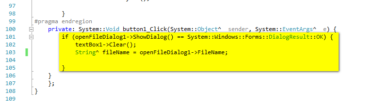

# Подключение SQLite в проектах Visual Studio в CRL проекте


Учебный пример о подключении популярного формата базы данных к проекту. Будем показывать на примере Visual Studio 2017 Community.

## Создание базы данных

По [этой](https://github.com/Harrix/harrix.dev-blog-2016/blob/main/db-browser-for-sqlite/db-browser-for-sqlite.md) <!-- https://harrix.dev/ru/blog/2016/db-browser-for-sqlite/ --> статье создайте файл базы данных `test.db` с одной таблицей `students`:


_Рисунок 1 — Поля таблицы students_


_Рисунок 2 — Строки таблицы students_

Для знающих:

```sql
CREATE TABLE `students` (
  `_id`  INTEGER PRIMARY KEY AUTOINCREMENT,
  `name`  TEXT NOT NULL,
  `age`  INTEGER NOT NULL
);
INSERT INTO `students` VALUES (1,'Дмитрий',20);
INSERT INTO `students` VALUES (2,'Галя',18);
INSERT INTO `students` VALUES (3,'Костя',19);
```

## Создание болванки приложения

Подготовьте приложение с готовой формой. Прочитать об этом можно тут: [Visual Studio 2017](https://github.com/Harrix/harrix.dev-blog-2017/blob/main/add-2-num-vs-2017-clr/add-2-num-vs-2017-clr.md) <!-- https://harrix.dev/ru/blog/2017/add-2-num-vs-2017-clr/ -->, [Visual Studio 2015](https://github.com/Harrix/harrix.dev-blog-2016/blob/main/add-2-num-vs-2015-clr/add-2-num-vs-2015-clr.md) <!-- https://harrix.dev/ru/blog/2016/add-2-num-vs-2015-clr/ -->, [Visual Studio 2010](https://github.com/Harrix/harrix.dev-blog-2016/blob/main/add-2-num-vs-2010-clr/add-2-num-vs-2010-clr.md) <!-- https://harrix.dev/ru/blog/2016/add-2-num-vs-2010-clr/ -->:


_Рисунок 3 — Болванка приложения с пустой формой_

Пока разместим на форме кнопку поле вывода:


_Рисунок 4 — Форма с кнопкой и полем вывода_

Также разместим диалоговое окно открытия файлов:


_Рисунок 5 — Форма с диалоговым окном открытия файлов_

## Код открытия файла

Дважды кликаем по кнопке и переходи в код обработки клика кнопки.

И разместим там такой код. Тут пока только получаем имя файла через диалоговое окно и очищаем текстовое поле:

```cpp
if (openFileDialog1->ShowDialog() == System::Windows::Forms::DialogResult::OK) {
    textBox1->Clear();
    String^ fileName = openFileDialog1->FileName;
}
```


_Рисунок 6 — Метод обработки клика кнопки_

## Скачивание библиотеки для работы SQLite

К сожалению, в Visual Studio нет встроенной поддержки SQLite (В отличии от того же Qt). По идеи есть в Visual Studio менеджер пакетов `NuGet`, который позволяет быстро загружать нужные библиотеки, но нужно понимать, что `CLR` платформа уходит потихоньку, и Microsoft делает упор на `C#`. В общем, вы сможете загрузить библиотеку через NuGet, но ничего не скомпилируется.

Поэтому будем делать всё вручную.

Идем на сайт <https://system.data.sqlite.org/>.

Там в раздел [Download](https://system.data.sqlite.org/index.html/doc/trunk/www/downloads.wiki):


_Рисунок 7 — Раздел Download на сайте_

И откроется страница, где куча ссылок на разные версии сборок библиотеки. Что же выбрать? Нам точно нужен файл из раздела `Precompiled Binaries`.

А вот далее четкого ответа вам не дам. Файлов с пометкой `Precompiled Binaries` много. Они отличаются разрядностью программы (`x86` и `x64`), версией `.NET Framework` и версией `Visual Studio`. Причем последний параметр, как оказалось, самый неважный.

Итак, я пишу пример под `Visual Studio 2017 Community` под `Windows 10 x64`.

Но CLR приложение компилируется как 32 разрядное приложение (x86). И через `.NET Framework 4.5.1`.

В общем, у меня сработала библиотека `Precompiled Binaries for 32-bit Windows (.NET Framework 4.5.1)`. Который вообще-то собран под Visual Studio 2013, а не 2017. У вас ввиду других версий Visual Studio и настроек компилятора может потребоваться другой файл.

**Внимание!** Для `Visual Studio 2015` подошел этот же файл. А для `Visual Studio 2010` подошел файл `sqlite-netFx40-binary-bundle-Win32-2010-1.0.105.2.zip` из раздела `Precompiled Binaries for 32-bit Windows (.NET Framework 4.0)`.

Скачиваем наш файл:


_Рисунок 8 — Выбранный файл для скачивания_

Распаковываем его.

Там нам нужны будут файлы формата `.dll`.

Размещаем их в какую-нибудь папку. Я разместил в папку `C:\Users\[Пользователь]\Documents\Visual Studio 2017\SQLite`, но вы можете разместить и в другом месте, где вам захочется:


_Рисунок 9 — Распакованный архив_

## Подключение библиотеки

Теперь обратно переходим к проекту в Visual Studio. У проекта есть раздел `Ссылок` в `Обозревателе решений`.

Щелкаем правой кнопкой по разделу и выбираем `Добавить ссылку…`:


_Рисунок 10 — Выбор команды Добавить ссылку_

И там через `Обзор…` выбираем файл `System.Data.SQLite.dll`:


_Рисунок 11 — Выбор кнопки Обзор_


_Рисунок 12 — Выбор файла DLL_


_Рисунок 13 — Нажатие кнопки OK_

Если после нажатия на `OK` выскочило сообщение об ошибке, то скорее всего с сайта вы не тот файл скачали.

У вас в разделе `Ссылки` должно появиться упоминание о библиотеке:


_Рисунок 14 — Добавленная библиотека_

Для `Visual Studio 2010` подключение ссылки выглядит по-другому:


_Рисунок 15 — Выбор References_


_Рисунок 16 — Добавление новой ссылки_


_Рисунок 17 — Выбор файла_


_Рисунок 18 — Нажатие на кнопку OK_

Теперь мы можем в файле кода формы (у меня это `MyForm.h`) добавить подключение пространств имен библиотек:

```cpp
using namespace System::Data::SQLite;
using namespace System::Text;
```

Вторая строчка к нашей библиотеке не имеет отношения, но функции оттуда нам будут нужны:


_Рисунок 19 — Подключенные пространства имен_

Скомпилируйте и запустите программу. Если всё запустилось, то пока вы всё делали правильно:


_Рисунок 20 — Запущенное приложение_

## Подключение к базе данных

Возвращаемся в код кнопки. Там у нас пока прописано открытие файла через диалоговое окно и получение имени выбранного файла:



_Рисунок 21 — Метод обработки клика кнопки_

Пропишем код подключение базы данных внутри условия открытия диалогового окна (не запутайтесь!):

```cpp
SQLiteConnection ^db = gcnew SQLiteConnection();
try
{
  db->ConnectionString = "Data Source=\"" + fileName + "\"";
  db->Open();

  db->Close();
}
finally
{
  delete (IDisposable^)db;
}
```


_Рисунок 22 — Код подключения к БД_

Скомпилируйте программу и запустите. Проверьте работу кнопки. Если программа не вылетает при выборе файла базы данных `test.db`, то теперь точно библиотека подключена правильно.

## Выгрузка данных из базы данных

Теперь в кнопке мы подключились к базе данных. Попробуем вытащить все данные из таблицы `students`.

Для этого между строчек `db->Open();` и `db->Close();` поместим такой код:

```cpp
// Display Table
try
{
  SQLiteCommand ^cmdSelect = db->CreateCommand();
  cmdSelect->CommandText = "SELECT * FROM students;";
  SQLiteDataReader ^reader = cmdSelect->ExecuteReader();
  StringBuilder ^sb = gcnew StringBuilder();
  for (int colCtr = 0; colCtr < reader->FieldCount; ++colCtr)
  {
    // Add Separator (If After First Column)
    if (colCtr > 0) sb->Append("|");

    // Add Column Name
    sb->Append(reader->GetName(colCtr));
  }
  sb->AppendLine();
  sb->Append("~~~~~~~~~~~~");
  sb->AppendLine();
  while (reader->Read())
  {
    for (int colCtr = 0; colCtr < reader->FieldCount; ++colCtr)
    {
      // Add Separator (If After First Column)
      if (colCtr > 0) sb->Append("|");

      // Add Column Text
      sb->Append(reader->GetValue(colCtr)->ToString());
    }
    sb->AppendLine();
  }

  textBox1->Text = sb->ToString();
}
catch (Exception ^e)
{
  MessageBox::Show("Error Executing SQL: " + e->ToString(), "Exception While Displaying MyTable ...");
}
```

Полный код кнопки получается такой:

```cpp
if (openFileDialog1->ShowDialog() == System::Windows::Forms::DialogResult::OK) {
  textBox1->Clear();
  String^ fileName = openFileDialog1->FileName;

  SQLiteConnection ^db = gcnew SQLiteConnection();
  try
  {
    db->ConnectionString = "Data Source=\"" + fileName + "\"";
    db->Open();

    // Display Table
    try
    {
      SQLiteCommand ^cmdSelect = db->CreateCommand();
      cmdSelect->CommandText = "SELECT * FROM students;";
      SQLiteDataReader ^reader = cmdSelect->ExecuteReader();
      StringBuilder ^sb = gcnew StringBuilder();
      for (int colCtr = 0; colCtr < reader->FieldCount; ++colCtr)
      {
        // Add Separator (If After First Column)
        if (colCtr > 0) sb->Append("|");

        // Add Column Name
        sb->Append(reader->GetName(colCtr));
      }
      sb->AppendLine();
      sb->Append("~~~~~~~~~~~~");
      sb->AppendLine();
      while (reader->Read())
      {
        for (int colCtr = 0; colCtr < reader->FieldCount; ++colCtr)
        {
          // Add Separator (If After First Column)
          if (colCtr > 0) sb->Append("|");

          // Add Column Text
          sb->Append(reader->GetValue(colCtr)->ToString());
        }
        sb->AppendLine();
      }

      textBox1->Text = sb->ToString();
    }
    catch (Exception ^e)
    {
      MessageBox::Show("Error Executing SQL: " + e->ToString(), "Exception While Displaying MyTable ...");
    }

    db->Close();
  }
  finally
  {
    delete (IDisposable^)db;
  }
}
```

Запускаем приложение, кликаем на кнопку, выбираем файл `test.db`. И вы должны увидеть что-то такое:


_Рисунок 23 — Результат загрузки БД_

Вот мы и вывели нашу таблицу в текстовое поле.

## Более простой код вывода данных из таблицы

Немного упростил код кнопки, убрав несколько сложных для первого знакомства мест:

```cpp
if (openFileDialog1->ShowDialog() == System::Windows::Forms::DialogResult::OK) {
  textBox1->Clear();
  String^ fileName = openFileDialog1->FileName;

  SQLiteConnection ^db = gcnew SQLiteConnection();
  try
  {
    db->ConnectionString = "Data Source=\"" + fileName + "\"";
    db->Open();

    try
    {
      SQLiteCommand ^cmdSelect = db->CreateCommand();
      // Обратите внимание, что SQL запрос оформляем как обычную строчку
      cmdSelect->CommandText = "SELECT * FROM students;";
      SQLiteDataReader ^reader = cmdSelect->ExecuteReader();

      // В sb будем записывать итоговый результат
      String ^sb = "";
      // Пробегаем по каждой записи
      while (reader->Read()) {
        // В каждой записи пробегаем по всем столбцам
        for (int colCtr = 0; colCtr < reader->FieldCount; ++colCtr) {
          // Добавляем значение столбца в sb
          sb +=  reader->GetValue(colCtr)->ToString();
          sb += (" | ");
        }
        sb += "\r\n";
      }

      // Выводим результат
      textBox1->Text = sb->ToString();
    }
    catch (Exception ^e)
    {
      MessageBox::Show("Error Executing SQL: " + e->ToString(), "Exception While Displaying MyTable ...");
    }

    db->Close();
  }
  finally
  {
    delete (IDisposable^)db;
  }
}
```


_Рисунок 24 — Вывод таблицы из БД_

## Вывод данных из базы данных в таблицу

Мы только что выводили информацию в `textBox1`. Но это неудобно для вывода таблиц. Выведем в таблицу.

На форме разместил еще одну кнопку и компонент `DataGridView`:


_Рисунок 25 — Компонент DataGridView и еще одна кнопка на форме_

Вывод данных в таблице будем основывать на статье [Вывод таблицы вручную в Visual Studio в CLR приложении](https://github.com/Harrix/harrix.dev-blog-2017/blob/main/data-grid-view-vs/data-grid-view-vs.md) <!-- https://harrix.dev/ru/blog/2017/data-grid-view-vs/ -->.

Будем использовать в коде вектора, так что подключим его через заголовочный файл:

```cpp
#include <cliext/vector>
```

И через подключение пространства имен:

```cpp
using namespace cliext;
```


_Рисунок 26 — Подключение библиотеки по работе с вектором_

Код клика кнопки:

```cpp
if (openFileDialog1->ShowDialog() == System::Windows::Forms::DialogResult::OK) {
  textBox1->Clear();
  String^ fileName = openFileDialog1->FileName;

  SQLiteConnection ^db = gcnew SQLiteConnection();
  try
  {
    db->ConnectionString = "Data Source=\"" + fileName + "\"";
    db->Open();

    try
    {
      SQLiteCommand ^cmdSelect = db->CreateCommand();
      // Обратите внимание, что SQL запрос оформляем как обычную строчку
      cmdSelect->CommandText = "SELECT * FROM students;";
      SQLiteDataReader ^reader = cmdSelect->ExecuteReader();

      // В table будем записывать итоговый результат
      DataTable ^table; // Невидимая таблица данных
      DataColumn ^column; // Столбец таблицы
      DataRow ^row; // Строка таблицы

      // Создаем таблицу данных
      table = gcnew DataTable();

      // Вектор названий столбцов
      vector<String^>^ nameColumns = gcnew vector<String^>();

      // Заполним данные о столбцах
      for (int i = 0; i < reader->FieldCount; i++) {
        nameColumns->push_back(reader->GetName(i));
        column = gcnew DataColumn(nameColumns->at(i), String::typeid);
        table->Columns->Add(column);
      }

      // Пробегаем по каждой записи
      while (reader->Read()) {
        // Заполняем строчку таблицы
        row = table->NewRow();
        // В каждой записи пробегаем по всем столбцам
        for (int i = 0; i < reader->FieldCount; i++) {
          //Добавляем значение столбца в row
          row[nameColumns->at(i)] = reader->GetValue(i)->ToString();
          reader->GetValue(i)->ToString();
        }
        table->Rows->Add(row);
      }

      // Выводим результат
      dataGridView1->DataSource = table;
    }
    catch (Exception ^e)
    {
      MessageBox::Show("Error Executing SQL: " + e->ToString(), "Exception While Displaying MyTable ...");
    }

    db->Close();
  }
  finally
  {
    delete (IDisposable^)db;
  }
}
```


_Рисунок 27 — Вывод таблицы из БД в виде таблицы_

## Расширенный пример с кнопкой добавления записи

Мы показали, как считывать данные из `SQLite` и выводить в таблицу `DataGridView`. Но у нас сейчас настроенное соединение `SQLiteConnection` работает только при клике одной кнопки. И, если нам потребуется обращаться к базе данных в других кнопках, то придется создавать новые подключения. Неудобно. Попробуем исправить это.

**Задача**: Нам нужно, чтобы при нажатии на еще одну кнопку происходило добавление новой записи в базу данных. Причем в отображаемой таблице также происходили изменения:


_Рисунок 28 — Новая кнопка «Добавить запись» на форме_

Как и в предыдущем примере, нам будут нужны вектора, так что не удаляем подключение `cliext`:

```cpp
#include <cliext/vector>

…

using namespace cliext;
```


_Рисунок 29 — Подключение библиотеки по работе с вектором_

Сделаем переменную подключения к базе данных `SQLiteConnection ^db` общей для всей нашей формы:

```cpp
SQLiteConnection ^db;
```


_Рисунок 30 — Объявление переменной db_

Нам нужно будет в двух кнопках `Открыть базу данных` и `Добавить данные` считывать данные из базы данных. Поэтому вынесем заполнение невидимой таблицы `DataTable ^table` в отдельный метод:

```cpp
private: DataTable^ fillDataTable() {
  DataTable ^table;
  try
  {
    SQLiteCommand ^cmdSelect = db->CreateCommand();
    // Обратите внимание, что SQL запрос оформляем как обычную строчку
    cmdSelect->CommandText = "SELECT * FROM students;";
    SQLiteDataReader ^reader = cmdSelect->ExecuteReader();

    // Переменные
    DataColumn ^column; // Столбец таблицы
    DataRow ^row; // Строка таблицы

    // Создаем таблицу данных
    table = gcnew DataTable();

    //Вектор названий столбцов
    vector<String^>^ nameColumns = gcnew vector<String^>();

    // Заполним данные о столбцах
    for (int i = 0; i < reader->FieldCount; i++) {
      nameColumns->push_back(reader->GetName(i));
      column = gcnew DataColumn(nameColumns->at(i), String::typeid);
      table->Columns->Add(column);
    }

    // Пробегаем по каждой записи
    while (reader->Read()) {
      // Заполняем строчку таблицы
      row = table->NewRow();
      // В каждой записи пробегаем по всем столбцам
      for (int i = 0; i < reader->FieldCount; i++) {
        // Добавляем значение столбца в row
        row[nameColumns->at(i)] = reader->GetValue(i)->ToString();
        reader->GetValue(i)->ToString();
      }
      table->Rows->Add(row);
    }
  }
  catch (Exception ^e)
  {
    MessageBox::Show("Error Executing SQL: " + e->ToString(), "Exception While Displaying MyTable ...");
  }
  return table;
}
```


_Рисунок 31 — Метод fillDataTable_

Закрытие соединения с базой данных вынесем в деструктор формы:

```cpp
db->Close();
```


_Рисунок 32 — Деструктор формы_

Тогда код кнопки открытия базы данных сократится до такого кода:

```cpp
if (openFileDialog1->ShowDialog() == System::Windows::Forms::DialogResult::OK) {
  String^ fileName = openFileDialog1->FileName;

  db = gcnew SQLiteConnection();
  try
  {
    db->ConnectionString = "Data Source=\"" + fileName + "\"";
    db->Open();

    DataTable ^table = fillDataTable();

    dataGridView1->DataSource = table;
  }
  catch (Exception ^e)
  {
    MessageBox::Show("Error Working SQL: " + e->ToString(), "Exception ...");
  }
}
```


_Рисунок 33 — Код кнопки открытия базы_

Тогда код клика кнопки `Добавить запись` можно определить так:

```cpp
try
{
  SQLiteCommand ^cmdInsertValue = db->CreateCommand();
  cmdInsertValue->CommandText = "INSERT INTO students (name, age) VALUES('Сандра', 18);";
  cmdInsertValue->ExecuteNonQuery();

  DataTable ^table = fillDataTable();

  dataGridView1->DataSource = table;
}
catch (Exception ^e)
{
  MessageBox::Show("Error Executing SQL: " + e->ToString(), "Exception ...");
}
```


_Рисунок 34 — Код клика кнопки «Добавить запись»_

## Удаление записи из таблицы

Напоследок покажем код кнопки, которая удаляет выделенную запись из таблицы. В этом примере из нового появится определение номера выделенной записи в таблице:

```cpp
// Номер выделенной строки
int index = dataGridView1->CurrentCell->RowIndex;
// Определим _id в выделенной строке
String^ _id = dataGridView1->Rows[index]->Cells["_id"]->Value->ToString();

try
{
  SQLiteCommand ^cmdInsertValue = db->CreateCommand();
  cmdInsertValue->CommandText = "DELETE FROM students WHERE _id = " + _id+ ";";
  cmdInsertValue->ExecuteNonQuery();

  DataTable ^table = fillDataTable();

  dataGridView1->DataSource = table;
}
catch (Exception ^e)
{
  MessageBox::Show("Error Executing SQL: " + e->ToString(), "Exception ...");
}
```


_Рисунок 35 — Код клика кнопки «Удалить запись»_

Обратите внимание на то, что при нажатии на кнопки `Добавить запись` и `Удалить запись` вначале мы производим изменения в базе данных, а потом заново из базы данных выгружаем данные.
