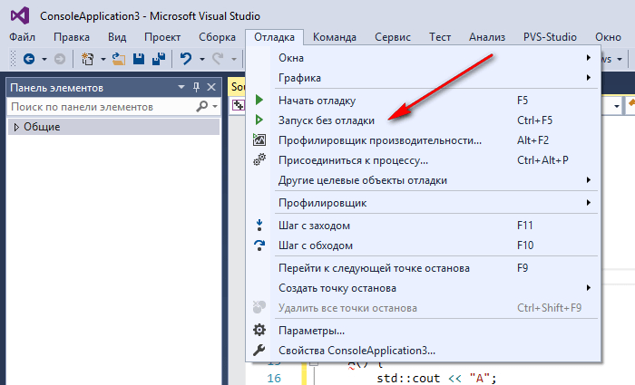
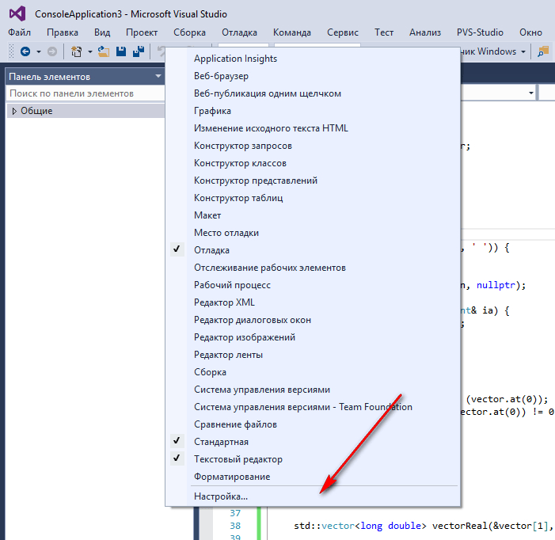
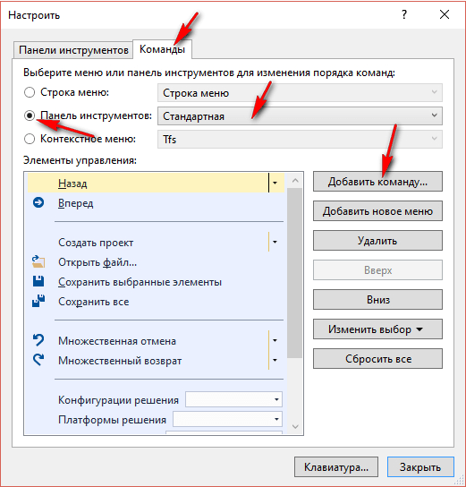
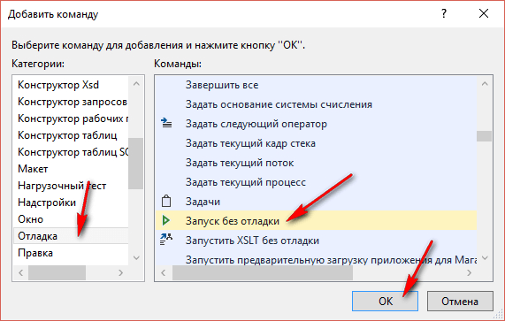
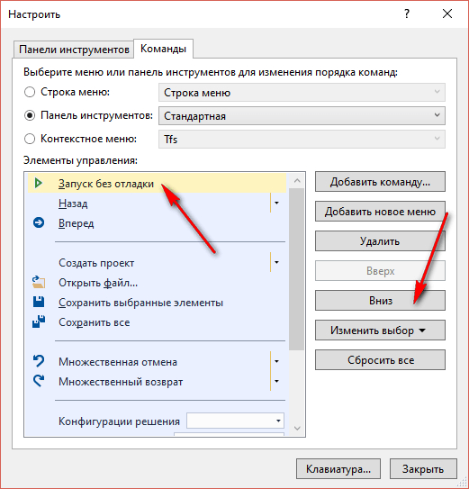
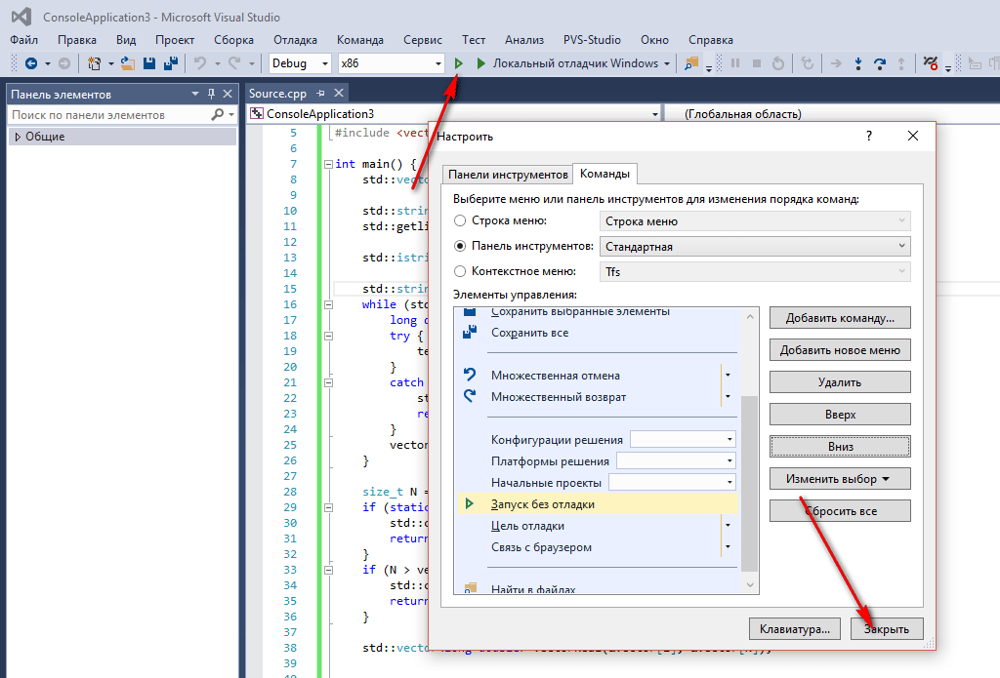

# Кнопка «Запуск без отладки» на панели инструментов в Visual Studio

Выводим кнопку запуска приложения в панель инструментов.

При написании консольных приложений в Visual Studio у начинающих возникает проблема, что при выводе результата приложение закрывается, не дав взглянуть на ответ.

Можно использовать `system("pause")`, `_getch()`. Но можно использовать запуск приложения без отладки `Ctrl` + `F5`. Тогда приложения после завершения работы не закроет окно консоли. Но данная кнопка отсутствует по умолчанию в панели инструментов:

_Рисунок 1 — Кнопка «Запуск без отладки»_

В панели инструментов вызываем контекстное меню правой кнопкой:

_Рисунок 2 — Контекстное меню_

_Рисунок 3 — Добавление команды_

_Рисунок 4 — Выбор команды_

_Рисунок 5 — Размещение команды_

_Рисунок 6 — Кнопка «Запуск без отладки» на панели инструментов_
