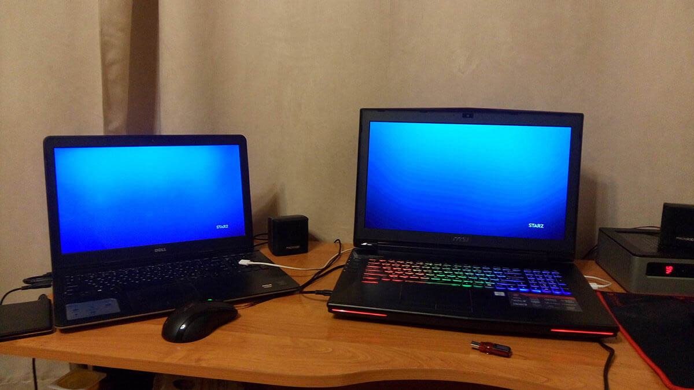
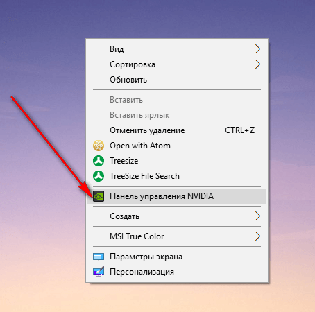
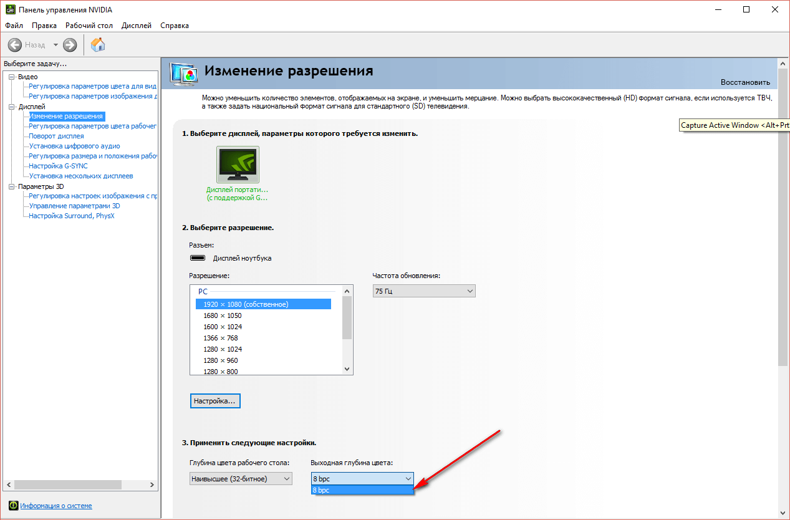
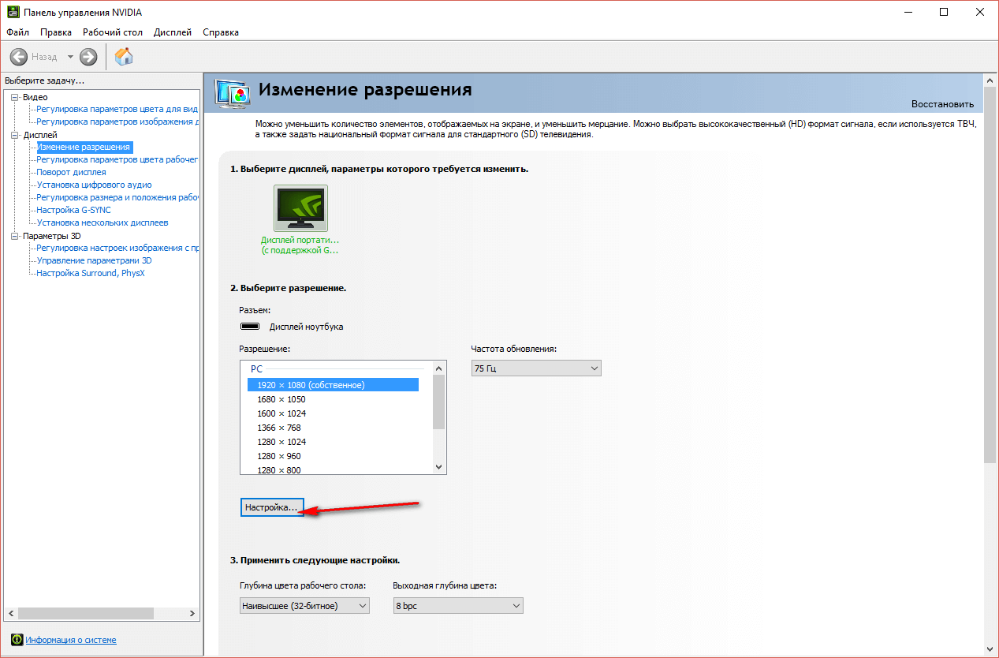
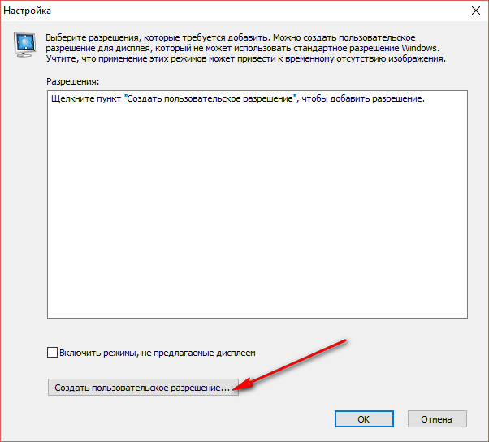
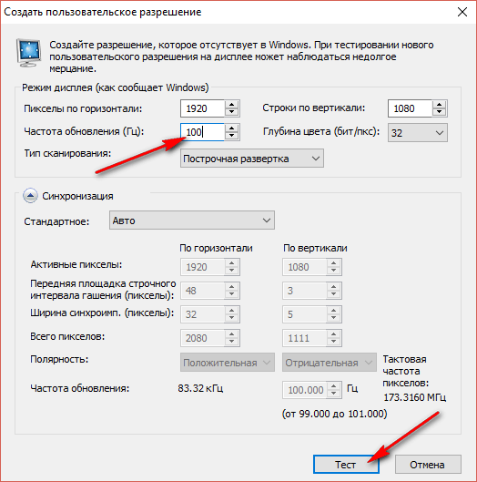
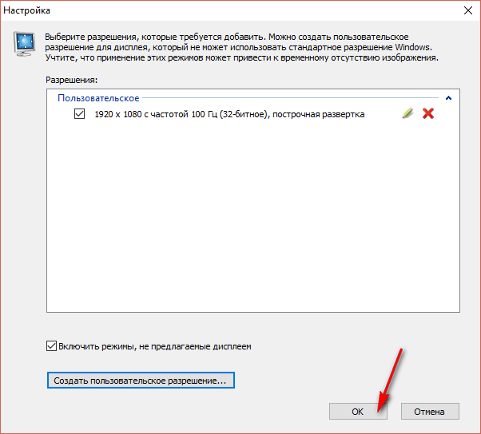
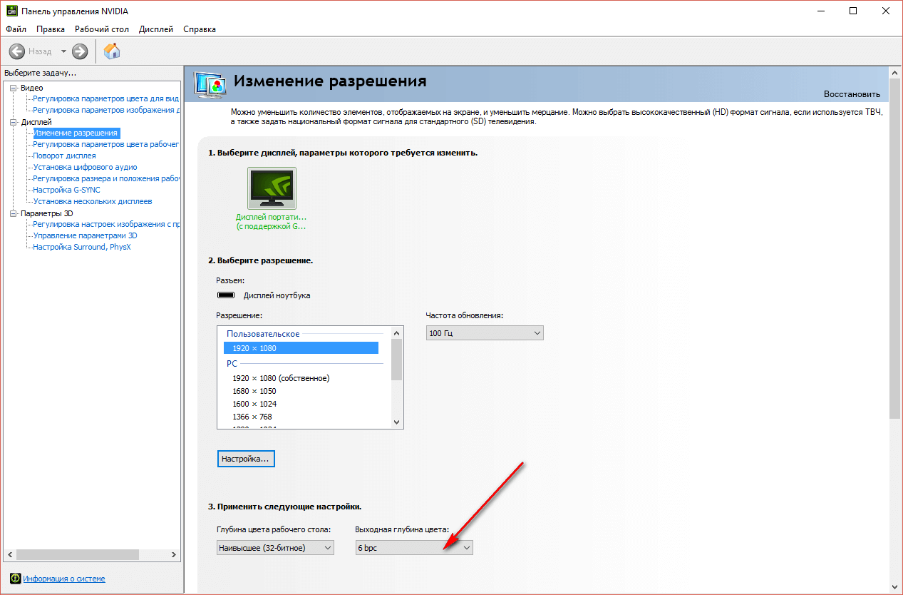

# Ступенчатый градиент на MSI GT72VR 6RD(Dominator)-090RU

Если на заглавной картинке вы видите ступенчатый градиент, то статья для вас.

Купил недавно себе новый ноутбук MSI GT72VR 6RD(Dominator)-090RU. Всем отличный, но столкнулся с проблемой, что градиенты на экране выглядят ступенчато. Проблему помогли решить только в сервисном центре MSI по email.

Вот так выглядит один и тот же кадр на старом ноутбуке Dell Inspiron 5547–8694 и на новом MSI GT72VR 6RD:

Очевидно, что проблема в неправильной глубине цвета. Но в настройках `Панели управления NVIDIA` глубину цвета не поменяешь:

Создадим своё собственное разрешение экрана:

Там поменяем частоту экрана (не знаю зачем, но так сказали в MSI):

Всё. Теперь мы получили разрешение с нужной глубиной экрана и ступенчатые градиенты пропадут:

