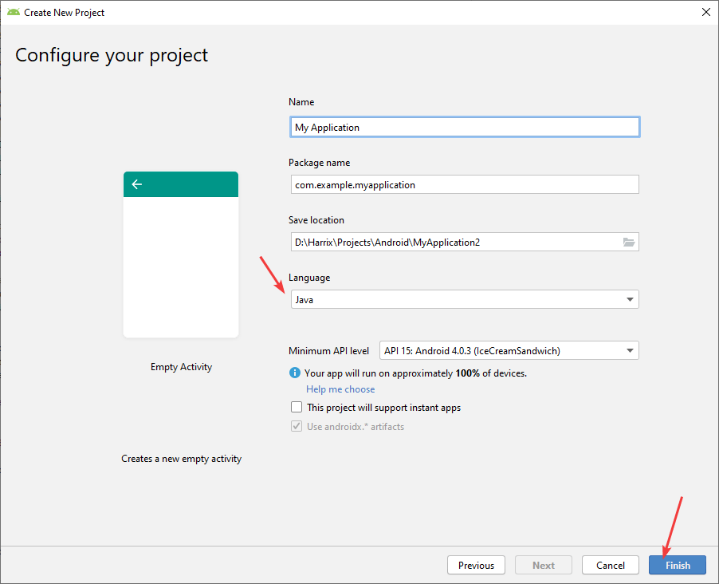

# Как добавлять в Android проект сторонние компоненты через Gradle


Для Android проект написано много сторонних компонентов. Как их подключать в своем проекте? В статье об одном из способов на примере подключения Fancybuttons.

- [Сборники компонентов](#сборники-компонентов)
- [Проблема](#проблема)
- [Создание проекта](#создание-проекта)
- [Подключение библиотеки](#подключение-библиотеки)
- [Использование добавленного компонента](#использование-добавленного-компонента)

## Сборники компонентов

<https://snowdream.github.io/awesome-android/>

<https://android-arsenal.com/>

## Проблема

Например, вы захотели себе в проект добавить [Fancybuttons](https://github.com/medyo/fancybuttons) — кнопки с закругленными углами:


_Рисунок 1 — Библиотека Fancybuttons_

Но в разделе установки компонента написана только одна строчка:


_Рисунок 2 — Инструкция по установке компонента_

Что делать и как устанавливать? Куда копировать файлы библиотеки и как? А всё на самом деле просто.

## Создание проекта

Создадим простой проект Android.

<details>
<summary>Создание Android проекта</summary>


_Рисунок 3 — Создание нового проекта_


_Рисунок 4 — Выбор типа активности_



_Рисунок 5 — Настройка проекта_

</details>

## Подключение библиотеки

Для подключения библиотеки будет нужен интернет!

Сборка проекта осуществляется через систему `Gradle`. И в приложении есть файлы скриптов `Gradle`, в которых вы и добавляете параметры сборки, а также сторонние библиотеки.

Откройте файл `build.gradle (Module: app)`:


_Рисунок 6 — Файл файл build.gradle_

В файле найдите раздел `dependencies`. И просто напишите там ту строчку, которая была в разделе установки Installation библиотеки:

```text
implementation 'com.github.medyo:fancybuttons:1.9.1'
```


_Рисунок 7 — Установка компонента_

Потом нажмите `Sync now` для синхронизации библиотеки. То есть Android Studio сама скачает нужные файлы добавленной библиотеки.

Всё, установка компонента закончена!

## Использование добавленного компонента

После окончания синхронизации вы можете полноценно использовать компонент, как расписано в разделе, например, `Usage` в документации компонента.

Перейдем в файл разметки `activity_main.xml`. Там разметку типа `ConstraintLayout` поменяем на `LinearLayout` (исключительно для простоты примера):

```xml
<?xml version="1.0" encoding="utf-8"?>
<LinearLayout xmlns:android="http://schemas.android.com/apk/res/android"
    android:layout_width="match_parent"
    android:layout_height="match_parent"
    android:paddingLeft="16dp"
    android:paddingRight="16dp"
    android:orientation="vertical" >

</LinearLayout>
```

Добавим в качестве атрибута в этот `LinearLayout` следующую строчку (это по документации компонента):

```xml
xmlns:fancy="http://schemas.android.com/apk/res-auto"
```

И внутрь этой разметки вставим код кнопки из документации:

```xml
<mehdi.sakout.fancybuttons.FancyButton
    android:id="@+id/btn_spotify"
    android:layout_width="wrap_content"
    android:layout_height="wrap_content"
    android:paddingBottom="10dp"
    android:paddingLeft="20dp"
    android:paddingRight="20dp"
    android:paddingTop="10dp"
    fancy:fb_borderColor="#FFFFFF"
    fancy:fb_borderWidth="1dp"
    fancy:fb_defaultColor="#7ab800"
    fancy:fb_focusColor="#9bd823"
    fancy:fb_fontIconResource="&#xf04b;"
    fancy:fb_iconPosition="left"
    fancy:fb_radius="30dp"
    fancy:fb_text="SHUFFLE PLAY"
    fancy:fb_textColor="#FFFFFF" />
```

В итоге получил вот такой код разметки:

```xml
<?xml version="1.0" encoding="utf-8"?>
<LinearLayout xmlns:android="http://schemas.android.com/apk/res/android"
    android:layout_width="match_parent"
    android:layout_height="match_parent"
    android:paddingLeft="16dp"
    android:paddingRight="16dp"
    android:orientation="vertical"
    xmlns:fancy="http://schemas.android.com/apk/res-auto">

    <mehdi.sakout.fancybuttons.FancyButton
        android:id="@+id/btn_spotify"
        android:layout_width="wrap_content"
        android:layout_height="wrap_content"
        android:paddingBottom="10dp"
        android:paddingLeft="20dp"
        android:paddingRight="20dp"
        android:paddingTop="10dp"
        fancy:fb_borderColor="#FFFFFF"
        fancy:fb_borderWidth="1dp"
        fancy:fb_defaultColor="#7ab800"
        fancy:fb_focusColor="#9bd823"
        fancy:fb_fontIconResource="&#xf04b;"
        fancy:fb_iconPosition="left"
        fancy:fb_radius="30dp"
        fancy:fb_text="SHUFFLE PLAY"
        fancy:fb_textColor="#FFFFFF" />

</LinearLayout>
```


_Рисунок 8 — Код разметки активности_

Запускаем проект:


_Рисунок 9 — Запуск проекта_


_Рисунок 10 — Запущенное приложение_

P.S. Разница между двумя файлами `build.gradle` объясняется [тут](https://stackoverflow.com/questions/28295933/difference-between-build-gradleproject-and-build-gradlemodule).
