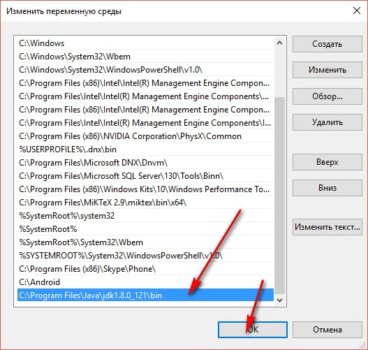
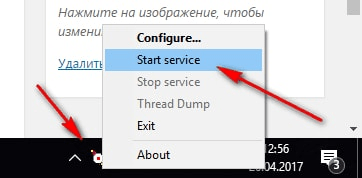

# Простейшее web-приложение на Java на сервере Tomcat

В статье рассказывается о том, как поднять на своем компьютере локальный Java сервер и прописать простейшее web-приложение.

## Введение

Tomcat нужен для работы Java сервера с применением [сервлетов](<https://ru.wikipedia.org/wiki/%D0%A1%D0%B5%D1%80%D0%B2%D0%BB%D0%B5%D1%82_(Java)>). Если грубо говоря, то сервелеты это аналог тех же PHP скриптов. На сервер Tomcat от клиентов приходят запросы. В зависимости от них сервер запустит те или иные сервелеты, которые сформируют ответы в виде текстовых файлов. Чаще всего это HTML страницы.

## Установка JDK

[Устанавливаем](https://github.com/Harrix/harrix.dev-blog-2019/blob/main/install-jdk-on-windows/install-jdk-on-windows.md) JDK. Если уже до этого устанавливали, то повторно не устанавливаем.

Если у вас в папке с Java есть только папка с названием `jdk`, но нет с названием `jre`, то аналогичным способом устанавливаем [jre](http://www.oracle.com/technetwork/java/javase/downloads/jre8-downloads-2133155.html) (по ссылке JRE для Java 8):


Для работы современных версий `Android Studio` или `IntelliJ IDEA` не нужно производить дополнительные действия, чтобы программы могли найти JDK и запускать Java приложения. Но мы будем на данный момент компилировать сервлеты вручную, так что для удобства мы пропишем путь к папке JDK в системную переменную `Path` в Windows. Ниже приведена инструкция для Windows 10.

У меня `JDK` находится в папке `C:\Program Files\Java\jdk1.8.0_121\bin`.

Кликните правой кнопкой по иконке `Этот компьютер` и перейдите в `Свойства`:


**Внимание!** Не вздумайте удалять всё содержимое переменной `Path`. Иначе у операционной системы возникнут очень большие проблемы. Вы должны дописать в эту переменную нужный путь:




## Установка Apache Tomcat

Переходим на сайт <https://tomcat.apache.org/>.

Скачиваем установочный файл:


Устанавливаем Tomcat:


Эти компоненты должны быть выбраны:


Для учебных целей можно параметры оставить по умолчанию:


Далее нужно указать путь к `JRE` (устанавливается при установке JDK). Обычно программа сама находит папку:


Далее всё стандартно:


После этого в трее должен появиться значок запущенного сервиса:


Перейдите по адресу <http://localhost:8080/>. Если вы видите это, то всё хорошо:


Кстати, потом включать (например, при перезапуске компа) сервер можно запуском программы `Monitor Tomcat` из `Пуска`:




## Создание и сборка сервлета вручную

Напишем первое web-приложение вручную без каких-либо IDE.

Перейдем в папку, где установлен Tomcat. У меня это папка `C:\Program Files\Apache Software Foundation\Tomcat 9.0`. Запомните этот путь, так как он вам еще много раз пригодится.

Выше говорилось, что сервлеты чем-то похожи на PHP скрипты (упоминание для тех, кто знает PHP). Но есть одна существенная разница. В PHP можно написать файл скрипта, закинуть в соответствующую папку и web-приложение готово. С Java такой трюк не пройдет. Нам соответствующие сервлеты нужно будет скомпилировать в байт-код и уже со сгенерированными `.class` файлами работать.

Итак, где-нибудь создайте произвольную папку. Советовал бы не использовать русские буквы, пробелы. И в пути к папке тоже желательно обойтись без русских букв. Я на рабочем столе создал папку `testapp`.

В ней создайте текстовой файл `TestServlet.java` с таким содержимым:

```java
package com.example;

import java.io.IOException;
import java.io.PrintWriter;

import javax.servlet.ServletException;
import javax.servlet.http.HttpServlet;
import javax.servlet.http.HttpServletRequest;
import javax.servlet.http.HttpServletResponse;

public class TestServlet extends HttpServlet {

    public void doGet(HttpServletRequest req, HttpServletResponse resp) throws ServletException, IOException {
        resp.setContentType("text/html;charset=utf-8");

        PrintWriter pw = resp.getWriter();
        pw.println("<H1>Hello, world!</H1>");

    }
}
```

Это и есть код нашего сервлета. Мы создаем наследника класса `HttpServlet`. В нем реализуем один метод `doGet()`, в котором вначале сообщаем что сервлет будет выдавать HTML документ. Потом вытаскиваем из `resp` ссылку на экземпляр `PrintWriter`. И то, что мы будем писать в нем, будет отдано сервером на запрос от клиента.

Первое, на что нужно обратить внимание. Кодировка файла `TestServlet.java` должна быть `UTF-8`. У многих проблема с компиляцией данного файла возникает именно из-за проблем с кодировкой. Вот так кодировка выглядит в `Notepad++`:


Не используйте стандартный блокнот Windows!

Второе. Класс наследуется от `HttpServlet`. И для компиляции программы нам будет нужен `jar` файл с нужными классами внутри.

В папке `Tomcat` есть папка `lib`. В ней есть файл `servlet-api.jar`:


Копируем его в нашу папку с Java файлом:


Третье. Мы разместили наш класс в пакете `package com.example` (у вас может быть другой). А это означает, что в папке, где лежит наш Java файл нужно создать папку `com`, в ней папку `example`, и уже туда переместить файл `TestServlet.java`.

У меня для наших двух файлов получились такие пути:

`C:\Users\Harrix\Desktop\testapp\com\example\TestServlet.java`

`C:\Users\Harrix\Desktop\testapp\servlet-api.jar`

Теперь можем приступить к сборке. Открываем командную строку `cmd`:


Перейдем в папку, что мы создали для размещения наших файлов. Не забывайте после каждой команды в командной строке для её запуска нажимать `Enter`:

```console
cd C:\Users\Harrix\Desktop\testapp
```


И запустим сборку. Если у вас в системной переменной `Path` не прописан путь к JDK (описано в начале статьи), то команда не сработает:

```console
javac -encoding UTF-8 -cp .;servlet-api.jar com\example\*.java
```

Если эта команда не сработает, то используйте один из этих вариантов:

```console
javac -classpath servlet-api.jar com\example\TestServlet.java
```

```console
javac -encoding UTF-8 -cp servlet-api.jar com\example\*.java
```


Если у вас не выведется список ошибок, а в папке с `TestServlet.java` файлом появится файл `TestServlet.class`, то всё получилось. Нам нужен будет этот файл и больше папка, созданная для сборки больше не пригодится:


## Собираем web-приложение

Перейдем опять в папку Tomcat. Там есть папка `webapps` с web-приложениями нашего сервера. В папке `ROOT`, как не сложно догадаться, располагается корневое приложение, которое вы видели при переходе на [localhost:8080](http://localhost:8080):


В папке `webapps` создадим папку с названием web-приложения. Допустим, `testingapp`:


В этой папке создайте папку `WEB-INF`, а в ней папку `classes`.

`C:\Program Files\Apache Software Foundation\Tomcat 9.0\webapps\testingapp\WEB-INF\classes`

В папке `classes` у нас должны находиться файлы байт-кода наших классов. То есть тут должен появиться файл `TestServlet.class`. Но мы помним, что класс был определен в пакете `com.example`.

Поэтому в папке `classes` создаем папку `com`, а ней папку `example`. И уже в эту папку кидаем файл `TestServlet.class`.

`C:\Program Files\Apache Software Foundation\Tomcat 9.0\webapps\testingapp\WEB-INF\classes\com\example\TestServlet.class`:


Перейдем в папку `WEB-INF`. В ней создадим текстовой файл `web.xml` с таким содержанием:


```xml
<!DOCTYPE web-app PUBLIC '-//Sun Microsystems, Inc.//DTD
  Web Application 2.3//EN' 'http://java.sun.com/dtd/web-app_2_3.dtd'>

<web-app>

  <servlet>
    <servlet-name>test</servlet-name>
    <servlet-class>com.example.TestServlet</servlet-class>
  </servlet>

  <servlet-mapping>
    <servlet-name>test</servlet-name>
    <url-pattern>/test</url-pattern>
  </servlet-mapping>

</web-app>
```

В тэге `servlet-class` мы указываем запускаемый класс сервлета, а в тэге `url-pattern` указываем url имя запускаемого сервлета.

Обязательно перезапустите сервер:


Всё сборка прошла успешно. Теперь можем проверить работу web-приложения. Для этого переходим по адресу:

<http://localhost:8080/testingapp/test>.

Обратите внимание, что в адресе `testingapp` — это имя папки нашего приложения из папки `webapps`, а `test` — имя сервлета из тэга `url-pattern` из файла `web.xml`.

Если вы увидели в браузере это, то всё хорошо:


Если же увидели это, то что-то сделали не так. Проверьте свои шаги:


