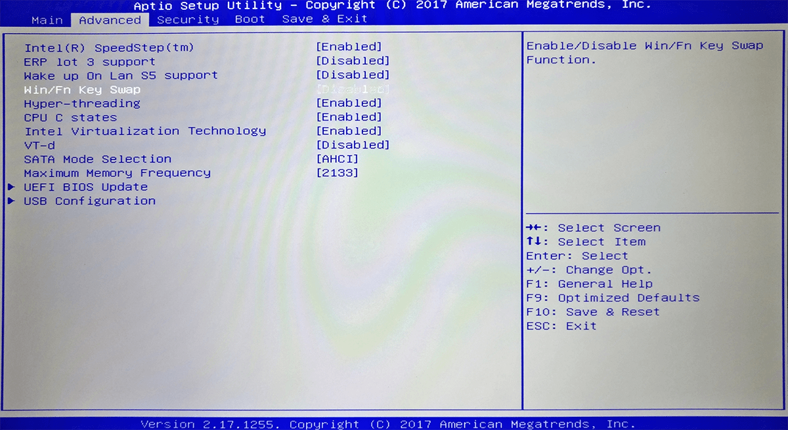

# Переключение клавиш Win/Fn в MSI GT72VR 6RD DOMINATOR

Не удалось с ходу найти переключение клавиш `Win` и `Fn` местами в моем ноутбуке. Оказалось, что переключение происходит в BIOS:

_Рисунок 1 — Переключение в BIOS_
